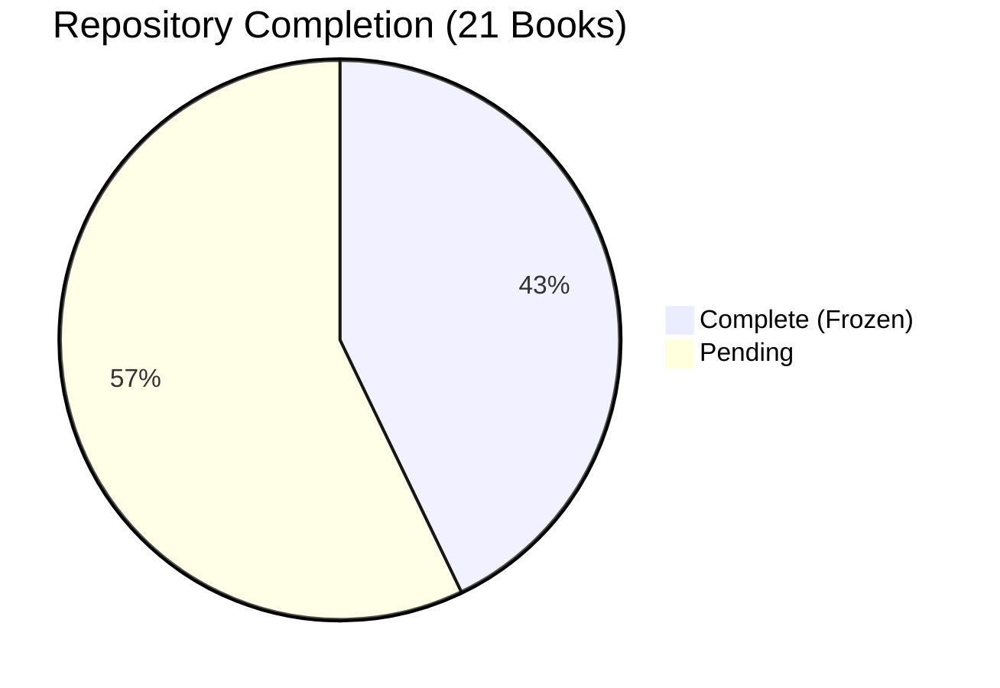

# ARCHITECTURE STATUS

## O³ Platform Operating Manual

**Report Date:** 2026-06-25
**Current Phase:** Architecture Foundation v1.0 — FROZEN
**Next Phase:** Integration Architecture v1.0

---

## Overall Progress

---

## Book Completion Status

| # | Book | Status | Progress |
|---|------|--------|----------|
| 00 | Platform Overview | ✅ FROZEN | ██████████ 100% |
| 01 | Platform Constitution | ✅ FROZEN | ██████████ 100% |
| 02 | Business Architecture | ✅ FROZEN | ██████████ 100% |
| 03 | Domain Model | ✅ FROZEN | ██████████ 100% |
| 04 | Capability Architecture | ✅ FROZEN | ██████████ 100% |
| 05 | Information Architecture | ✅ FROZEN | ██████████ 100% |
| 06 | O³ Workforce Data Standard | ✅ FROZEN | ██████████ 100% |
| 07 | Insight Engine Architecture | ✅ FROZEN | ██████████ 100% |
| 08 | Semantic Layer Architecture | ✅ FROZEN | ██████████ 100% |
| 09 | Event Model Architecture | ⬜ Pending | ░░░░░░░░░░ 0% |
| 10 | API Standards | ⬜ Pending | ░░░░░░░░░░ 0% |
| 11 | Database Architecture | ⬜ Pending | ░░░░░░░░░░ 0% |
| 12 | AI Architecture | ⬜ Pending | ░░░░░░░░░░ 0% |
| 13 | Dashboard Engine | ⬜ Pending | ░░░░░░░░░░ 0% |
| 14 | UX/UI Design System | ⬜ Pending | ░░░░░░░░░░ 0% |
| 15 | Security Architecture | ⬜ Pending | ░░░░░░░░░░ 0% |
| 16 | DevOps | ⬜ Pending | ░░░░░░░░░░ 0% |
| 17 | Product Specifications | ⬜ Pending | ░░░░░░░░░░ 0% |
| 18 | Business Knowledge Framework | ⬜ Pending | ░░░░░░░░░░ 0% |
| 19 | Engineering Handbook | ⬜ Pending | ░░░░░░░░░░ 0% |
| 20 | Platform Operations | ⬜ Pending | ░░░░░░░░░░ 0% |

**Overall Progress:** 9 / 21 books complete (43%)

---

## Phase Progress

| Phase | Books | Status | Progress |
|-------|-------|--------|----------|
| **Phase 1:** Architecture Foundation | Books 00–08 | ✅ COMPLETE & FROZEN | 9/9 (100%) |
| **Phase 2:** Integration Architecture | Books 09–13 | ⬜ PENDING | 0/5 (0%) |
| **Phase 3:** Implementation Architecture | Books 14–20 | ⬜ PLANNED | 0/7 (0%) |

---

## Architecture Health

| Metric | Value | Status |
|--------|-------|--------|
| Architecture Consistency Score | 99.25 / 100 | 🟢 Excellent |
| Critical Issues | 0 | 🟢 None |
| Minor Observations | 3 | 🟡 Non-blocking |
| Technical Debt Items | 8 | 🟡 Deferred to v1.1 |
| Orphan References | 0 | 🟢 None |
| Duplicate Definitions | 0 | 🟢 None |
| Broken Cross-References | 0 | 🟢 None |
| Mermaid Diagrams | 16 | 🟢 All valid |
| Documentation Standard Compliance | 100% | 🟢 All books compliant |

---

## Entity Inventory

| Entity Type | Count | Status |
|------------|-------|--------|
| KPIs | 25 | 🟢 Complete |
| Measures | 20 | 🟢 Complete |
| Metrics | 17 | 🟢 Complete |
| Dimensions | 17 | 🟢 Complete |
| Insights | 15 | 🟢 Complete |
| Information Objects | 21 | 🟢 Complete |
| Capabilities (L1) | 11 | 🟢 Complete |
| Domains | 14 | 🟢 Complete |
| ADRs | 6 | 🟢 Complete |
| Analytical Models | 8 | 🟢 Complete |
| Semantic Relationships | 8 | 🟢 Complete |
| Business Rules | 300+ | 🟢 Complete |
| OWDS Sheets | 8 | 🟢 Complete |

---

## Frozen Baseline

| Document | Version | Frozen Date |
|----------|---------|-------------|
| Book 00 — Platform Overview | v1.0.0 | 2026-06-25 |
| Book 01 — Platform Constitution | v1.0.0 | 2026-06-25 |
| Book 02 — Business Architecture | v1.0.0 | 2026-06-25 |
| Book 03 — Domain Model | v1.0.0 | 2026-06-25 |
| Book 04 — Capability Architecture | v1.0.0 | 2026-06-25 |
| Book 05 — Information Architecture | v1.0.0 | 2026-06-25 |
| Book 06 — O³ Workforce Data Standard | v1.0.0 | 2026-06-25 |
| Book 07 — Insight Engine Architecture | v1.0.0 | 2026-06-25 |
| Book 08 — Semantic Layer Architecture | v1.0.0 | 2026-06-25 |
| Architecture Consistency Review | v1.0 | 2026-06-25 |
| Documentation Writing Standard | v1.0.0 | 2026-06-25 |

---

## Git Status

| Item | Status |
|------|--------|
| Branch | `main` |
| Last Commit | `639bf3d` — Architecture Foundation v1.0 |
| Tag | `v1.0-architecture-foundation` |
| Remote | Not configured |

---

## Next Steps

1. Configure GitHub remote
2. Push to GitHub with tag
3. Create `integration-v1` branch
4. Begin Book 09 — Event Model Architecture

---

*End of ARCHITECTURE_STATUS*