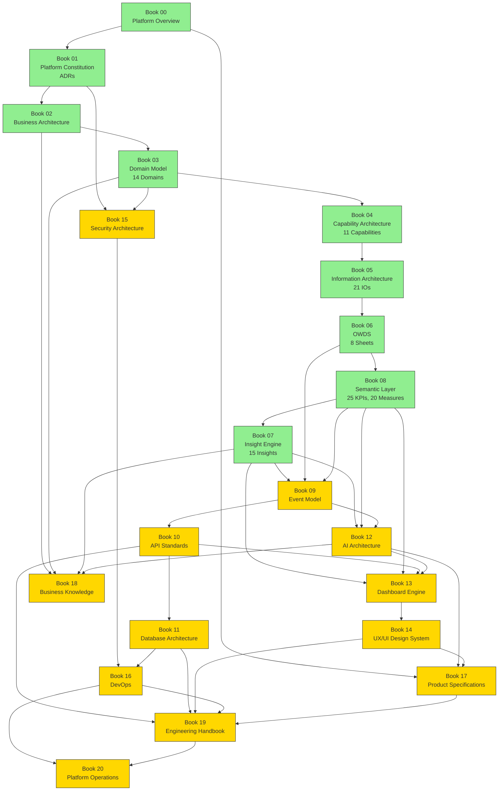

# REPOSITORY MANIFEST

## O³ Platform Operating Manual

**Document Type:** Repository Control Document
**Version:** v1.0.0
**Date:** 2026-06-25
**Owner:** Chief Architect
**Status:** Active

---

## 1. Repository Overview

This repository is the **architecture knowledge base** for the O³ Platform — a unified workforce intelligence platform that transforms standardized workforce data into business insights, recommendations, and actions.

The repository contains the complete architecture documentation organized as a series of Books (Book 00 through Book 20), each covering a specific architectural domain. Every Book is production-grade, self-contained, and cross-referenced with all related Books.

This repository is the single source of truth for:

- Platform architecture decisions (ADRs)
- Domain models and business capabilities
- Data standards (OWDS)
- KPI definitions and semantic layer
- Insight engine architecture
- API standards, database architecture, AI architecture
- Dashboard engine, design system, security, DevOps
- Product specifications, engineering handbook, platform operations

**Target Audience:** Founder, Product Manager, Developer, Architect, AI Agent

---

## 2. Current Repository Phase

```
Phase: Architecture Foundation v1.0
Status: APPROVED and FROZEN
Date: 2026-06-25
Scope: Books 00–08
```

The Architecture Foundation phase establishes the complete architectural foundation of the O³ Platform. All 9 books in this phase (Book 00 through Book 08) have been written, reviewed, approved, and frozen. These books form the immutable baseline upon which all future books are built.

---

## 3. Book Status Table

| # | Book Name | Purpose | Status | Version | State | Depends On | Used By | Notes |
|---|-----------|---------|--------|---------|-------|------------|---------|-------|
| **00** | Platform Overview | High-level platform concept, products, layers, MVP scope | ✅ Complete | v1.0.0 | FROZEN | — | All books | Entry point for new readers |
| **01** | Platform Constitution | ADRs, platform principles, governance | ✅ Complete | v1.0.0 | FROZEN | Book 00 | All books | Contains ADR-001 through ADR-006 |
| **02** | Business Architecture | Business model, value streams, product strategy | ✅ Complete | v1.0.0 | FROZEN | Book 00, Book 01 | Book 03, Book 04 | Business context for all architecture |
| **03** | Domain Model | 14 business domains and their relationships | ✅ Complete | v1.0.0 | FROZEN | Book 02 | Book 04, Book 05, Book 07, Book 08 | Foundation for all domain references |
| **04** | Capability Architecture | 11 Level 1 capabilities (LC-01 to LC-11) | ✅ Complete | v1.0.0 | FROZEN | Book 03 | Book 05, Book 07, Book 08 | Maps capabilities to domains |
| **05** | Information Architecture | 21 Information Objects (IO-01 to IO-21) | ✅ Complete | v1.0.0 | FROZEN | Book 03, Book 04 | Book 06, Book 07, Book 08 | Information flow and quality standards |
| **06** | O³ Workforce Data Standard (OWDS) | 8 OWDS sheets with field-level specifications | ✅ Complete | v1.0.0 | FROZEN | Book 05 | Book 07, Book 08, Book 11 | All data source definitions |
| **07** | Insight Engine Architecture | 15 Insights (INS-001 to INS-015), 8-stage lifecycle | ✅ Complete | v1.0.0 | FROZEN | Book 06, Book 08 | Book 12, Book 13 | Consumes KPI definitions from Book 08 |
| **08** | Semantic Layer Architecture | 25 KPIs, 20 Measures, 17 Metrics, 17 Dimensions | ✅ Complete | v1.0.0 | FROZEN | Book 06 | Book 07, Book 10, Book 12, Book 13 | Single source of truth for all calculations |
| **09** | Event Architecture | 40+ events across 5 categories, lifecycle, governance | ✅ Complete | v1.0.0 | FROZEN | Book 06, Book 07, Book 08 | Book 10, Book 12, Book 13 | Enterprise Architecture level — no technology |
| **10** | API Standards | REST API design, endpoints, versioning | ⬜ Pending | — | — | Book 07, Book 08, Book 09 | Book 11, Book 13, Book 19 | API design standards |
| **11** | Database Architecture | Physical data model, schema, performance | ⬜ Pending | — | — | Book 06, Book 08, Book 10 | Book 16, Book 19 | Implements OWDS and Semantic Layer |
| **12** | AI Architecture | AI Gateway, LLM integration, prompt engineering | ⬜ Pending | — | — | Book 07, Book 08, Book 09 | Book 13, Book 17 | AI capabilities for insights and recommendations |
| **13** | Dashboard Engine | Dashboard rendering, widgets, layout | ⬜ Pending | — | — | Book 07, Book 08, Book 10, Book 12 | Book 14 | Consumes insights and KPIs |
| **14** | UX/UI Design System | Design tokens, components, patterns | ⬜ Pending | — | — | Book 13 | Book 17, Book 19 | Visual design standards |
| **15** | Security Architecture | Authentication, authorization, data protection | ⬜ Pending | — | — | Book 01, Book 03 | Book 10, Book 11, Book 16 | Security standards |
| **16** | DevOps | CI/CD, infrastructure, monitoring | ⬜ Pending | — | — | Book 11, Book 15 | Book 19, Book 20 | Operational infrastructure |
| **17** | Product Specifications | Product requirements, feature specs | ⬜ Pending | — | — | Book 00, Book 12, Book 13, Book 14 | Book 19 | Product-level specifications |
| **18** | Business Knowledge & Decision Framework | Business rules, decision logic, knowledge base | ⬜ Pending | — | — | Book 02, Book 03, Book 07 | Book 12, Book 17 | Business decision framework |
| **19** | Engineering Handbook | Coding standards, development practices | ⬜ Pending | — | — | Book 10, Book 11, Book 14, Book 16, Book 17 | Book 20 | Engineering execution guide |
| **20** | Platform Operations | Platform management, governance, compliance | ⬜ Pending | — | — | Book 16, Book 19 | — | Operational runbook |

**Status Legend:**
- ✅ Complete — Book has been written, reviewed, approved
- ⬜ Pending — Book scaffolded but not yet written
- 🔄 In Progress — Book currently being written

---

## 4. Architecture Dependency Map



**Legend:**
- 🟢 Green (Books 00–08): Architecture Foundation v1.0 — APPROVED and FROZEN
- 🟡 Yellow (Books 09–20): Pending — Integration Architecture and beyond

**Why Book 08 appears before Book 07 in the dependency chain:**

The Semantic Layer (Book 08) defines KPI meaning, formulas, measures, thresholds, and dimensions. The Insight Engine (Book 07) consumes these semantic definitions to generate business insights. The Insight Engine says "Turnover is too high" — but it needs the Semantic Layer to define what "Turnover Rate" is, how it's calculated, and what thresholds define "too high."

In the dependency chain: OWDS (Book 06) provides raw data → Semantic Layer (Book 08) defines business meaning → Insight Engine (Book 07) interprets that meaning into actionable insights. Both books were written in parallel and cross-reference each other bidirectionally.

---

## 5. Repository Health Summary

| Metric | Value |
|--------|-------|
| **Total Books** | 21 (Book 00 – Book 20) |
| **Books Completed** | 9 (Books 00–08) |
| **Books Frozen** | 9 (Books 00–08) |
| **Books Pending** | 12 (Books 09–20) |
| **Consistency Review** | Complete — v1.0 |
| **Architecture Consistency Score** | 99.25 / 100 |
| **Critical Issues** | 0 |
| **Minor Observations** | 3 |
| **Repository Health** | **Excellent 🟢** |
| **Current Risk Level** | **Low 🟢** |

**Entity Inventory:**

| Entity Type | Count | Defined In |
|------------|-------|------------|
| KPIs | 25 | Book 08 |
| Measures | 20 | Book 08 |
| Metrics | 17 | Book 08 |
| Dimensions | 17 | Book 08 |
| Insights | 15 | Book 07 |
| Information Objects | 21 | Book 05 |
| Capabilities (L1) | 11 | Book 04 |
| ADRs | 6 | Book 01 |
| Domains | 14 | Book 03 |
| Analytical Models | 8 | Book 08 |
| Semantic Relationships | 8 | Book 08 |
| Mermaid Diagrams | 16 | Books 00–08 |
| Business Rules | 300+ | Books 00–08 |

---

## 6. Frozen Baseline

The following documents constitute the **Architecture Foundation v1.0 Frozen Baseline**. These documents MUST NOT be modified unless explicitly approved by the Founder or through an Architecture Decision Record (ADR).

| # | Document | Version | Frozen Date |
|---|----------|---------|-------------|
| 1 | Book 00 — Platform Overview | v1.0.0 | 2026-06-25 |
| 2 | Book 01 — Platform Constitution | v1.0.0 | 2026-06-25 |
| 3 | Book 02 — Business Architecture | v1.0.0 | 2026-06-25 |
| 4 | Book 03 — Domain Model | v1.0.0 | 2026-06-25 |
| 5 | Book 04 — Capability Architecture | v1.0.0 | 2026-06-25 |
| 6 | Book 05 — Information Architecture | v1.0.0 | 2026-06-25 |
| 7 | Book 06 — O³ Workforce Data Standard (OWDS) | v1.0.0 | 2026-06-25 |
| 8 | Book 07 — Insight Engine Architecture | v1.0.0 | 2026-06-25 |
| 9 | Book 08 — Semantic Layer Architecture | v1.0.0 | 2026-06-25 |
| 10 | Architecture Consistency Review v1.0 | v1.0 | 2026-06-25 |
| 11 | Documentation Writing Standard | v1.0.0 | 2026-06-25 |

**Frozen Baseline Rules:**

- Frozen books cannot be edited directly
- Changes to frozen books require an ADR (Architecture Decision Record)
- New books may reference frozen books freely
- The frozen baseline is the foundation for all future work
- Future Architecture Consistency Reviews will validate new books against the frozen baseline

---

## 7. Technical Debt Register

The following non-blocking improvements were identified during the Architecture Consistency Review v1.0. These are recorded as technical debt and deferred to v1.1.

| # | ID | Description | Priority | Effort | Target | Blocking? | Status |
|---|-----|-------------|----------|--------|--------|-----------|--------|
| 1 | TD-01 | Assign formal Domain IDs (DOM-01 – DOM-14) to Book 03 domains | Medium | Low | v1.1 | No | Deferred |
| 2 | TD-02 | Assign formal Vocabulary Term IDs (VOC-01 – VOC-14) to Book 08 vocabulary | Medium | Low | v1.1 | No | Deferred |
| 3 | TD-03 | Assign formal Glossary Entry IDs (GLOS-01 – GLOS-3X) to Book 08 glossary | Low | Low | v1.1 | No | Deferred |
| 4 | TD-04 | Create a centralized ID Registry appendix for cross-book reference | Low | Medium | v1.1 | No | Deferred |
| 5 | TD-05 | Create a Repository Architecture Index (cross-reference matrix of all entities) | Low | Medium | v1.1 | No | Deferred |
| 6 | TD-06 | Perform two-way cross-reference audit (verify all "referenced by" relationships) | Low | High | v1.1 | No | Deferred |
| 7 | TD-07 | Expand ADR coverage (ADRs for decisions made in Books 07–08) | Medium | Medium | v1.1 | No | Deferred |
| 8 | TD-08 | Refine repository dependency map with more granular sub-dependencies | Low | Low | v1.1 | No | Deferred |

**Technical Debt Management Rules:**

- Technical debt is non-blocking and does not prevent progress on new books
- Technical debt items are addressed in the next Architecture Consistency Review cycle
- New technical debt may be added during future reviews
- Technical debt items are resolved by updating the relevant book with an ADR or minor version bump

---

## 8. Next Workstream

```
Workstream: Integration Architecture v1.0
Next Book: Book 09 — Event Model Architecture
Target: Production-Grade v1.0.0
```

**Integration Architecture Scope (Books 09–13):**

| Book | Focus | Key Deliverables |
|------|-------|-----------------|
| Book 09 | Event Model Architecture | Platform events, event-driven workflows, event catalog |
| Book 10 | API Standards | REST API design, endpoint specifications, versioning |
| Book 11 | Database Architecture | Physical data model, schema design, query patterns |
| Book 12 | AI Architecture | AI Gateway, LLM integration, prompt engineering |
| Book 13 | Dashboard Engine | Dashboard rendering, widget architecture, layout system |

**Integration Architecture Goal:** Define how the platform components communicate, integrate, and operate together as a cohesive system. The Integration Architecture connects the Foundation Architecture (Books 00–08) to the Implementation Architecture (Books 14–20).

---

## 9. Branch and Versioning Recommendation

### Recommended Git Workflow

```
main
├── v1.0-architecture-foundation (tag)     ← Current frozen baseline
│
├── integration-v1 (branch)                ← Active development for Books 09–13
│   ├── Book 09 — Event Model
│   ├── Book 10 — API Standards
│   ├── Book 11 — Database Architecture
│   ├── Book 12 — AI Architecture
│   └── Book 13 — Dashboard Engine
│
├── v1.0-integration-architecture (tag)    ← Future: after Books 09–13 approved
│
├── implementation-v1 (branch)             ← Future: Books 14–20
│
└── v1.0-production (tag)                  ← Future: complete operating manual
```

### Versioning Rules

| Branch | Purpose | Merge Policy |
|--------|---------|-------------|
| `main` | Frozen approved milestones only | Merge only after Architecture Review approval |
| `integration-v1` | Active development for Books 09–13 | Merge to `main` after all 5 books reviewed and approved |
| `implementation-v1` | Future development for Books 14–20 | Merge to `main` after all 7 books reviewed and approved |

### Current Actions Required

```
git tag -a v1.0-architecture-foundation -m "Architecture Foundation v1.0 — Books 00–08 approved and frozen"
git checkout -b integration-v1
```

---

## 10. Change Control Rules

### Rule 1: Frozen Books Are Immutable
Frozen books (Books 00–08) cannot be edited directly. Any change to a frozen book requires an Architecture Decision Record (ADR) approved by the Founder or Chief Architect.

### Rule 2: ADR Required for Changes
Changes to frozen books must follow this process:
1. Propose change with rationale
2. Create an ADR documenting the change
3. Obtain approval from Founder or Chief Architect
4. Apply change with version bump
5. Update cross-references in dependent books
6. Re-run Architecture Consistency Review

### Rule 3: New Books Reference Frozen Books
New books (Book 09+) may freely reference frozen books. References must be specific (Book number, Chapter number, entity ID). New books must not contradict frozen books.

### Rule 4: Technical Debt Is Recorded
Future improvements identified during reviews should be recorded in the Technical Debt Register (Section 7). Technical debt is non-blocking and addressed in the next review cycle.

### Rule 5: Stable Architecture Is Preserved
Do not rewrite stable architecture unless explicitly approved. The frozen baseline represents validated, production-grade architecture. Refactoring for its own sake is prohibited.

### Rule 6: Consistency Review Required
After each workstream (Books 09–13, Books 14–20), a full Architecture Consistency Review must be performed before merging to `main`.

### Rule 7: Version Bumps Follow Semantic Versioning
- MAJOR: Breaking changes to architecture (e.g., removing a domain, changing KPI formula)
- MINOR: New content, new entities, new chapters
- PATCH: Clarifications, fixes, non-breaking improvements

---

## 11. AI Agent Instructions

The following instructions apply to any AI Agent (human or machine) working on this repository.

### Before Starting Any Work

```
1. Read REPOSITORY_MANIFEST.md (this file) first
2. Read o3_master_context/15_prompt_for_next_ai_agent.md
3. Read Book 00 (Platform Overview) for context
4. Read Book 01 (Platform Constitution) for ADRs and principles
5. Read the Documentation Writing Standard (standards/documentation-writing-standard.md)
6. Read the Architecture Consistency Review v1.0 for known issues
```

### When Creating a New Book

```
1. Read all frozen books that the new book depends on (see Depends On column in Section 3)
2. Do NOT invent new vocabulary — use terms from Book 08 (Business Vocabulary and Glossary)
3. Do NOT create new KPIs without registering them in Book 08
4. Do NOT reference capabilities that don't exist in Book 04
5. Do NOT reference domains that don't exist in Book 03
6. Reference previous books using specific Book number, Chapter number, and entity ID
7. Follow the Documentation Writing Standard exactly
8. Include a Self-Review chapter at the end of every new book
9. Include Mermaid diagrams where appropriate
10. Stay at the Architecture level — no implementation details (SQL, code, API payloads) unless the book's purpose is to define those standards
```

### When Modifying Frozen Books

```
1. Do NOT modify frozen books unless explicitly requested by the Founder
2. All changes to frozen books require an ADR
3. Update the Technical Debt Register if the change is deferred
4. Update the Version History section of the modified book
5. Update cross-references in dependent books
```

### When Reviewing

```
1. Run a full Architecture Consistency Review after each workstream
2. Validate all cross-references
3. Check naming conventions
4. Verify Mermaid diagram syntax
5. Update the Repository Health Summary
6. Record new technical debt
7. Update the Book Status Table
```

### Critical Rules

```
- Do NOT modify frozen books without explicit Founder approval
- Do NOT invent new vocabulary or business terms
- Do NOT create duplicate entity IDs
- Do NOT skip the Self-Review chapter
- Do NOT write implementation details in architecture books
- ALWAYS cross-reference related books
- ALWAYS follow the Documentation Writing Standard
- ALWAYS ask for Architecture Review before freezing any new book
```

---

## 12. Ready for Book 09 Checklist

| # | Item | Status |
|---|------|--------|
| 1 | Books 00–08 written, reviewed, and frozen | ✅ Complete |
| 2 | Architecture Consistency Review v1.0 approved | ✅ Complete |
| 3 | Repository Manifest created | ✅ Complete |
| 4 | Technical debt recorded | ✅ Complete |
| 5 | Integration Architecture workstream defined | ✅ Complete |
| 6 | Book 09 scaffold directory exists (`books/book-09-event-model/`) | ✅ Complete |
| 7 | Book 09 prompt ready | ⬜ Pending |

**Decision: READY TO PROCEED TO BOOK 09 ✅**

---

## Version History

| Version | Date | Changes |
|---------|------|---------|
| v1.0.0 | 2026-06-25 | Initial release. Repository manifest created after Architecture Foundation v1.0 approval. Covers Books 00–08 frozen baseline, 12 pending books, dependency map, technical debt register, change control rules, AI agent instructions, and Book 09 readiness checklist. |

---

*End of REPOSITORY_MANIFEST.md*