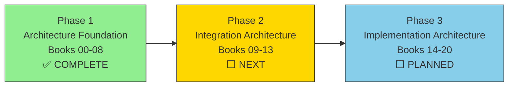

# ROADMAP

## O³ Platform Operating Manual

**Current Phase:** Integration Architecture v1.0
**Last Updated:** 2026-06-25

---

## Phase Overview

---

## Phase 1: Architecture Foundation v1.0 ✅ COMPLETE

**Status:** FROZEN
**Completed:** 2026-06-25
**Scope:** Books 00–08

| Book | Status | Version |
|------|--------|---------|
| Book 00 — Platform Overview | ✅ FROZEN | v1.0.0 |
| Book 01 — Platform Constitution | ✅ FROZEN | v1.0.0 |
| Book 02 — Business Architecture | ✅ FROZEN | v1.0.0 |
| Book 03 — Domain Model | ✅ FROZEN | v1.0.0 |
| Book 04 — Capability Architecture | ✅ FROZEN | v1.0.0 |
| Book 05 — Information Architecture | ✅ FROZEN | v1.0.0 |
| Book 06 — O³ Workforce Data Standard (OWDS) | ✅ FROZEN | v1.0.0 |
| Book 07 — Insight Engine Architecture | ✅ FROZEN | v1.0.0 |
| Book 08 — Semantic Layer Architecture | ✅ FROZEN | v1.0.0 |

**Deliverables:**
- 25 KPIs with full business definitions
- 15 Insights with 8-stage lifecycle
- 20 Measures, 17 Metrics, 17 Dimensions
- 21 Information Objects, 11 Capabilities, 14 Domains
- 6 ADRs, 8 OWDS sheets, 16 Mermaid diagrams
- 300+ Business Rules
- Architecture Consistency Review v1.0 (99.25/100)
- Documentation Writing Standard
- REPOSITORY_MANIFEST.md

---

## Phase 2: Integration Architecture v1.0 ⬜ NEXT

**Status:** PENDING
**Target:** TBD
**Scope:** Books 09–13

| Book | Status | Priority | Depends On |
|------|--------|----------|------------|
| Book 09 — Event Model Architecture | ⬜ Pending | High | Books 06, 07, 08 |
| Book 10 — API Standards | ⬜ Pending | High | Books 07, 08, 09 |
| Book 11 — Database Architecture | ⬜ Pending | High | Books 06, 08, 10 |
| Book 12 — AI Architecture | ⬜ Pending | High | Books 07, 08, 09 |
| Book 13 — Dashboard Engine | ⬜ Pending | High | Books 07, 08, 10, 12 |

**Goals:**
- Define how platform components communicate and integrate
- Event-driven workflows connecting all platform capabilities
- REST API standards for all endpoints
- Physical database schema implementing OWDS and Semantic Layer
- AI Gateway architecture for LLM integration
- Dashboard rendering engine consuming insights and KPIs

---

## Phase 3: Implementation Architecture v1.0 ⬜ PLANNED

**Status:** PLANNED
**Target:** After Phase 2 completion
**Scope:** Books 14–20

| Book | Status | Priority | Depends On |
|------|--------|----------|------------|
| Book 14 — UX/UI Design System | ⬜ Pending | Medium | Book 13 |
| Book 15 — Security Architecture | ⬜ Pending | High | Books 01, 03 |
| Book 16 — DevOps | ⬜ Pending | Medium | Books 11, 15 |
| Book 17 — Product Specifications | ⬜ Pending | Medium | Books 00, 12, 13, 14 |
| Book 18 — Business Knowledge Framework | ⬜ Pending | Low | Books 02, 03, 07 |
| Book 19 — Engineering Handbook | ⬜ Pending | Medium | Books 10, 11, 14, 16, 17 |
| Book 20 — Platform Operations | ⬜ Pending | Low | Books 16, 19 |

**Goals:**
- Complete design system for consistent UX
- Security architecture for authentication, authorization, data protection
- DevOps pipeline for CI/CD, infrastructure, monitoring
- Product specifications for all products
- Business knowledge framework for decision logic
- Engineering handbook for development standards
- Platform operations runbook

---

## Future Phases

### v1.1 — Architecture Refinement

**Target:** After Phase 3 completion

| Item | Priority | Description |
|------|----------|-------------|
| TD-01 | Medium | Assign formal Domain IDs (DOM-01 – DOM-14) |
| TD-02 | Medium | Assign formal Vocabulary Term IDs (VOC-01 – VOC-14) |
| TD-03 | Low | Assign formal Glossary Entry IDs (GLOS-01 – GLOS-3X) |
| TD-04 | Low | Create centralized ID Registry |
| TD-05 | Low | Create Repository Architecture Index |
| TD-06 | Low | Two-way cross-reference audit |
| TD-07 | Medium | Expand ADR coverage |
| TD-08 | Low | Refine repository dependency map |

### v2.0 — Production-Grade Expansion

**Target:** TBD

| Item | Description |
|------|-------------|
| Market data integration | Automatic Compensation Ratio from market data |
| Industry benchmarks | Real-time benchmark comparisons |
| Predictive KPIs | ML-based forecasting models |
| Real-time event processing | Event-driven architecture for real-time insights |
| Custom KPI builder | Company-defined custom KPIs |
| Advanced AI models | Enhanced AI Gateway capabilities |

---

## Milestone History

| Milestone | Date | Books | Tag |
|-----------|------|-------|-----|
| Architecture Foundation v1.0 | 2026-06-25 | Books 00–08 | `v1.0-architecture-foundation` |

---

*End of ROADMAP*