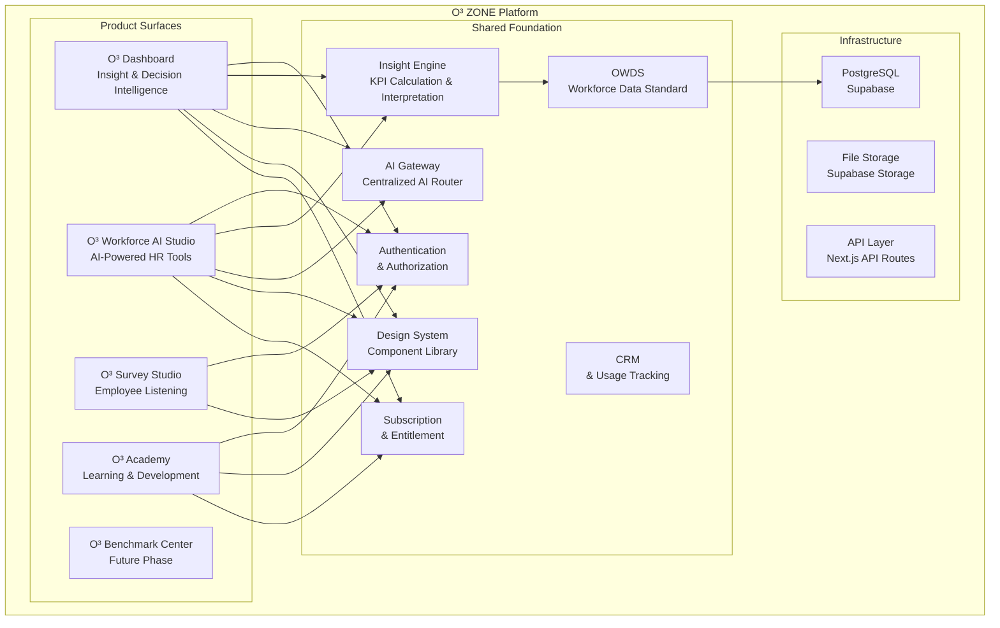
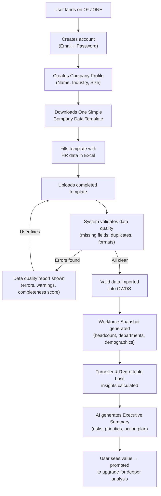
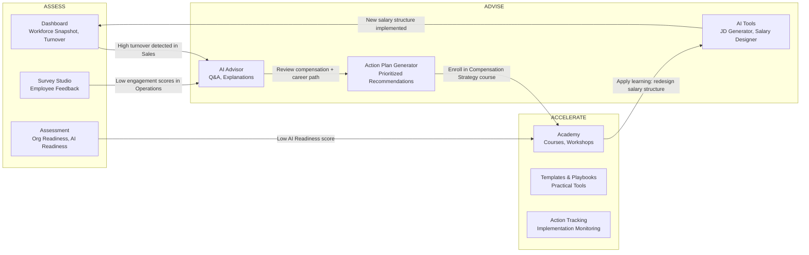
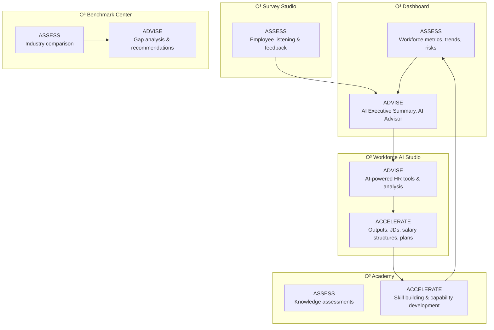

# Book 00: Platform Overview

---

## Chapter 1: Platform Concept and Products

### Purpose

Define the fundamental concept of O³ ZONE as a unified platform—not a collection of separate products. This chapter establishes the platform identity, product boundaries, shared foundation, and the architectural philosophy that governs all O³ products.

### Background

Most HR technology vendors build point solutions: a dashboard here, a survey tool there, an AI chatbot elsewhere. These products operate in silos with separate databases, authentication systems, and data models. The result is fragmented user experience, inconsistent data, and duplicated infrastructure.

O³ ZONE takes a fundamentally different approach. It is a **single platform** with multiple product surfaces. The four products—Dashboard, Workforce AI Studio, Survey Studio, and Academy—all run on the same shared foundation. This means:

- A user logs in once and accesses all products
- Employee data uploaded for Dashboard is immediately available to AI Studio
- Survey responses feed into the same Insight Engine that powers Dashboard
- Academy progress is tracked in the same CRM that monitors product usage

This chapter defines that platform concept in precise, actionable terms.

### Principles

| # | Principle | Description |
|---|-----------|-------------|
| P00-01 | **Platform First, Product Second** | The platform is the product. Individual products are surfaces of the platform, not standalone applications. |
| P00-02 | **Shared Foundation** | Company Profile, User Account, Subscription & Entitlement, AI Gateway, OWDS, Insight Engine, CRM, and Design System are shared across all products. No product owns these in isolation. |
| P00-03 | **Clear Product Boundaries** | Each product has a defined scope and responsibility. Overlap is intentional only when it serves the user journey (e.g., AI Advisor appears in both Dashboard and AI Studio). |
| P00-04 | **Consistent User Experience** | Navigation, visual language, data representation, and interaction patterns are identical across products. A user moving from Dashboard to AI Studio should feel like they are in the same application. |
| P00-05 | **Data Continuity** | Data entered or uploaded in one product is immediately available in all other products, subject to permission controls. No data re-entry. No data export/import between products. |
| P00-06 | **Progressive Disclosure** | Products and features are revealed progressively based on user role, subscription package, and usage maturity. A Basic user sees a simplified view; an Enterprise user sees the full platform. |

### Architecture



### Business Rules

| Rule ID | Rule | Enforcement |
|---------|------|-------------|
| BR-00-001 | All products MUST use the shared authentication system (Supabase Auth). No product may implement its own login. | Architecture Review — blocking violation |
| BR-00-002 | All products MUST read employee data from OWDS. No product may maintain a separate employee database. | Code Review — blocking violation |
| BR-00-003 | All products MUST use the AI Gateway for any LLM call. Direct API calls to OpenAI or other providers are forbidden. | AI Gateway middleware — blocked at network level |
| BR-00-004 | All products MUST use the shared Design System components. Custom UI that duplicates existing components requires ADR approval. | Design Review — blocking violation |
| BR-00-005 | All products MUST respect subscription entitlements. Feature access is gated by the entitlement engine, not by product-level logic. | Entitlement middleware — blocked at API level |
| BR-00-006 | New products can only be added through the ADR process with Chief Architect and Founder approval. | Governance process |
| BR-00-007 | Product-specific data that is NOT workforce data (e.g., course content for Academy) may have product-specific storage but MUST link to Company ID and User ID from the shared foundation. | Architecture Review |
| BR-00-008 | Cross-product navigation MUST be seamless. Users should not need to re-authenticate or re-select their company when switching products. | UX Review |

### The Four Products (and One Future Product)

#### Product 1: O³ Dashboard

**Purpose:** Help executives and HR leaders understand workforce conditions, risks, and priorities through guided insight dashboards.

**Key Characteristics:**
- NOT a BI tool — it is an insight and decision dashboard
- Every widget includes business meaning, risk level, and recommended action
- AI summary is embedded, not an add-on
- Guided layouts in MVP; customization expands with package tier
- Pages: Executive Home, Workforce Snapshot, Turnover & Retention, Productivity, Talent & Performance, Learning & Development, Employee Sentiment

**MVP Widgets:**
- Workforce health score
- Headcount by department, level, age, tenure
- Turnover rate with voluntary/involuntary split
- Regrettable loss count and rate
- Cost of attrition estimate
- Revenue per head
- Performance distribution
- Training hours per employee
- Employee sentiment scores (engagement, workload, manager support, career growth, pay satisfaction)

**User Personas:**
- Founder / SME Owner: Executive Home, AI Summary
- Executive: All pages, focus on risk and action plans
- HR Manager: All pages, focus on detailed data and trends
- HR User: Assigned pages based on permissions

#### Product 2: O³ Workforce AI Studio

**Purpose:** Provide a suite of AI-powered tools that help HR and business teams do practical work—writing job descriptions, designing salary structures, planning workforce, screening candidates.

**Key Characteristics:**
- NOT generic AI chat — uses guided forms with structured inputs and outputs
- Every tool follows the AI Tools Pattern: Input → Validate → Context → Prompt → Structured Output → Explain → Action Plan
- Company context is automatically injected from OWDS data
- Tools are gated by subscription package and AI credits

**MVP AI Tools:**
| Tool | Input | Output | Package Tier |
|------|-------|--------|-------------|
| AI JD Generator | Job title, department, level | Complete job description with responsibilities, qualifications, KPIs | Starter+ |
| AI Salary Structure Designer | Department, levels, budget range | Salary ranges, grade structure, market positioning | Professional+ |
| AI Workforce Planning | Headcount, growth targets, attrition rate | Hiring plan, skills gap analysis, org structure recommendations | Professional+ |
| AI Performance Writer | Employee context, achievements, areas for improvement | Professional performance review narrative | Starter+ |
| AI CV Screening | Job requirements, CV text | Ranked candidates with fit scores and explanations | Business+ |
| AI Job Evaluation | Job description, department context | Job grade recommendation, market comparison | Business+ |
| AI Succession Planning | Org structure, key positions, talent data | Succession readiness matrix, risk flags | Business+ |
| AI Merit & Bonus Advisor | Performance data, budget, salary ranges | Merit increase recommendations, bonus allocation | Enterprise |
| AI Career Path Designer | Employee profile, skills, aspirations | Career path options, development recommendations | Enterprise |

**Future AI Tools (post-MVP):**
- AI Organization Designer
- AI Competency Model Builder
- AI Training Needs Analyzer
- AI Retention Risk Predictor

#### Product 3: O³ Survey Studio

**Purpose:** Enable organizations to listen to employees through structured surveys, analyze responses with AI, and generate action plans from feedback.

**Key Characteristics:**
- NOT an MVP product — built after Dashboard and AI Studio prove value
- Full survey engine: question bank, distribution, response collection, scoring, correlation analysis, AI summary, action planning
- Integrates with OWDS for employee demographics (department, level, tenure filters)
- Survey responses feed into the Insight Engine for cross-analysis with workforce data

**Survey Types (Planned):**
- Employee Experience (EX) Survey
- Engagement Survey
- AI Readiness Survey
- Organization Readiness Survey
- 7S Organization Assessment
- Pulse Survey (short, frequent)
- Exit Survey

**Survey Studio is a full product by itself** — it includes question bank management, survey design, distribution (email, link, QR), response collection, scoring engine, correlation analysis, dashboard, AI summary generation, and action planning. This scope justifies its post-MVP timeline.

#### Product 4: O³ Academy

**Purpose:** Serve as both a learning platform and a lead generation engine. Academy educates users on data-driven HR and AI, then guides them into O³ products.

**Key Characteristics:**
- Primary role in MVP: lead generation and customer education
- Secondary role: revenue source (paid courses)
- Courses connect to products at natural transition points
- Course progress tracked in CRM for lead scoring

**MVP Courses:**
| Course | Content | Leads To |
|--------|---------|----------|
| Data-Driven HR with AI | HR analytics fundamentals, KPI interpretation, data-driven decision making | O³ Dashboard |
| AI for Executives | How AI transforms business, practical AI use cases, AI strategy | O³ Workforce AI Studio |
| ChatGPT for HR | Practical prompt engineering for HR tasks, AI tools overview | O³ Workforce AI Studio |
| AI Business Enablement Framework | Organization readiness, AI adoption roadmap | O³ Dashboard + AI Studio |
| Workforce Intelligence Fundamentals | Understanding workforce data, key metrics, insight generation | O³ Dashboard |

#### Future Product: O³ Benchmark Center

**Purpose:** Provide anonymous, aggregated workforce benchmarks so companies can compare their metrics against industry peers.

**Key Characteristics:**
- NOT MVP — requires enough standardized customer data to be statistically meaningful
- All data is anonymized and aggregated; no individual company can be identified
- Minimum N companies per benchmark segment before data is displayed
- Benchmarks: turnover by industry, regrettable loss, headcount mix, training hours, revenue per head, productivity per head, engagement score, salary range, organization readiness

### Examples

**Example 1: User Journey Across Products**
```
1. SME owner creates account → creates Company Profile
2. Uploads workforce data via One Simple Template → Dashboard shows Workforce Snapshot
3. Dashboard flags high turnover in Sales department → AI Advisor explains why
4. AI Advisor recommends reviewing compensation → User opens AI Studio
5. User runs "AI Salary Structure Designer" with Sales department context
6. AI suggests salary adjustments → Action Plan saved
7. User enrolls in Academy course "Data-Driven HR with AI" to learn more
8. CRM tracks this journey: upload → dashboard → AI → upgrade to Professional
```

**Example 2: Data Continuity**
```
User uploads Employee_Master with:
- Employee_ID: EMP001
- Department: Sales
- Position: Sales Manager
- Salary: 45,000
- Start_Date: 2023-01-15

This data is immediately available in:
- Dashboard: Headcount for Sales department updated
- AI Studio: "AI Salary Structure Designer" can filter by Sales department
- AI Advisor: Can answer "What is the average salary in Sales?"
- Academy: Course recommendations based on Sales management role
```

### Common Mistakes

| Mistake | Why It Happens | How to Avoid |
|---------|---------------|--------------|
| Building Dashboard, AI Studio, and Academy as separate apps | Teams organize by product instead of by platform layer | Assign platform-layer ownership (API team, Data team, UI team), not product-silo teams |
| Duplicating user management in each product | Copying a pattern from standalone SaaS products | Use shared Supabase Auth from day one; enforce via code review |
| Creating product-specific data stores | "It's faster to just add a table to this product's database" | Any new data entity must go through the Data Architect; OWDS is the gatekeeper |
| Hardcoding product names in shared components | Lack of configuration-driven design | Use design tokens and configuration; product names are configuration, not code |
| Building features that only work in one product | Product Manager focuses on their product without platform awareness | Cross-product architecture review required for all new features |

### Anti-patterns

| Anti-pattern | Description | Consequence | Correct Approach |
|-------------|-------------|-------------|-----------------|
| **Product Silo** | Each product built as a standalone application with its own auth, database, and UI | Data inconsistency, duplicated effort, fragmented UX, higher maintenance cost | Build on shared foundation; products are modules, not apps |
| **Feature Duplication** | Same feature implemented differently in two products (e.g., two different "employee search" components) | User confusion, double maintenance, inconsistent behavior | Extract shared features into the Design System; one implementation, used everywhere |
| **Bypassing the Platform** | A product team builds a direct database connection or direct LLM call because "the API/Gateway is too slow" | Security holes, untracked usage, billing errors, data inconsistency | Fix the platform bottleneck; never bypass it |
| **Product Name Proliferation** | Creating sub-brands like "O³ Insights Pro" or "O³ AI Max" | Brand confusion, customer perception of fragmentation | Use the five defined product names only; differentiate by package tier, not product name |
| **Scope Creep into Another Product** | Adding survey features to Dashboard because "users asked for a quick poll" | Blurred product boundaries, Survey Studio launch delayed, inconsistent survey experience | Keep products in their lanes; if a feature belongs in another product, coordinate with that product team |

### AI Instructions

- When asked to build a feature, first determine which product it belongs to
- If a feature spans multiple products, design it as a shared platform capability
- Never create a new product name; use only: O³ Dashboard, O³ Workforce AI Studio, O³ Survey Studio, O³ Academy, O³ Benchmark Center
- When designing UI, use components from the shared Design System (Book 14)
- When implementing features, ensure they work across all entitled products
- Cross-product features must use the shared API layer, not product-specific endpoints

### Developer Notes

- The platform uses a monorepo structure. Product-specific code lives in `packages/` or `apps/` directories but shares a common core.
- Shared foundation code (auth, OWDS, AI Gateway) lives in `packages/core/` or `lib/`.
- Product-specific code imports from the shared core; it never duplicates core functionality.
- When adding a new feature, ask: "Does this benefit more than one product?" If yes, build it in the shared core.
- Environment variables for product configuration (feature flags, API keys) are managed centrally, not per product.

### PM Notes

- Roadmap items must be tagged with the target product and the shared foundation impact
- A feature for one product that requires shared foundation changes needs coordination with the platform team
- Product KPIs should include cross-product metrics: how many Dashboard users also use AI Studio? How many Academy graduates convert to paid Dashboard?
- The Product Relationship Model (Assess → Advise → Accelerate) should be reflected in the user journey and onboarding flow

### Implementation Notes

- The platform is implemented as a Next.js application with API routes serving as the backend
- Product surfaces are route groups: `/dashboard/`, `/ai-studio/`, `/survey/`, `/academy/`
- Shared layout components (sidebar, header) are consistent across all product routes
- Feature flags (from the entitlement engine) control which product routes and features are visible per user
- The AI Gateway is a middleware that intercepts all LLM calls regardless of which product initiated them

### Cross References

- Book 01: Platform Constitution — All 15 principles apply to the platform concept
- Book 02: Business Architecture — Target customers, revenue model, package structure
- Book 03: Domain Model — Company, User, Employee domains that form the shared foundation
- Book 06: OWDS — The shared data standard that enables data continuity
- Book 12: AI Architecture — AI Gateway design that serves all products
- Book 13: Dashboard Engine — Dashboard-specific architecture
- Book 17: Product Specifications — Detailed feature specs per product
- Book 20: Platform Operations & Governance — How platform changes are governed

### Related ADR

| ADR | Title | Relevance |
|-----|-------|-----------|
| ADR-001 | Use OWDS as the Workforce Data Standard | Enables shared data foundation across products |
| ADR-002 | API First Architecture | Enforces that products communicate through APIs, not direct DB access |
| ADR-003 | Insight First Philosophy | Defines the Dashboard approach as decision intelligence, not BI |
| ADR-004 | Dashboard Is Not BI | Prevents scope creep into full BI territory |
| ADR-005 | Survey Studio Is Not MVP Core | Defers Survey Studio to post-MVP |
| ADR-006 | Benchmark Center Is Future Moat | Defers Benchmark to future phase |
| ADR-008 | AI Gateway Required | Enforces centralized AI routing for all products |

### Related OWDS

- The entire OWDS standard (Book 06) is shared across all products
- Company_Profile sheet: used by all products for context
- Employee_Master sheet: used by Dashboard, AI Studio, Survey Studio
- Exit_Record sheet: used by Dashboard (Turnover), AI Studio (Attrition Analysis)
- Performance sheet: used by Dashboard (Talent), AI Studio (Succession Planning)
- Short_Employee_Survey sheet: used by Dashboard (Sentiment), AI Advisor

### Related APIs

| API Group | Used By |
|-----------|---------|
| Auth API | All products |
| Company API | All products |
| Upload API | Dashboard |
| Workforce API | Dashboard, AI Studio |
| Turnover API | Dashboard, AI Studio |
| Dashboard API | Dashboard |
| AI API | AI Studio, Dashboard (AI Advisor) |
| Subscription API | All products |

### Related Dashboard

- The Dashboard is one of the four product surfaces
- Dashboard widgets can be embedded in other products (e.g., AI Studio shows a mini workforce snapshot for context)
- Dashboard AI Summary uses the same AI Gateway as AI Studio tools

### Related Product Specs

- Book 17, Chapter 2: O³ Dashboard Specification
- Book 17, Chapter 3: O³ Workforce AI Studio Specification
- Book 17, Chapter 4: O³ Survey Studio Specification
- Book 17, Chapter 5: O³ Academy Specification
- Book 17, Chapter 6: O³ Benchmark Center Specification

### Definition of Ready

```
☐ Platform concept documented and approved by Chief Architect
☐ All four products have defined scope boundaries
☐ Shared foundation components identified (Auth, OWDS, AI Gateway, etc.)
☐ Product Relationship Model (Assess → Advise → Accelerate) defined
☐ Cross-product user journey mapped
☐ No overlapping scope between products
☐ Package entitlement per product defined
```

### Definition of Done

```
☐ All four product READMEs created with scope, user personas, key features
☐ Platform architecture diagram published
☐ Product boundaries documented and reviewed
☐ Cross-product data flow documented
☐ Product-specific APIs scoped (no API belongs to two products)
☐ Design system shared components inventoried
☐ ADRs referenced for all platform-level decisions
☐ Cross-references to all dependent Books updated
```

### Validation Checklist

```
☐ Can a user navigate from Dashboard to AI Studio without re-authentication?       [ ]
☐ Is employee data uploaded via Dashboard available in AI Studio?                   [ ]
☐ Does every product use the shared Auth system?                                    [ ]
☐ Does every AI call go through AI Gateway?                                         [ ]
☐ Are product names consistent across documentation, UI, and code?                  [ ]
☐ Are feature flags configured per product, not hardcoded?                          [ ]
☐ Can a new product be added without modifying existing products?                   [ ]
☐ Is the Product Relationship Model reflected in navigation?                        [ ]
☐ Does CRM track usage across all products?                                         [ ]
☐ Are subscription entitlements enforced identically across all products?           [ ]
```

### Future Roadmap

| Phase | Milestone | Products Affected |
|-------|-----------|-------------------|
| MVP (Sprints 0–6) | Dashboard + AI Studio + Academy launch | Dashboard, AI Studio, Academy |
| Post-MVP (Sprint 7+) | Survey Studio MVP | Survey Studio |
| Post-MVP (Sprint 8+) | Cross-product integrations deepen | All |
| Growth Phase | Benchmark Center launch (requires data threshold) | Benchmark Center |
| Enterprise Phase | SSO, custom integrations, white-label | All |
| Mature Phase | Marketplace, partner integrations, public API | All |

---

## Chapter 2: Platform Layers

### Purpose

Describe the five-layer architecture of the O³ platform in precise detail. Each layer has defined responsibilities, interfaces, and constraints. This layered architecture is the foundation for all technical decisions.

### Background

Complex platforms become unmaintainable when concerns are mixed—when UI code queries databases directly, when AI calls bypass security controls, when business logic is scattered across frontend and backend. The five-layer architecture enforces separation of concerns, making the platform modular, testable, and evolvable.

Each layer depends only on the layer directly below it. Upper layers never bypass lower layers. This constraint is enforced through architecture review and, where possible, through technical guardrails (API Gateway, AI Gateway middleware, Row Level Security).

### Principles

| # | Principle | Description |
|---|-----------|-------------|
| PL-01 | **Strict Layering** | Each layer may only communicate with the layer directly below it. No layer skipping. |
| PL-02 | **Unidirectional Dependency** | Dependencies flow downward: Experience → Product → Intelligence → Data → Platform. No upward dependencies. |
| PL-03 | **Layer Isolation** | A change in one layer should not force changes in layers above it, as long as the layer interface contract is maintained. |
| PL-04 | **Contract-First Design** | Each layer exposes a well-defined interface (API, data schema, event schema). Implementation details are hidden. |
| PL-05 | **Independent Deployability** | Layers should be deployable independently where practical. The Data Layer schema can be migrated without redeploying the Experience Layer. |
| PL-06 | **Cross-Cutting Concerns at Platform Layer** | Authentication, authorization, logging, monitoring, and rate limiting apply to all layers and are implemented in the Platform Layer. |

### Architecture



```mermaid
graph TD
    subgraph "Layer 5: Experience"
        WEB["Website / Landing Pages"]
        DASHBOARD["Dashboard App"]
        AISTUDIO2["Workforce AI Studio"]
        SURVEY2["Survey Studio"]
        ACADEMY2["Academy"]
        ADMIN["Admin Portal"]
    end

    subgraph "Layer 4: Product"
        ASSESS["Assessment Module"]
        UPLOAD["Upload & Validation Module"]
        DASHMOD["Dashboard Module"]
        AIADVISOR["AI Advisor Module"]
        AITOOLS["AI Tools Module"]
        SURVEYMOD["Survey Module"]
        ACADEMYMOD["Academy Module"]
        REPORTS["Reports Module"]
        BENCHMARK["Benchmark Module"]
    end

    subgraph "Layer 3: Intelligence"
        INSIGHTENG["Insight Engine"]
        AIGATEWAY["AI Gateway"]
        ACTPLAN["Action Plan Generator"]
        ODKB["Decision Knowledge Base (ODKB)"]
        SEMANTIC["Semantic Layer"]
        CONTEXT["AI Context Layer"]
    end

    subgraph "Layer 2: Data"
        OWDSDATA["OWDS Data Store"]
        METADATA["Metadata Standard"]
        EVENTMODEL["Event Model"]
        COMPANYDB["Company Profile"]
        EMPDB["Employee Master"]
        PERFDB["Performance Records"]
        EXITDB["Exit Records"]
        TRAINDB["Training Records"]
        SURVEYDB["Survey Responses"]
        BIZDB["Business Output Data"]
    end

    subgraph "Layer 1: Platform"
        AUTHPLAT["Authentication (Supabase Auth)"]
        AUTHOR["Authorization (RLS + RBAC)"]
        APIGW["API Gateway"]
        DBPLAT["Database (PostgreSQL)"]
        STORAGE2["File Storage (Supabase Storage)"]
        LOGGING["Logging & Audit"]
        MONITORING["Monitoring & Alerting"]
        SUBSCRIPTION["Subscription & Billing"]
        CRM2["CRM & Usage Tracking"]
    end

    WEB --> ASSESS
    DASHBOARD --> DASHMOD
    AISTUDIO2 --> AITOOLS
    AISTUDIO2 --> AIADVISOR
    SURVEY2 --> SURVEYMOD
    ACADEMY2 --> ACADEMYMOD
    ADMIN --> SUBSCRIPTION

    ASSESS --> INSIGHTENG
    UPLOAD --> OWDSDATA
    DASHMOD --> INSIGHTENG
    AIADVISOR --> AIGATEWAY
    AIADVISOR --> CONTEXT
    AITOOLS --> AIGATEWAY
    SURVEYMOD --> SURVEYDB

    INSIGHTENG --> SEMANTIC
    INSIGHTENG --> OWDSDATA
    AIGATEWAY --> CONTEXT
    CONTEXT --> SEMANTIC
    CONTEXT --> OWDSDATA
    ACTPLAN --> ODKB

    OWDSDATA --> DBPLAT
    EVENTMODEL --> DBPLAT
```

### Layer Details

#### Layer 1: Platform Layer (Foundation)

**Responsibility:** Provide the technical infrastructure that all other layers depend on. This layer has no business logic.

**Components:**
| Component | Technology | Purpose |
|-----------|-----------|---------|
| Authentication | Supabase Auth | User sign-up, sign-in, session management, password reset |
| Authorization | Supabase RLS + RBAC | Row-level security for data isolation; role-based permissions for feature access |
| API Gateway | Next.js API Routes / Middleware | Single entry point for all client requests; routing, rate limiting, request validation |
| Database | Supabase PostgreSQL | Primary data store; all persistent data lives here |
| File Storage | Supabase Storage | Uploaded Excel files, generated reports, course materials, assets |
| Logging | Structured JSON logs | All significant events: logins, uploads, AI calls, errors |
| Monitoring | Vercel Analytics + custom | Uptime, latency, error rates, API usage, AI costs |
| Subscription | Custom entitlement engine | Package management, feature gating, AI credit tracking, billing integration |
| CRM | Custom CRM module | User and company profiles, product usage tracking, lead scoring |

**Constraints:**
- Platform Layer components have NO knowledge of business domains (Employee, Turnover, etc.)
- Authentication provides user identity; Authorization maps identity to permissions; neither knows what those permissions mean
- Database schema is managed through migrations; no direct schema changes in production
- All external service integrations (payment gateway, email service, LLM providers) are abstracted through this layer

#### Layer 2: Data Layer (OWDS & Data Foundation)

**Responsibility:** Store, validate, and serve all workforce and business data. This layer implements OWDS (Book 06) and the Metadata Standard (Book 07).

**Components:**
| Component | Purpose |
|-----------|---------|
| OWDS Data Store | Canonical storage for all workforce data: employees, exits, performance, training, surveys, business output |
| Metadata Standard | Field definitions, data types, sensitivity classifications, quality rules |
| Event Model | Timeline of workforce events: hired, promoted, transferred, exited, salary changed |
| Company Profile | Company-level data: industry, size, location, subscription tier |
| Employee Master | Core employee records linked to departments, positions, managers |
| Performance Records | Performance ratings, potential assessments, key talent indicators |
| Exit Records | Departure dates, reasons, regrettable loss classification |
| Training Records | Training hours, categories, costs, completion status |
| Survey Responses | Structured survey data linked to employees |
| Business Output Data | Revenue, output, productivity metrics |

**Constraints:**
- Data Layer has NO UI logic — it does not know how data will be displayed
- Data Layer does not call AI directly — it serves data to the Intelligence Layer
- All data access is through APIs defined in Book 10; no direct database access from upper layers
- Data quality validation happens at this layer, before data enters OWDS

#### Layer 3: Intelligence Layer (Insight & AI)

**Responsibility:** Transform raw data into business meaning. This layer contains the Insight Engine, AI Gateway, and all AI/ML capabilities.

**Components:**
| Component | Purpose |
|-----------|---------|
| Insight Engine | Calculate KPIs from OWDS data; apply business interpretation rules; detect anomalies and trends |
| AI Gateway | Centralized router for all LLM calls; manages model selection, prompt templates, context injection, cost control, safety rules |
| Action Plan Generator | Convert insights into structured action plans with priorities, owners, and timelines |
| Decision Knowledge Base (ODKB) | Structured HR domain knowledge: decision rules, action playbooks, industry benchmarks, Thai SME context |
| Semantic Layer | KPI definitions, formulas, business meanings, risk thresholds (detailed in Book 08) |
| AI Context Layer | Assembles structured context for AI prompts from OWDS data, Semantic Layer, and ODKB |

**Constraints:**
- Intelligence Layer does NOT store data — it reads from Data Layer and produces insights
- AI Gateway is the ONLY path to LLM models; no bypassing
- Every KPI calculated here must have a definition in the Semantic Layer
- AI outputs must follow the explanation schema: Summary → Evidence → Interpretation → Action → Confidence → Limitations

#### Layer 4: Product Layer (Business Logic)

**Responsibility:** Implement product-specific business logic. Each module corresponds to a product feature area.

**Components:**
| Module | Products Served | Key Logic |
|--------|----------------|-----------|
| Assessment Module | All | Guided organizational assessments (AI Readiness, Workforce Readiness, 7S) |
| Upload & Validation | Dashboard | Excel template parsing, OWDS field mapping, data quality validation |
| Dashboard Module | Dashboard | Page layout, widget configuration, filter logic, drill-down |
| AI Advisor Module | Dashboard, AI Studio | Conversational AI with company context, insight explanation, Q&A |
| AI Tools Module | AI Studio | Guided forms for each AI tool, input validation, output formatting |
| Survey Module | Survey Studio (future) | Survey design, distribution, response collection, scoring |
| Academy Module | Academy | Course catalog, lesson delivery, progress tracking, certificate generation |
| Reports Module | Dashboard | PDF/Excel report generation, scheduled reports, export |
| Benchmark Module | Benchmark Center (future) | Data anonymization, aggregation, industry comparison |

**Constraints:**
- Product Layer has NO direct database access — it calls Data Layer APIs
- Product Layer has NO direct LLM access — it calls AI Gateway
- Product modules can be combined to create product experiences (e.g., Dashboard = Dashboard Module + AI Advisor Module + Reports Module)
- New product modules must be approved through Architecture Review

#### Layer 5: Experience Layer (User Interfaces)

**Responsibility:** Render user interfaces for all O³ products. This layer handles presentation logic only.

**Components:**
| Interface | Serves | Technology |
|-----------|--------|-----------|
| Website / Landing Pages | Public visitors, prospects | Next.js pages, static generation |
| Dashboard App | Dashboard users | Next.js app, Design System components |
| Workforce AI Studio | AI Studio users | Next.js app, Design System components |
| Survey Studio | Survey users (future) | Next.js app, Design System components |
| Academy | Learners | Next.js app, Design System components |
| Admin Portal | O³ administrators | Next.js app, admin-specific components |

**Constraints:**
- Experience Layer has NO business logic — all logic lives in Product Layer
- Experience Layer has NO direct database queries — all data comes through APIs
- All UI components must use the Design System (Book 14)
- Thai language support is mandatory; English is supported where needed
- Responsive design required for all interfaces (mobile, tablet, desktop)

### Examples

**Example 1: Data Flow Through All Five Layers**
```
1. Experience Layer: User clicks "Upload" button on Dashboard
2. Product Layer: Upload Module receives file, validates format
3. Data Layer: OWDS import service maps Excel columns to OWDS fields, runs quality checks
4. Data Layer: Validated data stored in PostgreSQL
5. Intelligence Layer: Insight Engine calculates turnover rate from new data
6. Intelligence Layer: Semantic Layer applies business interpretation ("18% turnover is high for this industry")
7. Intelligence Layer: AI Context Layer assembles context for AI summary
8. Intelligence Layer: AI Gateway sends structured prompt to LLM
9. Product Layer: AI Advisor Module formats AI response for display
10. Experience Layer: Dashboard renders turnover widget with risk indicator and AI explanation
```

**Example 2: Layer Violation (What NOT to Do)**
```
❌ WRONG: Experience Layer directly queries database
   Dashboard component: SELECT * FROM employees WHERE department = 'Sales'
   → Bypasses Product Layer logic, Data Layer validation, Intelligence Layer interpretation

✅ CORRECT: Experience Layer calls Product Layer API
   Dashboard component: fetch('/api/v1/dashboard/turnover?department=Sales')
   → API Gateway → Product Layer → Intelligence Layer → Data Layer → Response
```

### Common Mistakes

| Mistake | Why | Fix |
|---------|-----|-----|
| Putting business logic in React components | Developers default to "code where it's convenient" | Extract business logic to Product Layer modules; components should only render data |
| Adding a direct database query in an API route because "the Insight Engine doesn't have this endpoint yet" | Time pressure | Add the endpoint to the Intelligence Layer; document the gap as technical debt |
| Calling OpenAI directly from a product module | "AI Gateway isn't ready yet" | Build the AI Gateway first; it's a prerequisite for any AI feature |
| Storing dashboard configuration in the Data Layer | Confusion about what belongs where | Dashboard config is Product Layer; workforce data is Data Layer |
| Creating a "utility" that crosses layers without definition | Organic growth without architecture review | Every cross-layer interaction must be through a defined API contract |

### Anti-patterns

| Anti-pattern | Description | Consequence |
|-------------|-------------|-------------|
| **Layer Skipping** | A component in Layer N directly accesses a component in Layer N-2 or lower | Breaks encapsulation; changes in lower layers break upper layers unexpectedly |
| **Upward Dependency** | A lower layer importing code or types from an upper layer | Circular dependency risk; lower layers become coupled to UI concerns |
| **Layer Blurring** | A single component performing responsibilities of two layers | Unclear ownership; difficult to test; hard to change one concern without affecting the other |
| **The God Module** | A Product Layer module that contains all business logic for all products | Impossible to maintain; any change risks breaking unrelated features |
| **Shadow Data Store** | An upper layer maintaining its own copy of data that belongs in the Data Layer | Data inconsistency; stale data; conflicting source of truth |

### AI Instructions

- When designing a feature, map each component to exactly one layer
- If a component seems to span layers, split it into separate layer-specific components
- Never generate code that bypasses a layer (e.g., frontend code that queries Supabase directly)
- When adding a new API endpoint, verify it is placed in the correct layer's API group
- Layer violations in generated code are blocking issues — fix them before submission

### Developer Notes

- Layer boundaries are enforced in code through package/directory structure: `packages/data-layer/`, `packages/intelligence-layer/`, etc.
- Import rules can be enforced with ESLint rules (e.g., `packages/experience-layer/` cannot import from `packages/data-layer/` directly)
- Each layer exports a public API (TypeScript types, functions, React components) that other layers consume
- Database access credentials are only available to the Data Layer and Platform Layer services
- AI Gateway API keys are only available to the Intelligence Layer

### PM Notes

- When scoping features, identify which layers are affected
- Layer-spanning features require coordination across teams
- Layer isolation means teams can work on different layers in parallel with clear API contracts
- The Product Layer is where most "feature" work happens; Intelligence and Data Layer work is typically platform infrastructure

### Implementation Notes

- Monorepo structure with packages:
  ```
  packages/
    platform-layer/    # Auth, DB connection, logging, monitoring
    data-layer/        # OWDS models, validation, database migrations
    intelligence-layer/ # Insight Engine, AI Gateway, Semantic Layer
    product-layer/     # Business logic modules (assessment, upload, dashboard, AI tools, etc.)
    experience-layer/  # Next.js pages and components (design system)
  ```
- Each package has its own `package.json`, `tsconfig.json`, and tests
- Packages communicate through well-defined TypeScript interfaces
- CI enforces that `experience-layer` does not import from `data-layer` directly

### Cross References

- Book 01: Platform Constitution — Principle 03 (API First), Principle 04 (Insight First)
- Book 05: Information Architecture — Data flow patterns
- Book 06: OWDS — Data Layer implementation
- Book 08: Semantic Layer — Intelligence Layer KPI definitions
- Book 10: API Standards — API contracts between layers
- Book 12: AI Architecture — Intelligence Layer AI Gateway design
- Book 14: Design System — Experience Layer components

### Related ADR

| ADR | Title | Relevance |
|-----|-------|-----------|
| ADR-002 | API First Architecture | Enforces layer separation through API contracts |
| ADR-008 | AI Gateway Required | Ensures Intelligence Layer is the only path to LLMs |

### Related OWDS

- OWDS is the Data Layer's canonical schema
- Every field in OWDS maps to a Data Layer table column
- The Data Layer's validation rules are defined in OWDS (Book 06, Chapter 9)

### Related APIs

| API Group | Layer | Endpoints |
|-----------|-------|-----------|
| Auth API | Platform Layer | /api/auth/* |
| Upload API | Data Layer | /api/upload/* |
| Workforce API | Data Layer | /api/workforce/* |
| Turnover API | Intelligence Layer | /api/turnover/* |
| Dashboard API | Product Layer | /api/dashboard/* |
| AI API | Intelligence Layer | /api/ai/* |
| Subscription API | Platform Layer | /api/subscription/* |

### Definition of Ready

```
☐ All five layers documented with components and responsibilities
☐ Layer interfaces defined (API contracts, data schemas, event schemas)
☐ Layer dependency diagram reviewed and approved
☐ Layer constraint rules documented and enforced in CI
☐ Team ownership per layer assigned
```

### Definition of Done

```
☐ All layer APIs published with OpenAPI documentation
☐ ESLint rules enforcing layer boundaries in CI
☐ Layer architecture diagram published in Book 00
☐ Layer-specific READMEs created in each package
☐ No layer violations in existing codebase (verified by lint)
```

### Validation Checklist

```
☐ Can a developer identify which layer a component belongs to by its file path?            [ ]
☐ Are all cross-layer interactions through defined API contracts?                          [ ]
☐ Does the Experience Layer have zero direct database imports?                             [ ]
☐ Does the Product Layer have zero direct LLM provider imports?                            [ ]
☐ Are layer boundaries enforced by CI (lint rules, import restrictions)?                   [ ]
☐ Can the Data Layer be deployed independently of the Experience Layer?                    [ ]
☐ Is Thai language handled at the Experience Layer, not in lower layers?                   [ ]
```

### Future Roadmap

| Phase | Change | Impact |
|-------|--------|--------|
| MVP | Five layers as defined above | Foundation |
| Post-MVP | Add Benchmark Layer or expand Intelligence Layer for benchmark calculations | New layer or layer expansion |
| Growth | Consider microservices for Intelligence Layer (AI Gateway as separate service) | Layer split |
| Enterprise | Add Integration Layer for HRIS connectors, SSO | New layer |
| Mature | Event-driven communication between layers (message queue) | Architecture evolution |

---

## Chapter 3: MVP Scope and Flow

### Purpose

Define the precise scope of the O³ Minimum Viable Product. What is built, what is deferred, and why. This chapter is the contract between product vision and engineering reality—it prevents scope creep and keeps the team focused on delivering value.

### Background

Startups die from overbuilding. The most common failure mode is trying to build everything at once: "We need Dashboard AND Survey AND Benchmark AND Enterprise integrations before we can launch." The result is a launch that never happens.

O³'s MVP philosophy is: **Ship the smallest thing that proves the core value proposition.** The core value proposition is: "Upload one HR Excel file → Get workforce insights and AI recommendations." Everything else is optimization.

This chapter defines EXACTLY what is in MVP and what is not. If a feature is listed as "Not in MVP," it means the engineering team should actively resist building it—no matter how tempting or "quick" it seems.

### Principles

| # | Principle | Description |
|---|-----------|-------------|
| MVP-01 | **Time-to-Value is the North Star** | MVP is successful when a user can go from account creation to their first AI-generated insight in under 10 minutes. |
| MVP-02 | **One Happy Path** | There is exactly one primary user journey in MVP: Upload Template → Validate → View Dashboard → Get AI Summary. Alternative paths (API upload, HRIS integration) are post-MVP. |
| MVP-03 | **Depth Over Breadth** | Do fewer things, but do them completely. A turnover dashboard that works perfectly is better than 10 dashboards that are half-baked. |
| MVP-04 | **Manual Before Automated** | If something can be done manually for the first 10 customers, it doesn't need to be automated in MVP. Setup service is manual; self-serve is post-MVP. |
| MVP-05 | **Data Quality Is a Feature** | The validation and data quality feedback loop is an MVP feature, not an afterthought. If users upload bad data, the AI will produce bad insights. |
| MVP-06 | **Build for Learning** | Every MVP feature includes analytics tracking. The team must learn what users actually do, not what they say they'll do. |

### Architecture



### MVP Scope: IN

| Category | Feature | Sprint | Priority |
|----------|---------|--------|----------|
| **Onboarding** | User registration (email + password) | Sprint 0 | P0 — Critical |
| **Onboarding** | Company Profile creation (name, industry, size) | Sprint 1 | P0 — Critical |
| **Onboarding** | One Simple Company Data Template download | Sprint 1 | P0 — Critical |
| **Data** | Excel/CSV file upload | Sprint 1 | P0 — Critical |
| **Data** | Data validation (required fields, duplicates, formats, consistency) | Sprint 1 | P0 — Critical |
| **Data** | Data quality report (errors, warnings, completeness score) | Sprint 1 | P1 — High |
| **Data** | Import validated data into OWDS | Sprint 1 | P0 — Critical |
| **Dashboard** | Workforce Snapshot (headcount, departments, age, tenure, type, location) | Sprint 2 | P0 — Critical |
| **Dashboard** | Department Mix visualization | Sprint 2 | P1 — High |
| **Dashboard** | Turnover Dashboard (total, voluntary, rate, by department, by tenure) | Sprint 2 | P0 — Critical |
| **Dashboard** | Regrettable Loss Dashboard (count, rate, characteristics) | Sprint 2 | P0 — Critical |
| **Dashboard** | Cost of Attrition estimate | Sprint 2 | P2 — Medium |
| **Dashboard** | Productivity Dashboard (revenue per head, trend) | Sprint 2 | P2 — Medium |
| **Dashboard** | Talent & Performance Dashboard (ratings distribution, key talent) | Sprint 2 | P2 — Medium |
| **Dashboard** | Learning & Development Dashboard (training hours, by department) | Sprint 2 | P3 — Low |
| **Dashboard** | Employee Sentiment Dashboard (from Short Survey sheet) | Sprint 2 | P3 — Low |
| **AI** | AI Executive Summary (auto-generated after import) | Sprint 2 | P0 — Critical |
| **AI** | AI Advisor (Q&A with company context) | Sprint 3 | P1 — High |
| **AI** | Action Plan generation from insights | Sprint 3 | P1 — High |
| **AI Studio** | AI JD Generator | Sprint 4 | P1 — High |
| **AI Studio** | AI Salary Structure Designer | Sprint 4 | P2 — Medium |
| **AI Studio** | AI Workforce Planning | Sprint 4 | P2 — Medium |
| **AI Studio** | AI Performance Writer | Sprint 4 | P2 — Medium |
| **Academy** | Course catalog (5 free courses) | Sprint 5 | P2 — Medium |
| **Academy** | Course detail and lesson pages | Sprint 5 | P2 — Medium |
| **Academy** | Progress tracking | Sprint 5 | P3 — Low |
| **Subscription** | Basic (Free) tier with limited features | Sprint 0 | P0 — Critical |
| **Subscription** | Starter tier | Sprint 6 | P1 — High |
| **Subscription** | Professional tier | Sprint 6 | P1 — High |
| **Subscription** | AI credit tracking and metering | Sprint 6 | P1 — High |
| **Subscription** | Upgrade flow | Sprint 6 | P2 — Medium |
| **CRM** | User and company profile storage | Sprint 0 | P0 — Critical |
| **CRM** | Product usage event tracking | Sprint 6 | P1 — High |
| **CRM** | Lead source tracking | Sprint 6 | P2 — Medium |
| **Platform** | Authentication (Supabase Auth) | Sprint 0 | P0 — Critical |
| **Platform** | Authorization (RBAC) | Sprint 0 | P0 — Critical |
| **Platform** | API Gateway | Sprint 0 | P0 — Critical |
| **Platform** | AI Gateway (basic: single model, prompt templates) | Sprint 0 | P0 — Critical |
| **Platform** | Logging | Sprint 0 | P1 — High |
| **Platform** | Design System (basic components) | Sprint 0 | P1 — High |

### MVP Scope: OUT (Do NOT Build)

| Category | Feature | Reason | When |
|----------|---------|--------|------|
| **Survey** | Full Survey Studio (question bank, distribution, response collection, analytics) | Full product; delays MVP by months | Post-MVP (Sprint 7+) |
| **Survey** | Pulse surveys | Depends on Survey Studio | Post-MVP |
| **Survey** | Exit surveys | Depends on Survey Studio | Post-MVP |
| **Benchmark** | Industry benchmark comparisons | Requires enough customer data to be statistically valid | Growth Phase (6-12 months post-launch) |
| **Benchmark** | Salary benchmarks | Requires sensitive data aggregation; legal review needed | Growth Phase |
| **Integration** | HRIS connectors (SAP, Oracle, Workday) | Complex; SMEs often don't have these systems | Enterprise Phase |
| **Integration** | SSO (Single Sign-On) | Enterprise feature; not needed for SME MVP | Enterprise Phase |
| **Integration** | API for third-party developers | Platform maturity needed first | Growth Phase |
| **AI** | All 9 AI Studio tools (only 4 in MVP) | Scope control; validate demand first | Post-MVP |
| **AI** | Multi-model AI Gateway (OpenAI + Claude + Gemini) | Single model sufficient for MVP validation | Post-MVP |
| **Dashboard** | Custom report builder | Complex UI; guided dashboards sufficient for MVP | Post-MVP |
| **Dashboard** | Scheduled reports (email PDF) | Nice-to-have; manual export sufficient | Post-MVP |
| **Dashboard** | Drill-down to individual employee | Privacy concern; need permission model first | Post-MVP |
| **Academy** | Paid courses | Free content for lead gen in MVP | Post-MVP |
| **Academy** | Certificates | Requires course completion validation | Post-MVP |
| **Academy** | Live workshop booking | Operational complexity | Post-MVP |
| **Platform** | Multi-language (beyond Thai + English) | Not needed for Thai SME focus | Growth Phase |
| **Platform** | White-label / custom branding | Enterprise feature | Enterprise Phase |
| **Platform** | Marketplace / template store | Requires ecosystem | Mature Phase |
| **Platform** | Mobile native app (iOS/Android) | Responsive web sufficient for MVP | Growth Phase |

### MVP User Flow (Detailed)

**Step 1: Landing & Sign-Up (Sprint 0)**
```
1. User visits o3zone.co (or equivalent)
2. Sees value proposition: "เปลี่ยนข้อมูล HR เป็น Insight และ Action Plan ด้วย AI"
3. Clicks "เริ่มใช้ฟรี" (Start Free)
4. Registration form: Email, Password, Name, Company Name
5. Email verification (optional for MVP — can defer)
6. Redirected to Company Profile setup
```

**Step 2: Company Profile (Sprint 1)**
```
1. Form fields: Company Name (required), Industry (dropdown: Manufacturing/Trading/Service/Other), Employee Count (number input), Province (dropdown)
2. Submit → Company created in OWDS
3. User lands on "Get Started" page with two options:
   a. Download template → Fill → Upload (primary path)
   b. Quick Assessment (secondary path — answer questions, get basic insights without data)
```

**Step 3: Template Download & Fill (Sprint 1)**
```
1. User clicks "Download Template"
2. Excel file downloads: O3_Company_Data_Template_v1.xlsx
3. Template contains 7 sheets with headers, instructions, and example rows
4. Sheet 1 (Company_Profile): Pre-filled from Step 2 — user reviews
5. Sheets 2-7: User fills with their HR data
   - Employee_Master: Name, Department, Position, Salary, Start Date, etc.
   - Exit_Record: Who left, when, why
   - Performance: Ratings, potential indicators
   - Training: Hours, categories
   - Business_Output: Revenue, output metrics
   - Short_Employee_Survey: Engagement, workload, satisfaction scores
6. Instructions tab explains each field in Thai
```

**Step 4: Upload & Validation (Sprint 1)**
```
1. User uploads completed Excel file
2. System parses file and runs validation:
   a. Required fields check: Are Employee_ID, Name, Department present?
   b. Duplicate check: Any duplicate Employee_IDs?
   c. Format check: Are dates valid? Are numbers within expected ranges?
   d. Consistency check: Do Exit_Record employees exist in Employee_Master?
   e. Completeness check: What percentage of optional fields are filled?
3. Validation report displayed:
   - ✅ 150 employees found
   - ✅ 12 exit records found
   - ⚠️ 5 employees missing Department field
   - ❌ 2 duplicate Employee_IDs
   - Data Quality Score: 87%
4. User can:
   a. Fix errors and re-upload (recommended)
   b. Proceed with warnings (data quality score will affect AI confidence)
```

**Step 5: Import & Insight Generation (Sprint 1-2)**
```
1. Validated data imported into OWDS tables
2. Insight Engine triggered:
   a. Workforce Snapshot calculated (headcount, demographics, department mix)
   b. Turnover metrics calculated (rate, voluntary vs involuntary, by department)
   c. Regrettable Loss detected (high performers who left)
   d. Cost of Attrition estimated
   e. Productivity metrics calculated
   f. Performance distribution analyzed
   g. Training metrics calculated
   h. Sentiment scores aggregated
3. Dashboard data cached for fast rendering
```

**Step 6: Dashboard Display (Sprint 2)**
```
1. User redirected to Executive Home (main dashboard page)
2. Top section: Workforce Health Score (composite metric) with trend arrow
3. Key metrics row: Headcount | Turnover Rate | Regrettable Loss | Revenue/Head
4. AI Executive Summary card: 3-5 paragraph analysis in Thai
   "กำลังคนของคุณมี 150 คน เพิ่มขึ้น 8% จากปีก่อน..."
   "อัตราการลาออกอยู่ที่ 18% ซึ่งสูงกว่าค่าเฉลี่ยอุตสาหกรรมการผลิต..."
   "พบ Regrettable Loss 5 คน คิดเป็น 28% ของการลาออกทั้งหมด..."
   "ข้อแนะนำ: ตรวจสอบความสามารถในการแข่งขันของค่าตอบแทนในแผนกขาย..."
5. Quick action buttons: "ดูรายละเอียด" | "ถาม AI" | "ดาวน์โหลดรายงาน"
```

**Step 7: Deep Dive (Sprint 2)**
```
1. User navigates to Turnover page
2. See: Turnover trend chart, By-department breakdown, Exit reasons chart
3. Each widget has "AI อธิบาย" button
4. Clicking "AI อธิบาย" on Sales turnover widget:
   "แผนก Sales มีอัตราลาออก 24% สูงกว่าค่าเฉลี่ยบริษัท (18%)..."
   "40% ของผู้ลาออกเป็น Regrettable Loss..."
   "สาเหตุหลัก: ค่าตอบแทนไม่แข่งขัน (38%), ขาดความก้าวหน้า (25%)..."
   "ข้อแนะนำ: ทบทวนโครงสร้างค่าตอบแทนแผนกขาย และสร้าง Career Path ที่ชัดเจน"
```

**Step 8: Upgrade Trigger (Sprint 6)**
```
1. User has viewed Dashboard, maybe asked AI Advisor a few questions
2. Hits AI credit limit (Basic tier: 10 AI questions/month)
3. System shows: "คุณใช้ AI Advisor ครบ 10 คำถามแล้ว — อัปเกรดเป็น Starter เพื่อถามต่อไม่จำกัด"
4. Upgrade flow: Select package → Enter payment → Immediate access
5. CRM records: upgrade event, package, revenue
```

### Common Mistakes

| Mistake | Why | Fix |
|---------|-----|-----|
| Building Survey Studio before Dashboard proves value | "Surveys are easier to build" or "We need surveys for the demo" | Dashboard is the core value prop; prove it first. The Short_Employee_Survey sheet in the template provides basic survey data without a full survey engine. |
| Adding "just one more" feature to MVP | Scope creep through good intentions | Every addition delays launch. Ask: "Does this prevent us from proving the core value prop?" If no, defer. |
| Over-engineering the AI Gateway for multi-model support | Future-proofing instinct | Single model (OpenAI) with a clean abstraction is sufficient. Multi-model is 2 lines of config change post-MVP. |
| Building enterprise features for SME customers | "We'll need them eventually" | SMEs don't need SSO, API integrations, or white-label. Building these wastes time and adds complexity. |
| Delaying launch for perfect data validation | Perfectionism | Ship with basic validation (required fields, duplicates). Add sophisticated validation (cross-sheet consistency, anomaly detection) post-MVP based on real data patterns. |

### Anti-patterns

| Anti-pattern | Description | Fix |
|-------------|-------------|-----|
| **The Never-Launching MVP** | Continuously adding "essential" features, never shipping | Set a hard launch date. Anything not done by that date goes to the next release. |
| **The Demo-Driven MVP** | Building features that look good in demos but don't solve real problems | Every feature must trace to a validated customer problem, not a demo script. |
| **The Technical Demo MVP** | Building backend infrastructure with no user-facing value | Users don't care about your AI Gateway. Ship the Dashboard that uses it. |
| **The Boiling Ocean** | Trying to support every data format, every industry, every use case | One template. Three industries. One happy path. Expand later based on data. |
| **The Speculative Feature** | Building features because "users might want this" | Only build features that at least 3 prospects have explicitly requested. |

### AI Instructions

- When asked to implement a feature, check if it's in the MVP IN list
- If the feature is in the MVP OUT list, respond: "This feature is deferred to [phase]. See Book 00, Chapter 3: MVP Scope and Flow for details."
- Do not build deferred features without explicit approval from Chief Architect
- When implementing MVP features, follow the Sprint assignment order
- If a feature is NOT in either list (IN or OUT), escalate to Chief Architect for scope decision

### Developer Notes

- MVP code should be well-architected but not over-engineered
- Accept technical debt ONLY in areas that are explicitly flagged for post-MVP refactoring (document in code comments with `TODO(POST-MVP):`)
- Every API endpoint, component, and database table must have an owner and a trace to an MVP feature
- If you're building something that doesn't trace to the MVP scope, stop and ask
- Performance targets for MVP: Dashboard load < 3 seconds, AI response < 15 seconds, Upload validation < 30 seconds

### PM Notes

- MVP success metrics must be defined BEFORE Sprint 0 starts
- Track: Time-to-first-insight, % of uploads that pass validation, AI Advisor questions per user, Free-to-Paid conversion rate
- Weekly review: Is what we're building this week traceable to MVP scope?
- Feature requests from early customers go to the backlog, not the MVP—unless they block the core value prop

### Implementation Notes

- All MVP features are built in a single Next.js application
- Database migrations are versioned and run as part of CI/CD
- Feature flags control what is visible to Basic vs Paid users
- AI Gateway initially supports OpenAI GPT-4o only; abstraction layer added for future multi-model
- Template file is stored in Supabase Storage; versioned (v1, v2) as OWDS evolves

### Cross References

- Book 02: Business Architecture — Target customers, revenue model, package structure
- Book 06: OWDS — One Simple Company Data Template details
- Book 12: AI Architecture — AI Gateway MVP design
- Book 13: Dashboard Engine — MVP dashboard pages and widgets
- Book 17: Product Specifications — Detailed feature specs for MVP features
- Book 20, Chapter 03: Dependency Graph — Build sequence
- Book 20, Chapter 11: Definition of Ready — Ready criteria before MVP work begins

### Related ADR

| ADR | Title | Relevance |
|-----|-------|-----------|
| ADR-005 | Survey Studio Is Not MVP Core | Formal decision to defer Survey Studio |
| ADR-006 | Benchmark Center Is Future Moat | Formal decision to defer Benchmark |
| ADR-007 | Use One Simple Company Data Template for MVP | Decision to use Excel template instead of HRIS integration |

### Related OWDS

- One Simple Company Data Template (7 sheets) is the primary data ingestion method for MVP
- Validation rules (Book 06, Chapter 9) are implemented in Sprint 1
- OWDS fields used in MVP are a subset of the full OWDS standard

### Related APIs

| API Group | MVP Status |
|-----------|-----------|
| Auth API | Sprint 0 — Full implementation |
| Company API | Sprint 1 — Create/Update/Get Company |
| Upload API | Sprint 1 — Upload, Validate, Import |
| Workforce API | Sprint 2 — Summary, Department Mix, Headcount |
| Turnover API | Sprint 2 — Summary, Regrettable Loss, Exit Reasons |
| Dashboard API | Sprint 2 — Layout, Widget Data, AI Summary |
| AI API | Sprint 3 — AI Advisor, AI Tools |
| Subscription API | Sprint 6 — Package, Entitlements, Credits |

### Definition of Ready (MVP)

```
☐ MVP scope list finalized and approved by Founder
☐ All MVP IN features have assigned sprints
☐ All MVP OUT features have documented deferral rationale
☐ User flow diagram complete and reviewed
☐ Success metrics defined and tracking plan in place
☐ Template v1 ready with instructions
☐ Sprint 0 environment provisioned (Vercel, Supabase, GitHub)
☐ Team understands what NOT to build
```

### Definition of Done (MVP)

```
☐ All Sprint 0-6 features implemented and tested
☐ End-to-end user flow tested (signup → upload → dashboard → AI → upgrade)
☐ Performance targets met (dashboard < 3s, AI < 15s, upload validation < 30s)
☐ Data quality validation catches all defined error types
☐ AI Executive Summary generated correctly for test data
☐ Basic tier limits enforced
☐ Upgrade flow works end-to-end
☐ Analytics tracking implemented for all key events
☐ Security review passed (Book 15)
☐ Deployment to production completed
☐ Smoke tests passed in production
```

### Validation Checklist (MVP)

```
☐ Can a new user sign up, create company, download template in < 5 minutes?             [ ]
☐ Does template have clear Thai instructions for each sheet?                              [ ]
☐ Can the system detect: missing required fields, duplicate IDs, invalid dates?           [ ]
☐ Does the validation report show specific, actionable error messages?                    [ ]
☐ Is Workforce Snapshot displayed within 30 seconds of successful import?                 [ ]
☐ Does AI Executive Summary reference actual data from the upload?                        [ ]
☐ Does AI Advisor answer questions with company-specific context?                         [ ]
☐ Are AI credits decremented on each AI call?                                             [ ]
☐ Does hitting the AI credit limit show the correct upgrade prompt?                       [ ]
☐ Is the entire flow functional on mobile?                                                [ ]
☐ Is the entire flow functional in Thai?                                                  [ ]
```

### Future Roadmap (Post-MVP)

| Release | Features |
|---------|----------|
| v0.7 (Post-MVP 1) | Remaining 5 AI Studio tools, improved AI Advisor with multi-turn conversation |
| v0.8 (Post-MVP 2) | Survey Studio MVP, Exit Survey, Pulse Survey |
| v0.9 (Post-MVP 3) | Advanced dashboard customization, scheduled reports, data export |
| v1.0 (Public Launch) | All MVP + Post-MVP features, performance optimization, security hardening |
| v1.1+ (Growth) | Benchmark Center, HRIS connectors, multi-language, paid Academy courses |

---

## Chapter 4: Platform Positioning

### Purpose

Define how O³ ZONE is positioned in the market, in customer communications, and in competitive differentiation. Positioning is not just marketing copy—it drives product decisions, feature prioritization, and architecture choices.

### Background

The HR technology market is crowded: HRIS systems (BambooHR, Humancapital), BI tools (Power BI, Tableau), survey platforms (SurveyMonkey, Qualtrics), AI chatbots (ChatGPT, Claude), and learning management systems. O³ ZONE does not compete directly with any of these. It occupies a distinct category: **Workforce Intelligence Platform**.

Positioning O³ correctly prevents:
- Customers comparing it to BI tools (and asking for chart customization)
- Customers expecting a full HRIS (and asking for payroll)
- Investors categorizing it as "just another HR SaaS"
- The team building features that belong in other categories

### Principles

| # | Principle | Description |
|---|-----------|-------------|
| POS-01 | **Category Definition** | O³ defines and owns the "Workforce Intelligence Platform" category in the Thai market. |
| POS-02 | **Insight Over Data** | O³ sells understanding and action, not raw data or pretty charts. |
| POS-03 | **AI-Powered, Human-Centered** | AI is a tool that serves human decision-makers. The human makes the final call. |
| POS-04 | **Thai-First, Globally Informed** | Built for Thai SMEs with global best practices. Not a translated foreign product. |
| POS-05 | **Platform, Not Point Solution** | O³ is a platform with multiple products—not a single-purpose tool. |

### What O³ IS

| Concept | Description |
|---------|-------------|
| **Workforce Intelligence Platform** | A platform that transforms HR data into business insights, risk assessments, and action plans using AI. |
| **Decision Support System** | Helps business leaders answer people-and-organization questions with evidence, not intuition. |
| **Data Standard & Insight Engine** | Standardizes messy HR data (OWDS) and generates consistent, explainable insights. |
| **Practical Toolkit** | Designed for SME owners and HR teams who need answers, not analytics jargon. |
| **Future Benchmark Center** | Will enable anonymous industry comparison once enough data exists. |

### What O³ IS NOT

| Concept | Why Not | What O³ Does Instead |
|---------|---------|---------------------|
| **HRIS (Human Resource Information System)** | HRIS manages transactions (leave requests, payroll, time tracking). O³ provides intelligence ON TOP of HR data. | O³ reads data from Excel or HRIS exports but does not manage HR transactions. |
| **BI Tool (Business Intelligence)** | BI tools visualize any data with custom charts and filters. O³ provides guided, interpreted dashboards. | O³ tells you what the numbers MEAN and what to DO, not just what they ARE. |
| **Payroll System** | Payroll calculates salaries, taxes, deductions. O³ analyzes compensation competitiveness and equity. | O³ uses salary data for analysis, not for payment processing. |
| **Generic AI Chatbot** | ChatGPT answers any question. O³ AI answers workforce questions with YOUR company data. | O³ AI has company context, OWDS data, and HR domain knowledge. |
| **Survey-Only Platform** | Survey tools collect feedback. O³ connects survey data to workforce data for deeper insights. | O³ correlates engagement scores with turnover data—something pure survey tools can't do. |
| **Course Website** | LMS platforms deliver courses. O³ Academy generates leads and educates customers toward product adoption. | Academy is a lead generation engine that connects learning to product usage. |

### Positioning Statement

> **O³ ZONE** เป็น **AI-powered Workforce Intelligence Platform** สำหรับ SME ไทย ที่เปลี่ยนข้อมูล HR และธุรกิจที่เรียบง่าย ให้เป็น Workforce Insights, AI Recommendations และ Action Plans ที่นำไปใช้ได้จริง ภายในเวลาไม่กี่นาที

### Customer-Facing Messaging

| Audience | Message |
|----------|---------|
| **SME Owner** | "อัปโหลดไฟล์ Excel ไฟล์เดียว O³ จะสรุปภาพรวมกำลังคนของคุณ ชี้ความเสี่ยง และบอกว่าควรทำอะไรต่อ — ด้วย AI ที่เข้าใจธุรกิจคุณ" |
| **HR Manager** | "เปลี่ยนรายงาน HR แบบเดิมๆ ให้เป็น Insight และ Action Plan ที่ผู้บริหารเข้าใจได้ทันที พร้อม AI Tools ที่ช่วยคุณทำงานได้เร็วขึ้น 10 เท่า" |
| **Executive** | "ตัดสินใจเรื่องคนด้วยข้อมูล ไม่ใช่ความรู้สึก O³ ช่วยคุณเห็นภาพรวมกำลังคน ความเสี่ยง และโอกาสในการพัฒนา — ทั้งหมดใน Dashboard เดียว" |

### Competitive Differentiation

| Dimension | O³ ZONE | Competitors |
|-----------|---------|-------------|
| **Category** | Workforce Intelligence Platform | HRIS, BI, Survey, LMS, AI Chat |
| **Data Model** | OWDS — standardized workforce data model | Custom per tool; no HR-specific standard |
| **AI** | Contextual AI with company data, explains reasoning | Generic AI without company context |
| **Insight Depth** | Every KPI has business meaning, risk level, action plan | Raw numbers or basic trend lines |
| **Onboarding** | Upload one Excel file → insights in minutes | Complex setup, integration, or configuration |
| **Language** | Thai-first with Thai business context | English-first; Thai is translation |
| **SME Focus** | Designed for 50-500 employee companies | Enterprise-focused or individual-focused |
| **Platform Approach** | Dashboard + AI Tools + Academy — shared foundation | Point solutions that don't connect |
| **Benchmark** | Future Thai workforce benchmark data | No Thai-specific benchmark data |
| **Pricing** | Freemium with clear upgrade path | Often enterprise-only or per-module pricing |

### Founder-Level Messaging (for Investors & Partners)

> "O³ ZONE is building a Workforce Intelligence Platform for Thai SMEs and growing companies. We start with simple data collection and AI-powered insights, then expand into dashboard, HR AI tools, survey intelligence, academy, and benchmark center. Our long-term moat is a standardized workforce data model (OWDS), decision knowledge base (ODKB), and AI architecture designed specifically for business and people decisions in the Thai context."

### Examples

**Example 1: Positioning in a Sales Conversation**
```
Prospect: "We already use Power BI for HR reports. Why do we need O³?"

Good Response:
"Power BI shows you charts. O³ tells you what those charts mean and what to do about them.
For example, Power BI can show your turnover is 18%. O³ tells you:
- 18% is high for manufacturing companies your size
- 40% of leavers are regrettable losses — your best people
- The top reasons are pay competitiveness and lack of career path
- Recommended actions: review Sales compensation, implement career framework
This is the difference between reporting and intelligence."

Bad Response:
"Our dashboard is better." or "We have AI."
→ These trigger feature comparison, not value comparison.
```

**Example 2: Positioning on the Website**
```
Hero Section:
"เปลี่ยนข้อมูล HR เป็น Insight และ Action Plan ด้วย AI"
Sub: "อัปโหลดไฟล์ Excel ไฟล์เดียว — รู้ทันทีว่ากำลังคนของคุณเป็นอย่างไร เสี่ยงอะไร และควรทำอะไรต่อ"

NOT:
"HR Dashboard ที่ดีที่สุดในไทย" → Sounds like BI
"AI สำหรับ HR" → Sounds like a chatbot
"ระบบบริหารทรัพยากรบุคคล" → Sounds like HRIS
```

### Common Mistakes

| Mistake | Why | Fix |
|---------|-----|-----|
| Positioning as "AI HR Platform" | "AI" is a feature, not a category. Every SaaS now claims AI. | Lead with "Workforce Intelligence." AI is the enabler, not the category. |
| Comparing to specific BI tools in marketing | Invites feature comparison ("But Power BI has drill-down...") | Compare to the PROBLEM: "Most HR reports don't tell you what to do." |
| Over-promising benchmark data before it exists | Damages credibility when customers ask and it's not ready | Tag benchmark as "Coming Soon" or "Future Phase." Never imply it's available. |
| Using English marketing copy translated to Thai | Sounds foreign; misses cultural context | Write in Thai first. English is for investor deck, not customer marketing. |
| Describing features instead of outcomes | "We have 12 dashboard widgets" means nothing to an SME owner | "คุณจะรู้ทันทีว่าคนของคุณเสี่ยงลาออกหรือไม่ และต้องทำอะไรเพื่อรักษาพวกเขาไว้" |

### Anti-patterns

| Anti-pattern | Description | Fix |
|-------------|-------------|-----|
| **Category Confusion** | Marketing uses multiple categories: "AI Platform," "HR Analytics," "People Dashboard" | Pick ONE category and use it consistently everywhere. |
| **Feature Wars** | Engaging in feature comparison with competitors | Reframe the conversation around outcomes and the platform's unique approach. |
| **Over-Claiming AI** | "AI will solve all your HR problems" | Be specific: "AI will analyze your turnover data and suggest specific actions based on patterns found in your data." |
| **Ignoring the Competition** | Pretending competitors don't exist | Acknowledge them and differentiate clearly: "Unlike BI tools that just show charts, O³ interprets what the numbers mean." |

### AI Instructions

- In all generated copy, use the Positioning Statement as the foundation
- Always categorize O³ as "Workforce Intelligence Platform" — never as HRIS, BI, Chatbot, or Survey Tool
- When describing features, lead with the outcome, not the technology
- Thai language customer-facing copy must be original Thai, not translated from English
- Never claim capabilities that are not yet built (e.g., benchmark data, enterprise integrations)

### Developer Notes

- Product naming in code must match positioning: route names, page titles, API names
- The platform's tagline and positioning statement should be in a configuration file, not hardcoded in components
- Feature flags should use capability names that align with positioning (e.g., `workforce-intelligence:dashboard` not `feature:charts`)

### PM Notes

- Every product decision should be tested against: "Does this reinforce our positioning as a Workforce Intelligence Platform?"
- Feature requests that pull toward HRIS, pure BI, or generic chatbot should be rejected or reframed
- Competitive analysis should track how competitors position themselves and adjust O³'s differentiation accordingly
- Customer testimonials should reinforce the positioning: "O³ helped us understand why our best people were leaving"

### Cross References

- Book 01: Platform Constitution — All principles support the positioning
- Book 02: Business Architecture — Target customers align with positioning
- Book 03: Domain Model — Domain language used in positioning
- Book 06: OWDS — The data standard that enables workforce intelligence
- Book 08: Semantic Layer — KPIs that deliver "intelligence" not just "data"
- Book 12: AI Architecture — AI capabilities that power the intelligence

### Related ADR

| ADR | Title | Relevance |
|-----|-------|-----------|
| ADR-003 | Insight First Philosophy | Core positioning: insight over reporting |
| ADR-004 | Dashboard Is Not BI | Prevents positioning drift toward BI |

### Definition of Ready

```
☐ Positioning statement approved by Founder
☐ Category definition ("Workforce Intelligence Platform") finalized
☐ Customer-facing messaging tested with 3+ target customers
☐ Competitive differentiation documented for top 5 competitors
☐ Website and marketing materials aligned with positioning
☐ Sales team trained on positioning (what O³ IS and IS NOT)
```

### Definition of Done

```
☐ Positioning statement published on website
☐ All product pages use consistent category language
☐ Sales deck reflects positioning
☐ Demo script reinforces positioning (shows insight, not just charts)
☐ Competitive battle cards created for sales team
☐ Positioning validation from 10+ customer conversations
```

### Future Roadmap

| Phase | Positioning Evolution |
|-------|----------------------|
| MVP | Establish "Workforce Intelligence" category in Thai market |
| Growth | Add "Thai Workforce Benchmark" as secondary positioning |
| Enterprise | Expand to "Workforce Intelligence & Benchmark Platform for Southeast Asia" |
| Mature | Potential category expansion: "People Analytics & Decision Intelligence" |

---

## Chapter 5: Product Relationship Model (Assess → Advise → Accelerate)

### Purpose

Define how O³'s products work together as a cohesive system, not as isolated tools. The Assess → Advise → Accelerate model is both a user journey framework and a product architecture principle.

### Background

Most platform companies struggle with cross-product adoption. A user might love the Dashboard but never try the AI Tools. Academy students might never become Dashboard users. This happens because products are designed in isolation without intentional connection points.

The **Assess → Advise → Accelerate** model solves this by defining a natural progression:
1. **Assess:** Understand the current state through data and assessment
2. **Advise:** Get AI-powered recommendations for what to do next
3. **Accelerate:** Build capability to execute on recommendations

Every product interaction should naturally lead to the next step in this model.

### Principles

| # | Principle | Description |
|---|-----------|-------------|
| AAA-01 | **Natural Progression** | Users should flow from Assess to Advise to Accelerate without friction—each step reveals the value of the next. |
| AAA-02 | **Context Preservation** | Context from one step (e.g., department filter in Dashboard) carries forward to the next (e.g., AI Advisor knows which department you're looking at). |
| AAA-03 | **Product-Agnostic Model** | Any product can serve any role in the model. Dashboard can Assess AND Advise. Academy can Assess AND Accelerate. |
| AAA-04 | **Loop, Not Funnel** | After Accelerating, users return to Assess to measure impact. The model is a continuous improvement cycle, not a one-way journey. |
| AAA-05 | **Value at Every Step** | Each step delivers standalone value. Users don't need to complete all three steps to benefit. |

### Architecture



### How Each Product Fits the Model



### Product-Specific Roles

| Product | Primary Role | Secondary Role | Not Applicable |
|---------|-------------|---------------|----------------|
| O³ Dashboard | ASSESS | ADVISE (AI Summary, AI Advisor) | ACCELERATE |
| O³ Workforce AI Studio | ADVISE | ACCELERATE (outputs are actionable) | ASSESS (uses Dashboard data) |
| O³ Survey Studio | ASSESS | — | ADVISE (AI summary is Dashboard), ACCELERATE |
| O³ Academy | ACCELERATE | ASSESS (knowledge checks) | ADVISE |
| O³ Benchmark Center | ASSESS | ADVISE (gap analysis) | ACCELERATE |

### User Journey Examples

**Journey 1: SME Owner Discovering Turnover Problem**
```
ASSESS (Dashboard):
  → Logs in, sees Workforce Health Score: 72/100
  → Turnover widget flagged red: 22% (High Risk)
  → Clicks "AI อธิบาย"

ADVISE (AI Advisor):
  → AI: "Turnover 22% สูงกว่าค่าเฉลี่ยอุตสาหกรรม... 35% เป็น Regrettable Loss...
     สาเหตุหลัก: ค่าตอบแทนไม่แข่งขัน และขาด Career Path"
  → AI recommends: 1) Review Sales compensation 2) Create career framework
  → Action Plan saved to dashboard

ACCELERATE (Academy):
  → System suggests: "หลักสูตรแนะนำ: การออกแบบโครงสร้างค่าตอบแทน"
  → Owner enrolls, completes course in 2 hours
  → Course includes template: "Salary Structure Design Worksheet"

ACCELERATE (AI Studio):
  → Owner opens AI Salary Structure Designer
  → Inputs: Sales department, 12 employees, budget range
  → AI generates: proposed salary ranges, market positioning, implementation plan

ASSESS (Dashboard — Return Loop):
  → 3 months later: Turnover drops to 15%
  → Workforce Health Score improves to 82/100
  → New insight: "Turnover ลดลง 7% หลังจากปรับโครงสร้างค่าตอบแทน"
```

**Journey 2: HR Manager Using Multiple Products**
```
ASSESS (Dashboard):
  → Reviews quarterly workforce report
  → Filters to Operations department
  → Notes: Training hours below target, engagement scores declining

ADVISE (AI Advisor):
  → "Operations team มีชั่วโมงอบรมเฉลี่ย 8 ชม./ปี (เป้าหมาย 24 ชม.)
     และคะแนน Career Growth ต่ำที่สุดในบริษัท
     ข้อแนะนำ: เพิ่ม investment ใน Learning & Development สำหรับ Operations"

ACCELERATE (Academy):
  → Enrolls Operations managers in "Data-Driven HR with AI"
  → Tracks completion through Academy dashboard

ACCELERATE (AI Studio):
  → Uses AI Career Path Designer for Operations roles
  → Creates development plans for 5 high-potential employees
  → Uses AI Performance Writer for quarterly reviews

ASSESS (Dashboard — Return Loop):
  → Next quarter: Training hours increase, engagement improves
  → Demonstrates ROI to executives
```

### Cross-Product Navigation Design

```
Dashboard Header (consistent across all products):
┌─────────────────────────────────────────────────────────┐
│ O³ ZONE  │  📊 Dashboard  │  🤖 AI Studio  │  🎓 Academy  │
├─────────────────────────────────────────────────────────┤
│ Current context: [Company Name] | Department: [All]     │
├─────────────────────────────────────────────────────────┤
│                                                         │
│  [Dashboard Content]                                    │
│                                                         │
│  ┌─────────────────────────────────────┐               │
│  │ 💡 AI Suggestion:                   │               │
│  │ High turnover in Sales detected.    │               │
│  │ [Ask AI Advisor →] [Design Salary →]│               │
│  └─────────────────────────────────────┘               │
│                                                         │
│  ┌─────────────────────────────────────┐               │
│  │ 🎓 Recommended Course:              │               │
│  │ "การออกแบบโครงสร้างค่าตอบแทน"       │               │
│  │ [Enroll Now →]                      │               │
│  └─────────────────────────────────────┘               │
└─────────────────────────────────────────────────────────┘
```

### Context Preservation Across Products

When a user moves from one product to another, context is preserved:

| Context Element | Source Product | Carried To | Example |
|----------------|---------------|------------|---------|
| Company selection | Any | All | User is always in the context of their company |
| Department filter | Dashboard | AI Advisor, AI Studio | "Tell me about Sales turnover" — AI knows current filter is Sales |
| Time period | Dashboard | AI Advisor, Reports | "Compare this quarter to last" — AI knows current period |
| Selected KPI | Dashboard | AI Advisor | User clicks "AI Explain" on Turnover → AI Advisor opens with Turnover context |
| Active Action Plan | AI Advisor | Dashboard, Academy | "You have 3 pending actions from last AI session" |
| Course progress | Academy | Dashboard | "You're 60% through Compensation Strategy — continue?" |

### Common Mistakes

| Mistake | Why | Fix |
|---------|-----|-----|
| Treating products as separate apps with separate navigation | Organizational silos reflected in product design | Unified navigation bar; shared header component |
| Losing context when switching products | Each product maintains its own state | Shared context store (URL params, session storage, or server-side context) |
| Not suggesting cross-product actions | Product teams only think about their own product | Cross-product recommendation engine based on user behavior |
| Making the Assess → Advise → Accelerate path optional | Users don't know what they don't know | Proactive suggestions: "Based on your turnover data, try AI Salary Designer" |
| Academy disconnected from product usage | Academy team operates independently | Course recommendations based on product usage patterns and data insights |

### Anti-patterns

| Anti-pattern | Description | Fix |
|-------------|-------------|-----|
| **The Siloed Experience** | Each product feels like a different application | Unified design system, shared navigation, consistent interactions |
| **The Dead End** | An insight is shown with no path to action | Every insight must have a "What Next?" — link to AI Advisor, AI Tool, or Academy course |
| **The Context Reset** | Switching products resets all filters and selections | Preserve company, department, time period across product navigation |
| **The Random Suggestion** | Cross-product recommendations that don't relate to the user's current context | Recommendations must be data-driven: based on the user's actual workforce data, not generic tips |
| **The Forced Path** | Requiring users to complete all three A's before getting value | Each step delivers standalone value; the path is suggested, not mandatory |

### AI Instructions

- When generating UI, always include cross-product navigation and context preservation
- When displaying an insight, always include a link to the relevant Advise or Accelerate action
- When a user asks a question in AI Advisor, use their current Dashboard context (filters, selected KPIs) to provide relevant answers
- After an AI Tool generates output, suggest related Academy courses based on the tool's domain

### Developer Notes

- Cross-product state is managed through URL search params and server-side session context
- The shared header component includes product navigation with active state indicators
- Cross-product recommendations are powered by a recommendation service that analyzes user data and behavior
- Context preservation uses a `PlatformContext` provider that wraps all product routes

### PM Notes

- Track cross-product adoption metrics: % of Dashboard users who try AI Studio, % of Academy students who become Dashboard users
- The Assess → Advise → Accelerate conversion funnel is a key product metric
- Product roadmap should prioritize features that strengthen cross-product connections
- User interviews should explore: "After seeing this insight, what did you do next?" — to validate the AAA model

### Cross References

- Book 01: Platform Constitution — Principle 12 (AI Is Everywhere, But Not Everything), Principle 13 (Action Plan Required)
- Book 04: Business Capability Map — Maps capabilities to products
- Book 13: Dashboard Engine — Dashboard as Assess + Advise
- Book 17: Product Specifications — Per-product feature specs
- Book 20, Chapter 02: Documentation Hierarchy — How products relate in the hierarchy

### Definition of Ready

```
☐ Assess → Advise → Accelerate flow documented for all products
☐ Cross-product navigation design finalized
☐ Context preservation requirements defined
☐ Cross-product recommendation logic specified
☐ Success metrics for cross-product adoption defined
```

### Definition of Done

```
☐ Cross-product navigation implemented with context preservation
☐ AI suggestions link to relevant products based on user data
☐ Academy course recommendations triggered by product usage
☐ Cross-product analytics tracking implemented
☐ User testing validates the AAA flow (3+ users complete full cycle)
```

### Future Roadmap

| Phase | Enhancement |
|-------|------------|
| MVP | Basic cross-product navigation; AI Advisor accessible from Dashboard |
| Post-MVP | Context preservation across all products; proactive cross-product suggestions |
| Growth | Automated action tracking: "You implemented the salary change — let's measure impact" |
| Enterprise | Customizable AAA workflows per organization |

---

## Version History

| Version | Date | Changes |
|---------|------|---------|
| v1.0.0 | 2026-06-25 | Production-grade expansion — all 5 chapters expanded with complete sections |
| v0.1.0 | 2026-06-25 | Initial skeleton — brief chapter outlines |