# Book 01: Platform Constitution

**Status:** Production-Grade v1.0.0

---

## Chapter 0: About This Book

### Purpose

Define the 15 non-negotiable principles that govern every architectural decision, product feature, AI behavior, and data strategy in the O³ platform. Every Book, every Product Specification, every Developer Specification, and every line of code must comply with these principles. This Book is the constitution—it takes precedence over all other Books.

### Background

Multi-product platforms fail in predictable ways: data duplication across products, inconsistent AI behavior, fragile custom code per customer, dashboards that show numbers without meaning, and AI that generates confident but wrong recommendations from bad data.

Each failure can be traced to a missing or violated principle. The 15 Platform Principles encode the lessons from these failures into enforceable rules. They are not guidelines or best practices. They are the constitution. Violating a principle requires an ADR to either amend the principle or justify a specific exception.

### Principles Map

| # | Principle | Short Name | Core Idea |
|---|-----------|------------|-----------|
| 01 | One Source of Truth | SSOT | Every business object has exactly one canonical source |
| 02 | Everything Starts from OWDS | OWDS | All workforce data passes through OWDS standardization |
| 03 | API First | API | All product communication goes through defined APIs |
| 04 | Insight First, Report Second | INSIGHT | O³ interprets data, not just displays it |
| 05 | AI Must Explain | AI-EXPLAIN | Every AI output includes reason, evidence, confidence, and limitations |
| 06 | Data Before AI | DATA-FIRST | AI must not pretend to know from bad data |
| 07 | Configuration Over Customization | CONFIG | Features are configured, not coded per customer |
| 08 | Reusable Components | REUSE | Build once, use across all products |
| 09 | Every Number Has Meaning | MEANING | Every KPI has definition, formula, source, interpretation, risk, and action |
| 10 | Benchmark Must Be Anonymous | ANON | No individual company identifiable in benchmarks |
| 11 | Simple First Experience | SIMPLE | SME users get value from one template upload |
| 12 | AI Is Everywhere, But Not Everything | AI-SUPPORT | AI supports decisions, doesn't replace architecture or judgment |
| 13 | Action Plan Required | ACTION | Every major insight leads to recommended actions |
| 14 | Documentation First for Platform Decisions | DOC-FIRST | Architecture and decisions are documented before implementation |
| 15 | Build for Learning | LEARN | MVP collects usage data so the team learns what creates value |

### How to Use This Book

- **Before designing any feature:** Read the relevant principles. Verify your design does not violate any.
- **During architecture review:** Use the Validation Checklist for each applicable principle.
- **When proposing an exception:** File an ADR. Exceptions require documented justification and Chief Architect approval.
- **When writing AI prompts:** Follow the AI Instructions section in each principle.
- **As an AI Agent:** These principles are your constraints. Do not generate code or documentation that violates them.

### Cross References

- O³ Master Context, Section 05: Platform Principles — Original source of the 15 principles
- Book 00: Platform Overview — How these principles manifest in the five-layer architecture
- Book 20, Chapter 05: Change Management — Process for updating principles
- `standards/documentation-writing-standard.md` — The writing standard this Book follows

---

## Chapter 1: Platform Overview

### Purpose

Define the O³ platform's vision, mission, goals, scope, and product portfolio at the architectural level. This chapter serves as the entry point for understanding what O³ is, what it includes, and where it is headed. Every subsequent chapter and Book derives its scope from this chapter.

### Background

O³ ZONE is a Workforce Intelligence Platform designed for Thai SMEs and growing organizations. The platform transforms simple HR and business data into workforce insights, AI recommendations, and practical action plans. O³ is not an HRIS, a payroll system, a pure BI dashboard, or a generic chatbot. It is a decision support system that combines standardized workforce data (OWDS), an AI-powered Insight Engine, and a suite of products that work together through a shared platform foundation.

### Platform Vision

> O³ ZONE helps Thai SMEs and business leaders transform simple HR and business data into workforce insights, AI recommendations, and practical action plans.

### Platform Mission

> Build a Workforce Intelligence Platform for Thai SMEs and growing companies. Start with simple data collection and AI-powered insights, then expand into dashboard, HR AI tools, survey intelligence, academy, and benchmark center. The long-term moat is a standardized workforce data model (OWDS), decision knowledge base (ODKB), and AI architecture designed specifically for business and people decisions.

### Platform Goals

| # | Goal | Success Metric |
|---|------|---------------|
| PG-01 | Enable SMEs to get workforce insights without HRIS integration | Time to First Insight < 5 minutes |
| PG-02 | Provide AI-powered decision support for HR and business leaders | AI Usage Rate > 40% of active companies |
| PG-03 | Standardize workforce data across Thai SMEs | OWDS adoption across all uploaded data |
| PG-04 | Build a benchmark database for Thai workforce intelligence | Benchmark Coverage > 100 companies per segment |
| PG-05 | Create a sustainable subscription business | MRR growth > 10% month-over-month |

### Platform Scope

| Scope Area | Included | Excluded (MVP) |
|------------|----------|----------------|
| **Data Ingestion** | Excel upload (One Simple Template), CSV import, manual entry | HRIS integration, API-based data sync |
| **Workforce Analytics** | Headcount, demographics, turnover, regrettable loss, performance, compensation | Advanced predictive analytics, real-time dashboards |
| **AI** | AI Advisor, AI Insight Generator, AI Tool Suite (9 tools) | Custom AI model training, on-premise AI |
| **Products** | Dashboard, AI Studio, Survey Studio, Academy, Benchmark Center (future) | Payroll, time attendance, recruitment ATS |
| **Platform** | Multi-tenant, subscription management, RBAC, audit logging | White-label, on-premise deployment, SSO |
| **Integrations** | File upload, future API | HRIS, payroll, ERP integrations (post-MVP) |

### Products

| Product | Status | Purpose | Key Features |
|---------|--------|---------|-------------|
| **O³ Dashboard** | MVP | Workforce insight dashboard with AI interpretation | Workforce Snapshot, Department Mix, Turnover, Regrettable Loss, AI Summary, Action Plan |
| **O³ AI Studio** | MVP | AI-powered HR tools with guided forms | AI JD Generator, CV Screening, Job Evaluation, Salary Structure, Workforce Planning, Performance Writer |
| **O³ Survey Studio** | Post-MVP | Employee survey and assessment platform | Engagement Survey, Pulse Survey, Exit Survey, Organization Assessment, AI Summary |
| **O³ Academy** | Post-MVP | Learning and lead generation product | Data-Driven HR, AI for Executives, ChatGPT for HR, Workforce Intelligence Fundamentals |
| **O³ Benchmark Center** | Future | Anonymous workforce benchmarking | Turnover by industry, Compensation benchmarking, Engagement benchmarks |

### Shared Foundation

All products share a common platform foundation:

| Foundation Component | Purpose | Owner |
|---------------------|---------|-------|
| **Authentication & Authorization** | User identity, roles, permissions | Supabase Auth + RLS |
| **Company & Workspace** | Multi-tenant isolation | Company Domain |
| **Subscription & Entitlements** | Package management, feature gating | Subscription Domain |
| **OWDS (Data Standard)** | Canonical workforce data model | OWDS Pipeline |
| **Semantic Layer** | KPI definitions, formulas, thresholds | Insight Engine |
| **AI Gateway** | Prompt management, LLM routing, output validation | AI Architecture |
| **Insight Engine** | KPI calculation, risk assessment, anomaly detection | Platform Layer |
| **Action Engine** | Action recommendation, tracking | Platform Layer |
| **API Gateway** | Unified API entry point, rate limiting, routing | API Standards |
| **Notification** | Email, in-app, push notifications | Platform Layer |
| **Audit & Logging** | Activity tracking, compliance | Platform Layer |

### Future Direction

| Phase | Timeline | Scope |
|-------|----------|-------|
| **MVP** | Q3 2026 | Dashboard + AI Studio + Shared Foundation |
| **Growth** | Q4 2026 – Q1 2027 | Survey Studio, Academy, Benchmark Center (basic) |
| **Scale** | 2027+ | HRIS integrations, Advanced AI, Enterprise features, API ecosystem |

### Architecture

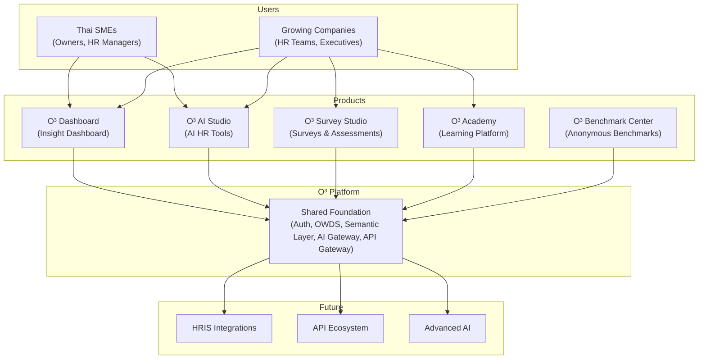

*Description: The O³ Platform consists of a Shared Foundation that all products use. Products are built on top of the foundation. Future integrations and advanced features extend the platform without rebuilding the core.*

### Business Rules

| Rule ID | Rule | Enforcement |
|---------|------|-------------|
| BR-OV-001 | Every product MUST use the Shared Foundation. No product may implement its own auth, data store, or AI gateway. | Architecture Review — blocking |
| BR-OV-002 | New products MUST be proposed via Product Specification (Book 17) before development. | Sprint planning gate |
| BR-OV-003 | The platform MUST support multi-tenancy from day one. Company data isolation is mandatory. | RLS enforcement |
| BR-OV-004 | MVP scope is fixed: Dashboard + AI Studio + Shared Foundation. Additional products require ADR approval. | Scope management |

### Cross References

- Book 00: Platform Overview — Five-layer architecture and product descriptions
- Book 02: Business Architecture — Subscription model and business strategy
- Book 17: Product Specifications — Detailed product feature specifications
- O³ Master Context, Section 01: Vision and Positioning
- O³ Master Context, Section 04: Product Portfolio

### Definition of Ready

```
☐ Platform vision and mission documented and approved
☐ Product portfolio defined with clear MVP scope
☐ Shared Foundation components identified
☐ Future direction documented with phases
```

### Definition of Done

```
☐ All products use Shared Foundation
☐ Platform scope is understood by all team members
☐ New team members can understand the platform from this chapter alone
```

### Validation Checklist

```
☐ Is the platform vision clear and actionable?                                                   [ ]
☐ Are product boundaries well-defined (no overlap)?                                              [ ]
☐ Does every product depend on Shared Foundation (not duplicate it)?                             [ ]
☐ Is the MVP scope clearly separated from future phases?                                         [ ]
☐ Can a new developer understand what O³ is and what it includes?                                [ ]
```

---

## Chapter 2: Platform Capability Map

### Purpose

Define every capability of the O³ platform with its purpose, responsibility, owner, inputs, outputs, dependencies, and related documentation. This capability map is the authoritative inventory of what the platform can do. Every capability must be traceable to a Book that defines it in detail.

### Background

Without a capability map, teams reinvent functionality that already exists, duplicate capabilities across products, and fail to understand the dependencies between platform components. The capability map serves as a single-page view of the entire platform's functional surface area.

### Capability Inventory

#### Shared Foundation Capabilities

| Capability | Purpose | Responsibility | Owner | Input | Output | Dependencies | Related Books |
|-----------|---------|---------------|-------|-------|--------|-------------|---------------|
| **Authentication** | Verify user identity and manage sessions | User login, registration, password reset, session management, MFA | Supabase Auth | User credentials | JWT token, session | None (foundational) | Book 15 |
| **Authorization** | Control access to resources based on roles and permissions | Role-based access control (RBAC), Row Level Security (RLS), permission checking | Authorization Service | JWT token, resource ID, action | Allow/Deny decision | Authentication | Book 15 |
| **Company** | Manage company profile and multi-tenant isolation | Company CRUD, industry classification, size categorization, company settings | Company Domain | Company registration data | Company profile, settings | None (foundational) | Book 03 |
| **Workspace** | Provide isolated workspace per company | Workspace creation, member management, workspace settings | Workspace Service | Company ID, user invitations | Workspace context, member list | Company, User | Book 03 |
| **Subscription** | Manage subscription plans, billing, and entitlements | Plan management, payment processing, entitlement checking, credit management | Subscription Domain | Plan selection, payment | Entitlements, usage limits | Company | Book 02 |
| **CRM** | Track customer relationships and communication | Lead tracking, customer communication, support tickets, feedback collection | CRM Service | User interactions, support requests | Customer profile, interaction history | Company, User | Book 02 |
| **Notification** | Deliver notifications across channels | Email, in-app, and future push notification delivery | Notification Service | Notification event, user preferences | Delivered notification | User, Company | Book 20 |
| **Audit** | Record all significant platform actions | Activity logging, audit trail, compliance reporting | Audit Service | User action, resource change | Audit log entry | Authentication, Authorization | Book 15, Book 20 |
| **OWDS** | Standardize and validate all workforce data | Data ingestion, validation, standardization, storage | OWDS Pipeline | Uploaded data files | Standardized OWDS data | None (foundational) | Book 06, Book 07 |
| **Semantic Layer** | Define KPIs, formulas, risk thresholds, and business meaning | KPI definitions, formula engine, risk threshold management, action library | Semantic Layer Engine | OWDS data, KPI definitions | Calculated KPIs, risk levels, actions | OWDS | Book 08 |
| **Insight Engine** | Generate business insights from workforce data | KPI calculation, risk assessment, trend detection, anomaly detection | Insight Engine | OWDS data, Semantic Layer definitions | Insights, risk assessments, trend alerts | OWDS, Semantic Layer | Book 08, Book 13 |
| **AI Gateway** | Manage all AI/LLM interactions | Prompt management, LLM routing, output validation, context assembly, rate limiting | AI Gateway | User query, context data, prompt template | Structured AI response | OWDS, Semantic Layer, Insight Engine | Book 12 |
| **Action Engine** | Generate and track recommended actions | Action selection, prioritization, tracking, product linking | Action Engine | Insights, risk assessments | Action list, action status | Insight Engine, AI Gateway | Book 08, Book 13 |
| **Benchmark Engine** | Generate anonymous industry benchmarks | Data anonymization, aggregation, segment filtering, benchmark calculation | Benchmark Engine | Anonymized OWDS data | Benchmark statistics, comparison reports | OWDS, Anonymization Pipeline | Book 05 |
| **Academy Engine** | Manage learning content and progress | Course management, progress tracking, assessment, certification | Academy Engine | Course content, user progress | Learning records, certificates | User, Subscription | Book 17 |
| **Dashboard Engine** | Render insight-first dashboard widgets | Widget rendering, layout management, filter orchestration, export | Dashboard Engine | Insights, KPIs, actions | Rendered dashboard widgets | Insight Engine, Action Engine, AI Gateway | Book 13 |
| **API Gateway** | Route, secure, and manage all API traffic | Request routing, rate limiting, authentication check, request/response logging | API Gateway | API request | API response | Authentication, Authorization | Book 10 |
| **Storage** | Store and manage files and documents | File upload, storage, retrieval, versioning | Storage Service | File upload | File URL, metadata | Company, Workspace | Book 11 |
| **Reporting** | Generate insight-first reports | Report template rendering, PDF generation, data export | Reporting Engine | Insights, widget data, company context | PDF report, data export | Insight Engine, Dashboard Engine | Book 13 |
| **Analytics** | Track product usage and business metrics | Event tracking, metric calculation, usage dashboard | Analytics Engine | User events, system events | Usage metrics, dashboards | All capabilities | Book 15, Book 20 |

### Business Rules

| Rule ID | Rule | Enforcement |
|---------|------|-------------|
| BR-CAP-001 | Every capability MUST have a documented owner. No capability without an owner. | Architecture Review |
| BR-CAP-002 | Capabilities MUST NOT duplicate functionality. If two capabilities overlap, one must be deprecated or merged. | Architecture Review |
| BR-CAP-003 | New capabilities MUST be proposed via ADR and added to this capability map. | Change management (Book 20, Ch.05) |
| BR-CAP-004 | Every capability MUST be traceable to a Book that defines it in detail. | Documentation review |

### Cross References

- Book 03: Domain Model — Domain ownership of capabilities
- Book 04: Business Capability Map — Business-level capability mapping
- Book 00: Platform Overview — Five-layer architecture mapping to capabilities

### Definition of Ready

```
☐ All capabilities documented with purpose, responsibility, owner, inputs, outputs, dependencies
☐ No capability overlaps with another
☐ Every capability has a related Book reference
```

### Definition of Done

```
☐ Capability map is complete and reviewed
☐ All capabilities are implemented or on roadmap
☐ No undocumented capabilities exist in the codebase
```

### Validation Checklist

```
☐ Does every platform capability have a documented owner?                                        [ ]
☐ Are there any duplicate capabilities across the platform?                                      [ ]
☐ Is every capability traceable to a Book?                                                       [ ]
☐ Are capability dependencies clearly documented?                                                [ ]
```

---

## Chapter 3: Platform Lifecycle

### Purpose

Define the end-to-end user journey across the O³ platform from discovery through renewal. This lifecycle view ensures that every phase of the user experience is designed, instrumented, and connected across products.

### Background

Multi-product platforms often have fragmented user journeys. A user discovers through the Academy, signs up, uses the Dashboard, but never discovers AI Studio. Or a user uploads data but never returns because the onboarding didn't lead to value. The Platform Lifecycle defines the ideal journey and ensures every transition between phases is intentional and measured.

### Architecture

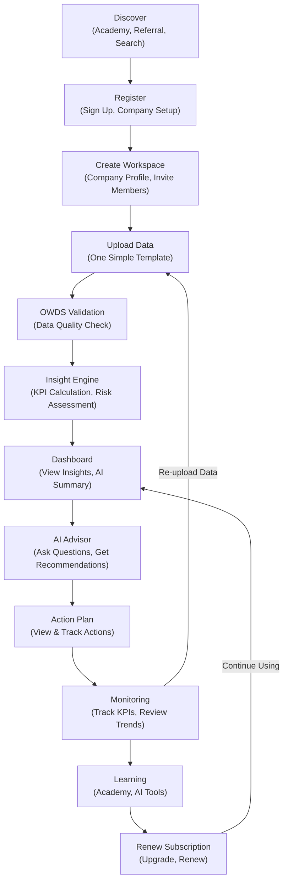

*Description: The Platform Lifecycle shows the end-to-end user journey from discovery through renewal. Each phase transitions to the next. Users can loop back from Monitoring to Upload for data updates. Renewal leads back to continued Dashboard usage.*

### Lifecycle Phases

| Phase | User Action | Platform Response | Success Metric |
|-------|------------|-------------------|---------------|
| **Discover** | Find O³ via Academy, referral, search, or social media | Landing page, Academy content, free assessment | Visitor → Signup conversion rate |
| **Register** | Sign up with email, create company profile | Account creation, workspace provisioning, welcome email | Signup completion rate |
| **Create Workspace** | Set up company profile, invite team members | Workspace creation, member invitations, role assignment | Workspace activation rate |
| **Upload Data** | Download template, fill employee data, upload | Template download, file parsing, OWDS validation | Upload success rate |
| **OWDS Validation** | Review validation report, fix errors, re-upload | Data quality check, validation report, fix instructions | Data quality score |
| **Insight Engine** | Wait for processing | KPI calculation, risk assessment, trend detection | Time to first insight |
| **Dashboard** | View workforce insights, AI summary, risk alerts | Insight-first widgets, AI interpretation, risk badges | Dashboard view rate |
| **AI Advisor** | Ask questions, get AI recommendations | AI context assembly, structured AI response | AI usage rate |
| **Action Plan** | Review recommended actions, mark progress | Action list, prioritization, tracking, product links | Action completion rate |
| **Monitoring** | Track KPIs over time, review trends | Trend charts, KPI monitoring, alert notifications | Weekly active company rate |
| **Learning** | Take Academy courses, use AI tools | Course progress, AI tool usage, certification | Academy completion rate |
| **Renew Subscription** | Upgrade plan, renew subscription | Plan comparison, payment processing, entitlement update | Subscription conversion rate |

### Business Rules

| Rule ID | Rule | Enforcement |
|---------|------|-------------|
| BR-LC-001 | Every lifecycle phase transition MUST be instrumented with analytics events. | Product analytics requirement |
| BR-LC-002 | Users MUST be able to return to any previous phase without losing progress. | UX requirement |
| BR-LC-003 | The Upload → Validation → Insight pipeline MUST complete within 2 minutes for datasets up to 500 employees. | Performance SLA |
| BR-LC-004 | Users who complete Dashboard view MUST be guided to AI Advisor as the next step. | UX flow requirement |

### Cross References

- Book 11: Database Architecture — Data pipeline performance targets
- Book 13: Dashboard Engine — Dashboard rendering and widget architecture
- Book 17: Product Specifications — Product-specific user journeys
- Book 20, Chapter 03: Onboarding Process — Detailed onboarding workflow

### Definition of Ready

```
☐ All lifecycle phases defined with user actions and platform responses
☐ Phase transitions instrumented with analytics
☐ Performance targets defined for each phase
☐ User can navigate between phases without data loss
```

### Definition of Done

```
☐ Lifecycle analytics collecting phase transition data
☐ Drop-off points identified and addressed
☐ Time-to-value measured and within targets
☐ User feedback collected at key transition points
```

### Validation Checklist

```
☐ Is every lifecycle phase instrumented with analytics?                                          [ ]
 Can users navigate freely between phases?                                                      [ ]
☐ Is the Upload-to-Insight pipeline within the 2-minute SLA?                                     [ ]
☐ Are drop-off rates measured at each phase transition?                                          [ ]
☐ Is the Dashboard-to-AI-Advisor transition guided?                                              [ ]
```

---

## Chapter 4: Core Vocabulary

### Purpose

Define the canonical business glossary for the O³ platform. Every term used in documentation, code, APIs, AI prompts, and user interfaces must use these definitions. This glossary prevents terminology drift across products and ensures that all stakeholders—PM, Architect, Developer, AI Agent—share a common language.

### Background

Multi-product platforms frequently develop inconsistent terminology. One product calls it a "Company," another calls it a "Tenant." One calls it a "Widget," another calls it a "Card." AI prompts reference "employees" while the database stores "staff." This inconsistency creates confusion for users, bugs in cross-product features, and incorrect AI outputs.

The Core Vocabulary is the single source of truth for all O³ terminology. Every term has a precise definition, a documented owner, and usage examples. No new term may be introduced without being added to this glossary.

### Business Glossary

| Term | Definition | Used By | Owner | Related Book | Example |
|------|-----------|---------|-------|-------------|---------|
| **Company** | A legal business entity registered on the O³ platform. The top-level tenant boundary. | All products | Company Domain | Book 03 | "บริษัท สมมติ จำกัด" registers on O³ |
| **Workspace** | An isolated environment within a Company for a specific team or department. | Dashboard, AI Studio | Workspace Service | Book 03 | "Sales Department Workspace" within a Company |
| **Tenant** | Synonym for Company in multi-tenant architecture context. Used in infrastructure and security documentation. | Platform, DevOps | Platform Layer | Book 15 | "Tenant isolation via RLS" |
| **User** | An individual with an O³ account. Has credentials, roles, and permissions. | All products | Supabase Auth | Book 15 | "somchai@company.com" logs into O³ |
| **Member** | A User who belongs to a specific Workspace. Has a workspace-level role. | Dashboard, AI Studio | Workspace Service | Book 03 | "Somchai is a Member of Sales Workspace with HR Manager role" |
| **Employee** | An individual recorded in OWDS data. May or may not be an O³ User. | Dashboard, AI Studio, Survey | OWDS | Book 06 | "Employee_ID EMP001: Somchai Somsakul, Sales Department" |
| **OWDS** | O³ Workforce Data Standard. The canonical data model for all workforce data. | All products | OWDS Pipeline | Book 06 | "Upload data following OWDS v1.0.0 template" |
| **Dataset** | A specific upload or import of OWDS data. Versioned and timestamped. | Dashboard, AI Studio | OWDS Pipeline | Book 06 | "Dataset #42 uploaded on 2026-06-25 with 150 employees" |
| **Insight** | A business interpretation generated from workforce data. Includes risk level and recommended actions. | Dashboard, AI Studio | Insight Engine | Book 08, Book 13 | "Sales turnover is 18% (High risk). Top performers are leaving." |
| **Recommendation** | A specific, actionable suggestion generated by AI or the Action Engine. | Dashboard, AI Studio | Action Engine | Book 08 | "Conduct stay interviews with Sales employees under 2 years tenure" |
| **Action** | A tracked task that a user can mark as Pending, In Progress, or Completed. | Dashboard, AI Studio | Action Engine | Book 08, Book 13 | "Action #12: Review Sales compensation — In Progress" |
| **Dashboard** | The insight-first analytics interface. Displays widgets with KPIs, risk levels, and AI interpretations. | Dashboard | Dashboard Engine | Book 13 | "O³ Dashboard showing Workforce Snapshot and Turnover Analysis" |
| **Widget** | A single dashboard component displaying one KPI or insight. Includes chart, risk badge, interpretation, and actions. | Dashboard | Dashboard Engine | Book 13 | "Turnover Rate Widget showing 18% with High risk badge" |
| **Indicator** | A single metric or KPI value. The atomic unit of measurement. | Dashboard, AI Studio | Semantic Layer | Book 08 | "Turnover Rate = 18%" |
| **KPI** | Key Performance Indicator. A metric with defined thresholds, interpretation, and actions. | All products | Semantic Layer | Book 08 | "Overall Turnover Rate KPI with Low/Medium/High/Critical thresholds" |
| **Product** | A user-facing application within the O³ platform (Dashboard, AI Studio, Survey Studio, Academy). | All | Platform | Book 00 | "O³ Dashboard is a Product" |
| **Capability** | A functional ability of the platform. Products are composed of capabilities. | Platform, Architecture | Platform Layer | Book 01, Ch.02 | "Insight Engine is a Capability used by Dashboard and AI Studio" |
| **Module** | A logical grouping of related features within a product. | Product specs | Product Management | Book 17 | "Workforce Snapshot module in Dashboard" |
| **Feature** | A specific user-facing functionality within a product module. | Product specs | Product Management | Book 17 | "Department Breakdown chart in Workforce Snapshot" |
| **Service** | A backend component that provides a specific capability via API. | Architecture, DevOps | Platform Layer | Book 10 | "Workforce API Service serves OWDS data" |
| **AI Session** | A single interaction session with an AI feature. Has context, conversation history, and output. | AI Studio, Dashboard | AI Gateway | Book 12 | "AI Advisor session #582: User asked about turnover trends" |
| **Conversation** | The exchange of messages within an AI Session. Includes user prompts and AI responses. | AI Studio | AI Gateway | Book 12 | "User: 'Why is Sales turnover high?' → AI: 'Sales turnover is 18%...'" |
| **Prompt** | The structured input sent to an LLM. Includes system instructions, context data, and user query. | AI Gateway | AI Gateway | Book 12 | "System: You are an HR advisor... Context: [OWDS data]... User: Why is turnover high?" |
| **Response** | The structured output from an LLM. Must follow the output template (Summary, Evidence, Interpretation, Action, Confidence, Limitations). | AI Gateway | AI Gateway | Book 12 | "Summary: Sales turnover is elevated... Confidence: Medium..." |
| **Report** | A generated document (PDF) containing insights, charts, and data. Insight-first layout. | Dashboard | Reporting Engine | Book 13 | "Q2 2026 Workforce Intelligence Report" |
| **Benchmark** | Anonymized, aggregated industry comparison data. Minimum N=5 per segment. | Benchmark Center | Benchmark Engine | Book 05 | "Manufacturing turnover benchmark: 14.2% (N=23 companies)" |
| **Template** | A pre-defined structure for data upload, AI output, report, or assessment. | All products | Various | Book 06, Book 14 | "One Simple Company Data Template v1.0.0" |
| **Assessment** | A structured evaluation (company readiness, organization health, AI readiness). | Survey Studio | Survey Engine | Book 17 | "7S Organization Assessment" |
| **Survey** | A questionnaire distributed to employees. Includes question bank, distribution, and analysis. | Survey Studio | Survey Engine | Book 17 | "Employee Engagement Pulse Survey Q3 2026" |
| **Academy** | The learning platform within O³. Courses, lessons, progress tracking, certification. | Academy | Academy Engine | Book 17 | "Course: Data-Driven HR with AI — 80% complete" |
| **Subscription** | A customer's plan and billing relationship with O³. | All products | Subscription Domain | Book 02 | "Growth Plan — 500 employees — Monthly billing" |
| **Entitlement** | A specific feature access right granted by a Subscription. | All products | Subscription Domain | Book 02 | "Entitlement: advanced_analytics = true" |
| **Credit** | A consumable unit for AI usage or premium features. | AI Studio | Subscription Domain | Book 02 | "50 AI Advisor credits remaining this month" |

### Business Rules

| Rule ID | Rule | Enforcement |
|---------|------|-------------|
| BR-VOC-001 | All documentation, code, APIs, and AI prompts MUST use terms exactly as defined in this glossary. | Code review, documentation review |
| BR-VOC-002 | New terms MUST be proposed via ADR and added to this glossary before use in code or documentation. | Architecture Review |
| BR-VOC-003 | Term definitions MUST NOT be duplicated or redefined in other Books. Other Books reference this glossary. | Documentation review |
| BR-VOC-004 | AI prompts MUST use glossary terms. AI MUST NOT invent new terminology. | AI Gateway prompt validation |

### Common Mistakes

| Mistake | Why | Fix |
|---------|-----|-----|
| Using "Company" and "Tenant" interchangeably in user-facing text | Confuses business and technical audiences | "Company" for user-facing; "Tenant" for infrastructure docs |
| Calling a Widget a "Card" or "Tile" | Inconsistent terminology across products | Always "Widget" — defined in this glossary |
| AI generating terms not in the glossary | AI invents plausible but incorrect terms | AI prompts include glossary constraints |

### AI Instructions

- Always use terms exactly as defined in this glossary. Never invent synonyms.
- When generating code, use glossary terms for variable names, API endpoints, and database tables.
- When generating AI prompts, include a glossary reference: "Use O³ terminology as defined in Book 01, Chapter 4."
- If a concept needs a new term, propose it for glossary addition — do not use an undefined term.

### Cross References

- Book 03: Domain Model — Domain entities that implement glossary terms
- Book 06: OWDS — OWDS field names that extend this glossary
- Book 08: Semantic Layer — KPI names defined in this glossary
- O³ Master Context, Section 13: Vocabulary and Naming

### Definition of Ready

```
☐ All core terms defined with definition, used by, owner, related book, and example
☐ No duplicate or conflicting definitions
☐ Glossary covers all product, architecture, and business terms
```

### Definition of Done

```
☐ All documentation uses glossary terms consistently
☐ All code uses glossary terms for naming
☐ AI prompts reference glossary terms
☐ New terms are added via ADR process
```

### Validation Checklist

```
☐ Are all terms used consistently across Books 00–20?                                            [ ]
☐ Are there any undocumented terms in the codebase?                                              [ ]
☐ Do AI prompts use glossary terms (not invented terms)?                                         [ ]
☐ Is there a process for adding new terms to the glossary?                                       [ ]
```

---

## Chapter 5: Repository Structure

### Purpose

Define the complete directory and file structure of the O³ Platform Operating Manual repository. Every folder has a defined purpose. Every file type has a defined location. This structure ensures that anyone—developer, PM, architect, or AI Agent—can find any document without asking.

### Background

Documentation repositories become unusable when files are scattered without convention. One person puts ADRs in `/decisions/`, another in `/adr/`. One person names a file `api-standards.md`, another names it `API_STANDARDS.md`. Without a defined structure, finding information requires searching, guessing, or asking—defeating the purpose of documentation.

### Repository Structure

```
o3-platform-operating-manual/
├── README.md                          # Repository overview and quick start
├── SUMMARY.md                         # Complete document index
├── CHANGELOG.md                       # All changes across all documents
│
├── books/                             # Platform Books (00–20)
│   ├── book-00-platform-overview/
│   │   ├── README.md                  # Book overview
│   │   └── index.md                   # Book content (all chapters)
│   ├── book-01-platform-constitution/
│   ├── book-02-business-architecture/
│   ├── book-03-domain-model/
│   ├── book-04-business-capability-map/
│   ├── book-05-information-architecture/
│   ├── book-06-owds/
│   ├── book-07-metadata-standard/
│   ├── book-08-semantic-layer/
│   ├── book-09-event-model/
│   ├── book-10-api-standards/
│   ├── book-11-database-architecture/
│   ├── book-12-ai-architecture/
│   ├── book-13-dashboard-engine/
│   ├── book-14-design-system/
│   ├── book-15-security/
│   ├── book-16-devops/
│   ├── book-17-product-specifications/
│   ├── book-18-business-knowledge-framework/
│   ├── book-19-engineering-handbook/
│   └── book-20-platform-operations/
│
├── adr/                               # Architecture Decision Records
│   ├── README.md                      # ADR index and process
│   └── adr-NNN-title.md              # Individual ADRs
│
├── standards/                         # Cross-cutting standards
│   ├── documentation-writing-standard.md
│   └── [future-standards].md
│
├── knowledge/                         # Knowledge Base articles
│   └── README.md
│
├── patterns/                          # Design and architecture patterns
│   └── README.md
│
├── templates/                         # Reusable templates
│   ├── README.md
│   └── [template-files]
│
├── diagrams/                          # Diagram source files
│   ├── README.md
│   └── [diagram-files].mmd
│
── assets/                            # Images and static assets
    ├── README.md
    ── [asset-files].png
```

### Folder Purposes

| Folder | Purpose | Content Types | Owner |
|--------|---------|--------------|-------|
| `books/` | Platform Books 00–20. The core architecture documentation. | `index.md` (content), `README.md` (overview) | Chief Architect |
| `adr/` | Architecture Decision Records. One file per decision. | `adr-NNN-title.md` | Chief Architect |
| `standards/` | Cross-cutting standards that apply to all documents. | `*.md` | Chief Architect |
| `knowledge/` | Knowledge Base articles for specific topics. | `*.md` | Product Management |
| `patterns/` | Reusable design and architecture patterns. | `*.md` | Engineering |
| `templates/` | Reusable templates (OWDS, reports, assessments). | `.xlsx`, `.md`, `.json` | Product Management |
| `diagrams/` | Mermaid diagram source files (extracted from Books). | `.mmd` | Engineering |
| `assets/` | Static assets: images, logos, icons. | `.png`, `.svg` | Design |

### File Naming Conventions

| Type | Convention | Example |
|------|-----------|---------|
| Book content | `index.md` | `books/book-03-domain-model/index.md` |
| Book overview | `README.md` | `books/book-03-domain-model/README.md` |
| ADR file | `adr-NNN-slug.md` | `adr-001-owds-standard.md` |
| Standard file | `descriptive-slug.md` | `documentation-writing-standard.md` |
| Diagram source | `descriptive-slug.mmd` | `platform-layers.mmd` |
| Template | `template-purpose.ext` | `template-owds-data.xlsx` |

### Business Rules

| Rule ID | Rule | Enforcement |
|---------|------|-------------|
| BR-REPO-001 | All documentation MUST be placed in the correct folder as defined in this chapter. | PR review |
| BR-REPO-002 | File names MUST follow the naming conventions. No spaces, no uppercase (except README.md, CHANGELOG.md, SUMMARY.md). | CI check |
| BR-REPO-003 | Every folder MUST have a README.md explaining its contents. | Repository audit |
| BR-REPO-004 | New top-level folders MUST be proposed via ADR. | Architecture Review |

### Cross References

- `standards/documentation-writing-standard.md` — Section 8: Naming Conventions
- Book 20, Chapter 07: Documentation Lifecycle — Document creation and review process

### Definition of Ready

```
☐ Repository structure documented and agreed
☐ All existing files follow the structure
☐ Every folder has a README.md
```

### Definition of Done

```
☐ Zero files outside defined folder structure
☐ All file names follow conventions
☐ New team members can find any document without asking
```

### Validation Checklist

```
☐ Are all files in their correct folders?                                                        [ ]
☐ Do all file names follow naming conventions?                                                   [ ]
☐ Does every folder have a README.md?                                                            [ ]
 Can a new team member locate any document in under 30 seconds?                                 [ ]
```

---

## Chapter 6: Book Relationship

### Purpose

Define how all 21 Platform Books (00–20) relate to each other. Show the dependency graph, explain which Books are prerequisites for which, and establish the reading order for different roles.

### Background

With 21 Books covering everything from platform overview to engineering handbook, readers need a map. A Product Manager reading Book 17 (Product Specifications) needs to know that Book 02 (Business Architecture) and Book 01 (Platform Constitution) are prerequisites. A Developer reading Book 19 (Engineering Handbook) needs to know that Books 10–16 define the technical standards they must follow.

### Architecture

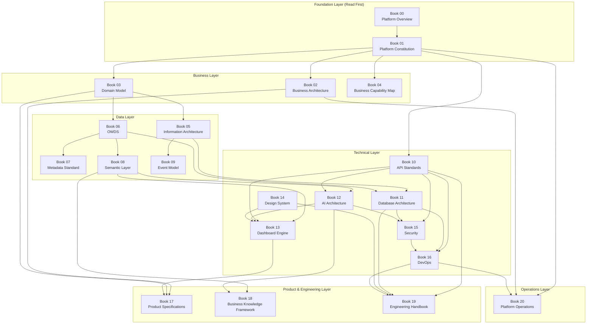

*Description: Books are organized in layers. Foundation Layer (00–01) must be read first. Each subsequent layer builds on the layers above it. Arrows show "must be read before" relationships.*

### Reading Order by Role

| Role | Required Books | Recommended Books |
|------|---------------|-------------------|
| **Product Manager** | 00, 01, 02, 17 | 03, 04, 08, 18 |
| **Software Architect** | 00, 01, 03, 05, 06, 08, 10, 11, 12, 15 | All |
| **Frontend Developer** | 00, 01, 10, 13, 14, 19 | 08, 12, 15 |
| **Backend Developer** | 00, 01, 06, 10, 11, 15, 16, 19 | 05, 07, 08, 09 |
| **AI/ML Engineer** | 00, 01, 06, 08, 12, 18, 19 | 05, 10, 15 |
| **DevOps Engineer** | 00, 01, 10, 15, 16, 20 | 11, 19 |
| **AI Agent** | 00, 01, 03, 06, 08, 10, 11, 12, 14, 19 | All |
| **Founder/Executive** | 00, 01, 02 | 17, 20 |

### Book Dependency Rules

| Rule ID | Rule | Enforcement |
|---------|------|-------------|
| BR-BOOK-001 | Book 00 and Book 01 MUST be read before any other Book. They are the foundation. | Onboarding process |
| BR-BOOK-002 | A Book MUST NOT contradict a Book higher in the dependency graph. | Architecture Review |
| BR-BOOK-003 | When a Book is updated, all dependent Books MUST be checked for consistency. | Change management (Book 20, Ch.05) |
| BR-BOOK-004 | Cross-references between Books MUST follow the dependency direction (downward only). | Documentation review |

### Cross References

- Book 00: Platform Overview — Entry point for all readers
- Book 20, Chapter 05: Change Management — Book update impact analysis
- `standards/documentation-writing-standard.md` — Section 7: Cross-Reference Rules

### Definition of Ready

```
☐ All 21 Books have defined positions in the dependency graph
☐ Reading orders defined for all roles
☐ No circular dependencies in the graph
```

### Definition of Done

```
☐ All cross-references follow dependency direction
☐ New team members follow the reading order for their role
☐ Book updates trigger dependency checks
```

### Validation Checklist

```
☐ Are there any circular dependencies in the Book relationship graph?                            [ ]
☐ Do all cross-references point downward in the dependency graph?                                [ ]
☐ Is the reading order clear for each role?                                                      [ ]
☐ Are Book 00 and 01 listed as prerequisites for all other Books?                                [ ]
```

---

## Chapter 7: Architecture Dependency

### Purpose

Define the technical dependency chain of the O³ platform. Show how data flows from OWDS through the Semantic Layer, Insight Engine, Dashboard, AI, Action Engine, Benchmark, and Academy. Document data dependencies, business dependencies, and technical dependencies between every platform component.

### Background

Without a clear dependency map, changes to one component can unexpectedly break others. If OWDS adds a field, the Semantic Layer, Insight Engine, Dashboard, and AI all need to know. If the Insight Engine changes a KPI formula, the Dashboard, AI, and Action Engine are affected. The Architecture Dependency map makes these relationships explicit so that change impact can be assessed before implementation.

### Architecture

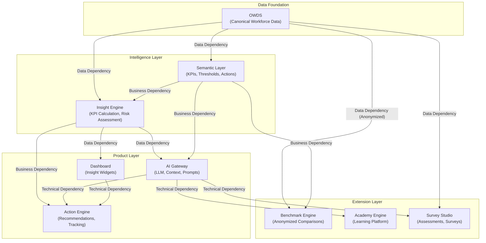

*Description: OWDS is the data foundation. The Intelligence Layer (Semantic Layer, Insight Engine) transforms raw data into business meaning. The Product Layer (Dashboard, AI, Action Engine) consumes intelligence. The Extension Layer (Benchmark, Academy, Survey) builds on top.*

### Dependency Types

| Dependency Type | Definition | Example |
|----------------|-----------|---------|
| **Data Dependency** | Component B reads data produced by Component A. If A's schema changes, B must be updated. | Dashboard reads KPI values from Insight Engine |
| **Business Dependency** | Component B's business logic depends on definitions from Component A. If A's rules change, B's behavior changes. | AI uses risk thresholds defined in Semantic Layer |
| **Technical Dependency** | Component B calls Component A's API at runtime. If A is down, B is degraded. | Action Engine calls AI Gateway for action enhancement |

### Dependency Matrix

| Upstream → Downstream | OWDS | Semantic Layer | Insight Engine | AI Gateway | Action Engine | Dashboard | Benchmark | Academy |
|----------------------|------|---------------|---------------|------------|---------------|-----------|-----------|---------|
| **OWDS** | — | Data | Data | Data | — | — | Data (Anon) | Data |
| **Semantic Layer** | — | — | Business | Business | Business | Business | Business | — |
| **Insight Engine** | — | — | — | Data | Business | Data | — | — |
| **AI Gateway** | — | — | — | — | Technical | — | — | Technical |
| **Action Engine** | — | — | — | — | — | Technical | — | — |
| **Dashboard** | — | — | — | — | — | — | — | — |

### Business Rules

| Rule ID | Rule | Enforcement |
|---------|------|-------------|
| BR-DEP-001 | Upstream component schema changes MUST trigger impact assessment on all downstream components. | Change management (Book 20, Ch.05) |
| BR-DEP-002 | No circular dependencies. If A depends on B, B MUST NOT depend on A. | Architecture Review — blocking |
| BR-DEP-003 | Technical dependencies MUST have fallback behavior. If a downstream component's upstream is unavailable, it MUST degrade gracefully, not crash. | Resilience testing |
| BR-DEP-004 | New dependencies MUST be documented in this chapter before implementation. | Architecture Review |

### Common Mistakes

| Mistake | Why | Fix |
|---------|-----|-----|
| Creating circular dependencies | "Dashboard needs AI, and AI needs Dashboard data" | Refactor to extract shared dependency into a lower layer |
| Not documenting runtime dependencies | "It's obvious that Action Engine calls AI Gateway" | All runtime API calls are documented dependencies |
| Changing upstream schema without downstream impact analysis | "Just adding a column, won't break anything" | Run dependency matrix check before any schema change |

### AI Instructions

- Before modifying any component, check the dependency matrix to identify all downstream components that may be affected.
- Never create a circular dependency. If you find one, refactor to break the cycle.
- When adding a new component, document its dependencies in this chapter.
- When an upstream component changes, generate impact analysis for all downstream components.

### Cross References

- Book 05: Information Architecture — Data flow patterns
- Book 09: Event Model — Event-driven communication between components
- Book 20, Chapter 05: Change Management — Dependency impact assessment process

### Definition of Ready

```
☐ All component dependencies documented (data, business, technical)
☐ Dependency matrix complete
☐ No circular dependencies
☐ Fallback behavior defined for all technical dependencies
```

### Definition of Done

```
☐ Dependency matrix validated against actual code
☐ All runtime API calls match documented dependencies
☐ Fallback behavior tested for all technical dependencies
☐ Change impact assessment process operational
```

### Validation Checklist

```
☐ Are there any circular dependencies in the platform?                                           [ ]
☐ Does every runtime API call match a documented dependency?                                     [ ]
☐ Do all technical dependencies have fallback behavior?                                          [ ]
☐ Is the dependency matrix updated when new components are added?                                [ ]
```

---

## Chapter 8: Platform Non-Functional Requirements

### Purpose

Define the non-functional requirements (NFRs) for the O³ platform: availability, performance, latency, security, privacy, compliance, auditability, scalability, maintainability, observability, localization, accessibility, backup, recovery, disaster recovery, logging, and monitoring. Every NFR has a measurable target.

### Background

Functional requirements define what the platform does. Non-functional requirements define how well it does it. A dashboard that shows turnover rate is functional. A dashboard that shows turnover rate in under 2 seconds with 99.9% availability is non-functional. Without explicit NFRs, the platform may work correctly but be too slow, too unreliable, or too insecure for real business use.

### NFR Inventory

| Category | Requirement | Target | Measurement | Priority |
|----------|------------|--------|-------------|----------|
| **Availability** | Platform uptime | 99.9% (8.76 hours downtime/year) | Uptime monitoring | Critical |
| **Availability** | API Gateway uptime | 99.95% | API health checks | Critical |
| **Availability** | AI Gateway uptime | 99.5% (AI is enhancement, not critical path) | AI Gateway health checks | High |
| **Performance** | API response time (p95) | < 300ms | APM tooling | Critical |
| **Performance** | Dashboard page load (p95) | < 2 seconds | Real User Monitoring (RUM) | Critical |
| **Performance** | AI response time (p95) | < 15 seconds | AI Gateway metrics | High |
| **Performance** | Data upload processing (500 employees) | < 2 minutes | Upload pipeline metrics | High |
| **Performance** | Report generation (PDF) | < 30 seconds | Report engine metrics | Medium |
| **Latency** | Database query (p95) | < 100ms | Database monitoring | Critical |
| **Latency** | AI Gateway to LLM provider | < 10 seconds | AI Gateway metrics | High |
| **Security** | Authentication | Supabase Auth with JWT. MFA available. | Security audit | Critical |
| **Security** | Authorization | Row Level Security (RLS) on all tables. RBAC for features. | Security audit | Critical |
| **Security** | Data encryption | At rest (AES-256) and in transit (TLS 1.3) | Security audit | Critical |
| **Security** | API security | Rate limiting, input validation, CORS, CSP headers | Security audit | Critical |
| **Security** | AI security | Prompt injection prevention, output validation, PII detection | AI Gateway audit | Critical |
| **Privacy** | Data isolation | Multi-tenant isolation via RLS. Company A cannot access Company B data. | Penetration testing | Critical |
| **Privacy** | PII handling | Salary, performance data classified as PII-Sensitive. Access logged. | Data audit | Critical |
| **Privacy** | Benchmark anonymization | k-anonymity (k≥5). No company identifiers in benchmark store. | Privacy audit | Critical |
| **Privacy** | Data retention | User data retained for account lifetime + 30 days after deletion. | Data policy | High |
| **Compliance** | PDPA (Thailand) | Consent management, data subject access requests, breach notification | Legal review | Critical |
| **Compliance** | GDPR readiness | Data export, right to deletion, data processing records | Legal review | Medium |
| **Auditability** | User actions | All user actions logged: login, data upload, config change, AI query | Audit log | Critical |
| **Auditability** | Admin actions | All admin actions logged with before/after values | Audit log | Critical |
| **Auditability** | AI decisions | All AI outputs logged with prompt, context, and response | AI Gateway audit | High |
| **Scalability** | Users | Support 1,000 concurrent users | Load testing | High |
| **Scalability** | Companies | Support 10,000 companies | Database partitioning plan | Medium |
| **Scalability** | Data volume | Support 1M employee records per company | Database performance testing | Medium |
| **Scalability** | AI requests | Support 100 concurrent AI requests | AI Gateway load testing | High |
| **Maintainability** | Code quality | TypeScript strict mode. ESLint + Prettier. 80%+ test coverage. | CI checks | Critical |
| **Maintainability** | Documentation | All architecture documented. ADRs for all major decisions. | Documentation audit | Critical |
| **Maintainability** | Deployment | CI/CD pipeline. Blue-green deployments. Rollback < 5 minutes. | DevOps audit | High |
| **Observability** | Logging | Structured JSON logs. All services log to centralized logging. | Log aggregation | Critical |
| **Observability** | Monitoring | CPU, memory, disk, network for all services. Alert on thresholds. | Monitoring dashboard | Critical |
| **Observability** | Tracing | Distributed tracing for requests across services. | APM tooling | High |
| **Observability** | Error tracking | All unhandled errors captured with stack traces and context. | Error tracking tool | Critical |
| **Localization** | Thai language | All user-facing UI, templates, and AI responses available in Thai. | Localization audit | Critical |
| **Localization** | English language | UI and documentation available in English for international users. | Localization audit | Medium |
| **Accessibility** | WCAG compliance | WCAG 2.1 Level AA for all user-facing products. | Accessibility audit | Medium |
| **Accessibility** | Mobile responsive | All products usable on mobile devices. | Responsive testing | High |
| **Backup** | Database backup | Daily automated backups. 30-day retention. | Backup monitoring | Critical |
| **Backup** | Backup testing | Quarterly restore tests. | Operations process | High |
| **Recovery** | Recovery Time Objective (RTO) | < 4 hours | Disaster recovery test | Critical |
| **Recovery** | Recovery Point Objective (RPO) | < 1 hour (maximum data loss) | Disaster recovery test | Critical |
| **Disaster Recovery** | DR plan | Documented DR plan. Quarterly testing. | Operations audit | High |
| **Disaster Recovery** | Multi-region | Multi-region deployment for Growth phase. | Architecture plan | Medium |

### Business Rules

| Rule ID | Rule | Enforcement |
|---------|------|-------------|
| BR-NFR-001 | All NFR targets MUST be measured in production. No NFR without measurement. | Operations monitoring |
| BR-NFR-002 | NFR violations MUST trigger alerts. Critical NFR violations trigger P1 incident. | Alerting configuration |
| BR-NFR-003 | NFR targets MUST be reviewed quarterly. Targets may be tightened as the platform matures. | Operations review |
| BR-NFR-004 | New features MUST NOT degrade existing NFRs. Performance and security regression testing required. | CI/CD pipeline |

### Cross References

- Book 15: Security — Detailed security architecture and controls
- Book 16: DevOps — CI/CD, monitoring, and operations
- Book 20, Chapter 09: Incident Management — Alert response procedures

### Definition of Ready

```
☐ All NFR categories defined with measurable targets
☐ Measurement tools configured for all targets
☐ Alert thresholds configured for critical NFRs
☐ DR plan documented
```

### Definition of Done

```
☐ All NFR targets measured in production
☐ No critical NFR violations open
☐ DR test completed successfully
☐ NFR review process operational
```

### Validation Checklist

```
☐ Is every NFR target measurable (not aspirational)?                                             [ ]
☐ Are critical NFRs monitored with alerts?                                                       [ ]
☐ Has a DR test been performed in the last quarter?                                              [ ]
☐ Do new features pass NFR regression testing?                                                   [ ]
```

---

## Chapter 9: Platform Success Metrics

### Purpose

Define the key metrics that measure the success of the O³ platform. These metrics span activation, engagement, retention, revenue, AI usage, data quality, and platform health. Every metric has a definition, current target, and measurement method.

### Background

Platforms fail when teams optimize for the wrong metrics—or for no metrics at all. "We're getting a lot of signups" is not a success metric if none of those signups upload data. "AI usage is high" is not a success metric if AI recommendations are never followed. The Platform Success Metrics define what "success" actually means for O³, ensuring that every team is aligned on what matters.

### Success Metrics

| # | Metric | Definition | Target (MVP) | Measurement |
|---|--------|-----------|-------------|-------------|
| **Activation & Onboarding** |
| SM-01 | Activation Rate | % of signups that upload data and view first insight | > 60% | Analytics funnel |
| SM-02 | Upload Success Rate | % of uploads that pass OWDS validation on first attempt | > 70% | Upload pipeline |
| SM-03 | Time to First Insight | Minutes from signup to first dashboard view with data | < 5 minutes | Analytics timer |
| **Engagement** |
| SM-04 | Weekly Active Companies | Companies with at least one active user in the last 7 days | Growth target | Analytics |
| SM-05 | Monthly Active Companies | Companies with at least one active user in the last 30 days | Growth target | Analytics |
| SM-06 | Dashboard Views per Company per Week | Average number of dashboard page views per active company | > 3 | Analytics |
| SM-07 | AI Usage Rate | % of active companies that use at least one AI feature per month | > 40% | AI Gateway |
| SM-08 | AI Queries per Company per Month | Average number of AI queries per active company | > 10 | AI Gateway |
| **Action & Value** |
| SM-09 | Action Completion Rate | % of recommended actions marked as Completed | > 30% | Action Engine |
| SM-10 | Survey Completion Rate | % of surveys that receive responses from > 50% of target employees | > 60% | Survey Studio |
| SM-11 | Academy Completion Rate | % of enrolled courses completed | > 40% | Academy Engine |
| **Revenue** |
| SM-12 | Subscription Conversion Rate | % of free companies that convert to paid | > 15% | Subscription |
| SM-13 | Monthly Recurring Revenue (MRR) | Total monthly subscription revenue | Growth target | Billing |
| SM-14 | MRR Growth Rate | Month-over-month MRR growth | > 10% | Billing |
| SM-15 | Churn Rate | % of paid companies that cancel per month | < 5% | Subscription |
| **Retention** |
| SM-16 | Week-1 Retention | % of companies active 1 week after signup | > 50% | Analytics |
| SM-17 | Month-1 Retention | % of companies active 1 month after signup | > 30% | Analytics |
| SM-18 | Net Promoter Score (NPS) | User satisfaction survey score | > 30 | NPS survey |
| **Data Quality** |
| SM-19 | OWDS Quality Score | Average data quality score across all companies | > 70/100 | OWDS Pipeline |
| SM-20 | Data Completeness | % of OWDS fields filled across all datasets | > 60% | OWDS Pipeline |
| **Platform Health** |
| SM-21 | API Success Rate | % of API requests returning 2xx | > 99.5% | API Gateway |
| SM-22 | API Latency (p95) | 95th percentile API response time | < 300ms | API Gateway |
| SM-23 | Platform Uptime | % of time platform is available | > 99.9% | Uptime monitoring |
| SM-24 | AI Response Time (p95) | 95th percentile AI response time | < 15 seconds | AI Gateway |
| SM-25 | Error Rate | % of requests resulting in 5xx errors | < 0.1% | Error tracking |
| **Benchmark (Future)** |
| SM-26 | Benchmark Coverage | Number of companies contributing to each benchmark segment | > 100 per segment | Benchmark Engine |
| SM-27 | Benchmark Usage | % of companies that view benchmark comparisons | > 20% | Benchmark Center |

### Business Rules

| Rule ID | Rule | Enforcement |
|---------|------|-------------|
| BR-SM-001 | All success metrics MUST be measured from day one. No metric without instrumentation. | Product analytics requirement |
| BR-SM-002 | Success metrics MUST be reviewed monthly. Metrics below target MUST have an action plan. | Monthly business review |
| BR-SM-003 | New features MUST define which success metrics they are expected to improve. | Product spec requirement |
| BR-SM-004 | Success metrics MUST be visible to the entire team via a shared dashboard. | Operations requirement |

### Cross References

- Book 02: Business Architecture — Business model and revenue metrics
- Book 20, Chapter 08: Product Learning Review — Monthly metric review process
- Principle 15: Build for Learning — Instrumentation requirements

### Definition of Ready

```
☐ All success metrics defined with targets
☐ Analytics instrumentation implemented for all metrics
☐ Success metrics dashboard built
☐ Monthly review process scheduled
```

### Definition of Done

```
☐ All metrics collecting data
☐ Metrics dashboard accessible to team
☐ Monthly review process operational
☐ Metrics inform roadmap decisions
```

### Validation Checklist

```
☐ Is every success metric instrumented and collecting data?                                      [ ]
 Are metrics reviewed monthly with action plans for below-target metrics?                       [ ]
☐ Does every new feature spec include expected metric impact?                                    [ ]
☐ Is the metrics dashboard accessible to the entire team?                                        [ ]
```

---

## Principle 01: One Source of Truth

### Purpose

Define a single, authoritative data source for every core business object in the O³ platform. No business object may exist in more than one canonical location. This principle prevents data inconsistency, conflicting insights, and the fragmentation that destroys trust in multi-product platforms.

### Background

Multi-product platforms commonly suffer from data duplication. One team creates an `employees` table. Another team creates a `staff` table for their tools. A third stores user profiles separately. When an employee's department changes in one system but not the others, every product shows different numbers for the same question: "How many people are in Sales?"

This fragmentation destroys trust. If a CEO sees 150 employees on the Dashboard but AI Studio says 148, they stop trusting both. The root cause is always the same: no single source of truth.

O³ solves this at the architectural level. Every business object has exactly one owner. Employee data lives in OWDS. Company profiles live in the shared Company domain. AI does not maintain its own copies. Dashboard reads from OWDS. AI Studio reads from OWDS. Academy references users through the shared User domain. One truth, everywhere.

### Principles

| # | Principle | Description |
|---|-----------|-------------|
| SSOT-01 | **Canonical Ownership** | Every business object type has exactly one canonical data store. No exceptions. |
| SSOT-02 | **Read-Only Access for Consumers** | Products that are not the owner of a business object may only read it through defined APIs. They may not modify or duplicate the data. |
| SSOT-03 | **Write-Through to Source** | When a user updates data through any product surface, the write must go to the canonical source, not a local copy. |
| SSOT-04 | **No Derived Stores Without Justification** | Cached or derived data is permitted only with an ADR documenting the justification, staleness tolerance, and invalidation strategy. |
| SSOT-05 | **Lineage Traceable** | Any data value displayed in any product must be traceable to its canonical source through a documented API path. |

### Architecture

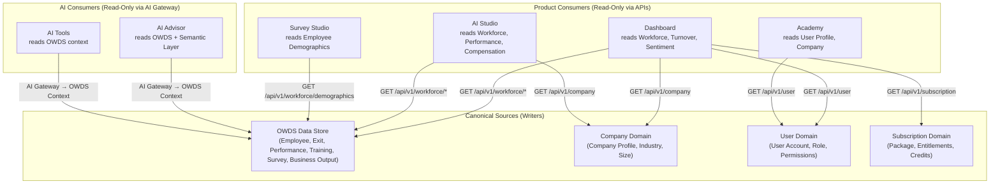

*Description: The canonical sources (OWDS, Company, User, Subscription) are the only writers. All product and AI consumers are read-only via APIs. No product maintains its own copy of canonical data.*

### Business Rules

| Rule ID | Rule | Enforcement |
|---------|------|-------------|
| BR-SSOT-001 | Employee data MUST be stored only in OWDS tables. No product may create its own employee table. | Database schema review — blocking violation |
| BR-SSOT-002 | Company profile MUST be stored only in the Company domain. All products read from the same company record. | API access control — only Company API writes |
| BR-SSOT-003 | User account data MUST be managed by Supabase Auth. Products reference user IDs, not duplicate user records. | Auth middleware — blocking |
| BR-SSOT-004 | Subscription state MUST be managed by the Subscription domain. Products check entitlements via API, not local state. | Entitlement middleware — blocked at API level |
| BR-SSOT-005 | Any data cache MUST have a documented ADR with invalidation strategy and staleness tolerance. | Architecture Review — blocking |
| BR-SSOT-006 | AI MUST NOT store or cache business data. AI reads context from canonical sources for each request. | AI Gateway middleware — context assembled per-request |

### Examples

**Example 1: Correct — Single Source for Employee Data**
```
1. User uploads Employee_Master Excel via Dashboard
2. Upload API validates and writes to OWDS.employees table
3. Dashboard reads workforce summary from OWDS via Workforce API
4. AI Studio reads employee context from OWDS via Workforce API
5. AI Advisor reads employee data from OWDS via AI Context Layer
→ All three products show the same headcount: 150 employees
```

**Example 2: Incorrect — Data Duplication**
```
❌ Dashboard writes to dashboard.employees table
❌ AI Studio writes to ai_studio.staff table
❌ Academy writes to academy.users table
→ Dashboard shows 150, AI Studio shows 148, Academy shows 152
→ CEO loses trust in all products
```

**Example 3: Permitted Exception — Performance Cache with ADR**
```
✅ Dashboard caches workforce summary for 5 minutes (ADR-009 approved)
✅ Cache invalidation: cleared on new upload, expires after 5 minutes
✅ Staleness tolerance: up to 5 minutes old is acceptable for dashboard display
✅ Documented in ADR-009 with justification: reduces DB load by 80%
```

### Common Mistakes

| Mistake | Why It Happens | How to Avoid |
|---------|---------------|--------------|
| Creating a local `employees` table in a product database | "It's faster to query locally" | Use the Workforce API; if performance is an issue, request a cache with ADR |
| Storing AI-generated insights as "employee data" | Confusion between derived insights and source data | Insights are stored in the Intelligence Layer, not in OWDS; they reference OWDS IDs |
| Copying company profile to each product's settings | "Each product needs different company fields" | Extend the Company domain; all products read extended fields |
| Duplicating user preferences per product | "Academy preferences are different from Dashboard preferences" | User preferences stored in User domain with product-specific namespaces |

### Anti-patterns

| Anti-pattern | Description | Consequence | Correct Approach |
|-------------|-------------|-------------|-----------------|
| **Shadow Database** | A product maintains its own copy of OWDS data "for performance" | Data drift; conflicting numbers across products | Request a sanctioned cache with ADR |
| **API Response Caching as Source** | A product caches an API response and treats it as the source of truth | Stale data used for critical decisions | Always re-fetch from canonical source for writes; reads may use cache with documented TTL |
| **AI Memory as Data Store** | AI Advisor "remembers" employee data from previous conversations | AI gives advice based on stale data | AI Context Layer assembles fresh context for every request |
| **Export-Import as Sync** | Users export data from one product and import to another | Manual, error-prone, creates drift | All products read from the same APIs |

### AI Instructions

- When generating code that reads business data, always use the canonical API for that data type.
- Never generate code that creates a new table for data that already has a canonical source.
- If you need to cache data for performance, document the cache in an ADR proposal — do not implement without approval.
- When displaying data in UI, always show the source: "Data from OWDS, last updated: 2026-06-25 14:30".
- If you detect a potential violation of this principle in existing code, flag it — do not silently work around it.

### Cross References

- Book 03: Domain Model — Defines the canonical business objects and their relationships
- Book 05: Information Architecture — Data flow patterns that enforce single source of truth
- Book 06: OWDS — The canonical data standard for all workforce data
- Book 10: API Standards — API contracts that enforce read-only access for consumers
- Book 11: Database Architecture — Physical schema design with clear data ownership
- Book 20, Chapter 04: Traceability Matrix — Tracing data from source to display

### Related ADR

| ADR | Title | Relevance |
|-----|-------|-----------|
| ADR-001 | Use OWDS as the Workforce Data Standard | Establishes OWDS as the canonical source for workforce data |
| ADR-002 | API First Architecture | Enforces API-based access instead of direct database access |
| ADR-009 | Dashboard Performance Caching Strategy | Approved exception for read-only caches with documented TTL |

### Definition of Ready

```
☐ All business object types have a documented canonical owner
☐ No product maintains a duplicate data store for any canonical object
☐ All data access paths are through defined APIs
☐ Any caches have documented ADRs with invalidation strategies
☐ Data lineage is traceable from any UI element to its canonical source
```

### Definition of Done

```
☐ Database schema review confirms no duplicate tables across products
☐ API access controls enforce write-only-by-owner
☐ All products read from canonical APIs (verified by code review)
☐ Cache documentation complete for all approved caches
☐ Data lineage documented for all dashboard widgets and AI features
```

### Validation Checklist

```
☐ Does every business object have exactly one database table (or set of tables) that owns it?     [ ]
☐ Can every data value displayed in the UI be traced to its canonical source?                      [ ]
☐ Are there any product-specific tables that duplicate canonical data?                             [ ]
☐ Do all AI features fetch fresh context for each request?                                         [ ]
☐ Are all caches documented with TTL and invalidation strategy?                                    [ ]
☐ If OWDS data changes, do all products reflect the change within the documented staleness window? [ ]
```

---

## Principle 02: Everything Starts from OWDS

### Purpose

Establish OWDS (O³ Workforce Data Standard) as the mandatory starting point for all data ingestion, analysis, AI processing, and product features. No workforce data enters the O³ platform without passing through OWDS validation and standardization.

### Background

Workforce data arrives in many forms: Excel files from HR managers, CSV exports from payroll systems, manual entries through forms, future API integrations with HRIS platforms. Without a standard, every data source requires custom parsing, custom validation, and custom mapping—creating an N×M complexity problem where N data sources × M products = exponential integration cost.

OWDS solves this by defining a single, comprehensive standard for workforce data. Every data source is mapped to OWDS once. Every product reads from OWDS. The result: N data sources + M products = N + M integration cost (linear, not exponential).

This principle is the architectural foundation for O³'s data strategy. It enables the Insight Engine to calculate consistent KPIs, the AI Advisor to reason about workforce data with a known schema, and the Benchmark Center to compare anonymized data across companies using the same definitions.

### Principles

| # | Principle | Description |
|---|-----------|-------------|
| OWDS-01 | **OWDS as Data Contract** | OWDS is the contract between data providers and data consumers. All data must conform to this contract. |
| OWDS-02 | **Validate at Entry** | All incoming data is validated against OWDS rules before entering the platform. Invalid data is rejected with specific, actionable error messages. |
| OWDS-03 | **Standardize on Ingestion** | Data is transformed to OWDS standard format at ingestion time. Products never see raw, unstandardized data. |
| OWDS-04 | **OWDS Extends, Never Contracts** | New OWDS fields can be added (minor version). Existing fields cannot be removed or renamed without a major version and migration plan. |
| OWDS-05 | **OWDS is the AI Vocabulary** | AI prompts, context assembly, and tool inputs use OWDS field names. AI never receives raw column names from source files. |

### Architecture

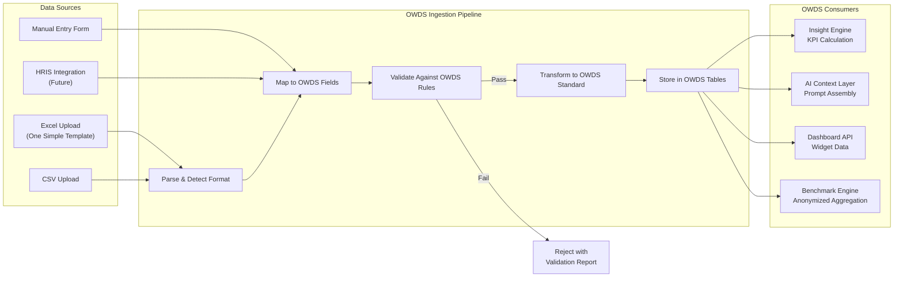

*Description: All data sources flow through the OWDS Ingestion Pipeline (Parse → Map → Validate → Transform → Store). Only validated, standardized data reaches OWDS consumers. Invalid data is rejected with a report.*

### Business Rules

| Rule ID | Rule | Enforcement |
|---------|------|-------------|
| BR-OWDS-001 | All workforce data MUST be validated against OWDS rules before storage. No unvalidated data in OWDS tables. | Upload API — blocking |
| BR-OWDS-002 | OWDS field names MUST be used in all APIs, AI prompts, and dashboard configurations. Raw source column names MUST NOT appear outside the ingestion pipeline. | Code review — blocking |
| BR-OWDS-003 | New OWDS fields require a minor version bump and update to the One Simple Template. | Change management process (Book 20, Ch.05) |
| BR-OWDS-004 | OWDS field removal or renaming requires a major version bump, migration plan, and 3-month deprecation notice. | ADR + Architecture Review |
| BR-OWDS-005 | The One Simple Company Data Template MUST be kept in sync with the current OWDS version. | Automated test — CI validates template headers match OWDS schema |
| BR-OWDS-006 | AI prompts MUST reference OWDS field names, not raw column names from uploaded files. | AI Gateway prompt validation |

### Examples

**Example 1: OWDS Standardization**
```
Source file column: "ชื่อพนักงาน"      → OWDS field: Employee_Name
Source file column: "เงินเดือน"        → OWDS field: Salary
Source file column: "วันที่เริ่มงาน"    → OWDS field: Start_Date

→ All products see Employee_Name, Salary, Start_Date
→ AI prompts use OWDS field names: "Analyze Salary by Department for employees with Start_Date after 2023"
```

**Example 2: Validation at Entry**
```
Upload contains:
- Employee_ID: EMP001, EMP002, EMP001 (duplicate!)
- Salary: 50000, "ห้าหมื่น" (invalid format!), 45000
- Start_Date: 2023-01-15, "", 2024-13-01 (invalid month!)

Validation report:
✅ 2 unique Employee_IDs found
❌ 1 duplicate Employee_ID: EMP001
❌ Row 2: Salary must be a number, found "ห้าหมื่น"
⚠️  Row 2: Start_Date is empty
❌ Row 3: Start_Date has invalid month 13

→ User fixes errors and re-uploads. Only clean data enters OWDS.
```

**Example 3: OWDS Version Evolution**
```
OWDS v1.0.0: 50 fields across 7 sheets
OWDS v1.1.0: +5 fields (Remote_Status, Education_Level, Certification_Count, Manager_Name, Team_Size)
→ Minor version: backward compatible, template updated
OWDS v2.0.0: Employee_Name split into First_Name + Last_Name
→ Major version: breaking change, migration required, v1 template deprecated over 3 months
```

### Common Mistakes

| Mistake | Why | Fix |
|---------|-----|-----|
| Passing raw column names to AI prompts | Developer uses the uploaded file's column names directly | Always map to OWDS field names before passing to AI |
| Adding fields to the database without updating OWDS | "It's just a quick column for this feature" | All workforce data fields must be defined in OWDS first |
| Accepting data that fails validation "with warnings" | Pressure to onboard customers quickly | Reject invalid data; provide clear fix instructions |
| Creating product-specific data fields outside OWDS | "This field is only used by AI Studio" | If it's workforce data, it belongs in OWDS |

### Anti-patterns

| Anti-pattern | Description | Consequence | Correct Approach |
|-------------|-------------|-------------|-----------------|
| **Bypassing OWDS** | A product reads directly from uploaded files without OWDS standardization | Inconsistent data; AI produces wrong insights | All data goes through OWDS ingestion pipeline |
| **OWDS Drift** | The database schema evolves independently of the OWDS documentation | Documentation becomes unreliable | OWDS documentation is the source of truth; migrations are generated from OWDS changes |
| **Silent Field Addition** | Adding a column to the database without updating OWDS, template, or documentation | Field exists but no one knows about it | OWDS change → Template update → Migration → Documentation → Announcement |
| **Template-Only Validation** | Validation rules exist only in the Excel template, not in the API | API uploads bypass validation | Validation rules live in the API; template is a convenience, not the enforcer |

### AI Instructions

- When generating code that handles workforce data, always use OWDS field names.
- When writing AI prompts, reference OWDS fields: "Analyze {OWDS.Salary} by {OWDS.Department}".
- Never use raw column names from uploaded files in any context outside the ingestion pipeline.
- If a required data point is not in OWDS, propose an OWDS extension — do not work around it.
- When generating validation logic, reference OWDS validation rules (Book 06).

### Cross References

- Book 06: OWDS — Complete OWDS specification, field definitions, validation rules
- Book 07: Metadata Standard — Field-level metadata that extends OWDS
- Book 08: Semantic Layer — KPIs defined in terms of OWDS fields
- Book 10: API Standards — API endpoints that serve OWDS data
- Book 11: Database Architecture — Physical schema implementing OWDS
- Book 20, Chapter 05: Change Management — OWDS change impact matrix

### Related ADR

| ADR | Title | Relevance |
|-----|-------|-----------|
| ADR-001 | Use OWDS as the Workforce Data Standard | Formal decision to adopt OWDS |
| ADR-007 | Use One Simple Company Data Template for MVP | Decision to use Excel template as primary data source |

### Definition of Ready

```
☐ OWDS v1.0 specification complete and published (Book 06)
☐ One Simple Company Data Template v1 published and synced with OWDS
☐ Ingestion pipeline validates all data against OWDS rules
☐ All APIs use OWDS field names exclusively
☐ AI prompts reference OWDS fields, not raw column names
```

### Definition of Done

```
☐ All workforce data in the database conforms to OWDS
☐ No raw column names appear in any API response, AI prompt, or UI
☐ Template and OWDS schema are in sync (verified by automated test)
☐ OWDS version displayed in admin portal
☐ New team members can understand the data model by reading OWDS alone
```

### Validation Checklist

```
☐ Does all workforce data pass through OWDS validation before storage?                           [ ]
☐ Are OWDS field names used consistently in all code, APIs, and documentation?                   [ ]
☐ Is the One Simple Template in sync with the current OWDS version?                              [ ]
☐ Do AI prompts reference OWDS fields (not raw column names)?                                    [ ]
☐ Are OWDS changes tracked with version numbers?                                                 [ ]
☐ Can a new developer understand the data model from OWDS documentation alone?                   [ ]
```

---

## Principle 03: API First

### Purpose

Mandate that all product functionality is exposed through well-defined APIs before any user interface is built. Every product surface—Dashboard, AI Studio, Academy—communicates with the platform exclusively through APIs. No direct database access from frontend code. No AI calls bypassing the AI Gateway. No external integration that does not use the same APIs as internal products.

### Background

Tightly coupled architectures—where UI code queries databases directly, where AI calls are embedded in frontend components, where business logic is scattered across React components—are the leading cause of platform rigidity. When every product has its own way of accessing data and services, a simple change (adding a field, changing a validation rule, switching AI models) requires changes in dozens of files across multiple products.

API First inverts this: define the API contract first, then build the UI against that contract. The API becomes the stable interface between frontend and backend, between products and data, between O³ and external systems. This enables independent evolution: the Dashboard UI can be redesigned without changing backend logic. The AI model can be switched without touching any product code. The database schema can be migrated with zero frontend changes—as long as the API contract is maintained.

### Principles

| # | Principle | Description |
|---|-----------|-------------|
| API-01 | **API as Contract** | Every product interaction is defined by an API contract before implementation begins. The contract is the source of truth. |
| API-02 | **Single Entry Point** | All external and internal requests enter through the API Gateway. No backdoor access to services or databases. |
| API-03 | **API Enforces Rules** | Authentication, authorization, rate limiting, input validation, and business rules are enforced at the API layer—not in frontend code. |
| API-04 | **Versioned from Day One** | Every API endpoint is versioned (v1, v2). Breaking changes require a new version. Old versions are deprecated with notice, not removed immediately. |
| API-05 | **Same API for Everyone** | Internal products and external integrations use the same API endpoints. There is no "internal-only" API that bypasses security or validation. |

### Architecture

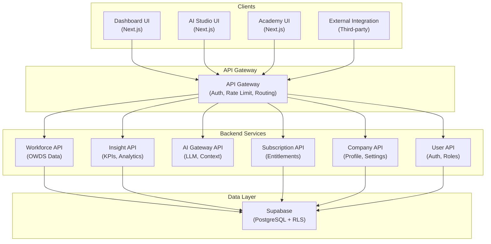

*Description: All clients—internal products and external integrations—enter through the API Gateway. The Gateway enforces authentication, rate limiting, and routing. Backend services are the only components that access the database directly.*

### Business Rules

| Rule ID | Rule | Enforcement |
|---------|------|-------------|
| BR-API-001 | Frontend code MUST NOT contain database queries. All data access goes through APIs. | Code review — blocking |
| BR-API-002 | AI calls MUST go through the AI Gateway API. Direct calls to LLM providers (OpenAI, Anthropic, etc.) from frontend or backend are forbidden. | API Gateway — blocked at network level |
| BR-API-003 | Every API endpoint MUST be documented with OpenAPI/Swagger before implementation. | CI check — documentation must exist before code merge |
| BR-API-004 | Every API endpoint MUST require authentication. No unauthenticated endpoints except for public health checks and login. | API Gateway — 401 for unauthenticated requests |
| BR-API-005 | API versioning MUST follow the pattern `/api/v{N}/`. Breaking changes require a new version number. | API design review |
| BR-API-006 | External integrations MUST use the same API endpoints as internal products. No separate integration API. | Architecture Review |

### Examples

**Example 1: Correct — API First Flow**
```
1. Dashboard needs workforce summary
2. Frontend calls: GET /api/v1/workforce/summary?company_id=123
3. API Gateway validates JWT, checks rate limit, routes to Workforce API
4. Workforce API queries database, applies business rules, returns JSON
5. Frontend renders widget from API response
→ Clean separation, testable, secure
```

**Example 2: Incorrect — Bypassing API**
```
❌ Dashboard component directly queries Supabase
❌ const { data } = await supabase.from('employees').select('*')
❌ No rate limiting, no business rule enforcement, auth bypass possible
→ Fragile, insecure, untestable
```

**Example 3: API Versioning**
```
✅ GET /api/v1/workforce/summary — Current version
✅ GET /api/v2/workforce/summary — New version with breaking changes (e.g., new response structure)
✅ GET /api/v1/workforce/summary returns 301 + Deprecation header after v2 stable for 3 months
→ Consumers have time to migrate
```

### Common Mistakes

| Mistake | Why | Fix |
|---------|-----|-----|
| Adding a "quick" endpoint without versioning | "It's just for the MVP" | Version from day one; adding versioning later is a breaking change |
| Allowing direct DB access from frontend "for prototyping" | "It's faster to iterate" | Prototype with mock API; implement real API before merging |
| Creating a separate API for external integrations | "External users need different endpoints" | Same API for everyone; use API keys for external auth |
| Hardcoding business rules in frontend | "The validation is duplicated for better UX" | Frontend does optimistic validation for UX; API is the authoritative validator |

### Anti-patterns

| Anti-pattern | Description | Consequence | Correct Approach |
|-------------|-------------|-------------|-----------------|
| **Frontend SQL** | React components containing Supabase queries | Business logic scattered; security bypass possible | All data access through API calls |
| **Direct LLM Calls** | Frontend or backend calling OpenAI/Anthropic directly | API keys exposed; no rate limiting; no prompt validation | All AI calls through AI Gateway API |
| **Invisible API** | API exists but is undocumented | Only original developer knows how to use it; AI Agent cannot integrate | OpenAPI spec written before implementation |
| **Versionless API** | Endpoints without version numbers | Any change breaks consumers without warning | `/api/v1/` prefix from day one |

### AI Instructions

- When generating frontend code, always use fetch/axios to call API endpoints — never use Supabase client directly for business data.
- When generating AI features, always route through the AI Gateway API — never call LLM providers directly.
- When generating a new API endpoint, always include version prefix (`/api/v1/`) and OpenAPI documentation.
- Never generate a frontend component that contains database queries or direct Supabase calls for business data.
- If an existing API endpoint doesn't provide needed data, extend the API — never bypass it.

### Cross References

- Book 10: API Standards — Complete API design standards, endpoint specifications, OpenAPI templates
- Book 11: Database Architecture — Database access is only through API layer
- Book 12: AI Architecture — AI Gateway API is the only path to LLM services
- Book 15: Security — Authentication and authorization enforced at API Gateway
- Book 20, Chapter 06: API Lifecycle Management — API versioning and deprecation process

### Related ADR

| ADR | Title | Relevance |
|-----|-------|-----------|
| ADR-002 | API First Architecture | Formal decision to mandate API-first development |
| ADR-003 | Use Supabase for Auth, Database, and API | Platform choice that implements the API layer |

### Definition of Ready

```
☐ API contract documented with OpenAPI/Swagger
☐ API version number assigned
☐ Authentication and authorization rules defined
☐ Rate limits specified
☐ Error response format defined
☐ API tested with mock data before frontend implementation
```

### Definition of Done

```
☐ API endpoint deployed and accessible
☐ OpenAPI documentation published and accurate
☐ Authentication enforced (401 for unauthenticated)
☐ Authorization enforced (403 for unauthorized)
☐ Rate limiting active
☐ All consumers migrated to this API (no direct DB access remains)
```

### Validation Checklist

```
☐ Are there any frontend components with direct database queries?                              [ ]
☐ Are there any direct LLM provider calls outside the AI Gateway?                              [ ]
☐ Are all API endpoints versioned with /api/v{N}/ prefix?                                      [ ]
☐ Are all API endpoints documented with OpenAPI?                                               [ ]
☐ Do external integrations use the same API endpoints as internal products?                    [ ]
☐ Can the frontend be completely rebuilt against the API without backend changes?              [ ]
```

---

## Principle 04: Insight First, Report Second

### Purpose

O³ must prioritize business interpretation—risk assessment, priority ranking, and actionable recommendations—over raw data display. Reporting (charts, tables, exports) is necessary infrastructure but is not the platform's core value. Every metric displayed must include business meaning.

### Background

Dozens of BI tools already do reporting well. Power BI, Tableau, Metabase, and Looker can all display charts and tables from any data source. If O³ is just another reporting tool, it has no reason to exist.

O³'s unique value proposition is workforce intelligence interpretation tailored to Thai SMEs. Most SME owners and HR managers do not have the time or expertise to look at a turnover chart and deduce what to do about it. O³ closes this gap: the Insight Engine calculates KPIs, applies business rules to assess risk levels, and generates AI-powered interpretations that explain what the numbers mean and what actions to take.

Every dashboard widget must answer three questions: What happened? Why does it matter? What should we do about it?

### Principles

| # | Principle | Description |
|---|-----------|-------------|
| INSIGHT-01 | **Interpretation is Mandatory** | Every metric displayed in any product must include business interpretation. No naked numbers. |
| INSIGHT-02 | **Risk is Always Assessed** | Every KPI has defined risk thresholds. Values are always displayed with their risk level (Low, Medium, High, Critical). |
| INSIGHT-03 | **Action is Always Recommended** | Every insight leads to at least one recommended action. O³ does not say "turnover is high" and stop. |
| INSIGHT-04 | **Context Over Data** | Anomalies, trends, and comparisons (vs. industry/self/history) are highlighted. Raw data is secondary. |
| INSIGHT-05 | **AI as Interpreter, Not Reporter** | AI is used to generate interpretations, not to list data. AI output follows Principle 05 (AI Must Explain). |

### Architecture

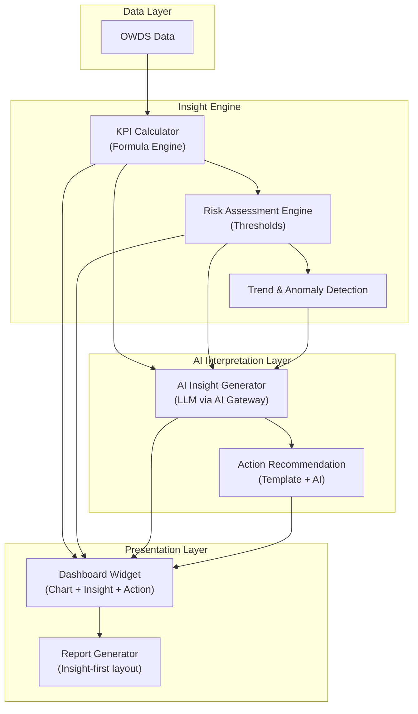

*Description: Raw OWDS data flows through the Insight Engine (KPI calculation → Risk assessment → Trend detection). The AI Interpretation Layer generates natural language insights and action recommendations. The Presentation Layer combines all elements into insight-first widgets and reports.*

### Business Rules

| Rule ID | Rule | Enforcement |
|---------|------|-------------|
| BR-INSIGHT-001 | Every dashboard widget MUST display: the metric value, its risk level, a one-sentence interpretation, and at least one recommended action. | Dashboard review — blocking |
| BR-INSIGHT-002 | Every KPI definition MUST include risk thresholds (Low/Medium/High/Critical). Thresholds are defined in the Semantic Layer (Book 08). | KPI metadata validation |
| BR-INSIGHT-003 | AI-generated insights MUST follow the output template: Summary → Evidence → Interpretation → Action → Confidence → Limitations. | AI Gateway output validation |
| BR-INSIGHT-004 | Reports (PDF, export) MUST be insight-first: executive summary first, then detailed analysis, then raw data appendix. | Report template validation |
| BR-INSIGHT-005 | Risk thresholds MUST be configurable per company (via settings) but have sensible defaults defined in the Semantic Layer. | Configuration system |

### Examples

**Example 1: Insight-First Widget**
```
Metric: Turnover Rate
Value: 18%
Risk Level: 🔴 High
Interpretation: "Sales department turnover is 18%, significantly above the industry benchmark of 12%. 
40% of exits are classified as regrettable loss—high performers leaving voluntarily."
Recommended Actions:
1. Conduct stay interviews with top-performing Sales employees
2. Review Sales compensation against market benchmarks
3. Schedule manager coaching sessions for Sales team leads

→ The user understands the problem AND what to do about it
```

**Example 2: Incorrect — Number-Only Widget**
```
❌ Metric: Turnover Rate = 18%
❌ (No interpretation, no risk level, no action)
→ User sees 18% and doesn't know if that's good, bad, or what to do
```

**Example 3: Insight-First Report Structure**
```
Page 1: Executive Summary
  - Top 3 risks detected
  - Recommended priority actions
  - Data quality assessment

Page 2-5: Detailed Analysis
  - Turnover by department, tenure, performance level
  - Trend comparison (vs. last quarter, vs. last year)
  - AI interpretation for each section

Appendix: Raw Data Tables
  - Complete data for verification
```

### Common Mistakes

| Mistake | Why | Fix |
|---------|-----|-----|
| Building a dashboard with just charts and no text | "Charts are self-explanatory" | Add AI-generated interpretation below every chart |
| Using hardcoded risk thresholds | "18% is high for everyone" | Default thresholds in Semantic Layer, configurable per company |
| Generating AI insight as a separate page | "Insights are in the AI tab" | Embed insights inline with the data they reference |
| Writing interpretation as generic text | "Turnover increased by 3%" | Explain: "Turnover increased 3% driven by Sales department exits of high performers" |

### Anti-patterns

| Anti-pattern | Description | Consequence | Correct Approach |
|-------------|-------------|-------------|-----------------|
| **Chart-Only Dashboard** | Widgets display only visualizations without interpretation | Users must interpret data themselves—defeats O³'s purpose | Every chart has inline AI interpretation + risk badge + action |
| **AI as Separate Product** | AI insights live in AI Studio while Dashboard shows raw numbers | Fragmented experience; user must switch between products | AI interpretation embedded in Dashboard widgets via Insight API |
| **Generic Insights** | AI says "Turnover is high, consider improving retention" | No actionable information | AI specifies which department, which employees, and specific recommended actions |

### AI Instructions

- When generating a dashboard widget, always include: metric value, risk level badge, AI interpretation text, and recommended actions.
- When generating AI insights, always follow the template: Summary → Evidence → Interpretation → Action → Confidence → Limitations.
- Never generate a widget that displays only a number or chart without interpretation.
- When generating reports, structure as insight-first: executive summary → analysis → data appendix.
- Reference the Semantic Layer (Book 08) for KPI definitions, formulas, and risk thresholds.

### Cross References

- Book 08: Semantic Layer — KPI definitions, formulas, risk thresholds
- Book 12: AI Architecture — AI Gateway and AI Insight Generator
- Book 13: Dashboard Engine — Widget architecture and insight embedding
- Book 18: Business Knowledge Framework — Business context for interpretation rules

### Related ADR

| ADR | Title | Relevance |
|-----|-------|-----------|
| ADR-006 | Dashboard Widgets Must Include AI Interpretation | Decision to embed AI insights in every dashboard widget |

### Definition of Ready

```
☐ KPI definitions complete with formulas and risk thresholds (Semantic Layer)
☐ Insight output template defined (Summary → Evidence → Interpretation → Action → Confidence → Limitations)
☐ Widget design includes space for metric, risk badge, interpretation, and actions
☐ AI prompt templates for insight generation tested with sample data
```

### Definition of Done

```
☐ All dashboard widgets display: metric value, risk level, interpretation, recommended actions
☐ AI interpretations follow the standard template
☐ Risk thresholds are configurable per company
☐ Reports are generated insight-first (executive summary before raw data)
☐ No widget displays a raw number without interpretation
```

### Validation Checklist

```
☐ Does every dashboard widget display business interpretation, not just numbers?               [ ]
☐ Does every KPI have defined risk thresholds?                                                  [ ]
☐ Do AI-generated insights follow the standard output template?                                 [ ]
☐ Are risk levels (Low/Medium/High/Critical) displayed with every metric?                       [ ]
☐ Are reports structured insight-first (executive summary first)?                               [ ]
☐ Can a non-HR person understand what to do after looking at the dashboard?                     [ ]
```

---

## Principle 05: AI Must Explain

### Purpose

Every AI-generated recommendation, insight, or analysis must include reason, evidence, confidence level, and limitations. AI output must never be presented as absolute truth. Users must understand exactly why AI made a recommendation, what data supports it, how confident the AI is, and what the AI cannot know.

### Background

Black-box AI recommendations erode trust. If AI says "You should improve retention in Sales," but does not explain why, what evidence supports this, or how confident the recommendation is, users cannot evaluate whether to act on it.

This is especially dangerous in workforce decisions. Recommending a compensation review, a termination, or a reorganization based on unexplained AI output could cause real harm to real people. AI in O³ is an advisor, not a decision-maker. The user is always responsible for the final decision—but they can only make informed decisions if AI explains its reasoning.

### Principles

| # | Principle | Description |
|---|-----------|-------------|
| AIEXP-01 | **Explanation is Mandatory** | Every AI output must include an explanation of reasoning. No unexplained recommendations. |
| AIEXP-02 | **Evidence is Cited** | AI must cite the specific data points, KPIs, and patterns that support its conclusion. |
| AIEXP-03 | **Confidence is Stated** | Every AI output must state its confidence level (Low/Medium/High) based on data quality, completeness, and pattern strength. |
| AIEXP-04 | **Limitations are Acknowledged** | AI must state what it does not know, what data is missing, and what assumptions it is making. |
| AIEXP-05 | **Structured Output** | AI output follows a fixed template: Summary → Evidence → Interpretation → Action → Confidence → Limitations. Free-text AI responses are forbidden. |

### Architecture

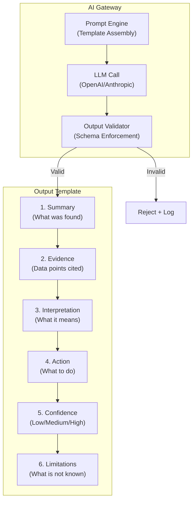

*Description: The AI Gateway assembles prompts with explanation requirements. LLM output is validated against the output template. Structured output ensures every AI response has Summary → Evidence → Interpretation → Action → Confidence → Limitations.*

### Business Rules

| Rule ID | Rule | Enforcement |
|---------|------|-------------|
| BR-AIEXP-001 | Every AI response MUST follow the structured output template: Summary, Evidence, Interpretation, Action, Confidence, Limitations. | AI Gateway output validation — blocking |
| BR-AIEXP-002 | Confidence level MUST be stated for every AI recommendation. Levels: Low (incomplete data, weak pattern), Medium (sufficient data, clear pattern), High (complete data, strong pattern). | AI Gateway output validation |
| BR-AIEXP-003 | When data is missing, AI MUST state what data is missing and how it affects the recommendation. | Prompt template enforcement |
| BR-AIEXP-004 | AI MUST NOT present recommendations as facts. Language must use qualifiers: "suggests," "indicates," "recommends," not "is," "will," "must." | Prompt template + output validation |
| BR-AIEXP-005 | User MUST be able to see the data that AI used to generate its recommendation (linked evidence). | UI requirement — clickable data citations |

### Examples

**Example 1: Correct — Explained AI Output**
```
Summary: Sales department shows elevated turnover risk compared to other departments and industry benchmarks.

Evidence:
- Sales turnover rate: 18% (industry benchmark: 12%)
- 6 of 15 exits in the last 12 months were classified as regrettable loss
- Average tenure of exiting employees: 1.8 years (vs. company average 3.2 years)
- Exit surveys cite "compensation" and "career growth" as primary reasons

Interpretation: Sales is losing high-performing employees earlier than expected tenure, primarily due to compensation and career path concerns. This pattern is concentrated in employees with Performance Rating of 4+ (out of 5).

Recommended Actions:
1. Conduct compensation benchmarking for Sales roles against market
2. Review career progression paths for Sales team
3. Schedule stay interviews with top-performing Sales employees under 2 years tenure

Confidence: Medium
- Data quality: Good — complete exit records for 12 months
- Limitation: Exit survey response rate is 67% (not all exiting employees provided reasons)
- Pattern is consistent across multiple quarters

Limitations:
- Exit survey data missing for 5 of 15 exits
- Compensation data is self-reported and may not reflect total compensation
- Industry benchmark data is from 2025 survey (may not reflect current market)
```

**Example 2: Incorrect — Unexplained AI Output**
```
❌ AI: "You should improve retention in Sales."
❌ (No evidence, no confidence, no actions, no limitations)
→ User cannot evaluate the recommendation. Trust is destroyed.
```

### Common Mistakes

| Mistake | Why | Fix |
|---------|-----|-----|
| AI using absolute language | "Turnover IS too high" | Use qualifiers: "Turnover suggests elevated risk compared to benchmarks" |
| Hiding confidence level | "Users might not trust Low confidence" | Always display confidence; Low confidence with explanation builds more trust than hidden uncertainty |
| Not citing data sources | "The AI just knows" | Every claim must be traceable to specific data points in OWDS |
| Free-text AI output | "Structured output feels restrictive" | Free text cannot be validated; structured output ensures quality and consistency |

### Anti-patterns

| Anti-pattern | Description | Consequence | Correct Approach |
|-------------|-------------|-------------|-----------------|
| **Oracle AI** | AI presents recommendations as infallible truth | Users either blindly trust or completely distrust AI | AI always states confidence and limitations |
| **Vague AI** | AI says "consider improving employee engagement" with no specifics | Recommendation is useless | AI specifies which department, which metric, and concrete actions |
| **Hidden Data** | AI makes claims without showing the data behind them | User cannot verify; AI could be hallucinating | Every claim links to the specific OWDS data that supports it |

### AI Instructions

- When generating AI output, always follow this exact template: Summary → Evidence → Interpretation → Action → Confidence → Limitations.
- Use qualifying language: "suggests," "indicates," "recommends" — never "is," "will," "must."
- Always state what data was used and what data is missing.
- When confidence is Low, explain why and recommend what data would improve confidence.
- Include clickable citations to the specific OWDS fields and records that support each claim.

### Cross References

- Book 12: AI Architecture — AI Gateway prompt templates and output validation
- Book 18: Business Knowledge Framework — Business rules for interpretation
- Book 06: OWDS — Data fields cited in AI evidence
- Book 08: Semantic Layer — KPI values cited in AI evidence

### Definition of Ready

```
☐ AI output template defined and tested (Summary, Evidence, Interpretation, Action, Confidence, Limitations)
☐ Output validation rules implemented in AI Gateway
☐ Data citation mechanism implemented (AI output links to OWDS data)
☐ Confidence scoring algorithm defined
☐ Prompt templates include explanation requirements
```

### Definition of Done

```
☐ Every AI output follows the structured template
☐ All AI responses include confidence levels
☐ All AI evidence citations link to verifiable data
☐ AI uses qualifying language (not absolute claims)
☐ Users can click evidence citations to see source data
```

### Validation Checklist

```
☐ Does every AI output include all 6 template sections?                                          [ ]
☐ Is confidence level always displayed (Low/Medium/High)?                                        [ ]
☐ Does AI cite specific data points as evidence?                                                 [ ]
☐ Does AI state what data is missing and its impact?                                             [ ]
☐ Does AI use qualifying language (not absolute claims)?                                         [ ]
☐ Can users view the source data behind AI claims?                                               [ ]
```

---

## Principle 06: Data Before AI

### Purpose

AI must not generate insights from bad data. Before any AI analysis runs, the platform must assess data quality—completeness, consistency, and validity. If data is missing, inconsistent, or low quality, AI must declare what it cannot know rather than fabricating confident-sounding but incorrect recommendations.

### Background

AI hallucination on bad data creates dangerous business recommendations. If a company uploads only 30% of their employee data, and AI says "Your turnover rate of 5% is excellent and your compensation strategy is working," the AI is lying. It doesn't know the turnover rate because 70% of data is missing. But LLMs are designed to be helpful and will generate plausible-sounding analysis from any input, regardless of quality.

This principle creates a hard gate: data quality is assessed before AI runs. If quality is below threshold, AI is blocked and the user is shown exactly what data is missing and how to fix it. If quality is sufficient but imperfect, AI adjusts its confidence level accordingly.

### Principles

| # | Principle | Description |
|---|-----------|-------------|
| DATA-01 | **Quality Gate Before AI** | AI analysis is blocked or confidence-adjusted based on data quality scores. No AI runs without quality assessment. |
| DATA-02 | **Transparent Data Quality** | Data quality scores and missing data are displayed prominently, before any AI-generated insights. |
| DATA-03 | **Confidence Scales with Quality** | AI confidence level is directly proportional to data quality. Low quality data → Low AI confidence. |
| DATA-04 | **Missing Data is Blocking** | Critical data gaps (e.g., no exit records, no salary data) block AI features that depend on that data. Non-critical gaps reduce confidence. |
| DATA-05 | **Fixable by User** | Every data quality issue comes with clear instructions for how to fix it. Upload more data, fill missing fields, correct invalid values. |

### Architecture

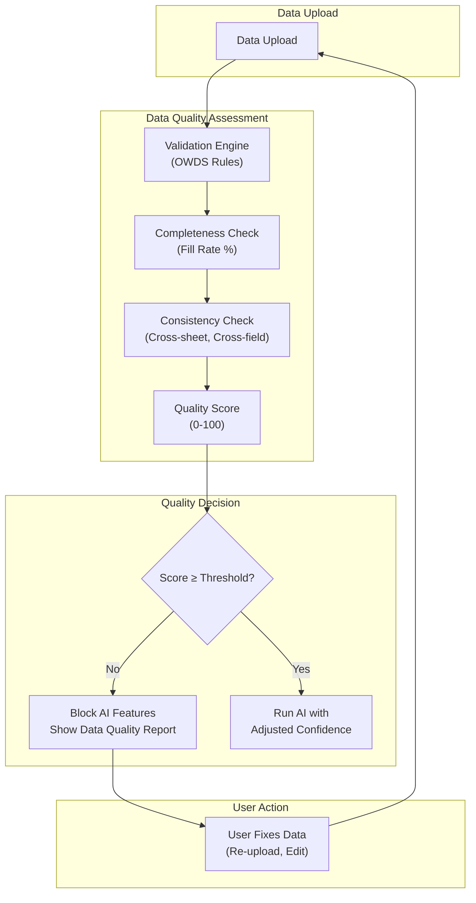

*Description: Every data upload passes through validation, completeness check, and consistency check. The resulting Quality Score determines whether AI features are blocked or run with adjusted confidence. Blocked AI features show a detailed data quality report with fix instructions.*

### Business Rules

| Rule ID | Rule | Enforcement |
|---------|------|-------------|
| BR-DATA-001 | Data quality score MUST be calculated before any AI analysis runs. Score is based on: completeness (fill rate %), validity (% passing OWDS validation), and consistency (% passing cross-field checks). | Data pipeline — blocking |
| BR-DATA-002 | Critical data gaps (Employee_Master or Exit_Record sheets completely missing) MUST block AI features that depend on that data. | AI Gateway — blocking |
| BR-DATA-003 | Data quality score and missing data report MUST be displayed prominently before any AI insights. | UI requirement — blocking |
| BR-DATA-004 | AI confidence level MUST be reduced proportionally to data quality gaps. Formula: Confidence = Base_Confidence × (Quality_Score / 100). | AI Gateway — enforced in prompt |
| BR-DATA-005 | Every data quality issue MUST include a fix instruction: "Upload Employee_Master sheet with at least Employee_ID, Name, Department, and Start_Date." | Validation report generation |

### Examples

**Example 1: Quality Gate Blocks AI**
```
Company uploads:
✅ Employee_Master: 50 records, 95% complete
❌ Exit_Record: 0 records (sheet missing entirely)
✅ Performance: 30 records, 80% complete

Quality Score: 45/100
- Employee_Master: 95% → Good
- Exit_Record: 0% → CRITICAL GAP
- Performance: 80% → Acceptable

AI Turnover Analysis: BLOCKED
Message to user: "Turnover analysis requires exit data. Your upload does not include the Exit_Record sheet. 
Please download the template, fill in exit records for the last 12 months, and re-upload."

AI Headcount Analysis: AVAILABLE (Medium confidence)
- Headcount by department can be calculated from Employee_Master
- Confidence: Medium (Performance data incomplete, may affect performance-based filtering)
```

**Example 2: AI Adjusts Confidence Based on Data Quality**
```
Company uploads:
✅ Employee_Master: 200 records, 98% complete
⚠️ Exit_Record: 15 exits (estimated 80% of actual exits — some months missing)
⚠️ Salary: 70% of employees have salary data

Quality Score: 72/100

AI Turnover Analysis: RUN (Low confidence)
- Confidence: Low — Exit records may be incomplete; some months have zero exits which is unlikely
- Recommendation: "Verify exit records for months Jan-Mar 2026, which show zero exits. 
  If exits occurred in these months, upload updated data for improved analysis accuracy."
```

### Common Mistakes

| Mistake | Why | Fix |
|---------|-----|-----|
| Running AI on freshly uploaded data without quality check | "The user just uploaded, let's show insights immediately" | Run quality assessment first; show quality score while AI generates |
| Showing AI insights and data quality warning as a small footnote | "Don't want to distract from the insights" | Quality warning must be prominent—it affects the trustworthiness of everything below it |
| Blocking all AI when only one feature is affected | "Data quality is below threshold, disable AI Studio" | Block only the specific AI features that depend on the missing data |

### Anti-patterns

| Anti-pattern | Description | Consequence | Correct Approach |
|-------------|-------------|-------------|-----------------|
| **AI on Empty Data** | AI generates insights from datasets where critical sheets are entirely missing | AI fabricates plausible-sounding but completely fictional analysis | Block AI features when critical data is missing |
| **Hidden Quality Issues** | Data quality problems are logged but not shown to user | User trusts AI insights not knowing they're based on bad data | Display quality score prominently; flag every gap |
| **Uniform Confidence** | AI always shows "Medium" confidence regardless of data quality | Users cannot distinguish between well-supported and poorly-supported insights | Confidence scales with actual quality score |

### AI Instructions

- Before generating any AI insight, check the data quality score for the relevant data.
- If quality score is below the feature threshold (defined per feature), do not generate the insight. Instead, generate a data quality report with fix instructions.
- Always include the data quality score and specific gaps in AI confidence assessment.
- When data is incomplete, state exactly what is missing and how it limits the analysis.
- Generate fix instructions that reference the OWDS template: "Please ensure your Employee_Master sheet includes Employee_ID, Name, Department, and Start_Date."

### Cross References

- Book 06: OWDS — Validation rules that determine data quality scores
- Book 07: Metadata Standard — Completeness and quality metadata fields
- Book 12: AI Architecture — AI Gateway quality gate implementation

### Definition of Ready

```
☐ Data quality scoring algorithm defined (completeness × validity × consistency)
☐ Quality thresholds defined per AI feature
☐ Quality score UI component designed
☐ Fix instruction templates created for each data gap type
☐ AI prompt templates include data quality context
```

### Definition of Done

```
☐ Data quality score calculated on every upload
☐ AI features blocked when critical data is missing
☐ AI confidence scales with data quality score
☐ Data quality report displayed before AI insights
☐ Every data gap has a fix instruction
```

### Validation Checklist

```
☐ Is data quality scored before any AI analysis runs?                                           [ ]
☐ Are critical data gaps blocking dependent AI features?                                        [ ]
☐ Is the data quality report displayed prominently before AI insights?                          [ ]
☐ Does AI confidence reflect actual data quality?                                               [ ]
☐ Does every data gap include a fix instruction?                                                [ ]
☐ Can users improve their data quality score and re-run AI?                                     [ ]
```

---

## Principle 07: Configuration Over Customization

### Purpose

All product behavior—features, access, limits, layouts, branding—must be controlled through configuration, not custom code. Every customer-specific variation must be expressible as a setting in a database, a feature flag, or an entitlement check. No `if (customerId === 'ACME_CORP')` in the codebase.

### Background

Per-customer custom code is the fastest path to an unmaintainable platform. One customer needs a special dashboard widget. Another needs a different AI prompt template. A third needs custom validation rules. Each request seems small, but collectively they create a codebase where every file has customer-specific branches, testing becomes impossible, and the platform cannot evolve without breaking someone's custom code.

Configuration Over Customization means every variation is designed into the platform's configuration system from the start. If a customer needs something different, the question is: "How do we make this configurable for all customers?" not "How do we code this for this one customer?" This forces the platform team to build flexible, parameterized features instead of brittle, customer-specific ones.

### Principles

| # | Principle | Description |
|---|-----------|-------------|
| CONF-01 | **Configurable, Not Coded** | Every customer-facing variation is expressed as a configuration value, not a code branch. |
| CONF-02 | **Database-Driven Settings** | All configuration lives in the database, managed through admin interfaces or self-service portals. No hardcoded values. |
| CONF-03 | **Entitlement-Gated Features** | Feature availability is controlled by the Subscription domain's entitlement system, not by customer-specific code. |
| CONF-04 | **Sensible Defaults** | Every configuration option has a default value that works for the majority of customers. Configuration is for deviation from defaults. |
| CONF-05 | **Configuration is Versioned** | Configuration schemas are versioned. Changes to the configuration schema follow the same change management process as API changes. |

### Architecture

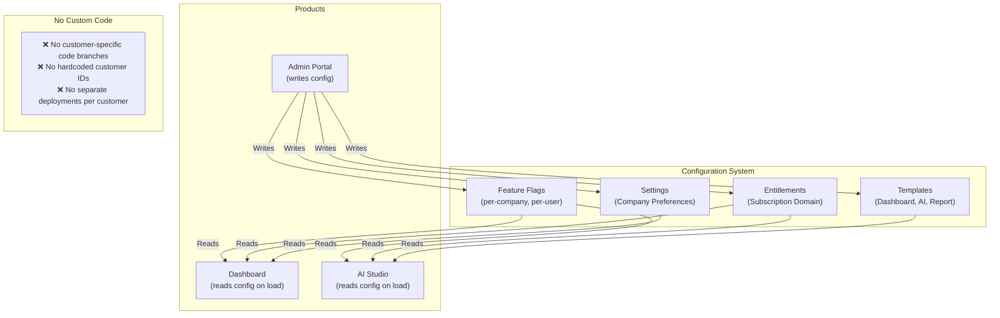

*Description: All product behavior is controlled through configuration stored in the database: Feature Flags, Entitlements, Settings, and Templates. Admin Portal writes configuration. Products read configuration on load. No customer-specific code branches exist.*

### Business Rules

| Rule ID | Rule | Enforcement |
|---------|------|-------------|
| BR-CONF-001 | No customer-specific code branches. Code MAY branch on configuration values or feature flags. Code MUST NOT branch on customer IDs. | Code review — blocking |
| BR-CONF-002 | Every configurable feature MUST have a default value. The platform MUST function correctly with default configuration for any new customer. | Architecture Review |
| BR-CONF-003 | Feature availability MUST be controlled by entitlement flags in the Subscription domain. Product code checks entitlement via API, not hardcoded logic. | Code review |
| BR-CONF-004 | Configuration changes MUST be auditable. Who changed what, when. Configuration history MUST be retained for at least 90 days. | Audit log requirement |
| BR-CONF-005 | New configuration options MUST be added to the configuration schema with a version bump. Backward compatibility MUST be maintained. | Change management (Book 20, Ch.05) |

### Examples

**Example 1: Correct — Configuration-Driven**
```
// Feature flag check — works for any customer
const config = await getCompanyConfig(companyId);
if (config.features.aiAdvisor) {
  showAIAdvisorTab();
}

// Entitlement check
const entitlements = await getEntitlements(companyId);
if (entitlements.includes('advanced_analytics')) {
  showAdvancedAnalytics();
}

// Threshold — configurable per company
const riskThreshold = config.thresholds.turnoverHigh || 15; // default 15%
if (turnoverRate > riskThreshold) {
  showRiskBadge('high');
}
```

**Example 2: Incorrect — Hardcoded**
```
❌ if (companyId === 'ACME_CORP') { showSpecialWidget(); }
❌ if (customerName === 'Beta Tester') { enableExperimentalAI(); }
❌ const riskThreshold = 18; // hardcoded for one customer
```

**Example 3: Configuration Schema Version**
```
Configuration Schema v1.0.0:
  features:
    aiAdvisor: boolean (default: false)
    advancedAnalytics: boolean (default: false)
  thresholds:
    turnoverHigh: number (default: 15)
    turnoverCritical: number (default: 25)

Configuration Schema v1.1.0 (minor — backward compatible):
  features:
    + benchmark: boolean (default: false)  ← new feature flag
  thresholds:
    turnoverHigh: number (default: 15)     ← unchanged
    turnoverCritical: number (default: 25) ← unchanged
```

### Common Mistakes

| Mistake | Why | Fix |
|---------|-----|-----|
| Adding a customer-specific feature flag named after the customer | "flag_acme_special_widget" | Name flags by feature, not customer: "flag_department_comparison_widget" |
| Bypassing entitlement system for "special" customers | "They're our biggest customer" | Every feature access goes through entitlements; grant the entitlement, don't bypass |
| Hardcoding thresholds because "we'll make it configurable later" | "This is just MVP" | Use configuration from day one; defaults are in code, actual values in DB |

### Anti-patterns

| Anti-pattern | Description | Consequence | Correct Approach |
|-------------|-------------|-------------|-----------------|
| **Customer Flag** | `if (customerId === 'ACME')` scattered through codebase | Every new customer request adds another branch; testing matrix explodes | Feature flags gated by entitlement, not customer ID |
| **Hidden Config** | Configuration values hardcoded in environment variables or source files | Cannot be changed without deployment; not auditable | All configuration in database with admin UI |
| **Config Drift** | Configuration schema changes without versioning | Old configurations break; customers lose settings | Configuration schema versioned; migrations run on upgrade |

### AI Instructions

- When generating product code, never use customer IDs in conditional logic. Use feature flags or entitlements.
- When adding a new configurable option, always provide a default value.
- When generating admin features, include audit logging for configuration changes.
- Never hardcode thresholds, limits, or feature availability. Always read from configuration.
- If a customer requests a unique feature, design it as a configurable option available to all customers — not a one-off.

### Cross References

- Book 02: Business Architecture — Subscription model and entitlement definitions
- Book 14: Design System — Configuration-driven UI component variants
- Book 16: DevOps — Configuration deployment and migration
- Book 20, Chapter 05: Change Management — Configuration change process

### Definition of Ready

```
☐ Configuration schema defined and versioned
☐ Admin UI for configuration management exists
☐ Entitlement system operational
☐ Default values defined for all configuration options
☐ Audit logging implemented for config changes
```

### Definition of Done

```
☐ No customer-specific code branches in codebase
☐ All feature availability gated by entitlements
☐ All thresholds and limits read from configuration
☐ Configuration changes are auditable
☐ Configuration schema versioned and backward compatible
```

### Validation Checklist

```
☐ Are there any customer-specific code branches (if customerId ===)?                            [ ]
☐ Are all configurable values read from the database, not hardcoded?                            [ ]
☐ Does every configuration option have a documented default value?                              [ ]
☐ Are feature availability decisions made through entitlements, not code?                       [ ]
☐ Are configuration changes logged with who, what, when?                                        [ ]
☐ Can a new customer use the platform with only default configuration?                          [ ]
```

---

## Principle 08: Reusable Components

### Purpose

Every UI component, AI tool template, dashboard widget, form pattern, and output template must be built once and reused across all products. No rebuilding the same component for Dashboard, AI Studio, Academy, and Admin Portal. The component library is the single source of truth for UI elements.

### Background

Multi-product platforms frequently rebuild the same components for each product. The Dashboard team builds a data table. The AI Studio team builds a different data table. The Academy team builds a third data table. Each with slightly different behavior, styling, and bugs. When a design change is needed, three teams must update three components. When a bug is fixed in one, the other two remain broken.

Reusable Components eliminates this waste. Every component is built once, documented once, tested once, and used everywhere. Changes propagate automatically to all products. Consistency is enforced by the component API—a product cannot accidentally style a component differently because the component controls its own presentation.

### Principles

| # | Principle | Description |
|---|-----------|-------------|
| REUSE-01 | **Build Once, Use Everywhere** | Every UI component, template, and pattern is built as a reusable module. No product-specific duplicates. |
| REUSE-02 | **Component Library is Source of Truth** | The shared component library defines all UI elements. Products consume components; they do not create their own. |
| REUSE-03 | **Consistent by Default** | Components enforce visual and behavioral consistency. Products configure components through props, not by overriding styles. |
| REUSE-04 | **Documented API** | Every component has documented props, usage examples, and variants. AI Agents and developers find what they need in the component catalog. |
| REUSE-05 | **Tested in Isolation** | Components are unit-tested independently. Product integration tests verify correct usage, not component behavior. |

### Architecture

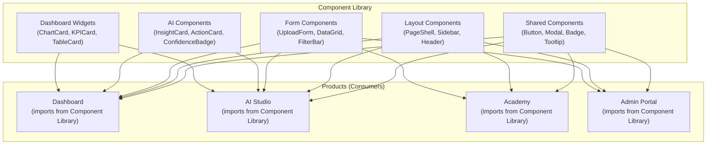

*Description: The Component Library contains all UI components organized by category. All products consume components from the library. No product creates its own components. Product-specific behavior is configured through props, not by forking components.*

### Business Rules

| Rule ID | Rule | Enforcement |
|---------|------|-------------|
| BR-REUSE-001 | UI components MUST be built in the shared component library, not in product-specific directories. | Code review — blocking |
| BR-REUSE-002 | Every component MUST have a Storybook story or equivalent documentation showing all variants and usage. | CI check — component without docs cannot merge |
| BR-REUSE-003 | Product-specific styling MUST be achieved through component props (variant, size, color), not through CSS overrides or `!important`. | Code review |
| BR-REUSE-004 | If a component is needed by two or more products, it MUST be moved to the shared library. Product-specific components are only for truly unique features. | Architecture Review |
| BR-REUSE-005 | Component API changes MUST be backward compatible within a major version. Breaking changes require a new major version and migration guide. | Component versioning |

### Examples

**Example 1: Reusable InsightCard Component**
```typescript
// Shared component in @o3/components
<InsightCard
  title="Sales Turnover"
  metricValue={18}
  metricUnit="%"
  riskLevel="high"
  interpretation="Sales department turnover is 18%, significantly above the industry benchmark of 12%."
  actions={[
    { label: 'Review Compensation', onClick: () => navigate('/compensation-review') },
    { label: 'Schedule Stay Interviews', onClick: () => navigate('/stay-interviews') },
  ]}
  confidence="medium"
  limitations="Exit survey response rate is 67%"
/>

// Used identically in Dashboard and AI Studio
// No product-specific variants needed
```

**Example 2: Incorrect — Duplicate Components**
```
❌ packages/dashboard/components/DataTable.tsx
❌ packages/ai-studio/components/DataTable.tsx
❌ packages/academy/components/DataTable.tsx
→ Three implementations, three sets of bugs, three places to update
```

**Example 3: Correct — Shared with Product-Specific Configuration**
```
✅ packages/components/DataTable.tsx — shared component
✅ Dashboard uses: <DataTable variant="dashboard" columns={...} />
✅ AI Studio uses: <DataTable variant="compact" columns={...} />
✅ Academy uses: <DataTable variant="educational" columns={...} />
→ One implementation, configured per product through props
```

### Common Mistakes

| Mistake | Why | Fix |
|---------|-----|-----|
| Creating a product-specific component that already exists in the library | "Didn't know it existed" | Browse the component catalog (Storybook) before building |
| Copying a component to a product directory to modify it | "Just need one small change" | Extend the shared component with a new prop or variant |
| Overriding component styles with CSS | "The default style doesn't match" | Add a new variant to the component; all products benefit |

### Anti-patterns

| Anti-pattern | Description | Consequence | Correct Approach |
|-------------|-------------|-------------|-----------------|
| **Component Fork** | Copying a shared component into a product directory and modifying it | Divergence; bug fixes in original don't reach the fork | Add variants/props to shared component or extend via composition |
| **Product-Specific Library** | Each product has its own `components/` directory with duplicates | Inconsistency; multiplied maintenance effort | All components in `@o3/components`; product-specific components must be justified |
| **Style Override Creep** | Products override component styles with `!important` or deep CSS selectors | Component updates break product layouts | Products request new variants; component library owns all styling |

### AI Instructions

- When generating UI code, always import from the shared component library (`@o3/components`).
- Never create a new component in a product directory if a similar component exists in the library.
- If a needed component variant doesn't exist, create it in the shared library with a new prop value — not as a product-specific component.
- Every new component must include Storybook documentation.
- When fixing a bug in a shared component, verify the fix in all products that use it.

### Cross References

- Book 14: Design System — Complete component catalog, design tokens, and usage guidelines
- Book 19: Engineering Handbook — Component development standards, testing, and contribution process
- Book 13: Dashboard Engine — Dashboard-specific widget composition patterns
- Book 17: Product Specifications — Product-specific component requirements

### Definition of Ready

```
☐ Component library structure defined (@o3/components)
☐ Component catalog (Storybook) set up
☐ Component contribution process documented
☐ Design tokens defined for consistent styling
☐ Shared build configuration for the component library
```

### Definition of Done

```
☐ Zero duplicated components across products
☐ Every component has Storybook documentation
☐ Every component has unit tests
☐ No CSS overrides in product code (all styling through component variants)
☐ New components are added to the shared library, not product directories
```

### Validation Checklist

```
☐ Are there any duplicate components in product directories?                                   [ ]
☐ Does every shared component have Storybook documentation?                                   [ ]
☐ Are products using component props for styling (not CSS overrides)?                          [ ]
☐ Can a new developer build a new page using only components from the library?                 [ ]
☐ Is there a clear process for adding new components/variants to the library?                  [ ]
```

---

## Principle 09: Every Number Has Meaning

### Purpose

Every KPI, metric, or numerical value displayed anywhere in the O³ platform must include its definition, formula, data source, interpretation guide, risk thresholds, and recommended actions. No number is displayed without complete business context.

### Background

Numbers without context are meaningless—and dangerous. A dashboard showing "Turnover: 18%" without explaining how turnover is calculated, what data it's based on, whether 18% is good or bad, and what to do about it, leaves the user confused at best and misled at worst.

This principle mandates that every KPI is a complete business object, not just a calculation. A KPI includes its metadata (definition, formula, source), its risk context (thresholds for Low/Medium/High/Critical), its interpretation (what this value means for the business), and its action recommendations (what to do about it). The Semantic Layer (Book 08) is the canonical store for all KPI definitions.

### Principles

| # | Principle | Description |
|---|-----------|-------------|
| MEAN-01 | **KPI Metadata is Mandatory** | Every KPI must have: name, definition, formula, data source (OWDS fields), owner, and update frequency. |
| MEAN-02 | **Risk Context is Mandatory** | Every KPI must have defined risk thresholds (Low/Medium/High/Critical) with business rationale. |
| MEAN-03 | **Interpretation is Mandatory** | Every KPI value must be accompanied by business interpretation: what this value means, why it matters. |
| MEAN-04 | **Action is Mandatory** | Every KPI must have recommended actions for each risk level. What to do when the value is High or Critical. |
| MEAN-05 | **KPI Library is the Source of Truth** | The Semantic Layer (Book 08) contains every KPI definition. No KPI is defined in product code. |

### Architecture

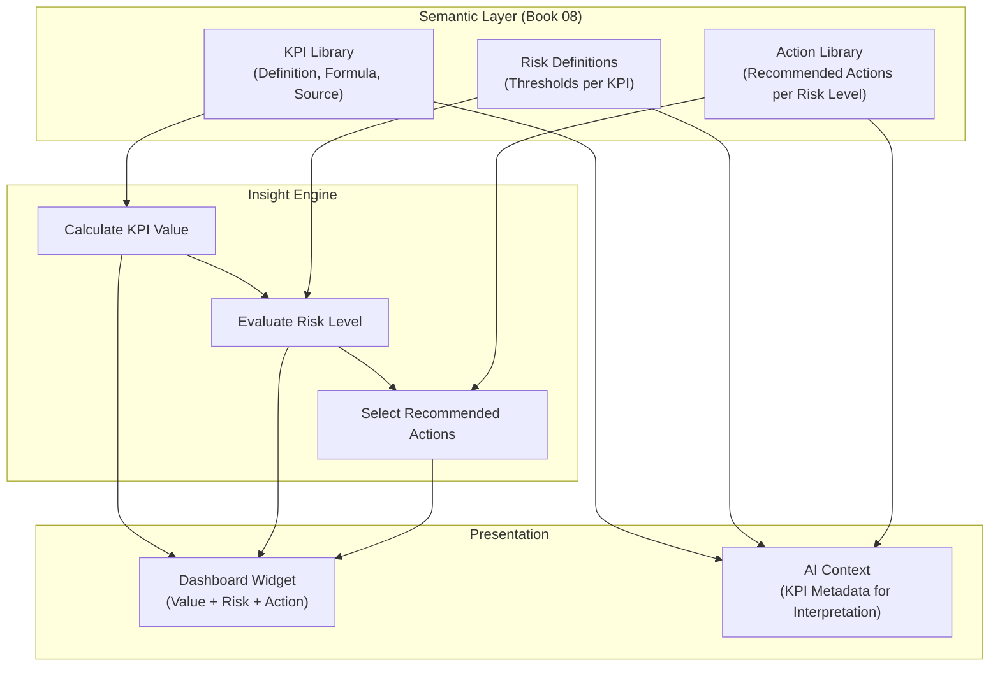

*Description: The Semantic Layer stores KPI definitions, risk thresholds, and action recommendations. The Insight Engine calculates values, evaluates risk, and selects actions. Products display the complete KPI context. AI uses KPI metadata for generating interpretations.*

### Business Rules

| Rule ID | Rule | Enforcement |
|---------|------|-------------|
| BR-MEAN-001 | Every KPI displayed in any product MUST have a complete metadata record in the Semantic Layer. | KPI registry validation — blocking |
| BR-MEAN-002 | KPI definitions MUST NOT be duplicated in product code. All products read KPI metadata from the Semantic Layer API. | Code review |
| BR-MEAN-003 | Changes to KPI formulas MUST be versioned. Old values generated with old formulas MUST be distinguishable from new values. | KPI versioning |
| BR-MEAN-004 | Every KPI MUST have actions defined for at least High and Critical risk levels. | KPI metadata validation |
| BR-MEAN-005 | Risk thresholds MUST be configured with business rationale. "Turnover >15% = High because industry average is 12% and top performers are disproportionately affected." | Threshold documentation |

### Examples

**Example 1: Complete KPI Definition**
```yaml
KPI:
  name: "Overall Turnover Rate"
  definition: "Percentage of employees who left the company in the last 12 months"
  formula: "(COUNT(Exit_Record WHERE Exit_Date IN last_12_months) / AVG(Headcount over last_12_months)) × 100"
  data_source:
    - OWDS.Employee_Master.Employee_ID
    - OWDS.Exit_Record.Exit_Date
  owner: "Workforce Intelligence Domain"
  update_frequency: "Recalculated on every data upload"
  risk_thresholds:
    low: "0–10% — Healthy turnover, within normal range"
    medium: "10–15% — Elevated, monitor for trends"
    high: "15–25% — Concerning, investigate root causes"
    critical: ">25% — Critical, immediate action required"
  actions:
    high:
      - "Analyze turnover by department to identify hotspots"
      - "Review exit survey data for common reasons"
      - "Conduct stay interviews with high performers"
    critical:
      - "Immediate executive review of turnover drivers"
      - "Engage HR consulting support"
      - "Consider compensation and culture interventions"
```

**Example 2: Incorrect — Naked Number**
```
❌ Widget: "Turnover: 18%"
❌ (No definition, no risk level, no interpretation, no actions)
→ User sees 18%. Doesn't know if it's good or bad. Doesn't know what to do.
```

### Common Mistakes

| Mistake | Why | Fix |
|---------|-----|-----|
| Duplicating KPI definitions in product code | "It's easier to hardcode the formula for this widget" | All KPIs read from Semantic Layer API |
| Using different formulas for the same KPI in different products | "Dashboard calculates turnover differently than AI Studio" | One KPI definition in Semantic Layer; all products use it |
| Hardcoding risk thresholds | "15% is always high" | Thresholds in Semantic Layer, configurable per company |
| Not defining actions for normal risk levels | "Only Critical needs actions" | Actions for Medium/High help prevent reaching Critical |

### Anti-patterns

| Anti-pattern | Description | Consequence | Correct Approach |
|-------------|-------------|-------------|-----------------|
| **KPI Drift** | Different products calculate the "same" KPI differently | Conflicting numbers destroy trust | One KPI definition in Semantic Layer; all products consume via API |
| **Naked Number** | Displaying metrics without definition, risk, or actions | Users misinterpret or ignore metrics | Every metric display includes full KPI context |
| **Hardcoded Thresholds** | Risk thresholds embedded in widget code | Cannot adjust per company or per industry | Thresholds in Semantic Layer with company-level overrides |

### AI Instructions

- When generating a dashboard widget, always fetch the full KPI definition from the Semantic Layer API. Never hardcode metric formulas.
- When interpreting a KPI value, include the KPI definition, risk assessment, and recommended actions.
- When an AI output references a KPI, cite the KPI name exactly as defined in the Semantic Layer.
- Never generate a metric display without risk level badge and recommended actions.
- If a needed KPI doesn't exist in the Semantic Layer, propose its definition — don't define it ad-hoc in product code.

### Cross References

- Book 08: Semantic Layer — Complete KPI library with all definitions, formulas, thresholds, and actions
- Book 13: Dashboard Engine — KPI widget rendering that includes metadata
- Book 18: Business Knowledge Framework — Business interpretation rules for KPIs

### Definition of Ready

```
☐ KPI Library defined with all core KPIs (headcount, turnover, engagement, compensation, etc.)
☐ Every KPI has: name, definition, formula, data source, owner, update frequency
☐ Every KPI has risk thresholds (Low/Medium/High/Critical) with business rationale
☐ Every KPI has recommended actions for High and Critical risk levels
☐ Semantic Layer API serves KPI metadata to all products
```

### Definition of Done

```
☐ No hardcoded KPI formulas in product code
☐ All products display KPI values with metadata (definition, risk, actions)
☐ KPI versioning operational (old values traceable to old formulas)
☐ Risk thresholds have documented business rationale
☐ AI interpretations reference KPI definitions from Semantic Layer
```

### Validation Checklist

```
☐ Does every displayed KPI have a complete definition in the Semantic Layer?                    [ ]
☐ Are risk levels displayed with every KPI value?                                               [ ]
☐ Are recommended actions displayed for High/Critical KPIs?                                     [ ]
☐ Is there a single source of truth for KPI formulas (no duplicates)?                           [ ]
☐ Can a user understand what a KPI means, how it's calculated, and what to do about it?          [ ]
```

---

## Principle 10: Benchmark Must Be Anonymous

### Purpose

Future benchmark and industry comparison features must protect customer identity absolutely. No individual company may be identifiable from benchmark data. Data must be aggregated and anonymized before any comparison or analysis.

### Background

Benchmarking is a powerful feature: a company can see how their turnover compares to industry averages, how their compensation stacks up, how their engagement scores compare. But benchmarking only works if customers trust that their data will not be exposed to competitors.

If a customer suspects that their data can be seen—or even inferred—by another customer, they will not contribute. If a competitor can query benchmarks and deduce "Company X with 200 employees in Bangkok manufacturing has 18% turnover," trust is permanently destroyed. This principle ensures that benchmarks are built on a foundation of provable anonymity.

### Principles

| # | Principle | Description |
|---|-----------|-------------|
| ANON-01 | **No Individual Identification** | No individual company may be identifiable from benchmark data, directly or through inference. |
| ANON-02 | **Minimum Aggregation Threshold** | Benchmarks are only shown for segments with N ≥ 5 companies. Smaller segments are not displayed. |
| ANON-03 | **Separate Data Store** | Benchmark data is stored separately from operational data with no company identifiers. |
| ANON-04 | **Anonymization Before Storage** | Data is anonymized in the aggregation pipeline before being written to the benchmark store. The pipeline cannot be reversed. |
| ANON-05 | **AI Does Not Access Raw Benchmark Data** | AI benchmark insights use only aggregated, anonymized data. AI cannot query individual company contributions. |

### Architecture

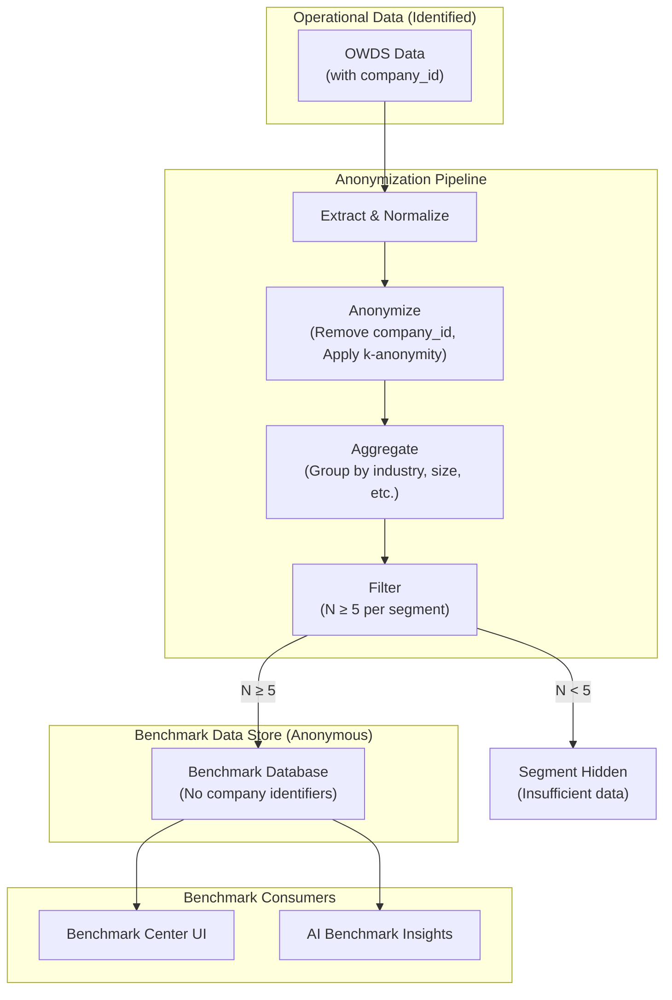

*Description: Operational data with company identifiers passes through an anonymization pipeline that removes identifiers and applies k-anonymity. Data is aggregated into segments. Segments with fewer than 5 companies are hidden. The benchmark store contains no company identifiers.*

### Business Rules

| Rule ID | Rule | Enforcement |
|---------|------|-------------|
| BR-ANON-001 | Company identifiers MUST be removed before data enters the benchmark store. The benchmark database must contain zero company_id fields. | Database schema validation — blocking |
| BR-ANON-002 | Benchmark segments MUST have a minimum of 5 companies. Segments with N < 5 MUST NOT be displayed. | Query filter — enforced at API level |
| BR-ANON-003 | Benchmark data MUST NOT be exportable in raw form. Only aggregated statistics may be exported. | API restriction |
| BR-ANON-004 | The anonymization pipeline MUST use k-anonymity (minimum k=5) or differential privacy for all benchmark data. | Architecture Review |
| BR-ANON-005 | AI MUST NOT access individual company contributions to benchmarks. AI benchmark analysis uses only aggregated data. | AI Gateway restriction |

### Examples

**Example 1: Correct — Anonymous Benchmark**
```
Query: "Turnover rate for Manufacturing companies with 50-200 employees in Thailand"
Result:
  - Segment: Manufacturing | 50-200 employees | Thailand
  - N: 23 companies
  - Average Turnover: 14.2%
  - Median: 13.1%
  - P25: 9.8% | P75: 17.5%
  - Your Company: 18% (High — above P75)

→ Customer knows how they compare without knowing who the other 22 companies are
```

**Example 2: Incorrect — Identifiable**
```
❌ Query: "Turnover rate for Manufacturing in Bangkok"
❌ Segment: N = 2 companies
❌ Result: Company A = 12%, Company B = 18%
→ Both companies are identifiable. Trust destroyed.
```

**Example 3: Segment Too Small — Hidden**
```
Query: "Turnover rate for Aerospace companies in Thailand"
Result:
  ⚠️ "This segment has fewer than 5 companies and cannot be displayed for privacy reasons.
  Available comparisons: Manufacturing (N=23), Services (N=18), Retail (N=12)"
```

### Common Mistakes

| Mistake | Why | Fix |
|---------|-----|-----|
| Storing benchmark data with company_id "for debugging" | "It's easier to trace issues" | Anonymization must be irreversible; debug with synthetic test data |
| Allowing drill-down to small segments | "User wants to see the data" | Hard minimum N=5; no exceptions even for "internal use" |
| Using exact values instead of aggregates | "Exact numbers are more accurate" | Display ranges, quartiles, or add noise via differential privacy |

### Anti-patterns

| Anti-pattern | Description | Consequence | Correct Approach |
|-------------|-------------|-------------|-----------------|
| **Identifiable Benchmark** | Benchmark data retains company identifiers or can be cross-referenced to identify companies | Customers leave the platform; legal liability | k-anonymity + separate anonymous store |
| **Small Segment Exposure** | Displaying benchmarks for segments with 1-4 companies | Individual companies are identifiable | N ≥ 5 hard minimum; smaller segments hidden |
| **Benchmark Data Export** | Allowing raw benchmark data to be exported | Data can be analyzed externally to identify companies | Only aggregated statistics exportable |

### AI Instructions

- When generating benchmark features, never include company_id in the benchmark data store.
- When generating benchmark queries, always enforce the minimum N=5 filter.
- Never generate AI prompts that include raw benchmark data. Use aggregated statistics only.
- When displaying benchmarks, always show the segment size (N) and hide segments with N < 5.
- If a benchmark segment has insufficient data, recommend what data would be needed: "Add 3 more companies to unlock this benchmark."

### Cross References

- Book 05: Information Architecture — Data segregation between operational and benchmark stores
- Book 15: Security — Data privacy and anonymization standards

### Definition of Ready

```
☐ Anonymization pipeline designed (k-anonymity or differential privacy)
☐ Separate benchmark database schema created
☐ Minimum segment size (N=5) enforced
☐ Benchmark Center UI designed with privacy controls
```

### Definition of Done

```
☐ Benchmark database contains zero company identifiers
☐ All benchmark queries enforce N ≥ 5 minimum
☐ Anonymization pipeline is irreversible (cannot reconstruct company data)
☐ Raw benchmark data is not exportable
☐ AI benchmark insights use only aggregated data
```

### Validation Checklist

```
☐ Does the benchmark database contain any company identifiers?                                  [ ]
☐ Are benchmark segments with N < 5 hidden?                                                     [ ]
☐ Is the anonymization pipeline proven irreversible?                                            [ ]
☐ Can raw benchmark data be exported? (should be NO)                                            [ ]
☐ Does AI have access to individual company benchmark contributions? (should be NO)              [ ]
```

---

## Principle 11: Simple First Experience

### Purpose

A new user's first experience with O³ must deliver real business value within minutes, requiring only basic company information and a single data upload. No HRIS integration required. No complex configuration. No training needed. The platform must work for Thai SME owners who are not HR experts.

### Background

Complex onboarding is the #1 killer of SaaS adoption in the SME market. If a user must integrate their HRIS, configure complex settings, attend training, or wait days for setup before seeing any value, they will abandon the platform. Thai SMEs, in particular, may not have an HRIS, may not have standardized HR data, and may not have dedicated HR staff.

O³'s onboarding is designed around the One Simple Company Data Template—a single Excel file that any SME can fill out with basic employee information. The user answers a few questions about their company, uploads the template, and within minutes sees their first AI-powered workforce insights. This "quick win" builds trust and motivation to explore more features.

### Principles

| # | Principle | Description |
|---|-----------|-------------|
| SIMPLE-01 | **Value in Minutes** | First user experience delivers actionable insights within 5 minutes of signup. |
| SIMPLE-02 | **One Template Onboarding** | The One Simple Company Data Template is the primary onboarding path. No HRIS integration required. |
| SIMPLE-03 | **No Setup Required** | Default configuration works for most companies. Settings are for refinement, not prerequisites. |
| SIMPLE-04 | **Progressive Complexity** | Advanced features (integrations, custom dashboards, advanced AI tools) are available but not required for initial value. |
| SIMPLE-05 | **Thai SME Native** | The experience is designed for Thai SME contexts: Thai language support, familiar business concepts, culturally relevant examples. |

### Architecture

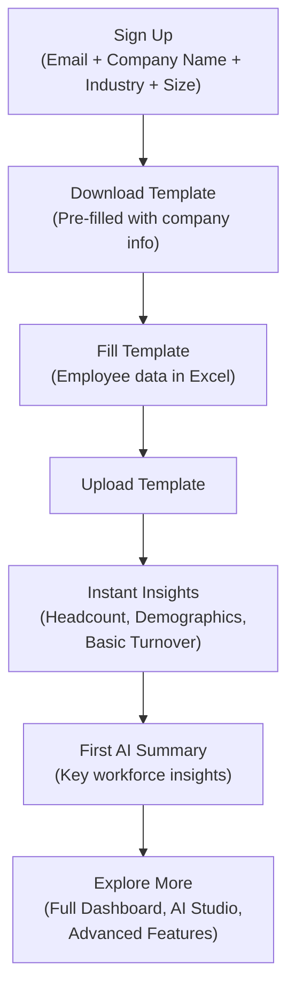

*Description: The onboarding flow is linear and simple. Sign up → Download template → Fill in data → Upload → See insights immediately. Each step delivers value without requiring the next step.*

### Business Rules

| Rule ID | Rule | Enforcement |
|---------|------|-------------|
| BR-SIMPLE-001 | Free tier MUST deliver real value. Users must see at least: headcount summary, department breakdown, basic turnover analysis, and AI summary after first upload. | Product spec — blocking |
| BR-SIMPLE-002 | The One Simple Company Data Template MUST be downloadable immediately after signup with clear instructions in Thai. | Onboarding flow validation |
| BR-SIMPLE-003 | Default configuration MUST work for any new company. No settings changes required to see first insights. | QA testing with fresh accounts |
| BR-SIMPLE-004 | Onboarding MUST complete within 3 steps: (1) Answer company questions, (2) Upload template, (3) View insights. | UX review |
| BR-SIMPLE-005 | All onboarding UI and template instructions MUST be available in Thai. English is optional for international users. | Localization requirement |

### Examples

**Example 1: Simple Onboarding Flow**
```
Step 1: Sign Up
- Enter email, password
- Answer: "Business Name," "Industry" (dropdown), "Number of Employees" (approximate)
- Time: 1 minute

Step 2: Download & Fill Template
- Click "ดาวน์โหลดเทมเพลต" (Download Template)
- Excel file downloads with company name pre-filled
- Fill in employee data: Name, Department, Position, Start Date, Salary (optional)
- Time: 5-30 minutes depending on employee count

Step 3: Upload & View Insights
- Upload the filled template
- Processing (30 seconds)
- Dashboard appears with: Headcount by department, Demographics overview, Basic turnover (if exit data included)
- AI Summary: "You have 50 employees across 5 departments. Your workforce is 60% female, 40% male..."
- Time: 1 minute

→ Total: 5-30 minutes to first value
```

**Example 2: Incorrect — Complex Onboarding**
```
❌ Step 1: Sign up
❌ Step 2: Integrate HRIS (requires IT, API keys, approval)
❌ Step 3: Configure departments, roles, permissions (complex admin screens)
❌ Step 4: Import data (failed twice due to format issues)
❌ Step 5: Configure dashboard widgets (overwhelming options)
❌ Step 6: Wait 24 hours for data processing
→ User abandons at Step 2
```

### Common Mistakes

| Mistake | Why | Fix |
|---------|-----|-----|
| Requiring all template fields to be filled | "We need complete data for accurate insights" | Core fields only for first upload (Name, Department, Start Date); additional fields enhance insights later |
| Showing empty dashboard before first upload | "The user hasn't uploaded data yet" | Guide the user to upload with a clear CTA: "อัปโหลดข้อมูลเพื่อดู Insights แรกของคุณ" |
| Overwhelming with all products immediately | "We want to show everything O³ can do" | Progressive disclosure: Dashboard first, then AI Studio, then Academy, etc. |

### Anti-patterns

| Anti-pattern | Description | Consequence | Correct Approach |
|-------------|-------------|-------------|-----------------|
| **Integration Required** | HRIS integration is mandatory before seeing any value | 90%+ abandonment rate among SMEs without HRIS | Template-first onboarding; integrations are a growth feature |
| **Empty State Neglect** | New users see empty dashboards with no guidance | User doesn't know what to do; leaves | Clear onboarding wizard: "Step 1: Download template → Step 2: Fill data → Step 3: Upload" |
| **All Features at Once** | Every product and feature is presented immediately | Cognitive overload; user doesn't know where to start | Progressive disclosure; unlock features as user engages |

### AI Instructions

- When generating onboarding flows, always start simple: signup → download template → upload → insights.
- Never generate an onboarding flow that requires HRIS integration or complex configuration.
- All onboarding text and template instructions must be available in Thai.
- The first AI summary after upload should be encouraging and focused on what the user CAN see, not what data is missing.
- Missing data should be presented as "Here's what more data could unlock" not as an error.

### Cross References

- Book 06: OWDS — One Simple Company Data Template specification
- Book 13: Dashboard Engine — Default dashboard configuration for new users
- Book 17: Product Specifications — Product onboarding specifications

### Definition of Ready

```
☐ One Simple Company Data Template created and tested
☐ Onboarding flow designed (3 steps: signup → upload → insights)
☐ Default dashboard configuration defined (shows value with minimal data)
☐ First AI summary prompt template tested
☐ All onboarding UI available in Thai
```

### Definition of Done

```
☐ New user sees insights within 5 minutes of upload
☐ Free tier delivers real value (not a crippled experience)
☐ Onboarding completion rate measured and acceptable
☐ No HRIS integration required for initial value
☐ Template instructions clear and error-tolerant
```

### Validation Checklist

```
☐ Can a new user sign up, upload data, and see insights in under 5 minutes?                    [ ]
☐ Does the free tier deliver real workforce insights (not just a teaser)?                      [ ]
☐ Is the template downloadable immediately after signup?                                       [ ]
☐ Are all onboarding texts and template instructions in Thai?                                  [ ]
☐ Does default configuration work without any settings changes?                                [ ]
```

---

## Principle 12: AI Is Everywhere, But Not Everything

### Purpose

AI is a capability embedded across all O³ products—Dashboard, AI Studio, Academy, Admin—but AI supports human decisions. It does not replace data architecture, product design, or human judgment. AI is a tool, not the product.

### Background

The temptation with modern LLMs is to use AI for everything: "Let AI generate the dashboard." "Let AI decide the data model." "Let AI write the business rules." This is dangerous. AI is probabilistic, not deterministic. It hallucinates. It cannot be held accountable for decisions that affect real employees' careers and real companies' futures.

O³ uses AI extensively: for generating insights from workforce data, for explaining KPIs, for recommending actions, for powering the AI Advisor. But every AI output is constrained by platform principles: AI must explain (Principle 05). AI is gated by data quality (Principle 06). AI reads from canonical sources (Principle 01). AI never replaces the data model, the business rules, or the human decision-maker.

### Principles

| # | Principle | Description |
|---|-----------|-------------|
| AISUP-01 | **AI Supports, Humans Decide** | Every AI recommendation is advisory. The human user makes the final decision. |
| AISUP-02 | **Architecture Before AI** | Data architecture, business rules, and product design come before AI features. AI enhances a solid foundation; it does not replace it. |
| AISUP-03 | **Determinism for Critical Path** | Core platform functions—authentication, data validation, entitlements, billing—are deterministic. AI is not on the critical path. |
| AISUP-04 | **AI is Constrained by Principles** | AI output is constrained by Platform Principles 01–15. AI cannot violate the constitution. |
| AISUP-05 | **AI is Measurable** | Every AI feature is instrumented. O³ measures AI usage, accuracy, user acceptance, and value creation. |

### Architecture

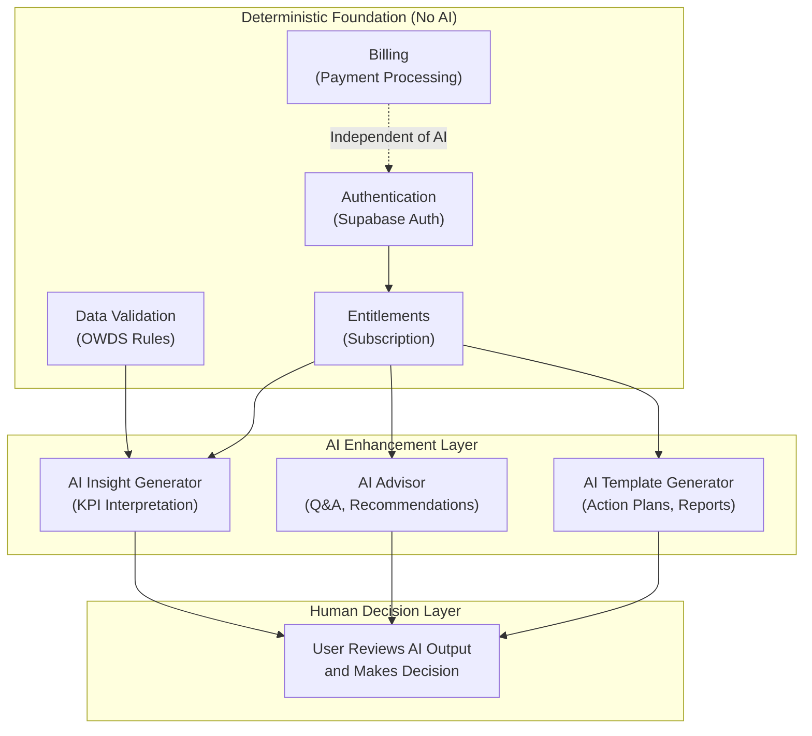

*Description: The deterministic foundation (Auth, Validation, Entitlements, Billing) operates without AI. AI enhances the platform through insights, advisory, and template generation. The human always makes the final decision after reviewing AI output.*

### Business Rules

| Rule ID | Rule | Enforcement |
|---------|------|-------------|
| BR-AISUP-001 | AI MUST NOT be on the critical path for core platform functions (auth, validation, entitlements, billing). These functions MUST work without AI. | Architecture Review — blocking |
| BR-AISUP-002 | AI recommendations MUST be presented as advisory, not as decisions. Language: "AI recommends" not "System will." | UI copy review |
| BR-AISUP-003 | Users MUST be able to dismiss or override AI recommendations without penalty. | UX requirement |
| BR-AISUP-004 | All AI features MUST be instrumented: usage count, user acceptance rate (recommendation followed/dismissed), and user feedback (helpful/not helpful). | Product analytics requirement |
| BR-AISUP-005 | AI MUST NOT make decisions that have legal, financial, or employment consequences. Examples: hiring decisions, termination recommendations, compensation changes. | AI Gateway — blocked prompts |

### Examples

**Example 1: AI Supports Decision**
```
AI Insight: "Sales department turnover is 18%. AI recommends reviewing compensation structure 
and conducting stay interviews with high-performing employees under 2 years tenure. 
Confidence: Medium."

User Action: "We reviewed compensation and found we're 10% below market. We'll adjust. 
But we'll start with stay interviews first before making any changes. 
Dismiss AI's compensation recommendation for now."

→ AI provided evidence and recommendations. User made the decision.
```

**Example 2: Incorrect — AI Replaces Decision**
```
❌ AI: "Termination Risk: Employee EMP042 is at high risk of underperformance. 
Recommended: Begin performance improvement plan leading to termination."

→ AI should never recommend termination or make employment decisions.
→ This crosses the line from advisor to decision-maker.
```

### Common Mistakes

| Mistake | Why | Fix |
|---------|-----|-----|
| Using AI for data validation | "AI can detect invalid data" | Data validation is deterministic; use OWDS validation rules |
| AI making automatic changes based on recommendations | "We can automate the action plan" | All AI recommendations require human approval before action |
| Presenting AI output as system decisions | "The system detected..." | "AI recommends..." — always attribute to AI, not the system |

### Anti-patterns

| Anti-pattern | Description | Consequence | Correct Approach |
|-------------|-------------|-------------|-----------------|
| **AI as Product** | The platform IS the AI (e.g., "AI HR Platform") | Platform becomes a thin wrapper around LLM; no defensible architecture | AI is a feature, not the product; the data model, KPI engine, and business rules are the product |
| **AI on Critical Path** | Auth or billing depends on AI working | AI outage takes down the entire platform | Critical path is deterministic; AI is on enhancement paths only |
| **AI Autopilot** | AI recommendations are automatically applied | User loses control; errors have real consequences | Every AI recommendation requires human confirmation |

### AI Instructions

- When generating AI features, always include a human confirmation step before any action is taken.
- Never generate AI that makes automatic decisions affecting employees, finances, or legal matters.
- When generating AI output text, use advisory language: "AI recommends," "AI suggests," "AI's analysis indicates."
- Instrument every AI feature with tracking: did the user accept or dismiss the recommendation?
- Core platform functions (auth, validation, entitlements) must work without AI. Never make AI a dependency for these.

### Cross References

- Book 12: AI Architecture — AI Gateway design and AI feature integration
- Book 18: Business Knowledge Framework — Business rules that constrain AI
- Book 19: Engineering Handbook — AI feature instrumentation standards

### Definition of Ready

```
☐ AI features clearly separated from deterministic core functions
☐ AI output always presented as advisory (not decisional)
☐ User can dismiss or override every AI recommendation
☐ AI feature analytics instrumentation plan defined
☐ AI prompts constrained by platform principles
```

### Definition of Done

```
☐ No AI on critical path (auth, validation, entitlements, billing work without AI)
☐ All AI output uses advisory language
☐ All AI recommendations have dismiss/override capability
☐ AI feature analytics collecting usage and acceptance data
☐ AI does not make or recommend employment/legal/financial decisions
```

### Validation Checklist

```
☐ Can the platform function if AI is completely disabled?                                        [ ]
☐ Is AI output always presented as recommendation, not decision?                                [ ]
☐ Can users dismiss or override every AI recommendation?                                        [ ]
☐ Are AI features instrumented with usage and acceptance tracking?                              [ ]
☐ Does AI ever recommend termination, hiring, or legal decisions? (should be NO)                [ ]
```

---

## Principle 13: Action Plan Required

### Purpose

Every major insight generated by O³ must lead to recommended actions. O³ does not merely describe problems—it provides a path to solving them. An insight without an action plan is incomplete.

### Background

Traditional BI tools excel at showing you problems: "Turnover increased 5%." "Engagement dropped in Q3." "Top performers are leaving." But they stop there. The user is left with a diagnosis and no prescription. They must figure out what to do on their own.

O³ closes this loop. Every KPI threshold breach, every AI-detected anomaly, every workforce risk signal triggers a set of recommended actions. These actions are specific, actionable, and prioritized. They are drawn from the Action Library (part of the Semantic Layer, Book 08) and enhanced by AI with context-specific details.

### Principles

| # | Principle | Description |
|---|-----------|-------------|
| ACT-01 | **No Insight Without Action** | Every insight displayed in O³ must include at least one recommended action. An insight without an action is incomplete. |
| ACT-02 | **Actions are Specific** | Actions must be specific enough to execute: "Review Sales compensation against 2026 market survey" not "Improve compensation." |
| ACT-03 | **Actions are Prioritized** | When multiple actions are recommended, they are ordered by priority. The user knows what to do first. |
| ACT-04 | **Actions are Trackable** | Users can mark actions as "In Progress" or "Completed." O³ tracks action follow-through. |
| ACT-05 | **Actions Link to Products** | Actions that can be executed in O³ products (e.g., run a survey, create a training plan) are linked directly to those products. |

### Architecture

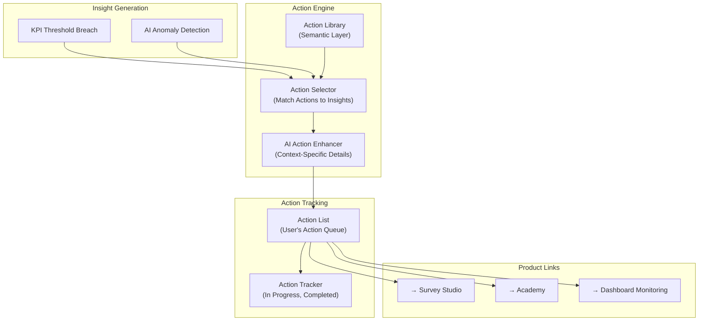

*Description: Insights trigger action selection from the Action Library. AI enhances actions with context-specific details. Actions appear in the user's action queue with tracking and links to O³ products that can execute them.*

### Business Rules

| Rule ID | Rule | Enforcement |
|---------|------|-------------|
| BR-ACT-001 | Every KPI that breaches High or Critical threshold MUST generate at least one recommended action. | Insight Engine — enforced |
| BR-ACT-002 | Actions MUST be specific and executable. "Improve retention" is not a valid action. "Conduct stay interviews with Sales employees under 2 years tenure" is valid. | Action Library quality review |
| BR-ACT-003 | Actions MUST be prioritized. Priority is based on: risk level of the triggering insight × number of employees affected × business impact. | Action ranking algorithm |
| BR-ACT-004 | Users MUST be able to track action status: Pending, In Progress, Completed, Dismissed. | Action tracking feature |
| BR-ACT-005 | Actions that can be executed in O³ products (survey, training, dashboard monitoring) MUST link to the relevant product. | Product integration |

### Examples

**Example 1: Insight with Action Plan**
```
Insight: Critical — Sales Department Turnover
  "Sales turnover reached 22% this quarter, exceeding the Critical threshold of 20%.
  Top performers (Performance Rating 4+) account for 60% of exits."

Action Plan (Prioritized):
  1. 🔴 [HIGH PRIORITY] Conduct exit interview analysis
     → Review exit survey data for Sales exits in the last 6 months
     → Link: O³ Dashboard → Exit Analysis
     Status: [Start]

  2. 🟠 [HIGH PRIORITY] Run employee engagement pulse survey
     → Target: All Sales employees
     → Focus: Compensation satisfaction, Career growth, Manager relationship
     → Link: O³ Survey Studio → Create Survey
     Status: [Start]

  3. 🟡 [MEDIUM PRIORITY] Schedule stay interviews
     → Target: Sales employees with Performance Rating 4+ and tenure 1-3 years
     → List: 8 employees identified
     Status: [Start]

  4. 🟢 [ONGOING] Monitor Sales turnover monthly
     → Link: O³ Dashboard → Turnover Watch
     Status: [Set Up]
```

**Example 2: Incorrect — Insight Without Action**
```
❌ Insight: "Turnover is high in Sales."
❌ (No actions, no priority, no tracking)
→ User knows there's a problem but has no path to solving it.
```

### Common Mistakes

| Mistake | Why | Fix |
|---------|-----|-----|
| Generic actions | "Improve employee engagement" | Specify: "Run pulse survey on compensation and career growth for Sales team" |
| No prioritization | 10 actions in random order | Sort by impact: risk level × employees affected × business consequence |
| Actions that require external tools without links | "Benchmark compensation against market" — but user must find their own survey | Link to O³ Benchmark Center or provide market survey references |

### Anti-patterns

| Anti-pattern | Description | Consequence | Correct Approach |
|-------------|-------------|-------------|-----------------|
| **Insight Dump** | List of problems with no solutions | User overwhelmed; no path forward | Every insight paired with at least one action |
| **Vague Actions** | "Consider reviewing your HR strategy" | User cannot execute; no value | Specific, time-bound, tool-linked actions |
| **No Follow-up** | Actions generated but never tracked | User forgets; insights have no impact | Action tracking with status and reminders |

### AI Instructions

- When generating insights, always generate at least one recommended action per insight.
- Actions must be specific enough for a user to execute immediately: who, what, when.
- Prioritize actions: most critical first, with clear rationale for the ordering.
- When an action maps to an O³ product feature (survey, training, monitoring), include a direct link.
- Generate actions even when confidence is Low — but flag the lower confidence: "These actions are based on limited data. Recommended first action: improve data quality."

### Cross References

- Book 08: Semantic Layer — Action Library with predefined actions per KPI and risk level
- Book 13: Dashboard Engine — Action display and tracking widgets
- Book 18: Business Knowledge Framework — Business rules for action ranking

### Definition of Ready

```
☐ Action Library populated with actions for all KPIs at High and Critical thresholds
☐ Action ranking algorithm defined (risk × impact × scope)
☐ Action tracking feature designed (status: Pending, In Progress, Completed, Dismissed)
☐ Product links defined (which actions link to Survey Studio, Academy, etc.)
```

### Definition of Done

```
☐ Every High/Critical insight generates at least one action
☐ Actions are specific, prioritized, and trackable
☐ Users can mark actions as In Progress or Completed
☐ O³-generated actions that map to O³ products have direct links
☐ Action completion rate is measurable
```

### Validation Checklist

```
☐ Does every High or Critical KPI value generate recommended actions?                           [ ]
☐ Are actions specific enough to execute without additional research?                           [ ]
☐ Are actions prioritized with clear rationale?                                                 [ ]
☐ Can users track action status (Pending, In Progress, Completed)?                              [ ]
☐ Do actions link to relevant O³ products where applicable?                                     [ ]
```

---

## Principle 14: Documentation First for Platform Decisions

### Purpose

All architecture decisions, data model changes, AI rules, API designs, and major product decisions must be documented before implementation begins. Documentation is not an afterthought—it is the prerequisite for building. If it's not documented, it doesn't exist.

### Background

Platforms that prioritize code over documentation accumulate technical debt in knowledge form. The original architect leaves. The senior developer who built the AI pipeline moves on. The product manager who defined the KPI formulas transitions to another project. Without documentation, their knowledge leaves with them. New team members—and AI Agents—must reverse-engineer decisions from code, guessing at the intent behind architectural choices.

Documentation First means the decision is recorded before the code is written. An ADR documents the options considered and the rationale for the choice. A Book documents the architecture that implements the decision. A Product Specification documents the feature before development starts. This creates a knowledge base that outlasts any individual contributor.

### Principles

| # | Principle | Description |
|---|-----------|-------------|
| DOC-01 | **Document Before Build** | Architecture decisions, data model changes, and API designs are documented and reviewed before implementation begins. |
| DOC-02 | **ADR for Major Decisions** | Any decision that involves a trade-off, has platform-wide impact, or might be controversial is recorded as an ADR. |
| DOC-03 | **Code Reflects Documentation** | The documentation is the source of truth. If code and documentation disagree, the documentation is assumed correct until proven otherwise. |
| DOC-04 | **Documentation is for AI Agents Too** | Every document is written so that an AI Agent can understand the platform and generate correct code. |
| DOC-05 | **Living Documentation** | Documentation is updated when architecture changes. Outdated documentation is worse than no documentation. |

### Architecture

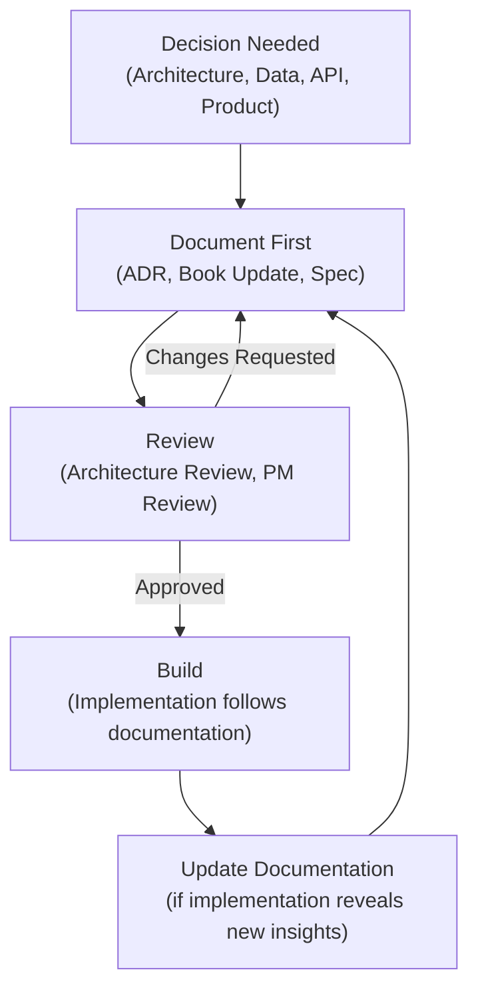

*Description: Every decision starts with documentation (ADR, Book update, Spec). Documentation is reviewed before implementation. After implementation, documentation is updated if new insights emerged. Documentation never lags behind code.*

### Business Rules

| Rule ID | Rule | Enforcement |
|---------|------|-------------|
| BR-DOC-001 | Major architecture decisions MUST be documented as ADRs before implementation. No ADR, no build. | Architecture Review — blocking |
| BR-DOC-002 | API endpoints MUST have complete OpenAPI documentation before the first line of implementation code. | CI check |
| BR-DOC-003 | Product feature specifications (Book 17) MUST be written and reviewed before development begins. | Sprint planning gate |
| BR-DOC-004 | If a code change affects documented architecture, the documentation MUST be updated in the same PR. | Code review — blocking |
| BR-DOC-005 | All documentation MUST be written following the Documentation Writing Standard (`standards/documentation-writing-standard.md`). | Documentation review |

### Examples

**Example 1: ADR-First Decision Process**
```
1. Architect identifies need: "Should we use Redis for caching or rely on Supabase query cache?"
2. ADR written: documents options (Redis vs. Supabase cache vs. no cache), trade-offs, recommendation
3. ADR reviewed by team; decision made: Supabase query cache (simpler, sufficient for MVP)
4. ADR merged as ADR-009
5. Book 11 (Database Architecture) updated with caching strategy
6. Implementation begins following documented decision
→ New developer (or AI Agent) reads ADR-009 and understands why caching was chosen
```

**Example 2: Incorrect — Code Before Documentation**
```
❌ Developer implements caching with Redis
❌ No ADR, no Book update
❌ 6 months later: "Why are we using Redis? Was there a reason?"
❌ Original developer left. No one knows.
→ Redis becomes a black box that no one dares touch.
```

### Common Mistakes

| Mistake | Why | Fix |
|---------|-----|-----|
| Writing documentation after implementation | "We'll document it once it's built" | Documentation is the design phase; build after approval |
| Outdated documentation | "The code changed but we forgot to update the doc" | Documentation update is part of the PR checklist |
| Writing documentation that only the author understands | "It's obvious to me" | Documentation is for the person who joins tomorrow with zero context |

### Anti-patterns

| Anti-pattern | Description | Consequence | Correct Approach |
|-------------|-------------|-------------|-----------------|
| **Code as Documentation** | "The code is self-documenting" | Code shows WHAT, not WHY. Rationale, trade-offs, and decisions are invisible. | ADR for decisions; Books for architecture; comments for implementation details |
| **Shelf Documentation** | Documentation written once, never updated | Documentation becomes misleading; team stops trusting it | Documentation updated in same PR as code changes |
| **Undocumented Decision** | Decision made in a meeting, never recorded | Only attendees know why; everyone else must guess | ADR for every major decision |

### AI Instructions

- Before generating any implementation code for a new feature or architecture change, check if the relevant ADR and Book documentation exists.
- If documentation is missing, generate the documentation first (ADR, Book update, or Spec) and request review before writing code.
- When generating code, reference the Books and ADRs that justify the implementation choices.
- If you discover that existing documentation is outdated, flag it — do not silently deviate from documentation.
- Follow the Documentation Writing Standard exactly for all generated documentation.

### Cross References

- `standards/documentation-writing-standard.md` — The writing standard this principle mandates
- Book 20, Chapter 07: Documentation Lifecycle — Documentation review and update process
- ADR Index (`adr/README.md`) — All Architecture Decision Records

### Definition of Ready

```
☐ Documentation Writing Standard published and adopted
☐ ADR template defined and accessible
☐ Documentation review process integrated into PR workflow
☐ Documentation status (Draft, Review, Approved, Outdated) defined
☐ All existing architecture documented (Books 00–20 complete)
```

### Definition of Done

```
☐ Every major decision has a corresponding ADR
☐ Every API has OpenAPI documentation
☐ Every feature has a Product Specification before development
☐ Documentation is updated in the same PR as code changes
☐ No outdated documentation (reviewed quarterly)
```

### Validation Checklist

```
☐ Are there any undocumented architecture decisions in the codebase?                            [ ]
☐ Are all APIs documented with OpenAPI?                                                        [ ]
☐ Does every PR that changes architecture include documentation updates?                       [ ]
☐ Can a new team member understand WHY each decision was made (not just WHAT the code does)?    [ ]
☐ Is there a process for reviewing and updating outdated documentation?                         [ ]
```

---

## Principle 15: Build for Learning

### Purpose

The MVP and every subsequent release must be instrumented to collect usage data that enables the team to learn: which features create value, where users struggle, which AI tools are used, which dashboards users return to, and which customers convert. Every feature is a hypothesis that must be tested with data.

### Background

Startups fail most often because they build something nobody wants—and they don't discover this until it's too late. Building for Learning means every feature is shipped with the instrumentation needed to measure whether it creates value. The question is never "Did we ship it?" but "Did it change user behavior in the way we predicted?"

O³ launches with 3 products + Shared Foundation, an ambitious scope. Without rigorous learning, the team risks investing in features that don't drive adoption, retention, or conversion. Build for Learning ensures that every sprint produces not just features, but knowledge about what Works.

### Principles

| # | Principle | Description |
|---|-----------|-------------|
| LEARN-01 | **Every Feature is Instrumented** | Every feature is shipped with analytics that measure: usage frequency, completion rate, time to value, and user satisfaction. |
| LEARN-02 | **Hypothesis-Driven Development** | Every feature starts with a hypothesis: "We believe [feature] will drive [metric] because [reason]." The hypothesis is tested after release. |
| LEARN-03 | **Data Informs Roadmap** | Product roadmap priorities are informed by usage data, not just intuition or customer requests. |
| LEARN-04 | **Fail Fast, Learn Faster** | Features that don't create value are deprecated quickly. Resources are redirected to what works. |
| LEARN-05 | **Learning is Shared** | Usage insights are shared across the team (PM, Dev, Founder). Data is not siloed. |

### Architecture

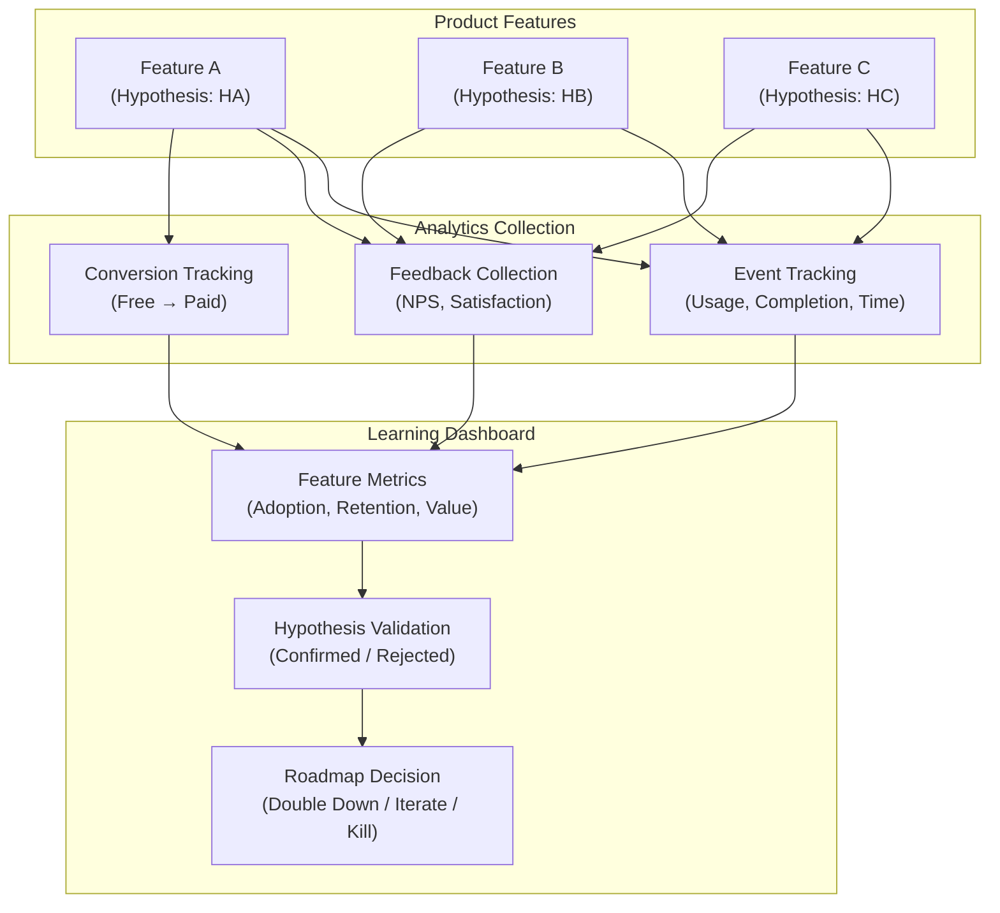

*Description: Every feature is instrumented with event tracking, feedback collection, and conversion tracking. Usage data feeds into a Learning Dashboard that validates hypotheses and informs roadmap decisions (Double Down, Iterate, or Kill).*

### Business Rules

| Rule ID | Rule | Enforcement |
|---------|------|-------------|
| BR-LEARN-001 | Every user-facing feature MUST emit usage events: feature_viewed, feature_used, feature_completed, feature_error. | Product spec — blocking |
| BR-LEARN-002 | Every feature in the roadmap MUST have a documented hypothesis: belief, metric, reason. | Sprint planning gate |
| BR-LEARN-003 | Feature usage data MUST be reviewed at least monthly. Features with zero adoption after 3 months MUST be evaluated for deprecation. | Product review process |
| BR-LEARN-004 | Usage data MUST be collected anonymously. Individual user behavior MUST NOT be identifiable to other users. | Privacy requirement |
| BR-LEARN-005 | Learning insights MUST be shared in a monthly Product Learning Report accessible to the entire team. | Process requirement |

### Examples

**Example 1: Feature Hypothesis**
```
Feature: AI Advisor Chat
Hypothesis: "We believe that AI Advisor will increase Dashboard weekly active users by 20% 
because it provides instant answers to workforce questions that users currently answer manually."
Metric: Dashboard WAU (weekly active users)
Target: +20% within 2 months of launch
Measurement: Compare Dashboard WAU 2 months before vs. 2 months after AI Advisor launch

Result after 2 months: Dashboard WAU increased 35%
→ Hypothesis CONFIRMED. Double down on AI Advisor features.
```

**Example 2: Learning-Driven Pivot**
```
Feature: Custom Report Builder
Hypothesis: "Users want to build custom reports beyond the default dashboard."
Metric: Report Builder usage (reports created per company per month)
Target: 2+ reports per company per month

Result after 3 months: Average 0.3 reports per company per month. 80% of users never opened Report Builder.
→ Hypothesis REJECTED. Users don't want to build reports; they want pre-built insights.
→ Decision: Deprecate Report Builder. Invest in more pre-built dashboard widgets instead.
```

### Common Mistakes

| Mistake | Why | Fix |
|---------|-----|-----|
| Building features without hypotheses | "The customer asked for it" | Define hypothesis: what metric will this move and why? |
| Not instrumenting features because "it's MVP" | "We'll add analytics later" | Analytics is part of MVP; you can't learn without data |
| Keeping features with zero adoption | "We spent time building it" | Sunk cost fallacy. Kill features that don't create value. |

### Anti-patterns

| Anti-pattern | Description | Consequence | Correct Approach |
|-------------|-------------|-------------|-----------------|
| **Feature Factory** | Building features continuously without measuring impact | Team is busy but doesn't know if they're creating value | Every feature has a hypothesis and success metric |
| **HiPPO-Driven Roadmap** | Highest Paid Person's Opinion drives priorities | Features built because someone senior "feels" they're important | Usage data + hypotheses inform priorities |
| **Analytics Theater** | Analytics collected but never reviewed | Data exists but no learning happens | Monthly Product Learning Report reviewed by team |

### AI Instructions

- When generating a new feature, always include analytics instrumentation: feature_viewed, feature_used, feature_completed, feature_error events.
- When generating a feature spec (Book 17), include the hypothesis: "We believe [feature] will drive [metric] because [reason]."
- When generating a dashboard or report, include usage analytics on that dashboard (which widgets are viewed most).
- Never generate a user-facing feature without event tracking.
- When suggesting roadmap changes, reference usage data if available — not just opinion.

### Cross References

- Book 17: Product Specifications — Feature specifications with hypotheses and success metrics
- Book 16: DevOps — Analytics infrastructure and event pipeline
- Book 20, Chapter 08: Product Learning Review — Monthly review process

### Definition of Ready

```
☐ Analytics infrastructure deployed and collecting events
☐ Event taxonomy defined (feature_viewed, feature_used, feature_completed, feature_error)
☐ Hypothesis template defined and adopted for all features
☐ Learning Dashboard built for internal use
☐ Monthly Product Learning Review scheduled
```

### Definition of Done

```
☐ Every user-facing feature emits usage events
☐ Every feature has a documented hypothesis with success metric
☐ Monthly Product Learning Report published
☐ Features with zero adoption after 3 months are deprecated
☐ Roadmap priorities are informed by usage data
```

### Validation Checklist

```
☐ Does every user-facing feature emit usage events?                                             [ ]
☐ Does every feature in the current sprint have a hypothesis?                                   [ ]
☐ Has the team reviewed usage data in the last month?                                           [ ]
☐ Are there features with zero adoption that should be deprecated?                              [ ]
☐ Is the next sprint's priority influenced by actual usage data?                                [ ]
```

---

## Appendix: Future Improvements

### Purpose

This appendix catalogs architectural improvements that are intentionally postponed. Each item is recognized as valuable but requires additional context from future Books before it can be fully specified. This appendix prevents scope creep during Book 01 development while ensuring that important architectural concerns are not forgotten.

### Background

During the Architecture Review of Book 01, several architectural elements were identified as necessary for a complete platform constitution but could not be fully specified without the context provided by Books 02–20. Rather than writing incomplete specifications or delaying Book 01, these items are documented here with their dependencies and target versions.

### Postponed Items

| # | Item | Description | Why Postponed | Depends On | Target Version |
|---|------|-------------|---------------|------------|---------------|
| FI-01 | **Governance Hierarchy** | Define the formal governance structure for the O³ platform: who has authority over architecture decisions, product scope, data standards, AI behavior, and platform operations. Includes roles: Chief Architect, Product Council, Architecture Review Board, Data Governance Committee. | Requires Book 02 (Business Architecture) for organizational structure and Book 20 (Platform Operations) for operational governance processes. | Book 02, Book 20 | v1.1 |
| FI-02 | **Architecture Decision Hierarchy** | Define the levels of architecture decisions and which level of authority is required for each: Strategic (Founder/Chief Architect), Major (Architecture Review Board), Minor (Team Lead), Implementation (Developer). Includes decision escalation paths. | Requires Book 20 (Platform Operations) for decision-making processes and Book 02 (Business Architecture) for organizational authority. | Book 02, Book 20 | v1.1 |
| FI-03 | **Decision Authority Matrix** | A matrix mapping decision types (Architecture, Data Model, API, AI, Security, Product Scope, Budget) to decision makers (Founder, Chief Architect, Product Manager, Engineering Lead) with RACI (Responsible, Accountable, Consulted, Informed) assignments. | Requires Book 02 (Business Architecture) for role definitions and Book 20 (Platform Operations) for governance processes. | Book 02, Book 20 | v1.1 |
| FI-04 | **Platform Constraints** | Define hard constraints that no architecture decision may violate. Examples: "Must use Supabase for Auth and Database," "Must use OWDS for all workforce data," "Must use AI Gateway for all LLM calls." These are absolute, not subject to ADR. | Requires all Books 02–19 to be complete before all constraints can be identified. Some constraints are already implicit in Principles 01–15 but need formal enumeration. | Books 02–19 | v1.2 |
| FI-05 | **Dependency Impact Matrix** | A comprehensive matrix showing the impact of changes to any platform component on all other components. Extends Chapter 7 (Architecture Dependency) with quantitative impact scores (Critical, High, Medium, Low) and estimated effort for downstream changes. | Requires Book 05 (Information Architecture), Book 09 (Event Model), and Book 10 (API Standards) for complete dependency mapping. Chapter 7 provides the qualitative foundation. | Book 05, Book 09, Book 10 | v1.2 |
| FI-06 | **Principle Priority Tier** | Classify the 15 Platform Principles into priority tiers: Tier 1 (Constitutional — cannot be violated), Tier 2 (Architectural — requires ADR to violate), Tier 3 (Guidance — should be followed but exceptions are permitted with documentation). | Requires practical implementation experience to determine which principles are truly non-negotiable vs. which have valid exceptions. Premature classification could over-constrain or under-constrain the architecture. | Implementation experience + Book 20 | v1.2 |
| FI-07 | **Principle Traceability Matrix** | A matrix mapping each of the 15 Platform Principles to: the specific Books that implement them, the ADRs that reference them, the API endpoints that enforce them, the database tables that embody them, and the UI components that reflect them. Enables impact analysis when a principle changes. | Requires all Books 02–19 to be complete before full traceability can be established. | Books 02–19 | v1.3 |
| FI-08 | **Architecture Review Checklist** | A standardized checklist used during Architecture Review to verify that proposed changes comply with all 15 Platform Principles, all NFRs (Chapter 8), and all dependency rules (Chapter 7). Includes pass/fail criteria and escalation paths. | Requires Book 20 (Platform Operations) for the Architecture Review process definition. The principles and NFRs are defined in Book 01; the process for reviewing them belongs in Book 20. | Book 20 | v1.1 |
| FI-09 | **Quality Gates** | Define quality gates that must be passed at each stage of the development lifecycle: Design Gate (ADR approved, Spec reviewed), Implementation Gate (Code review, Test coverage, NFR validation), Release Gate (Security scan, Performance test, Documentation updated). | Requires Book 16 (DevOps) for CI/CD pipeline definition and Book 19 (Engineering Handbook) for development standards. | Book 16, Book 19 | v1.2 |
| FI-10 | **Risk Register** | A structured register of platform risks: technical risks (scalability, security, data loss), business risks (churn, compliance, competition), and operational risks (key person dependency, vendor lock-in). Each risk has likelihood, impact, mitigation, and contingency plans. | Requires Book 02 (Business Architecture) for business risk context, Book 15 (Security) for security risk assessment, and Book 20 (Platform Operations) for operational risk management. | Book 02, Book 15, Book 20 | v1.2 |
| FI-11 | **Architecture Scorecard** | A quantitative scorecard that measures platform architecture health across dimensions: Principle Compliance (are all 15 principles followed?), Documentation Completeness (are all Books at Production-Grade?), Technical Debt (are there unresolved ADRs or known violations?), NFR Achievement (are all NFR targets met?). Produces a single Architecture Health Score (0–100). | Requires all Books 02–20 to be complete and the platform to be in production before meaningful scores can be calculated. | Books 02–20 + Production data | v1.3 |

### Future Improvement Lifecycle

```
1. Book 02–20 Completion → Dependencies resolved
2. Item promoted from "Postponed" to "In Progress"
3. Specification written in the relevant Book or as a standalone standard
4. Architecture Review approves the specification
5. Item marked as "Complete" in this appendix
6. Book 01 version bumped (MINOR) to reflect the addition
```

### Business Rules

| Rule ID | Rule | Enforcement |
|---------|------|-------------|
| BR-FI-001 | Postponed items MUST NOT be implemented until their dependent Books are complete and the item is promoted from this appendix. | Architecture Review |
| BR-FI-002 | When a postponed item's dependencies are resolved, an ADR MUST be filed to promote the item to active specification. | Change management (Book 20, Ch.05) |
| BR-FI-003 | This appendix MUST be reviewed quarterly. Items that are no longer relevant MUST be removed. New postponed items MAY be added with Chief Architect approval. | Quarterly architecture review |

### Cross References

- Book 02: Business Architecture — Required for FI-01, FI-02, FI-03, FI-10
- Book 05: Information Architecture — Required for FI-05
- Book 09: Event Model — Required for FI-05
- Book 10: API Standards — Required for FI-05
- Book 15: Security — Required for FI-10
- Book 16: DevOps — Required for FI-09
- Book 19: Engineering Handbook — Required for FI-09
- Book 20: Platform Operations — Required for FI-01, FI-02, FI-03, FI-06, FI-08, FI-10

### Definition of Ready

```
☐ All postponed items have clear dependency documentation
☐ All postponed items have target versions
☐ Quarterly review process established
☐ Promotion process defined (ADR → Specification → Review → Complete)
```

### Definition of Done

```
☐ All postponed items are either promoted to active specification or removed as irrelevant
☐ This appendix is empty (all items resolved) — target: v2.0.0
☐ Architecture Health Scorecard operational (FI-11)
☐ Principle Traceability Matrix complete (FI-07)
```

### Validation Checklist

```
 Are all postponed items documented with clear rationale for postponement?                      [ ]
☐ Does each item have identified dependent Books?                                                [ ]
☐ Is there a process for promoting items from this appendix?                                     [ ]
☐ Has this appendix been reviewed in the last quarter?                                           [ ]
☐ Are there items that should be promoted now that dependencies are resolved?                    [ ]
```

---

## Version History

| Version | Date | Changes |
|---------|------|---------|
| v1.0.0 | 2026-06-25 | Initial production-grade release — 15 Platform Principles expanded with full mandatory sections following the Documentation Writing Standard. Appendix: Future Improvements added with 11 postponed items. Book 01 frozen. |
