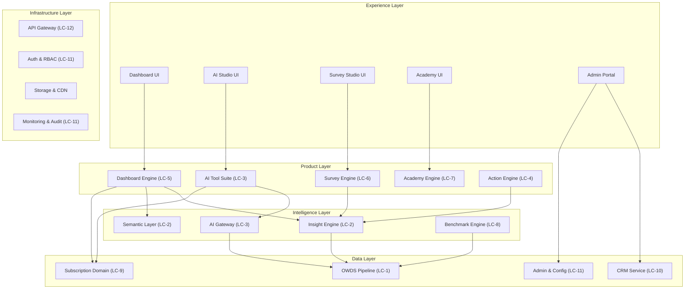
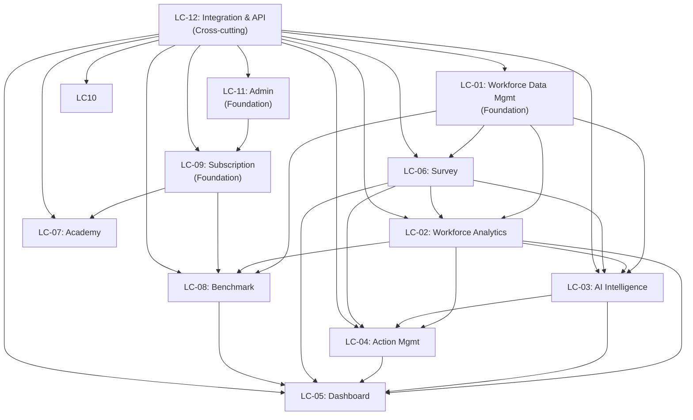
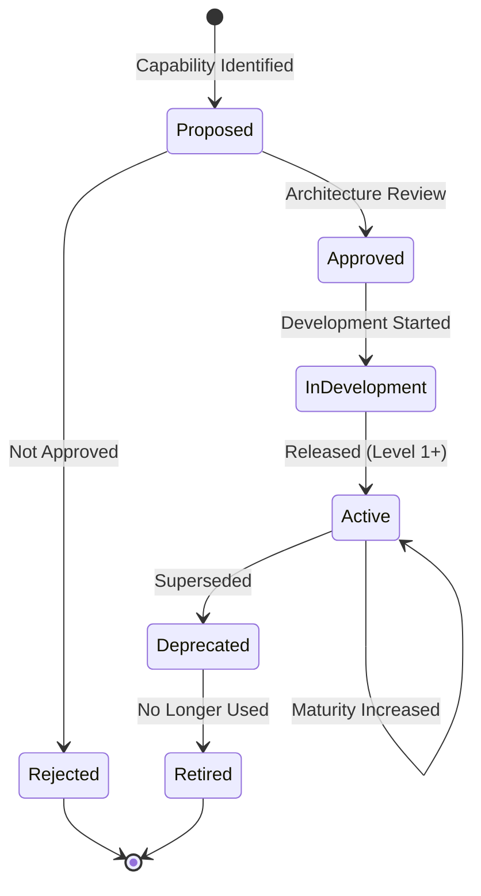
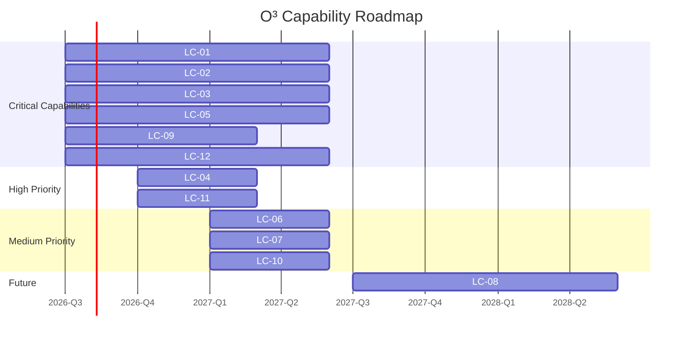

# Book 04: Capability Architecture

**Status:** Production-Grade v1.0.0

---

## Chapter 0: About This Book

### Purpose

Define every capability of the O³ Platform—what the platform can do, independent of how it is implemented. This Book establishes the capability architecture that bridges business strategy (Book 02) and domain model (Book 03) to technical implementation (Books 06–16). Every product, every API, every database table exists to serve a capability defined here.

### Background

A capability is a stable business function—what the platform does, not how it does it. "Calculate Turnover KPI" is a capability. "The SQL query in the Insight Engine" is an implementation detail. Capabilities are stable over time; implementations evolve. This separation enables the platform to evolve its technology without redefining its purpose.

This Book defines capabilities at three levels: Level 1 (Capability Groups), Level 2 (Capabilities), and Level 3 (Sub-capabilities). Each capability has a defined purpose, business value, inputs, outputs, consumers, owner, and relationships to domains, products, APIs, and OWDS fields.

### Scope

| Topic | Covered? | Notes |
|-------|----------|-------|
| Business Capability Map (L1–L3) | ✅ | Complete three-level hierarchy |
| Platform Capability Map | ✅ | Capabilities mapped to platform layers |
| Capability Ownership | ✅ | Every capability has an owner |
| Capability Dependencies | ✅ | Dependency matrix |
| Capability Maturity | ✅ | Current and target maturity per phase |
| Capability Governance | ✅ | Change process |
| Feature List | ❌ | Book 17: Product Specifications |
| Product Specs | ❌ | Book 17 |
| API Design | ❌ | Book 10 |
| Database Design | ❌ | Book 11 |

### How to Use This Book

- **Before building a new feature:** Identify which capability it serves. Does this capability already exist?
- **Before adding a new service:** Verify it maps to a documented capability. No capability, no service.
- **During architecture review:** Use the capability dependency matrix to assess change impact.
- **As a Product Manager:** Prioritize features based on capability maturity targets.
- **As an AI Agent:** Every code change must serve a capability defined in this Book.

### Cross References

- Book 01: Platform Constitution — Principles that govern capability design
- Book 02: Business Architecture — Business capabilities mapped to platform capabilities
- Book 03: Domain Model — Domains implemented by capabilities
- Book 00: Platform Overview — Five-layer architecture overview
- `standards/documentation-writing-standard.md` — Writing standard

---

## Chapter 1: Capability Architecture Principles

### Purpose

Establish the principles that govern how capabilities are defined, organized, owned, and evolved in the O³ Platform. These principles ensure that the capability architecture remains coherent as the platform grows.

### Principles

| # | Principle | Description |
|---|-----------|-------------|
| CAP-01 | **Stable Capabilities, Evolving Implementation** | Capabilities define WHAT the platform does. Implementation (APIs, databases, UI) defines HOW. Capabilities are stable; implementation evolves. |
| CAP-02 | **Capability Before Feature** | Every feature must serve a documented capability. Features without a parent capability are questioned. |
| CAP-03 | **Single Owner Per Capability** | Every capability has exactly one owner. Shared ownership = no ownership. |
| CAP-04 | **Capabilities are Composable** | Products are composed of capabilities. A capability may serve multiple products. |
| CAP-05 | **Measurable Maturity** | Every capability has a defined maturity level (Initial, Defined, Managed, Optimized). Maturity drives investment decisions. |
| CAP-06 | **Dependencies are Explicit** | Dependencies between capabilities are documented. Changes to upstream capabilities trigger downstream impact assessment. |
| CAP-07 | **Capabilities Span Layers** | A capability may touch multiple platform layers (Experience, Product, Intelligence, Data, Infrastructure) but is defined once. |

### Capability vs Feature vs Service

| Concept | Definition | Example | Owned By |
|---------|-----------|---------|----------|
| **Capability** | WHAT the platform does (stable) | "Calculate Workforce KPIs" | This Book (Book 04) |
| **Feature** | A user-facing expression of a capability | "Turnover Rate Widget on Dashboard" | Book 17 (Product Specs) |
| **Service** | Technical implementation of a capability | "Insight Engine KPI Calculation Service" | Book 10 (API Standards) |

### Business Rules

| Rule ID | Rule | Enforcement |
|---------|------|-------------|
| BR-CAP-001 | Every platform component MUST trace to a capability defined in this Book. | Architecture Review |
| BR-CAP-002 | New capabilities MUST be approved via the capability governance process (Chapter 10). | Architecture Review |
| BR-CAP-003 | Capability duplication MUST be resolved by merging or clearly differentiating scope. | Architecture Review |
| BR-CAP-004 | Capability maturity MUST be assessed quarterly. | Capability review |

### Cross References

- Book 01, Chapter 2: Platform Capability Map — Original capability inventory
- Book 02, Chapter 10: Business Capability Mapping — Business-to-platform capability mapping
- Book 17: Product Specifications — Features that implement capabilities

### Definition of Ready

```
☐ Capability principles documented and approved
☐ Capability vs Feature vs Service distinction understood by all team members
```

### Definition of Done

```
☐ All platform components trace to a capability
☐ No duplicated capabilities
☐ Capability maturity is assessed quarterly
```

### Validation Checklist

```
☐ Can every platform component be traced to a capability?                                        [ ]
☐ Are there any duplicated capabilities?                                                         [ ]
☐ Is capability maturity assessed quarterly?                                                     [ ]
☐ Do all team members understand capability vs feature vs service?                               [ ]
```

---

## Chapter 2: Business Capability Map (Level 1–3)

### Purpose

Define the complete three-level business capability hierarchy of the O³ Platform. This is the authoritative inventory of everything the platform can do.

### Capability Hierarchy

#### LC-1: Workforce Data Management
The capability to ingest, validate, standardize, store, and manage workforce data.

| Attribute | Value |
|-----------|-------|
| **Purpose** | Provide a single, trusted source of workforce data for all products and AI features |
| **Business Value** | Foundation for all insights. Without trusted data, no AI, no benchmarks, no value. |
| **Inputs** | Excel/CSV uploads, manual entries, future HRIS integrations |
| **Outputs** | Validated OWDS datasets, data quality scores, validation reports |
| **Consumers** | Dashboard, AI Studio, Insight Engine, Benchmark Engine |
| **Owner** | OWDS Pipeline (Data Team) |
| **Related Products** | Dashboard (upload UI), Admin Portal (data management) |
| **Related Domains** | Workforce Domain (Book 03, Ch.4) |
| **Related APIs** | Workforce API, Upload API |
| **Related OWDS** | All OWDS sheets and fields (Book 06) |
| **Related ADRs** | ADR-001 (OWDS Standard), ADR-007 (One Simple Template) |

**Level 3 Sub-capabilities:**
- LC-1.1: **Data Ingestion** — Accept and parse data files (Excel, CSV, future API)
- LC-1.2: **OWDS Validation** — Validate data against OWDS rules (required fields, formats, cross-sheet consistency)
- LC-1.3: **Data Standardization** — Map source fields to OWDS standard fields
- LC-1.4: **Data Quality Scoring** — Calculate and track data quality metrics
- LC-1.5: **Data Storage & Retrieval** — Store OWDS data and serve it to consumers

#### LC-2: Workforce Analytics
The capability to calculate KPIs, assess risk, detect trends, and generate workforce insights.

| Attribute | Value |
|-----------|-------|
| **Purpose** | Transform raw workforce data into business intelligence |
| **Business Value** | Core differentiator. Turns data into decisions. |
| **Inputs** | OWDS data, KPI definitions (Semantic Layer), risk thresholds |
| **Outputs** | KPI values, risk assessments, trend analyses, anomaly alerts |
| **Consumers** | Dashboard, AI Studio, AI Advisor, Benchmark Engine |
| **Owner** | Insight Engine |
| **Related Products** | Dashboard, AI Studio |
| **Related Domains** | Insight Domain (Book 03, Ch.5) |
| **Related APIs** | Insight API, KPI API |
| **Related OWDS** | All OWDS fields (source data) |
| **Related ADRs** | ADR-006 (Dashboard AI Interpretation) |

**Level 3 Sub-capabilities:**
- LC-2.1: **KPI Calculation** — Execute KPI formulas against OWDS data
- LC-2.2: **Risk Assessment** — Evaluate KPI values against defined thresholds
- LC-2.3: **Trend Detection** — Detect patterns and changes over time
- LC-2.4: **Anomaly Detection** — Identify statistical outliers
- LC-2.5: **Comparative Analysis** — Compare metrics across dimensions (department, period, industry)

#### LC-3: AI-Powered Intelligence
The capability to generate AI interpretations, answer workforce questions, and power AI tools.

| Attribute | Value |
|-----------|-------|
| **Purpose** | Provide AI-powered decision support across all products |
| **Business Value** | Makes workforce intelligence accessible to non-experts. Drives engagement and conversion. |
| **Inputs** | OWDS data, KPI values, user queries, prompt templates |
| **Outputs** | Structured AI responses (Summary, Evidence, Interpretation, Action, Confidence, Limitations) |
| **Consumers** | Dashboard (AI Summary), AI Studio (AI Advisor, AI Tools), Academy |
| **Owner** | AI Gateway |
| **Related Products** | Dashboard, AI Studio, Academy |
| **Related Domains** | Insight Domain (Book 03, Ch.5) |
| **Related APIs** | AI Gateway API |
| **Related OWDS** | All OWDS fields (AI context) |
| **Related ADRs** | ADR-005 (AI Must Explain) |

**Level 3 Sub-capabilities:**
- LC-3.1: **AI Insight Generation** — Generate natural language interpretations of KPIs
- LC-3.2: **AI Advisor (Q&A)** — Answer user questions about workforce data
- LC-3.3: **AI Tool Suite** — Power guided AI tools (JD Generator, CV Screening, etc.)
- LC-3.4: **Prompt Management** — Manage and optimize AI prompt templates
- LC-3.5: **AI Output Validation** — Enforce structured output template and quality standards

#### LC-4: Action Management
The capability to recommend, prioritize, track, and link actions derived from insights.

| Attribute | Value |
|-----------|-------|
| **Purpose** | Close the insight-to-action loop |
| **Business Value** | Transforms insights from "interesting" to "actionable." Drives retention. |
| **Inputs** | Risk assessments, AI insights, action library definitions |
| **Outputs** | Prioritized action lists, action status, completion metrics |
| **Consumers** | Dashboard, AI Studio |
| **Owner** | Action Engine |
| **Related Products** | Dashboard, AI Studio |
| **Related Domains** | Insight Domain (Book 03, Ch.5) |
| **Related APIs** | Action API |
| **Related ADRs** | (Implicit in Principle 13: Action Plan Required) |

**Level 3 Sub-capabilities:**
- LC-4.1: **Action Recommendation** — Select and prioritize actions based on insights
- LC-4.2: **Action Tracking** — Track action status (Pending, InProgress, Completed, Dismissed)
- LC-4.3: **Action-Product Linking** — Link actions to executable product features
- LC-4.4: **Action Effectiveness Measurement** — Measure completion rates and business impact

#### LC-5: Dashboard & Visualization
The capability to render insight-first dashboards with KPIs, risk badges, AI interpretations, and actions.

| Attribute | Value |
|-----------|-------|
| **Purpose** | Present workforce intelligence in an actionable visual format |
| **Business Value** | Primary user interface. First value moment for new users. |
| **Inputs** | KPI values, risk assessments, AI insights, actions |
| **Outputs** | Rendered dashboard widgets, reports (PDF), exports |
| **Consumers** | End users (SME Owners, HR Managers) |
| **Owner** | Dashboard Engine |
| **Related Products** | Dashboard |
| **Related Domains** | Insight Domain (Book 03, Ch.5) |
| **Related APIs** | Dashboard API, Insight API, Report API |
| **Related ADRs** | ADR-006 (Dashboard AI Interpretation) |

**Level 3 Sub-capabilities:**
- LC-5.1: **Widget Rendering** — Render individual dashboard widgets (KPI card, chart, insight card)
- LC-5.2: **Dashboard Layout** — Arrange widgets into configurable dashboard layouts
- LC-5.3: **Report Generation** — Generate insight-first PDF reports
- LC-5.4: **Data Export** — Export dashboard data in various formats
- LC-5.5: **Dashboard Configuration** — User and company-level dashboard customization

#### LC-6: Survey & Assessment
The capability to create, distribute, collect, and analyze employee surveys and organizational assessments.

| Attribute | Value |
|-----------|-------|
| **Purpose** | Measure employee experience, engagement, and organizational health |
| **Business Value** | Expands product portfolio. Drives expansion revenue. |
| **Inputs** | Survey templates, question bank, employee lists |
| **Outputs** | Survey responses, engagement scores, AI analysis, action recommendations |
| **Consumers** | HR Managers, Executives |
| **Owner** | Survey Engine |
| **Related Products** | Survey Studio |
| **Related Domains** | Survey Domain (Book 03, Ch.2) |
| **Related APIs** | Survey API |
| **Related ADRs** | (Post-MVP) |

**Level 3 Sub-capabilities:**
- LC-6.1: **Survey Creation** — Build surveys from templates or custom questions
- LC-6.2: **Survey Distribution** — Distribute surveys to employee populations
- LC-6.3: **Response Collection** — Collect and store survey responses
- LC-6.4: **Survey Analysis** — Calculate scores, correlations, and AI-powered analysis
- LC-6.5: **Assessment Management** — Manage organizational assessments (7S, readiness)

#### LC-7: Learning & Development
The capability to deliver educational content, track progress, and certify learners.

| Attribute | Value |
|-----------|-------|
| **Purpose** | Educate users on data-driven HR and AI, generate leads |
| **Business Value** | Lead generation engine. Builds awareness and trust. |
| **Inputs** | Course content, user progress data |
| **Outputs** | Course completion, certificates, learning analytics |
| **Consumers** | All user segments (SME Owners, HR Managers, HR Consultants) |
| **Owner** | Academy Engine |
| **Related Products** | Academy |
| **Related Domains** | Academy Domain (Book 03, Ch.2) |
| **Related APIs** | Academy API |
| **Related ADRs** | (Post-MVP) |

**Level 3 Sub-capabilities:**
- LC-7.1: **Course Management** — Create and manage courses, lessons, and content
- LC-7.2: **Enrollment & Progress** — Enroll users and track learning progress
- LC-7.3: **Assessment & Certification** — Assess learning and issue certificates
- LC-7.4: **Learning Analytics** — Track course popularity, completion rates, effectiveness

#### LC-8: Benchmark & Comparison
The capability to generate anonymous industry benchmarks and enable cross-company comparisons.

| Attribute | Value |
|-----------|-------|
| **Purpose** | Enable companies to compare their workforce metrics to industry peers |
| **Business Value** | Premium feature. Drives upgrades. Data moat. |
| **Inputs** | Anonymized OWDS data, industry segments |
| **Outputs** | Benchmark statistics, comparison reports |
| **Consumers** | Paid customers (Professional+, future) |
| **Owner** | Benchmark Engine |
| **Related Products** | Benchmark Center (future) |
| **Related Domains** | Insight Domain (Book 03, Ch.5) |
| **Related APIs** | Benchmark API |
| **Related ADRs** | (Future) |

**Level 3 Sub-capabilities:**
- LC-8.1: **Data Anonymization** — Remove identifiers and apply k-anonymity
- LC-8.2: **Segment Aggregation** — Group companies into benchmark segments
- LC-8.3: **Benchmark Calculation** — Calculate benchmark statistics (mean, median, quartiles)
- LC-8.4: **Benchmark Visualization** — Display comparison charts and insights

#### LC-9: Subscription & Monetization
The capability to manage subscription plans, billing, entitlements, and AI credit consumption.

| Attribute | Value |
|-----------|-------|
| **Purpose** | Monetize platform value through subscriptions and usage-based pricing |
| **Business Value** | Revenue generation. Enables the business model. |
| **Inputs** | Package definitions, payment transactions, usage data |
| **Outputs** | Active subscriptions, entitlements, invoices, credit balances |
| **Consumers** | All products (entitlement checks), Admin Portal |
| **Owner** | Subscription Domain |
| **Related Products** | All (entitlement gating) |
| **Related Domains** | Subscription Domain (Book 03, Ch.2) |
| **Related APIs** | Subscription API, Entitlement API |
| **Related ADRs** | (Implicit in Principle 07: Configuration Over Customization) |

**Level 3 Sub-capabilities:**
- LC-9.1: **Package Management** — Define and manage subscription packages
- LC-9.2: **Billing & Payment** — Process payments and manage invoices
- LC-9.3: **Entitlement Management** — Control feature access based on subscription
- LC-9.4: **Credit Management** — Track AI credit consumption and balances

#### LC-10: Customer Relationship Management
The capability to track leads, customer interactions, product usage, and customer health.

| Attribute | Value |
|-----------|-------|
| **Purpose** | Understand and manage customer relationships across the lifecycle |
| **Business Value** | Drives retention, expansion, and targeted sales. |
| **Inputs** | User events, subscription data, support interactions |
| **Outputs** | Customer profiles, health scores, usage analytics, lead lists |
| **Consumers** | Sales, Customer Success, Product Management |
| **Owner** | CRM Service |
| **Related Products** | Admin Portal |
| **Related Domains** | CRM Domain (Book 03, Ch.2) |
| **Related APIs** | CRM API, Analytics API |

**Level 3 Sub-capabilities:**
- LC-10.1: **Lead Management** — Track and qualify leads
- LC-10.2: **Customer Health Scoring** — Assess customer engagement and churn risk
- LC-10.3: **Usage Analytics** — Track product usage patterns
- LC-10.4: **Communication Management** — Manage customer communications

#### LC-11: Platform Administration
The capability to manage platform configuration, users, roles, permissions, feature flags, and audit logs.

| Attribute | Value |
|-----------|-------|
| **Purpose** | Enable administrative control over the platform |
| **Business Value** | Operational efficiency. Security and compliance. |
| **Inputs** | Admin actions, configuration changes |
| **Outputs** | Updated configuration, user roles, audit logs |
| **Consumers** | Admin Portal, Internal Operations |
| **Owner** | Platform Layer |
| **Related Products** | Admin Portal |
| **Related Domains** | Company, User, Authorization domains |
| **Related APIs** | Admin API, Configuration API |

**Level 3 Sub-capabilities:**
- LC-11.1: **User & Role Management** — Manage users, roles, permissions
- LC-11.2: **Configuration Management** — Manage platform and company settings
- LC-11.3: **Feature Flag Management** — Control feature availability
- LC-11.4: **Audit Logging** — Record and review platform activity
- LC-11.5: **System Health Monitoring** — Monitor platform performance and health

#### LC-12: Integration & API
The capability to expose platform capabilities through APIs and integrate with external systems.

| Attribute | Value |
|-----------|-------|
| **Purpose** | Enable external systems and future integrations to access platform capabilities |
| **Business Value** | Ecosystem expansion. Enterprise sales enabler. |
| **Inputs** | API requests, webhook events |
| **Outputs** | API responses, webhook deliveries |
| **Consumers** | External systems, future HRIS integrations, partners |
| **Owner** | API Gateway |
| **Related Products** | All (API access) |
| **Related Domains** | All domains (via APIs) |
| **Related APIs** | All platform APIs |
| **Related ADRs** | ADR-002 (API First) |

**Level 3 Sub-capabilities:**
- LC-12.1: **API Gateway** — Route, secure, and rate-limit API traffic
- LC-12.2: **API Documentation** — Provide OpenAPI documentation
- LC-12.3: **Webhook Management** — Deliver event notifications to external systems
- LC-12.4: **API Versioning** — Manage API versions and deprecation

---

## Chapter 3: Platform Capability Map

### Purpose

Map business capabilities (Chapter 2) to the O³ platform layers (Book 00). This shows how each capability is realized across the platform's five-layer architecture.

### Platform Layer Mapping



*Description: Business capabilities span multiple platform layers. The Experience Layer provides UI. The Product Layer implements product-specific logic. The Intelligence Layer provides shared analytics and AI. The Data Layer manages canonical data. The Infrastructure Layer provides cross-cutting services.*

### Capability-to-Layer Matrix

| Capability (LC) | Experience | Product | Intelligence | Data | Infrastructure |
|-----------------|-----------|---------|-------------|------|---------------|
| LC-1: Workforce Data Mgmt | Upload UI | Upload Service | — | OWDS Pipeline | Storage |
| LC-2: Workforce Analytics | Dashboard Widgets | Dashboard Engine | Insight Engine, Semantic Layer | OWDS Data | — |
| LC-3: AI Intelligence | AI Advisor UI, Insight Cards | AI Studio | AI Gateway | AI Context | — |
| LC-4: Action Management | Action Widgets | Action Engine | Action Prioritizer | Action Store | Notification |
| LC-5: Dashboard & Viz | Dashboard UI | Dashboard Engine | Insight Engine | KPI Store | — |
| LC-6: Survey & Assessment | Survey UI | Survey Engine | Survey Analysis | Survey Store | Notification |
| LC-7: Learning & Dev | Academy UI | Academy Engine | — | Course Store | — |
| LC-8: Benchmark | Benchmark UI | Benchmark Engine | Benchmark Engine | Anonymized Store | — |
| LC-9: Subscription | Billing UI | Subscription Service | — | Subscription DB | Payment Gateway |
| LC-10: CRM | Admin UI | CRM Service | Analytics Engine | CRM DB | — |
| LC-11: Platform Admin | Admin Portal | Config Service | — | Config DB | Auth, Audit, Monitoring |
| LC-12: Integration & API | API Docs UI | — | — | — | API Gateway |

### Business Rules

| Rule ID | Rule | Enforcement |
|---------|------|-------------|
| BR-PCM-001 | Every capability MUST be realized in at least one platform layer. | Architecture Review |
| BR-PCM-002 | Capabilities that span multiple layers MUST have clear layer-specific responsibilities. | Architecture Review |
| BR-PCM-003 | The Intelligence Layer contains ONLY capabilities that are shared across products. Product-specific logic is in the Product Layer. | Architecture Review |

### Cross References

- Book 00: Platform Overview — Five-layer architecture definition
- Book 01, Chapter 2: Platform Capability Map — Original capability-to-layer mapping
- Chapter 2: Business Capability Map — Capabilities being mapped

---

## Chapter 4: Capability Hierarchy

### Purpose

Define the hierarchical structure of capabilities, showing how Level 1 groups decompose into Level 2 capabilities which decompose into Level 3 sub-capabilities. This chapter also defines the capability numbering scheme used throughout the platform.

### Numbering Scheme

```
LC-{NN}         = Level 1 Capability Group (e.g., LC-01 = Workforce Data Management)
LC-{NN}.{MM}    = Level 2 Capability (e.g., LC-01.02 = OWDS Validation)
LC-{NN}.{MM}.{PP} = Level 3 Sub-capability (e.g., LC-01.02.01 = Field Validation)
```

### Complete Hierarchy

| Level 1 | Level 2 | Level 3 Count |
|---------|---------|---------------|
| **LC-01: Workforce Data Management** | LC-01.01 Data Ingestion, LC-01.02 OWDS Validation, LC-01.03 Data Standardization, LC-01.04 Data Quality Scoring, LC-01.05 Data Storage & Retrieval | 5 |
| **LC-02: Workforce Analytics** | LC-02.01 KPI Calculation, LC-02.02 Risk Assessment, LC-02.03 Trend Detection, LC-02.04 Anomaly Detection, LC-02.05 Comparative Analysis | 5 |
| **LC-03: AI-Powered Intelligence** | LC-03.01 AI Insight Generation, LC-03.02 AI Advisor, LC-03.03 AI Tool Suite, LC-03.04 Prompt Management, LC-03.05 AI Output Validation | 5 |
| **LC-04: Action Management** | LC-04.01 Action Recommendation, LC-04.02 Action Tracking, LC-04.03 Action-Product Linking, LC-04.04 Action Effectiveness | 4 |
| **LC-05: Dashboard & Visualization** | LC-05.01 Widget Rendering, LC-05.02 Dashboard Layout, LC-05.03 Report Generation, LC-05.04 Data Export, LC-05.05 Dashboard Configuration | 5 |
| **LC-06: Survey & Assessment** | LC-06.01 Survey Creation, LC-06.02 Survey Distribution, LC-06.03 Response Collection, LC-06.04 Survey Analysis, LC-06.05 Assessment Management | 5 |
| **LC-07: Learning & Development** | LC-07.01 Course Management, LC-07.02 Enrollment & Progress, LC-07.03 Assessment & Certification, LC-07.04 Learning Analytics | 4 |
| **LC-08: Benchmark & Comparison** | LC-08.01 Data Anonymization, LC-08.02 Segment Aggregation, LC-08.03 Benchmark Calculation, LC-08.04 Benchmark Visualization | 4 |
| **LC-09: Subscription & Monetization** | LC-09.01 Package Management, LC-09.02 Billing & Payment, LC-09.03 Entitlement Management, LC-09.04 Credit Management | 4 |
| **LC-10: Customer Relationship Mgmt** | LC-10.01 Lead Management, LC-10.02 Customer Health Scoring, LC-10.03 Usage Analytics, LC-10.04 Communication Management | 4 |
| **LC-11: Platform Administration** | LC-11.01 User & Role Management, LC-11.02 Configuration Management, LC-11.03 Feature Flag Management, LC-11.04 Audit Logging, LC-11.05 System Health Monitoring | 5 |
| **LC-12: Integration & API** | LC-12.01 API Gateway, LC-12.02 API Documentation, LC-12.03 Webhook Management, LC-12.04 API Versioning | 4 |
| **Total** | **54 Level 2 capabilities** | **54** |

### Business Rules

| Rule ID | Rule | Enforcement |
|---------|------|-------------|
| BR-HIER-001 | Every capability MUST have a unique LC number following the defined scheme. | Architecture Review |
| BR-HIER-002 | Level 3 sub-capabilities MUST be children of exactly one Level 2 capability. | Architecture Review |
| BR-HIER-003 | New capabilities MUST be inserted into the hierarchy at the appropriate level. | Architecture Review |

---

## Chapter 5: Capability Ownership

### Purpose

Define ownership for every Level 1 and Level 2 capability. Every capability has exactly one owner responsible for its definition, maturity, and evolution.

### Ownership Matrix

| Capability (LC) | Owner (Team/Domain) | Primary Stakeholder | Review Frequency |
|-----------------|---------------------|--------------------|--------------------|
| LC-01: Workforce Data Mgmt | Data Team / OWDS Pipeline | Chief Architect | Quarterly |
| LC-02: Workforce Analytics | Insight Engine Team | Chief Architect | Quarterly |
| LC-03: AI-Powered Intelligence | AI/ML Team / AI Gateway | Chief Architect | Monthly |
| LC-04: Action Management | Product Team / Action Engine | Product Manager | Quarterly |
| LC-05: Dashboard & Visualization | Frontend Team / Dashboard Engine | Product Manager | Monthly |
| LC-06: Survey & Assessment | Product Team / Survey Engine | Product Manager | Quarterly (Post-MVP) |
| LC-07: Learning & Development | Content Team / Academy Engine | Product Manager | Quarterly (Post-MVP) |
| LC-08: Benchmark & Comparison | Data Team / Benchmark Engine | Chief Architect | Quarterly (Future) |
| LC-09: Subscription & Monetization | Platform Team / Subscription Domain | Founder | Monthly |
| LC-10: Customer Relationship Mgmt | Platform Team / CRM Service | Founder | Quarterly |
| LC-11: Platform Administration | Platform Team / Admin | Chief Architect | Quarterly |
| LC-12: Integration & API | Platform Team / API Gateway | Chief Architect | Monthly |

### Business Rules

| Rule ID | Rule | Enforcement |
|---------|------|-------------|
| BR-OWN-001 | Every capability MUST have exactly one owner. Shared ownership is not permitted. | Architecture Review |
| BR-OWN-002 | Capability owners are responsible for maintaining capability documentation in this Book. | Capability review |
| BR-OWN-003 | Ownership changes MUST be documented in this chapter and approved by Chief Architect. | Architecture Review |

### Cross References

- Book 03, Chapter 11: Entity Ownership — Domain-level ownership
- Book 20, Chapter 01: Team Structure — Team responsibilities

---

## Chapter 6: Capability Dependency Matrix

### Purpose

Define dependencies between Level 1 capabilities. This matrix enables impact analysis: when a capability changes, which downstream capabilities are affected?

### Dependency Matrix

| Upstream → Downstream | LC-01 | LC-02 | LC-03 | LC-04 | LC-05 | LC-06 | LC-07 | LC-08 | LC-09 | LC-10 | LC-11 | LC-12 |
|----------------------|-------|-------|-------|-------|-------|-------|-------|-------|-------|-------|-------|-------|
| **LC-01 Data Mgmt** | — | **D** | **D** | — | — | **D** | — | **D** | — | — | — | — |
| **LC-02 Analytics** | — | — | **D** | **D** | **D** | — | — | **D** | — | — | — | — |
| **LC-03 AI** | — | — | — | **D** | **D** | — | — | — | — | — | — | — |
| **LC-04 Actions** | — | — | — | — | **D** | — | — | — | — | — | — | — |
| **LC-05 Dashboard** | — | — | — | — | — | — | — | — | — | — | — | — |
| **LC-06 Survey** | — | **D** | **D** | **D** | **D** | — | — | — | — | — | — | — |
| **LC-07 Academy** | — | — | — | — | — | — | — | — | — | — | — | — |
| **LC-08 Benchmark** | — | — | — | — | **D** | — | — | — | — | — | — | — |
| **LC-09 Subscription** | — | — | — | — | — | — | **D** | **D** | — | — | — | — |
| **LC-10 CRM** | — | — | — | — | — | — | — | — | — | — | — | — |
| **LC-11 Admin** | — | — | — | — | — | — | — | — | **D** | — | — | — |
| **LC-12 API** | **D** | **D** | **D** | **D** | **D** | **D** | **D** | **D** | **D** | **D** | **D** | — |

**Legend:** D = Data Dependency (downstream capability reads data produced by upstream)

### Dependency Architecture



*Description: LC-01 (Data), LC-09 (Subscription), and LC-11 (Admin) are foundational capabilities. LC-02 (Analytics) and LC-06 (Survey) feed the intelligence layer (LC-03 AI, LC-04 Actions). LC-05 (Dashboard) is the primary consumer. LC-12 (API) is cross-cutting—all capabilities are accessed through it.*

### Business Rules

| Rule ID | Rule | Enforcement |
|---------|------|-------------|
| BR-DEP-001 | Capability dependency changes MUST update this matrix and trigger impact assessment. | Architecture Review |
| BR-DEP-002 | No circular dependencies. The dependency graph MUST be acyclic. | Architecture Review |
| BR-DEP-003 | Cross-cutting capabilities (LC-12) MAY be depended on by all other capabilities. | Architecture Review |

### Cross References

- Book 01, Chapter 7: Architecture Dependency — Technical dependency at platform level
- Chapter 2: Business Capability Map — Capabilities being mapped

---

## Chapter 7: Capability Maturity Model

### Purpose

Define the maturity model for O³ platform capabilities. Each capability is assessed on a five-level maturity scale. This model drives investment decisions: capabilities with lower maturity receive more development attention.

### Maturity Levels

| Level | Name | Description | Criteria |
|-------|------|-------------|----------|
| 0 | **Not Started** | Capability does not exist | No implementation |
| 1 | **Initial** | Basic, ad-hoc implementation | Manual processes, minimal automation |
| 2 | **Defined** | Standardized and documented | Defined processes, basic tooling |
| 3 | **Managed** | Measured and controlled | Metrics collected, quality gates |
| 4 | **Optimized** | Continuously improving | Automated optimization, predictive capability |

### Current Maturity Assessment (MVP)

| Capability | Current Level | Target (Growth) | Target (Scale) | Priority |
|-----------|--------------|-----------------|----------------|----------|
| LC-01: Workforce Data Mgmt | 2 (Defined) | 3 (Managed) | 4 (Optimized) | Critical |
| LC-02: Workforce Analytics | 2 (Defined) | 3 (Managed) | 4 (Optimized) | Critical |
| LC-03: AI-Powered Intelligence | 2 (Defined) | 3 (Managed) | 4 (Optimized) | Critical |
| LC-04: Action Management | 1 (Initial) | 2 (Defined) | 3 (Managed) | High |
| LC-05: Dashboard & Visualization | 2 (Defined) | 3 (Managed) | 4 (Optimized) | Critical |
| LC-06: Survey & Assessment | 0 (Not Started) | 2 (Defined) | 3 (Managed) | Medium |
| LC-07: Learning & Development | 1 (Initial) | 2 (Defined) | 3 (Managed) | Medium |
| LC-08: Benchmark & Comparison | 0 (Not Started) | 1 (Initial) | 3 (Managed) | Low |
| LC-09: Subscription & Monetization | 2 (Defined) | 3 (Managed) | 4 (Optimized) | Critical |
| LC-10: Customer Relationship Mgmt | 1 (Initial) | 2 (Defined) | 3 (Managed) | Medium |
| LC-11: Platform Administration | 1 (Initial) | 2 (Defined) | 3 (Managed) | High |
| LC-12: Integration & API | 2 (Defined) | 3 (Managed) | 4 (Optimized) | Critical |

### Capability Heat Map

| Capability | MVP Priority | Maturity Gap |
|-----------|-------------|-------------|
| LC-01 | 🔴 Critical | Gap: 2 → 4 (2 levels) |
| LC-02 | 🔴 Critical | Gap: 2 → 4 (2 levels) |
| LC-03 | 🔴 Critical | Gap: 2 → 4 (2 levels) |
| LC-05 | 🔴 Critical | Gap: 2 → 4 (2 levels) |
| LC-09 | 🔴 Critical | Gap: 2 → 4 (2 levels) |
| LC-12 | 🔴 Critical | Gap: 2 → 4 (2 levels) |
| LC-04 | 🟠 High | Gap: 1 → 3 (2 levels) |
| LC-11 | 🟠 High | Gap: 1 → 3 (2 levels) |
| LC-06 | 🟡 Medium | Gap: 0 → 3 (3 levels) |
| LC-07 | 🟡 Medium | Gap: 1 → 3 (2 levels) |
| LC-10 | 🟡 Medium | Gap: 1 → 3 (2 levels) |
| LC-08 | 🟢 Low | Gap: 0 → 3 (3 levels) |

### Business Rules

| Rule ID | Rule | Enforcement |
|---------|------|-------------|
| BR-MAT-001 | Capability maturity MUST be assessed quarterly. | Capability review |
| BR-MAT-002 | Capabilities with maturity below target for two consecutive quarters MUST have a documented improvement plan. | Architecture Review |
| BR-MAT-003 | Critical priority capabilities MUST be at Level 2 or above for MVP launch. | MVP gate |

### Cross References

- Book 01, Chapter 9: Platform Success Metrics — Metrics that measure capability effectiveness
- Book 20, Chapter 02: Quality Management — Quality gates for capability maturity

---

## Chapter 8: Capability Lifecycle

### Purpose

Define the lifecycle of a capability from proposal through retirement. This ensures that capabilities are intentionally created, evolved, and—when no longer needed—retired in a controlled manner.

### Lifecycle States



### Lifecycle Phases

| Phase | Description | Entry Criteria | Exit Criteria |
|-------|-------------|---------------|---------------|
| **Proposed** | Capability identified as needed | Business need documented | Architecture Review decision |
| **Approved** | Capability approved for development | Architecture Review approval | Development team assigned |
| **In Development** | Capability being built | Development started | Released to production (Level 1+) |
| **Active** | Capability operational | In production | Deprecated or retired |
| **Deprecated** | Capability being phased out | Replacement identified | All consumers migrated |
| **Retired** | Capability removed | No active consumers | — |

### Business Rules

| Rule ID | Rule | Enforcement |
|---------|------|-------------|
| BR-LCYC-001 | New capabilities MUST follow the capability lifecycle. No capability skips from Proposed to Active. | Architecture Review |
| BR-LCYC-002 | Deprecated capabilities MUST have a documented migration path for all consumers. | Architecture Review |
| BR-LCYC-003 | Retired capabilities MUST be removed from this Book's active inventory. | Capability review |

---

## Chapter 9: Capability Governance

### Purpose

Define the governance process for capability changes: how new capabilities are proposed, reviewed, approved, and tracked.

### Governance Process

```
1. Proposal
   → Any team member identifies a capability gap
   → Proposal documents: purpose, business value, inputs, outputs, consumers, dependencies, maturity target

2. Impact Assessment
   → Identify impacts on existing capabilities, domains, products, APIs
   → Assess if this is a new capability or an extension of an existing one

3. Architecture Review
   → Architecture Review Board reviews proposal
   → Checks for duplication, dependency conflicts, principle compliance
   → Approve / Request Changes / Reject

4. Documentation
   → Add capability to Book 04 (this Book)
   → Update dependency matrix (Chapter 6)
   → Update maturity assessment (Chapter 7)

5. Implementation
   → Development follows approved capability definition
   → Implementation details in Books 06–16 as applicable

6. Verification
   → Verify capability meets defined purpose and maturity target
   → Update maturity level upon verification
```

### Decision Authority

| Change Type | Approver |
|------------|----------|
| New Level 1 capability | Chief Architect |
| New Level 2 capability | Architecture Review Board |
| New Level 3 sub-capability | Domain Owner + Architecture Review |
| Capability retirement | Chief Architect |
| Maturity level change | Domain Owner |

### Business Rules

| Rule ID | Rule | Enforcement |
|---------|------|-------------|
| BR-GOV-001 | All capability changes MUST follow the governance process. | Architecture Review |
| BR-GOV-002 | Capability inventory MUST be reviewed quarterly. Orphaned capabilities (no owner, no consumers) MUST be deprecated. | Quarterly capability review |

### Cross References

- Book 20, Chapter 05: Change Management — Detailed change management process
- Book 03, Chapter 13: Domain Governance — Domain model governance (related process)

---

## Chapter 10: Capability Roadmap

### Purpose

Define the capability evolution roadmap. Which capabilities are being developed now, which are planned for the next phase, and which are future investments.

### Capability Roadmap by Phase

| Phase | Capabilities in Focus | Maturity Target |
|-------|----------------------|-----------------|
| **MVP (Q3 2026)** | LC-01, LC-02, LC-03, LC-05, LC-09, LC-12 | Level 2 minimum |
| **Growth (Q4 2026–Q1 2027)** | LC-04, LC-06, LC-07, LC-10, LC-11 | Level 2 minimum; LC-01–03, 05, 09, 12 → Level 3 |
| **Scale (2027+)** | LC-08, All capabilities | LC-01–03, 05, 09, 12 → Level 4; Others → Level 3 |

### Architecture



*Description: Critical capabilities are developed first and evolve through all phases. High and Medium priority capabilities are added in the Growth phase. Benchmark capability is a Scale phase investment.*

### Business Rules

| Rule ID | Rule | Enforcement |
|---------|------|-------------|
| BR-RMAP-001 | The capability roadmap MUST be reviewed quarterly. | Quarterly capability review |
| BR-RMAP-002 | Critical capabilities MUST reach Level 2 before Growth phase capabilities begin. | Phase gate |
| BR-RMAP-003 | Roadmap changes affecting product launch timelines MUST be communicated to Product Management. | Change management |

### Cross References

- Book 02, Chapter 14: Business Roadmap — Business timeline alignment
- Book 02, Chapter 5: Product Portfolio — Product launch alignment
- Book 17: Product Specifications — Feature-level roadmaps

---

## Chapter 11: Cross References

### Cross-Reference Index

| Target Book | Purpose |
|-------------|---------|
| Book 00: Platform Overview | Five-layer architecture |
| Book 01: Platform Constitution | Principles, platform capability map, NFRs |
| Book 02: Business Architecture | Business capabilities, business roadmap |
| Book 03: Domain Model | Domains implemented by capabilities |
| Book 06: OWDS | Data standard for LC-01 |
| Book 08: Semantic Layer | KPI definitions for LC-02 |
| Book 10: API Standards | APIs exposing capabilities |
| Book 12: AI Architecture | AI Gateway for LC-03 |
| Book 13: Dashboard Engine | Dashboard for LC-05 |
| Book 17: Product Specifications | Features that implement capabilities |
| Book 20: Platform Operations | Governance and change management |

---

## Chapter 12: Self-Review

### Mandatory Sections Compliance

| Section | Present? | Quality |
|---------|----------|---------|
| Purpose | ✅ | Clear |
| Background | ✅ | Context provided |
| Principles | ✅ Ch.1 | 7 capability principles |
| Architecture | ✅ Ch.3, Ch.6, Ch.10 | Mermaid diagrams |
| Business Rules | ✅ Every chapter | Specific |
| Cross References | ✅ Ch.11 | Indexed |
| AI Instructions | ⚠️ | Implicit in capability definitions |
| DoR/DoD | ✅ Per chapter | Checklist |
| Validation Checklist | ✅ Per chapter | [ ] markers |

### Known Gaps

| # | Gap | Resolution Plan |
|---|-----|----------------|
| G-01 | Level 3 sub-capabilities not fully detailed (54 items) | Expand in v1.1 when products are further along |
| G-02 | Capability-to-API mapping not exhaustive | Add when Book 10 (API Standards) is complete |
| G-03 | Capability performance metrics not defined | Add in v1.1 after MVP launch provides baseline data |
| G-04 | AI Instructions section not explicit per chapter | Add in v1.1 for AI-facing capabilities |

---

## Version History

| Version | Date | Changes |
|---------|------|---------|
| v1.0.0 | 2026-06-25 | Initial production-grade release — 12 chapters covering complete capability architecture. 12 Level 1 capabilities, 54 Level 2 sub-capabilities. |