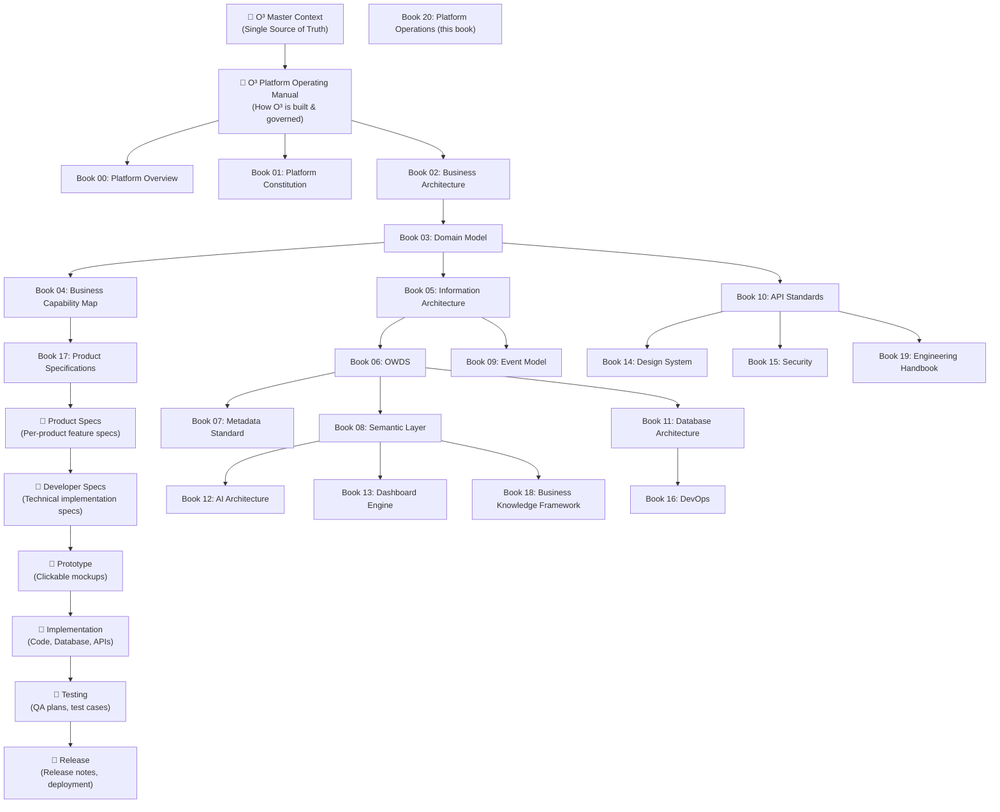
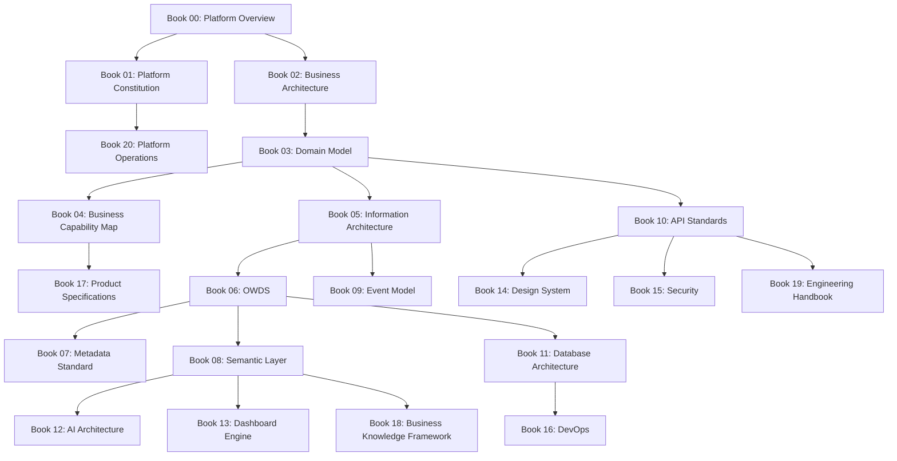
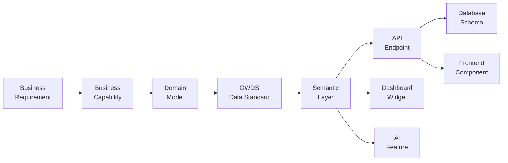
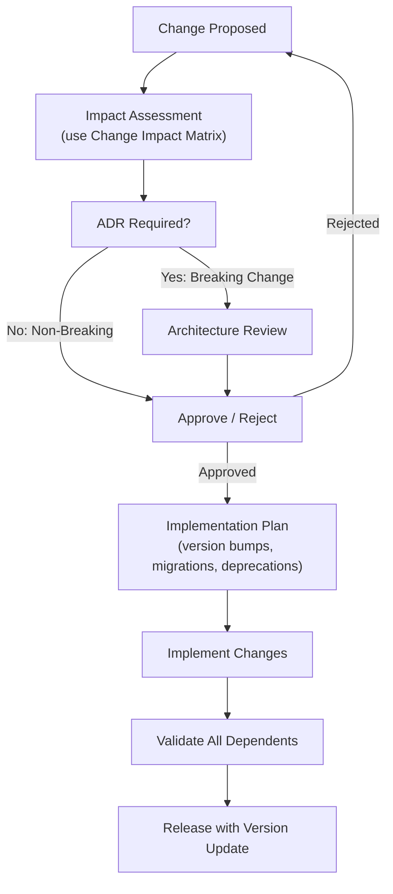
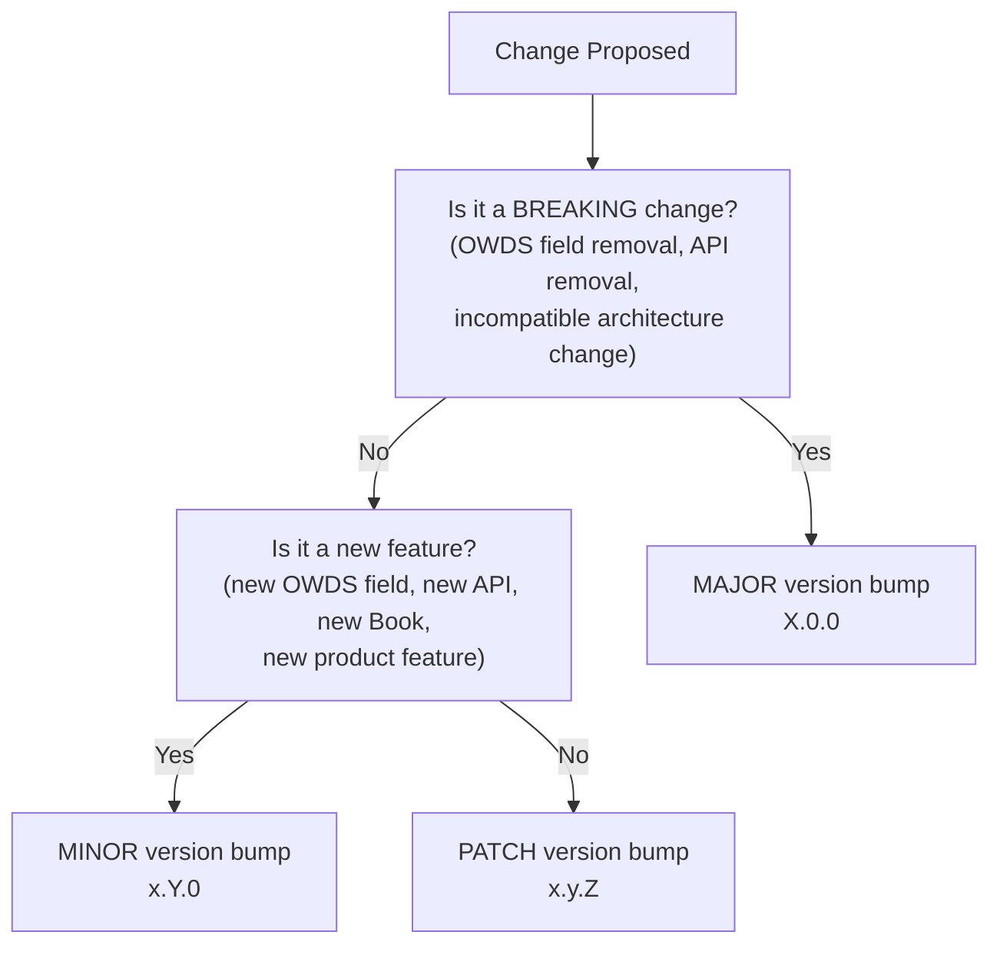
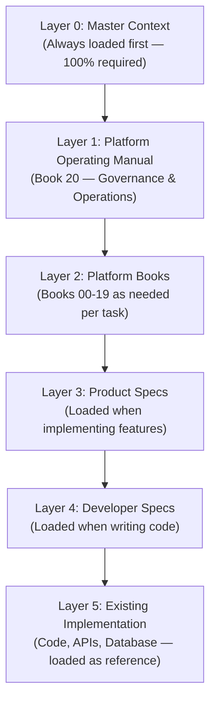
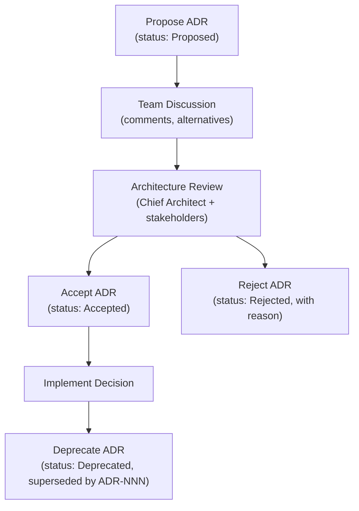

# Book 20: Platform Operations & Governance — Index

---

## Chapter 01: Repository Structure

### Purpose

Define the complete folder structure of the O³ Platform Operating Manual repository. Every directory and file has a defined purpose, ownership, and naming convention. No file exists without justification.

### Principles

1. **One repository, one truth.** The `o3-platform-operating-manual/` repository is the canonical source for all platform architecture, governance, and operational knowledge.
2. **Predictable structure.** Any AI Agent or developer can navigate the repository without external guidance.
3. **Separation of concerns.** Books are self-contained; support directories serve cross-cutting needs.
4. **Markdown first.** All source content is Markdown. HTML, PDF, and other formats are generated outputs, not sources.

### Repository Layout

```
o3-platform-operating-manual/
│
├── README.md                          ← Entry point: what this is, how to use it
├── SUMMARY.md                         ← Release scope, book inventory, status
├── CHANGELOG.md                       ← All notable changes, version history
│
├── books/                             ← All platform books (00–20)
│   ├── book-00-platform-overview/
│   │   ├── README.md                  ← Book overview, purpose, chapters list
│   │   ├── index.md                   ← Full chapter content with all sections
│   │   ├── chapters/                  ← (Optional) Individual chapter files
│   │   ├── diagrams/                  ← Mermaid and image diagrams
│   │   └── assets/                    ← Book-specific assets
│   ├── book-01-platform-constitution/
│   ├── book-02-business-architecture/
│   ├── book-03-domain-model/
│   ├── book-04-business-capability-map/
│   ├── book-05-information-architecture/
│   ├── book-06-owds/
│   ├── book-07-metadata-standard/
│   ├── book-08-semantic-layer/
│   ├── book-09-event-model/
│   ├── book-10-api-standards/
│   ├── book-11-database-architecture/
│   ├── book-12-ai-architecture/
│   ├── book-13-dashboard-engine/
│   ├── book-14-design-system/
│   ├── book-15-security/
│   ├── book-16-devops/
│   ├── book-17-product-specifications/
│   ├── book-18-business-knowledge-framework/
│   ├── book-19-engineering-handbook/
│   └── book-20-platform-operations/   ← This book: governance & operations
│
├── knowledge/                         ← ODKB: O³ Decision Knowledge Base
│   └── README.md                      ← HR business rules, decision logic, playbooks
│
├── adr/                               ← Architecture Decision Records
│   ├── README.md                      ← ADR index and template
│   ├── adr-001-owds-standard.md
│   ├── adr-002-api-first.md
│   └── ...                            ← One file per ADR
│
├── patterns/                          ← Reusable design and architecture patterns
│   └── README.md
│
├── templates/                         ← Reusable templates (OWDS Excel, API docs, ADR)
│   └── README.md
│
├── diagrams/                          ← Cross-book diagrams (platform, data flow, AI flow)
│   └── README.md
│
└── assets/                            ← Shared assets (logos, fonts, document templates)
    └── README.md
```

### Ownership

| Directory / File | Owner | Review Required By |
|------------------|-------|-------------------|
| `README.md`, `SUMMARY.md`, `CHANGELOG.md` | Chief Architect | Founder |
| `books/book-00/` through `book-02/` | Chief Architect | Founder |
| `books/book-03/` through `book-09/` | Chief Architect + Data Architect | Chief Architect |
| `books/book-10/` through `book-16/` | Chief Architect + Lead Engineer | Chief Architect |
| `books/book-17/` through `book-19/` | Product Manager + Lead Engineer | Chief Architect |
| `books/book-20/` | Chief Architect | Founder |
| `knowledge/` | Domain Expert + AI Engineer | Chief Architect |
| `adr/` | Chief Architect | Founder |
| `patterns/` | Lead Engineer | Chief Architect |
| `templates/` | Product Manager | Chief Architect |

### Naming Convention

| Type | Convention | Example |
|------|-----------|---------|
| Book directory | `book-NN-slug/` (NN = zero-padded two-digit number) | `book-03-domain-model/` |
| Book files | `README.md`, `index.md` | Always these two names |
| Chapter files | `chapter-NN-slug.md` | `chapter-01-platform-concept.md` |
| Diagram files | `diagram-slug.mmd` or `.png` | `diagram-platform-layers.mmd` |
| ADR files | `adr-NNN-slug.md` | `adr-001-owds-standard.md` |
| Template files | `template-purpose.ext` | `template-owds-data.xlsx` |

### Best Practices

- Every directory has a `README.md` explaining its purpose
- Book numbers are never re-assigned; deprecated books are marked as `[DEPRECATED]`
- No file exceeds 500 lines without splitting into chapters
- Cross-references use relative paths from the repository root

### Anti-patterns

- Creating files outside the defined structure
- Using non-standard naming (spaces, special characters, inconsistent casing)
- Placing diagrams in the wrong book's directory
- Mixing generated files (HTML, PDF) with source files (Markdown)

### AI Instructions

- When creating new content, always follow the repository layout exactly
- Book numbers are assigned by the Chief Architect — do not self-assign
- If a new book is needed, propose it via ADR first

### Developer Notes

- The repository is versioned in GitHub
- All changes go through Pull Requests
- `books/` directories contain only source content; generated files go in a separate `dist/` or build output

### PM Notes

- Do not create product specs outside `book-17-product-specifications/`
- Templates for customer-facing documents live in `templates/`

### Architecture Notes

- The repository structure mirrors the documentation hierarchy
- Cross-book diagrams live in the shared `diagrams/` directory to avoid duplication

### Cross References

- Book 01: Platform Constitution (Principle 14: Documentation First)
- Book 19: Engineering Handbook (Documentation Standards)
- ADR-002: API First

---

## Chapter 02: Documentation Hierarchy

### Purpose

Define the strict hierarchy of O³ documentation — from the highest-level Master Context down to Release notes. Every document type has a defined position, audience, and relationship to documents above and below it.

### Principles

1. **Top-down authority.** Higher documents constrain lower documents. A Product Spec must not contradict the Domain Model.
2. **Single Source of Truth.** The Master Context is the root. All other documents derive from it.
3. **Traceable lineage.** Every requirement, decision, or spec can be traced upward to its source document.
4. **Build before document.** Architecture documentation precedes implementation; implementation does not drive documentation.

### Hierarchy Diagram



### Documentation Levels

| Level | Document Type | Audience | Constrains | Constrained By |
|-------|--------------|----------|------------|----------------|
| L0 | Master Context | Founder, All | Everything below | Nothing (root) |
| L1 | Platform Operating Manual | AI Agents, Architects | All Books | Master Context |
| L2 | Platform Books (00–20) | Architects, Engineers, PMs | Product Specs, Developer Specs | L0, L1 |
| L3 | Product Specs | PMs, Engineers, Designers | Developer Specs | L2 |
| L4 | Developer Specs | Engineers | Implementation | L3 |
| L5 | Prototype | Designers, PMs, Engineers | Implementation | L3, L4 |
| L6 | Implementation | Engineers | Testing | L4, L5 |
| L7 | Testing | QA Engineers | Release | L4, L6 |
| L8 | Release | All, Customers | Nothing (leaf) | L7 |

### Rules of Hierarchy

1. **Downward flow only.** Constraints flow from higher levels to lower levels. Lower levels may not redefine or override higher levels.
2. **Conflict resolution.** If a lower document conflicts with a higher document, the higher document wins. File an ADR to resolve the conflict.
3. **Gap filling.** If a higher document is silent on a topic, the lower document may define it — but must note that it is filling a gap.
4. **Version coupling.** When a higher document changes, all dependent lower documents must be reviewed for impact.

### Examples

**Example 1: Domain Model → OWDS → Database Schema**
- Domain Model defines `Employee` as a core workforce object with attributes like `Department`, `Position`, `Salary`
- OWDS standardizes these as `Employee_ID`, `Department`, `Position`, `Salary` with data types and validation rules
- Database Schema implements OWDS as PostgreSQL tables with columns, constraints, and indexes traceable back to OWDS fields

**Example 2: Platform Principle → API Standard → API Implementation**
- Principle 03 (API First) states all products communicate through APIs
- Book 10 (API Standards) defines REST conventions, versioning, error handling
- Implementation creates actual API endpoints following Book 10

### Best Practices

- Every document states its level in the hierarchy in its README
- Cross-references always point upward or sideways, never downward to avoid circular dependencies
- When in doubt about where a decision belongs, escalate it upward

### Anti-patterns

- Developer Specs that introduce new business rules not in Product Specs
- Product Specs that contradict the Domain Model
- Implementation that bypasses API Standards defined in Book 10
- Creating documents outside the hierarchy without ADR approval

### AI Instructions

- Before creating any document, identify its level in the hierarchy
- Read all documents above it in the hierarchy before writing
- Never create a lower-level document that contradicts a higher-level document
- If the hierarchy is unclear, ask the Chief Architect

### Developer Notes

- The hierarchy is enforced through code review
- PRs must include a checklist confirming hierarchy compliance
- If implementation reveals a gap in higher documents, file an issue — do not work around it

### PM Notes

- Product Specs exist at L3 — they derive from Business Architecture (Book 02) and Domain Model (Book 03)
- Do not write Product Specs in isolation; always cross-reference the relevant Platform Book

### Architecture Notes

- The hierarchy is itself an architecture decision (ADR-009 — proposed)
- Changes to the hierarchy require an ADR and Founder approval

### Cross References

- Book 01: Platform Constitution (Principle 14: Documentation First)
- Book 17: Product Specifications
- Book 19: Engineering Handbook
- ADR Directory

---

## Chapter 03: Dependency Graph

### Purpose

Map every dependency between Platform Books, showing what each Book depends on and what depends on it. This graph is the definitive map of O³ knowledge relationships.

### Principles

1. **Explicit dependencies.** Every dependency between Books must be explicitly documented and justified.
2. **Acyclic graph.** Dependencies must form a Directed Acyclic Graph (DAG). Circular dependencies are forbidden.
3. **Minimal dependencies.** Books should depend only on what they truly need. Unnecessary dependencies create fragility.

### Full Dependency Matrix



### Dependency Table

| Book | Depends On | Depended By |
|------|-----------|-------------|
| Book 00 | (none — entry point) | Book 01, Book 02 |
| Book 01 | Book 00 | Book 20, all Books (principles) |
| Book 02 | Book 00 | Book 03 |
| Book 03 | Book 02 | Book 04, Book 05, Book 10 |
| Book 04 | Book 03 | Book 17 |
| Book 05 | Book 03 | Book 06, Book 09 |
| Book 06 | Book 05 | Book 07, Book 08, Book 11 |
| Book 07 | Book 06 | (leaf — referenced by all) |
| Book 08 | Book 06 | Book 12, Book 13, Book 18 |
| Book 09 | Book 05 | (leaf — referenced by Book 12, Book 16) |
| Book 10 | Book 03 | Book 14, Book 15, Book 19 |
| Book 11 | Book 06 | Book 16 |
| Book 12 | Book 08 | (leaf — referenced by Book 13, Book 18) |
| Book 13 | Book 08 | (leaf) |
| Book 14 | Book 10 | (leaf) |
| Book 15 | Book 10 | (leaf) |
| Book 16 | Book 11 | (leaf) |
| Book 17 | Book 04 | (leaf) |
| Book 18 | Book 08 | (leaf) |
| Book 19 | Book 10 | (leaf) |
| Book 20 | Book 01 | (leaf — governs all) |

### Data Dependency Chain

```
Business Output → OWDS → Semantic Layer → Insight Engine → Dashboard
                                                              → AI Advisor
                                                              → Action Plan
```

### AI Dependency Chain

```
Company Context → OWDS Data → Semantic Layer → AI Context Layer → AI Gateway → LLM
                   ↑                              ↑
           Metadata Standard              Decision Knowledge Base (ODKB)
```

### Product Dependency Chain

```
Company Profile → User Account → Subscription → Upload → Validation → Import
                                                                          ↓
Dashboard ← Insight Engine ← KPI Calculation ← OWDS ←────────────────────┘
    ↓
AI Summary → Action Plan
```

### Dependency Rules

1. **Books may only depend on Books with lower or equal numbers in the sequence.**
2. **No circular dependencies.** If Book A depends on Book B, Book B must not depend on Book A.
3. **Cross-cutting concerns** (Security, DevOps, Design System) are leaf nodes — they are referenced by other Books but do not depend on them.
4. **Changes to a Book require impact assessment on all Books that depend on it.**

### Best Practices

- When adding a new dependency, document why it is necessary in the depending Book's README
- Review the dependency graph whenever a Book is updated
- Keep the dependency graph shallow — prefer 2-3 levels of dependency

### Anti-patterns

- Circular dependencies (A → B → A)
- Implicit dependencies not documented in the graph
- Dependency on a Book that hasn't been written yet (creates forward reference)
- Too many dependencies on a single Book (indicates the Book may be too large)

### AI Instructions

- Before modifying a Book, check the dependency graph to understand what depends on it
- After modifying a Book, review all Books that depend on it for necessary updates
- If you discover an undocumented dependency, add it to this chapter

### Developer Notes

- The dependency graph is a design-time tool, not a runtime constraint
- CI/CD can include a script to validate that Book cross-references match the dependency graph

### PM Notes

- When scoping a feature, trace its dependency path through the graph to identify all affected Books
- Product Specs (Book 17) depend on Business Capability Map (Book 04) — scope must align

### Architecture Notes

- The dependency graph is the definitive answer to "what breaks if I change X?"
- Major dependency changes require an ADR

### Cross References

- Chapter 05: Change Management (impact analysis based on this graph)
- Chapter 04: Traceability Matrix
- Book 03: Domain Model
- Book 06: OWDS

---

## Chapter 04: Traceability Matrix

### Purpose

Define the traceability path from Business Requirement to Production Code. Every requirement, data point, API, UI component, and AI feature must be traceable back to its origin.

### Principles

1. **Full traceability.** Every implementation artifact must trace back to a business requirement through the documented chain.
2. **No orphan artifacts.** Nothing exists in the platform without a traceable origin.
3. **Bidirectional traceability.** Forward traceability (requirement → implementation) and backward traceability (implementation → requirement) must both be possible.

### Traceability Chain



### Traceability Matrix Template

| ID | Business Requirement | Capability | Domain | OWDS Field | Semantic KPI | API Endpoint | DB Table | Frontend Component | Dashboard Widget | AI Feature | Status |
|----|---------------------|-----------|--------|-----------|-------------|-------------|---------|-------------------|-----------------|------------|--------|
| REQ-001 | SME can upload workforce data | Workforce Data Management | Upload | Employee_Master (all fields) | — | POST /api/v1/upload | uploads, employees | UploadForm, ValidationReport | — | — | Defined |
| REQ-002 | User sees turnover rate | Workforce Analytics | Exit, Employee | Exit_Record, Employee_Master | Turnover Rate | GET /api/v1/turnover | exits, employees | TurnoverWidget | TurnoverCard | AI Turnover Summary | Defined |
| REQ-003 | AI explains why turnover is high | AI-Powered Advisory | Insight, AI Advisor | Exit_Record, Performance | Turnover Rate, Regrettable Loss Rate | POST /api/v1/ai/ask | — | — | AIAdvisorWidget | AI Advisor | Planned |
| REQ-004 | User compares to industry benchmark | Benchmark & Market Intelligence | Benchmark | Aggregated KPIs | Benchmark Turnover | GET /api/v1/benchmark/turnover | benchmark_data | BenchmarkWidget | BenchmarkCard | — | Future |

### Traceability Rules

1. Every Product Spec user story must reference a Business Requirement ID
2. Every API endpoint must reference the OWDS fields it reads or writes
3. Every Dashboard widget must reference the Semantic KPI it displays
4. Every AI feature must reference the OWDS data and Semantic KPIs it consumes
5. Every Database table must map to a Domain entity

### Traceability Checklist (per Feature)

```
☐ Business Requirement documented in Product Specs
☐ Mapped to Business Capability in Book 04
☐ Domain entities identified in Book 03
☐ OWDS fields defined in Book 06
☐ Semantic KPIs defined in Book 08 (if applicable)
☐ API endpoints defined in Book 10
☐ Database tables defined in Book 11
☐ Frontend components defined in Book 14
☐ Dashboard widgets defined in Book 13 (if applicable)
☐ AI features defined in Book 12 (if applicable)
☐ Security considerations in Book 15
☐ DevOps considerations in Book 16
☐ Cross-references updated in all affected Books
```

### Best Practices

- Assign a unique Requirement ID to every business requirement in Product Specs
- Use the traceability matrix in code reviews to validate completeness
- Automate traceability checks in CI/CD where possible
- Update the matrix when scope changes

### Anti-patterns

- Building an API endpoint without a traceable business requirement
- Creating a Dashboard widget that displays data not defined in OWDS
- AI features that consume data without Semantic Layer definitions
- Orphan frontend components with no API or data source

### AI Instructions

- When implementing a feature, fill out the traceability checklist
- If you cannot trace a component to its origin, stop and ask — do not proceed
- Use the Requirement ID as a tag in code comments and commit messages

### Developer Notes

- Database migration files should reference OWDS field names in comments
- API route handlers should document which OWDS fields they use
- Component props should map to Semantic KPI names

### PM Notes

- Every Product Spec story must have a Requirement ID
- Requirement IDs follow format: `REQ-{product}-{NNN}` (e.g., `REQ-DASH-001`)
- Track requirement coverage using the traceability matrix

### Architecture Notes

- The traceability matrix is a living document — update it with every release
- Missing traceability is a blocking issue for Release readiness

### Cross References

- Book 03: Domain Model
- Book 04: Business Capability Map
- Book 06: OWDS
- Book 08: Semantic Layer
- Book 10: API Standards
- Book 13: Dashboard Engine
- Book 17: Product Specifications

---

## Chapter 05: Change Management

### Purpose

Define the exact impact of every type of change in the O³ Platform. When something changes, what else must change? This chapter provides the definitive answer.

### Principles

1. **Predictable impact.** Every change type has a documented impact path.
2. **No silent breaks.** A change in one component must trigger a review of all dependent components.
3. **ADR for breaking changes.** Any change that breaks backward compatibility requires an ADR.
4. **Version everything.** Every change is tracked through version numbers (see Chapter 06).

### Change Impact Matrix

#### If OWDS Changes

| Change Type | Impact | Affected Books | Affected Artifacts |
|-------------|--------|---------------|-------------------|
| Add new OWDS field | Add field to DB schema, update upload template, update validation rules, update API responses | Book 06, Book 07, Book 11, Book 10 | Database migration, Upload template v2, Validation service, API schemas |
| Rename OWDS field | **BREAKING** — requires migration of existing data, update all APIs, update AI prompts, update dashboard widgets | Book 06, Book 07, Book 08, Book 10, Book 11, Book 12, Book 13 | Database migration, API version bump, AI prompt updates, Dashboard widget updates |
| Remove OWDS field | **BREAKING** — requires data migration plan, deprecation notice, timeline | Book 06, Book 07, Book 08, Book 10, Book 11 | Database migration, API deprecation, Semantic KPI removal |
| Change OWDS data type | **BREAKING** — requires data conversion, validation rule updates | Book 06, Book 07, Book 11 | Database migration, Validation service, Import service |
| Add validation rule | Non-breaking if new rule is additive | Book 06, Book 07 | Validation service, Data quality dashboard |

#### If Semantic Layer Changes

| Change Type | Impact | Affected Books | Affected Artifacts |
|-------------|--------|---------------|-------------------|
| Add new KPI | Define in Semantic Layer, add API endpoint, add dashboard widget, add AI context | Book 08, Book 10, Book 13, Book 12 | New API endpoint, New dashboard widget, AI prompt templates |
| Change KPI formula | Update all dashboards, update AI explanations, notify users of recalculation | Book 08, Book 13, Book 12 | Dashboard widgets, AI Advisor context, Historical data recalculation |
| Change KPI threshold | Update risk indicators, update AI interpretations | Book 08, Book 13, Book 12 | Dashboard risk levels, AI Advisor interpretations |
| Remove KPI | **BREAKING** — deprecate API, remove dashboard widget, remove AI context | Book 08, Book 10, Book 13, Book 12 | API deprecation, Dashboard removal, AI prompt cleanup |

#### If Product Changes

| Change Type | Impact | Affected Books | Affected Artifacts |
|-------------|--------|---------------|-------------------|
| New product feature | Update Product Specs, update Domain Model if new entities, add APIs, add UI | Book 17, Book 03, Book 10, Book 14 | Product Spec, API endpoints, UI components |
| Change product scope | Update Roadmap, reassess MVP definition, update Release Plan | Book 00, Book 12 (Sprint Roadmap section), Book 20 (Chapter 03) | Roadmap, Release Plan, Sprint backlog |
| Remove product feature | **BREAKING** — deprecation notice, API deprecation, UI removal | Book 17, Book 10, Book 14 | Deprecation plan, API sunset, UI cleanup |
| Change package entitlement | Update Subscription model, update entitlement checks, update CRM | Book 02, Book 11 | Subscription logic, Entitlement engine, CRM rules |

### Change Management Process



### Change Checklist

```
☐ Type of change identified (OWDS / Semantic Layer / Product / API / Other)
☐ Impact matrix consulted
☐ All affected Books identified
☐ All affected artifacts identified
☐ Breaking vs non-breaking classification
☐ ADR created (if breaking change)
☐ Architecture Review completed (if breaking change)
☐ Version bump determined (Major / Minor / Patch — see Chapter 06)
☐ Migration plan documented (if data change)
☐ Deprecation timeline published (if removal)
☐ All dependent Books updated
☐ Cross-references updated
☐ CHANGELOG updated
```

### Best Practices

- Always assess impact before making a change, not after
- Deprecate before removing — give at least one release cycle of notice
- Use the Change Impact Matrix as the first step in any change proposal
- Automate dependency checking where possible

### Anti-patterns

- Changing OWDS fields without updating the upload template
- Adding a KPI without defining it in the Semantic Layer
- Removing an API endpoint without a deprecation period
- Making breaking changes without an ADR
- Updating implementation without updating documentation

### AI Instructions

- Before making any change, consult the Change Impact Matrix in this chapter
- If the change type is not listed, escalate to Chief Architect
- Never make a breaking change without approval
- After any change, run the Change Checklist

### Developer Notes

- Use database migrations (never direct schema changes) and reference OWDS field names
- API versioning protects against breaking changes — use it
- Deprecation headers (`Deprecation`, `Sunset`) in API responses inform consumers

### PM Notes

- Product scope changes affect the Roadmap (Book 00) and Release Plan (this Book)
- Communicate breaking changes to stakeholders at least one release in advance
- Feature removal requires customer communication plan

### Architecture Notes

- The Change Impact Matrix is maintained by the Chief Architect
- New change types can be added with ADR approval
- This chapter is referenced by the Governance chapter (Chapter 10) for approval workflows

### Cross References

- Chapter 03: Dependency Graph
- Chapter 06: Version Strategy
- Chapter 10: Governance
- Book 06: OWDS
- Book 08: Semantic Layer
- ADR Directory

---

## Chapter 06: Version Strategy

### Purpose

Define the versioning strategy for all O³ artifacts — documentation, platform, products, APIs, and data schemas. Every artifact follows Semantic Versioning (SemVer) adapted for O³'s multi-artifact reality.

### Principles

1. **SemVer base.** All versioning follows MAJOR.MINOR.PATCH semantics.
2. **Independent versioning.** Different artifacts can have different versions. OWDS v1.2.0 can coexist with Platform v0.6.0.
3. **Version in filename.** Major documentation versions are reflected in filenames where appropriate.
4. **CHANGELOG mandatory.** Every version change is documented in the appropriate CHANGELOG.

### Version Types

| Artifact | Version Format | Example | CHANGELOG Location |
|----------|---------------|---------|-------------------|
| Master Context | MAJOR.MINOR | v1.0, v1.1, v2.0 | `o3_master_context/CHANGELOG.md` |
| Platform Operating Manual | MAJOR.MINOR.PATCH | v0.1.0, v0.2.0, v1.0.0 | `o3-platform-operating-manual/CHANGELOG.md` |
| Individual Book | Inherits Platform version | — | Book's README.md |
| OWDS Schema | MAJOR.MINOR.PATCH | v1.0.0, v1.1.0, v2.0.0 | `books/book-06-owds/CHANGELOG.md` |
| API | MAJOR.MINOR | v1, v2 (in URL path) | API documentation |
| Product (Dashboard, AI Studio, etc.) | MAJOR.MINOR.PATCH | v0.1.0, v1.0.0 | Product Specs |
| Prototype | MAJOR.MINOR | v0.1, v0.2 | Prototype changelog |

### SemVer Rules (adapted for O³)

| Change Type | Version Bump | Example |
|-------------|-------------|---------|
| **MAJOR** — Breaking changes to OWDS, API, or Architecture; removal of features; incompatible data migrations | X.0.0 | v1.0.0 → v2.0.0 |
| **MINOR** — New OWDS fields; new APIs; new features; new Books; backward-compatible additions | x.Y.0 | v1.0.0 → v1.1.0 |
| **PATCH** — Bug fixes; typo corrections; clarifications; non-functional improvements | x.y.Z | v1.0.0 → v1.0.1 |

### Documentation Version vs Platform Version vs Product Version

```
Documentation Version (Platform Operating Manual)
    │
    ├── v0.1.0  →  Release 0.1 (Book 00, 01, 02)
    ├── v0.2.0  →  Release 0.2 (Book 03, 04, 05)
    ├── v0.3.0  →  Release 0.3 (Book 06, 07, 08, 09)
    ├── v0.4.0  →  Release 0.4 (Book 10, 11, 12)
    ├── v0.5.0  →  Release 0.5 (Book 13, 14, 15, 16)
    ├── v0.6.0  →  Release 0.6 (Book 17, 18, 19)
    └── v1.0.0  →  Release 1.0 (All Books complete + Product Specs + Developer Specs)

Platform Version (O³ ZONE Platform)
    │
    ├── v0.1.0  →  MVP Foundation (Sprint 0–1)
    ├── v0.2.0  →  MVP Dashboard (Sprint 2)
    ├── v0.3.0  →  MVP AI Advisor (Sprint 3)
    ├── v0.4.0  →  MVP AI Studio (Sprint 4)
    ├── v0.5.0  →  MVP Academy (Sprint 5)
    ├── v0.6.0  →  MVP Subscription & CRM (Sprint 6)
    └── v1.0.0  →  Public Release

Product Versions
    │
    ├── O³ Dashboard v1.0.0
    ├── O³ Workforce AI Studio v1.0.0
    ├── O³ Survey Studio v1.0.0 (Future)
    ├── O³ Academy v1.0.0
    └── O³ Benchmark Center v1.0.0 (Future)
```

### Version Bump Decision Tree



### Versioning Checklist

```
☐ Type of change classified (Breaking / Feature / Fix)
☐ Correct version bump determined
☐ All dependent artifacts identified (see Chapter 05: Change Impact Matrix)
☐ CHANGELOG.md updated with new version entry
☐ Version number updated in all relevant README.md files
☐ API version updated in URL path (if API change)
☐ Database migration created with versioned filename (if schema change)
☐ Git tag created for the release
☐ Dependent teams notified (if breaking change)
```

### Best Practices

- Tag every release in Git with the version number
- Never skip version numbers
- Never reuse a version number after release
- Pre-release versions use suffixes: `v0.1.0-alpha`, `v0.1.0-beta`, `v0.1.0-rc1`
- Documentation and Platform versions are independent but aligned through the Release Plan

### Anti-patterns

- Changing version manually in multiple places (use a single source of truth)
- Releasing without a CHANGELOG entry
- Skipping MAJOR version for breaking changes ("it's just a small breaking change")
- Version number inflation (jumping from v1.0 to v5.0 without justification)

### AI Instructions

- Always bump the appropriate version when making changes
- Use the Version Bump Decision Tree to determine the correct bump
- If unsure whether a change is breaking, treat it as breaking (conservative approach)
- Tag commits with version numbers

### Developer Notes

- `package.json` version follows Platform Version
- API versions in URL paths use MAJOR only (e.g., `/api/v1/`, `/api/v2/`)
- Database migration filenames include timestamp + description, not version numbers directly

### PM Notes

- Product releases align with Platform versions
- Customer-facing version numbers may differ from internal documentation versions
- Communicate version changes and their impact to customers

### Architecture Notes

- OWDS schema version is the most critical — it has the widest blast radius
- API versioning protects consumers from breaking changes
- Documentation versioning enables rollback and historical reference

### Cross References

- Chapter 05: Change Management
- Chapter 03: Dependency Graph
- Book 06: OWDS
- Book 10: API Standards
- CHANGELOG.md

---

## Chapter 07: Repository Standards

### Purpose

Define the mandatory standards for all files, folders, naming, Markdown, diagrams, and ADRs in the O³ Platform Operating Manual repository. Consistency is non-negotiable.

### Principles

1. **Predictability over preference.** Standards exist so anyone can find anything without asking.
2. **Machine-readable.** File names and structures should be parseable by scripts and AI Agents.
3. **Human-readable.** Standards should be intuitive, not arcane.
4. **Enforced, not suggested.** Violations are caught in code review.

### Folder Naming Standards

| Rule | Example | Anti-pattern |
|------|---------|-------------|
| Lowercase kebab-case | `book-03-domain-model/` | `Book 03 - Domain Model/` |
| Zero-padded two-digit numbers | `book-00/`, `book-03/`, `book-20/` | `book-0/`, `book-3/` |
| No spaces | `business-architecture/` | `business architecture/` |
| No special characters except hyphen | `api-standards/` | `api & standards/` |
| Singular nouns | `pattern/`, `template/`, `diagram/` | `patterns/` (allowed for top-level dirs per legacy) |

### File Naming Standards

| Type | Convention | Example |
|------|-----------|---------|
| Book overview | `README.md` | Always `README.md` (capitalized) |
| Book content | `index.md` | Always `index.md` (lowercase) |
| Chapter file | `chapter-NN-slug.md` | `chapter-01-platform-concept.md` |
| ADR file | `adr-NNN-slug.md` | `adr-001-owds-standard.md` |
| Diagram (Mermaid) | `diagram-slug.mmd` | `diagram-platform-layers.mmd` |
| Diagram (image) | `diagram-slug.png` | `diagram-data-flow.png` |
| Template (Excel) | `template-purpose.xlsx` | `template-owds-data.xlsx` |
| Template (Markdown) | `template-purpose.md` | `template-adr.md` |

### Markdown Standards

| Rule | Requirement |
|------|------------|
| Headings | Use ATX-style (`#`), not setext-style (`===`). Level 1 only for document title. |
| Line length | No hard limit, but wrap at ~120 characters for readability. |
| Lists | Use `-` for unordered lists. Indent with 2 spaces. |
| Code blocks | Always specify language: ` ```mermaid `, ` ```sql `, ` ```typescript `. |
| Links | Use reference-style `[text][ref]` or inline `[text](url)`. Cross-book links use relative paths. |
| Tables | Align columns with pipes. Use consistent spacing. |
| Images | Alt text mandatory. Use relative paths. |
| Emphasis | `**bold**` for strong, `*italic*` for emphasis. No underline. |
| Line breaks | Two spaces at end of line for hard break, or blank line for paragraph. |
| File ending | Every file ends with exactly one newline. |

### Diagram Standards

| Rule | Requirement |
|------|------------|
| Format | Mermaid (`.mmd`) preferred for text-based diagrams. PNG/SVG for exports. |
| Direction | Specify in Mermaid: `graph TD` (top-down) or `graph LR` (left-right). |
| Labels | Use clear, descriptive labels. No abbreviations without a legend. |
| Colors | Use O³ color palette: `#c00` (red), `#0d0d0d` (black), `#fafafa` (light gray). |
| Accessibility | Provide a text description below every diagram. |
| Placement | Diagrams go in `diagrams/` folder of the relevant book. |

### ADR Standards

| Rule | Requirement |
|------|------------|
| Filename | `adr-NNN-slug.md` — NNN is zero-padded 3-digit number. |
| Sections | Title, Status, Context, Decision, Consequences (mandatory). Options Considered (optional). |
| Status | One of: `Proposed`, `Accepted`, `Deprecated`, `Superseded`. |
| Cross-references | Reference related ADRs by their ID. |
| Version | ADRs are immutable once Accepted. Changes require a new ADR. |

### Checklist: New File Creation

```
☐ Folder follows naming conventions
☐ File follows naming conventions
☐ Markdown follows Markdown standards
☐ Headings are correctly nested (H1 → H2 → H3, no skipping)
☐ All links are valid (no broken cross-references)
☐ Diagrams have alt text / descriptions
☐ Code blocks specify language
☐ File ends with exactly one newline
☐ Cross-references to related Books included
☐ Added to appropriate index.md or README.md
```

### Best Practices

- Run a Markdown linter before committing
- Use `prettier` for consistent Markdown formatting
- Review file naming in PR diff — names are hard to change later
- Keep the repository clean: no temporary files, no `.DS_Store`, no `node_modules`

### Anti-patterns

- `Final_v2_REAL.docx` naming style
- Spaces in filenames (break on some systems and in URLs)
- Mixing Markdown styles within a single file
- Diagrams as screenshots of text (use Mermaid instead)
- Unlabeled diagrams with no explanation

### AI Instructions

- Follow all standards in this chapter when creating any file in the repository
- If a standard is unclear, ask the Chief Architect — do not guess
- Use the Checklist: New File Creation before committing any new file

### Developer Notes

- Add a `.prettierrc` or `.editorconfig` to the repository root for automated formatting
- Git hooks can enforce naming conventions
- CI can run a Markdown linter and link checker

### PM Notes

- Templates for customer-facing documents must still follow repository naming standards
- When requesting new content, specify the target Book and chapter to maintain structure

### Architecture Notes

- These standards are themselves governed by Book 01, Principle 14 (Documentation First)
- Changes to standards require an ADR and Chief Architect approval

### Cross References

- Chapter 01: Repository Structure
- Chapter 08: Prompt Standards
- Book 01: Platform Constitution (Principle 14)
- Book 19: Engineering Handbook (Documentation Standards)
- ADR Directory

---

## Chapter 08: Prompt Standards

### Purpose

Define standard prompts for AI Agents at every level of O³ documentation and development. Prompts ensure consistency, completeness, and adherence to O³ architecture across all AI-generated output.

### Principles

1. **Prompt hierarchy.** Prompts exist at every level of the documentation hierarchy, from Master Context down to individual feature implementation.
2. **Context injection.** Every prompt includes references to the relevant Books, ADRs, and standards.
3. **Output specification.** Every prompt defines the expected output format and quality criteria.
4. **No ambiguity.** Prompts are specific, actionable, and verifiable.

### Prompt Hierarchy

| Level | Prompt Type | When to Use | References |
|-------|------------|-------------|------------|
| L0 | Master Prompt | Starting any O³ work | Master Context |
| L1 | Platform Prompt | Creating Books, ADRs, platform artifacts | Master Context + Platform Operating Manual |
| L2 | Book Prompt | Creating individual Book content | Master Context + specific Book's README |
| L3 | Product Prompt | Creating Product Specs | L0 + Books 02, 03, 04, 17 |
| L4 | Feature Prompt | Implementing a specific feature | L0 + Product Spec + relevant Books |
| L5 | Developer Prompt | Writing code | L0 + Developer Specs + Books 10, 11, 12, 19 |

### Standard Prompt Template

```markdown
## Role
You are [ROLE] for O³ ZONE.

## Context
[RELEVANT CONTEXT FROM MASTER CONTEXT AND PLATFORM BOOKS]

## Constraints
- [CONSTRAINT 1]
- [CONSTRAINT 2]
- ...

## Task
[SPECIFIC, ACTIONABLE TASK DESCRIPTION]

## Output Format
[EXPECTED OUTPUT STRUCTURE]

## Quality Criteria
- [CRITERION 1]
- [CRITERION 2]
- ...

## Cross-References
- [BOOK OR ADR REFERENCE]
- ...

## Rules
- Do not invent new product names.
- Use O³ vocabulary consistently.
- Mark every section as Draft if not enough information.
```

### Master Prompt (L0)

```markdown
## Role
You are the Chief Architect and Chief Documentation Officer for O³ ZONE.

## Context
O³ ZONE is an AI-powered Workforce Intelligence Platform for Thai SMEs.
Read and fully understand the O³ Master Context before producing any output.

## Constraints
- O³ is NOT a dashboard, HRIS, chatbot, survey tool, or academy site.
- It IS a platform with shared OWDS, AI Gateway, Insight Engine, and Benchmark Center.
- Architecture principles are non-negotiable (see Book 01).

## Cross-References
- Master Context (all 16 sections + Part X)
- Platform Operating Manual (Book 20)
```

### Platform Prompt (L1)

```markdown
## Role
You are the Chief Documentation Officer for O³ ZONE.

## Context
You must read and follow the O³ Master Context and Platform Operating Manual (Book 20).

## Task
Generate O³ Platform Operating Manual content following the build sequence.

## Output Format
- README.md with Purpose, Chapters, Key Takeaways
- index.md with full chapter content
- Each chapter: Purpose, Background, Principles, Business Rules, Architecture Impact, AI Impact, Best Practices, Anti-patterns, Cross References, Future Considerations

## Rules
- Do not create Product Specs before reading Master Context.
- Do not invent new product names.
- Use O³ vocabulary consistently.
- Markdown is source of truth.
- Every Book must reference related Books.
- Every technical decision must connect to an ADR.
- Every data concept must connect to OWDS.
- Every KPI must connect to Semantic Layer.
- Every AI feature must explain its reasoning.
- If data insufficient, AI must say so.
- Do not skip Domain Model, OWDS, API, or AI Architecture.
```

### Book Prompt (L2)

```markdown
## Role
You are the author of [BOOK TITLE] for O³ ZONE.

## Context
Read these before writing:
- O³ Master Context (all sections)
- Platform Operating Manual (Book 20)
- All Books that [BOOK TITLE] depends on (see Book 20, Chapter 03: Dependency Graph)

## Task
Write the complete content for [BOOK TITLE].

## Output Format
- README.md: Purpose, Chapters, Key Takeaways, Target Audience
- index.md: Full chapter content with all required sections
- diagrams/: Mermaid diagrams as needed

## Quality Criteria
- Every chapter has all 10 required sections
- No placeholder text — mark incomplete sections as [DRAFT: explanation]
- All cross-references are valid
- Mermaid diagrams are syntactically correct
```

### Product Prompt (L3)

```markdown
## Role
You are the Product Manager for O³ ZONE, creating Product Specifications.

## Context
Read these before writing:
- O³ Master Context
- Book 02: Business Architecture
- Book 03: Domain Model
- Book 04: Business Capability Map
- Book 17: Product Specifications

## Task
Create Product Spec for [PRODUCT NAME].

## Output Format
- User stories with acceptance criteria
- Feature requirements traced to Business Requirements
- Wireframe references
- API dependencies

## Rules
- Every feature must trace to a Business Capability (Book 04).
- Every data field must reference an OWDS field (Book 06).
- Every KPI must reference a Semantic KPI (Book 08).
- Do not define new product names.
```

### Feature Prompt (L4)

```markdown
## Role
You are a Full-Stack Developer implementing a feature for O³ ZONE.

## Context
Read these before coding:
- Product Spec for this feature
- Book 10: API Standards
- Book 11: Database Architecture (if data change)
- Book 12: AI Architecture (if AI feature)
- Book 13: Dashboard Engine (if dashboard widget)
- Book 14: Design System
- Book 19: Engineering Handbook

## Task
Implement [FEATURE NAME] following the Developer Spec.

## Output Format
- Code following Engineering Handbook standards
- Tests following testing strategy
- Documentation updates

## Rules
- All APIs follow Book 10 standards.
- All database changes via migrations.
- All AI calls through AI Gateway.
- All new KPIs defined in Semantic Layer first.
```

### Developer Prompt (L5)

```markdown
## Role
You are a Senior Software Engineer at O³ ZONE.

## Context
Read these before writing code:
- Developer Spec for the assigned task
- Book 19: Engineering Handbook
- Relevant Books for the feature domain

## Task
Write production-quality code for [TASK].

## Quality Criteria
- TypeScript strict mode
- Test coverage ≥ 80%
- All PR checks pass
- Documentation updated
- Traceability matrix updated
```

### Prompt Usage Checklist

```
☐ Correct prompt level selected (L0–L5)
☐ All referenced context documents read before execution
☐ Output format matches the prompt specification
☐ Quality criteria met before submission
☐ Cross-references included in output
☐ No invented names or concepts
☐ O³ vocabulary used consistently
☐ Draft sections clearly marked
```

### Best Practices

- Always use the highest appropriate prompt level — start with Master Prompt, narrow down
- Customize prompts with specific cross-references to relevant Books
- If a prompt produces incorrect output, update the prompt, not the output
- Store reusable prompts in `templates/prompts/`

### Anti-patterns

- Using a generic prompt without O³-specific context
- Skipping prompt levels (e.g., writing code without reading Product Specs)
- Ignoring prompt constraints (e.g., inventing new product names)
- Not updating prompts when architecture changes

### AI Instructions (Meta)

- When you receive a prompt, verify it includes the required context references
- If context is insufficient, request the missing context — do not hallucinate
- After completing a task, suggest improvements to the prompt template if applicable
- All AI Agents must follow the prompt hierarchy — no bypassing

### Developer Notes

- Prompt templates can be versioned alongside code
- Consider storing prompts as structured data (JSON/YAML) for programmatic use
- Prompt effectiveness should be reviewed in retrospectives

### PM Notes

- Product prompts should be reviewed by the Chief Architect before use
- Feature prompts should be created collaboratively with Engineering

### Architecture Notes

- The prompt hierarchy mirrors the documentation hierarchy (Chapter 02)
- Changes to prompt standards require an ADR
- Prompt templates are part of the Platform Operating Manual and follow the same versioning

### Cross References

- Chapter 02: Documentation Hierarchy
- Chapter 09: AI Memory Hierarchy
- Book 19: Engineering Handbook
- `templates/prompts/` directory

---

## Chapter 09: AI Memory Hierarchy

### Purpose

Define the memory and context loading order for AI Agents working on O³. AI Agents have finite context windows — this chapter defines priority order for context consumption to maximize output quality.

### Principles

1. **Layered memory.** AI Agents load context in layers, from foundational to specific.
2. **Just-in-time loading.** Load only what is needed for the current task to conserve context window.
3. **Consistent priority.** The memory hierarchy is fixed — AI Agents must not reorder it.
4. **Context is cumulative.** Each layer builds on the previous layer.

### AI Memory Hierarchy Diagram



### Memory Loading Priority Table

| Priority | Layer | What to Load | When | Estimated Token Cost |
|----------|-------|-------------|------|---------------------|
| 1 (Always) | L0 — Master Context | Executive Summary, O³ Definition, Platform Principles, Architecture Overview, Vocabulary | Every session, always | ~5K tokens |
| 2 | L1 — Platform Operations | Book 20: Repository Structure, Documentation Hierarchy, Governance, Rules for AI Agents | When building O³ artifacts | ~3K tokens |
| 3 | L2 — Platform Books | Domain Model (Book 03), OWDS (Book 06), Semantic Layer (Book 08), AI Architecture (Book 12) | When designing or implementing | ~10K tokens per Book |
| 4 | L2 — Domain Books | The specific Books relevant to the task (e.g., Book 13 for dashboard work) | Per task | ~5K tokens each |
| 5 | L3 — Product Specs | The Product Spec for the feature being built | When implementing features | ~3K tokens |
| 6 | L4 — Developer Specs | The Developer Spec for the implementation task | When writing code | ~3K tokens |
| 7 | L5 — Implementation | Existing code, APIs, database schema | As reference during implementation | Variable |

### Task-to-Context Mapping

| Task | Required Context Layers | Estimated Total Tokens |
|------|------------------------|----------------------|
| Create a new Platform Book | L0 + L1 + Dependency Graph (Book 20 Ch.03) | ~12K |
| Create a Product Spec | L0 + L1 + Books 02, 03, 04, 17 | ~25K |
| Design an API endpoint | L0 + L1 + Books 03, 06, 10 | ~22K |
| Implement a Dashboard widget | L0 + L1 + Books 06, 08, 13, 14 | ~28K |
| Build an AI feature | L0 + L1 + Books 06, 08, 12, 18 | ~30K |
| Database schema change | L0 + L1 + Books 03, 06, 11 | ~22K |
| Write a Developer Spec | L0 + L1 + Books 10, 11, 12, 19 + Product Spec | ~30K |
| Review a PR | L0 + L1 + relevant domain Books | ~15K |
| Create an ADR | L0 + L1 + affected Books | ~18K |

### Memory Loading Sequence (Step by Step)

```
Step 1: Load Master Context Executive Summary + Platform Principles (L0 Core)
Step 2: Assess task — determine which Books are needed
Step 3: Load Book 20 Governance chapter (rules every AI must follow)
Step 4: Load Domain Model (Book 03) if task involves data or entities
Step 5: Load OWDS (Book 06) if task involves data fields
Step 6: Load Semantic Layer (Book 08) if task involves KPIs or insights
Step 7: Load domain-specific Books based on task
Step 8: Load Product Specs if implementing a feature
Step 9: Load Developer Specs if writing code
Step 10: Load existing implementation as reference
```

### AI Memory Checklist

```
☐ Master Context Executive Summary loaded
☐ Platform Principles (Book 01) reviewed
☐ Book 20 AI Rules section reviewed
☐ Task assessment complete — required Books identified
☐ All required Books loaded before starting work
☐ Context window utilization monitored (target < 80%)
☐ Unused context unloaded when switching tasks
```

### Best Practices

- Front-load the most critical, unchanging context (L0 Core) — it applies to everything
- Load domain Books just-in-time — don't load Book 13 (Dashboard Engine) when working on OWDS
- Monitor context window usage — if exceeding 80%, optimize or split the task
- Cache L0 Core context — it rarely changes between sessions

### Anti-patterns

- Loading all 20 Books into context for a simple task
- Skipping L0 and starting from a Product Spec
- Not loading Book 20's AI Rules before generating output
- Ignoring the task-to-context mapping and loading random Books

### AI Instructions

- Always follow the Memory Loading Sequence
- If context window is insufficient, request the task be split into smaller subtasks
- Report token usage in task completion summary
- If a Book is referenced but not in context, flag it — do not hallucinate its content

### Developer Notes

- Token costs should be tracked per task for cost optimization
- Consider creating "Book digests" — compressed versions of Books for context efficiency
- The Memory Hierarchy may evolve as context windows grow

### PM Notes

- When scoping tasks for AI Agents, consider context window limits
- Large, cross-domain tasks may need to be split for AI Agent execution

### Architecture Notes

- The Memory Hierarchy is optimized for current LLM context windows (~128K–200K tokens)
- As context windows grow, more Books can be loaded simultaneously
- Review and update this chapter when LLM capabilities change significantly

### Cross References

- Chapter 02: Documentation Hierarchy
- Chapter 08: Prompt Standards
- Book 01: Platform Constitution
- Book 03: Domain Model
- Book 20 (this Book): All chapters

---

## Chapter 10: Governance

### Purpose

Define the governance model for O³ ZONE — who can change what, what requires approval, and how decisions are made and recorded. Governance ensures the platform architecture remains coherent as it evolves.

### Principles

1. **Tiered authority.** Different artifacts have different change authorities.
2. **ADR for architecture.** All architecture changes go through the ADR process.
3. **Review gates.** Every change passes through defined review gates based on its impact.
4. **Transparency.** All decisions are documented and accessible.

### Authority Matrix

| Artifact | May Be Changed By | Requires Approval From | Change Process |
|----------|------------------|----------------------|---------------|
| Master Context | Chief Architect only | Founder | ADR + Founder sign-off |
| Platform Constitution (Book 01) | Chief Architect only | Founder | ADR + Founder sign-off |
| Platform Operating Manual (Book 20) | Chief Architect | Founder | ADR + Architecture Review |
| Domain Model (Book 03) | Chief Architect + Data Architect | Chief Architect | ADR |
| OWDS (Book 06) | Chief Architect + Data Architect | Chief Architect | ADR + Impact Assessment |
| API Standards (Book 10) | Chief Architect + Lead Engineer | Chief Architect | ADR |
| AI Architecture (Book 12) | Chief Architect + AI Engineer | Chief Architect | ADR |
| Product Specs (Book 17) | Product Manager | Chief Architect + Founder | Product Review |
| Engineering Handbook (Book 19) | Lead Engineer | Chief Architect | Architecture Review |
| Implementation (Code) | Any Developer | Lead Engineer (PR review) | PR + Code Review |
| ADRs | Chief Architect | Founder (for Accepted status) | ADR Process |

### What AI May Change

| Allowed | Condition |
|---------|----------|
| Create new Books following the template | Must follow Book 20 standards; must be approved via PR |
| Fill in Draft sections of existing Books | Must cite sources from Master Context |
| Generate Product Specs from Business Capabilities | Must trace to Book 04 and Book 02 |
| Generate Developer Specs from Product Specs | Must trace to Product Spec requirements |
| Write implementation code | Must follow Engineering Handbook and pass PR review |
| Propose ADRs | Must follow ADR template; status starts as `Proposed` |

### What AI Cannot Change

| Forbidden | Reason |
|-----------|--------|
| Master Context content | Single Source of Truth — Founder-owned |
| Platform Principles (Book 01) | Constitutional — requires Founder approval |
| Product names | Defined in Master Context — immutable |
| OWDS standard fields | Breaking change — requires ADR + Founder approval |
| AI Gateway architecture | Core architecture decision — requires ADR |
| Governance rules (this chapter) | Self-referential — requires Founder approval |

### Review Gates

| Gate | Required For | Participants | Output |
|------|-------------|-------------|--------|
| Architecture Review | New Books, ADRs, OWDS changes, API changes, Architecture changes | Chief Architect, Lead Engineer, domain experts | Approved / Rejected with feedback |
| Product Review | Product Specs, feature scope changes | Product Manager, Chief Architect, Founder | Approved / Rejected / Needs revision |
| Code Review | All code changes | Lead Engineer, peers | Approved / Changes requested |
| Documentation Review | Book updates, ADRs | Chief Architect | Approved / Changes requested |

### ADR Process



### Governance Checklist (per Change)

```
☐ Change type identified (see Change Impact Matrix, Chapter 05)
☐ Authority level determined (who can approve)
☐ Required review gates identified
☐ ADR created (if architecture change)
☐ Impact assessment completed
☐ All affected Books updated
☐ Version bumped (see Chapter 06)
☐ CHANGELOG updated
☐ Stakeholders notified
☐ Approval obtained and documented
```

### Best Practices

- When in doubt about authority, escalate to Chief Architect
- Document the rationale for every decision in the ADR or PR
- Review governance rules annually — they may need updating as the team grows
- Maintain a decision log separate from ADRs for minor decisions

### Anti-patterns

- Making architecture changes without an ADR
- Bypassing review gates for "urgent" changes
- Changing Master Context without Founder approval
- AI Agents modifying governance rules
- Undocumented decisions (tribal knowledge)

### AI Instructions

- You MAY create content within the boundaries defined in "What AI May Change"
- You MUST NOT change anything listed in "What AI Cannot Change"
- If you believe a forbidden change is necessary, propose an ADR with status `Proposed`
- Always pass through the required review gates before marking work as Done

### Developer Notes

- PR templates should include a governance checklist
- CI can enforce that ADRs exist for architecture changes
- Branch protection rules prevent direct pushes to main

### PM Notes

- Product scope changes require Product Review, not just Architecture Review
- Feature requests that affect OWDS or API standards must go through ADR

### Architecture Notes

- Governance rules are themselves governed by Book 01, Principle 14 (Documentation First)
- Changes to this Governance chapter require Founder approval — it is self-protecting
- The governance model should be reviewed after every major release

### Cross References

- Chapter 05: Change Management
- Chapter 06: Version Strategy
- Book 01: Platform Constitution (Principle 14)
- ADR Directory

---

## Chapter 11: Definition of Ready

### Purpose

Define the exact criteria that must be met before work can begin on any artifact — Product Specs, code, Dashboard, API, or any other O³ deliverable. "Ready" means the artifact is fully specified and unblocked.

### Principles

1. **No work without Ready.** Work begins only when all Ready criteria are met.
2. **Upstream completeness.** An artifact is Ready only when all artifacts it depends on are Done.
3. **Unambiguous.** Ready criteria leave no room for interpretation.
4. **Verifiable.** Ready status can be objectively confirmed.

### Definition of Ready: Before Writing Product Specs

```
☐ Master Context read and understood
☐ Business Requirement documented and approved
☐ Business Capability identified (Book 04)
☐ Domain entities identified (Book 03)
☐ OWDS fields available for all required data (Book 06)
☐ Semantic KPIs defined for all metrics (Book 08)
☐ Package/entitlement requirements defined (Book 02)
☐ Target user persona identified
☐ Success criteria defined
☐ Dependencies on other features documented
☐ Product Manager has signed off
```

### Definition of Ready: Before Writing Code

```
☐ Product Spec approved and traceable to Business Requirement
☐ Developer Spec written and reviewed
☐ API endpoints defined in API Standards format (Book 10)
☐ Database schema changes designed and migration plan ready (Book 11)
☐ AI features designed and prompt templates ready (Book 12)
☐ Dashboard widgets designed with KPI mappings (Book 13)
☐ UI components designed per Design System (Book 14)
☐ Security considerations reviewed (Book 15)
☐ DevOps requirements defined (Book 16)
☐ All dependencies are Done (see Chapter 03: Dependency Graph)
☐ Test cases written
☐ Lead Engineer has signed off
```

### Definition of Ready: Before Building Dashboard

```
☐ OWDS data imported and validated
☐ Semantic KPIs calculated and verified
☐ Data quality score meets threshold (> 80%)
☐ Dashboard layout approved (Book 13)
☐ Widget specifications complete (KPI, risk level, action plan)
☐ AI summary prompt templates tested
☐ User permissions configured (who sees what)
☐ Performance requirements defined (load time < 2s)
```

### Definition of Ready: Before Building API

```
☐ API endpoint documented per Book 10 standards
☐ Request/response schemas defined (OpenAPI/Swagger)
☐ Authentication and authorization rules specified
☐ Rate limiting configured
☐ Error handling defined
☐ OWDS field mappings documented
☐ Database queries optimized and indexed
☐ API version determined
☐ Deprecation plan for replaced endpoints (if applicable)
```

### Definition of Ready: Before AI Feature

```
☐ AI use case documented and approved
☐ Required OWDS data available and quality-checked
☐ Semantic KPIs available for AI context
☐ AI prompt template designed and tested
☐ AI output schema defined (Summary, Evidence, Interpretation, Action, Confidence, Limitations)
☐ AI credit cost estimated
☐ AI guardrails reviewed (Book 12)
☐ Fallback behavior defined (what happens if AI fails)
☐ User feedback mechanism designed
```

### Ready Checklist (Master)

```
☐ All upstream dependencies are Done
☐ All downstream requirements are specified
☐ Required approvals obtained
☐ Required documentation completed
☐ Required diagrams created
☐ Cross-references updated
☐ Version strategy applied (Chapter 06)
☐ No blocking issues in the dependency graph (Chapter 03)
```

### Best Practices

- Review Ready criteria at the start of every sprint or work cycle
- If a criterion cannot be met, escalate — do not start work anyway
- Track Ready status in the project management tool
- Automate Ready checks where possible (e.g., CI validates that OWDS fields exist before API implementation)

### Anti-patterns

- Starting code before Product Spec is approved
- Building Dashboard without validated data
- Implementing AI features without prompt testing
- Skipping Ready criteria to "save time" (always costs more later)
- Treating Ready as optional

### AI Instructions

- Before starting any task, verify all Ready criteria for that task type
- If a criterion is not met, report it and wait — do not proceed
- Use the Ready Checklist as a pre-flight check

### Developer Notes

- Ready criteria can be encoded as PR template checklists
- CI can block PRs that don't meet Ready criteria (e.g., no Product Spec reference)
- Ready status is binary — partially ready is not ready

### PM Notes

- Product Specs cannot be marked Ready until all upstream Books are Done
- Use the Ready criteria in sprint planning to identify blocked items
- If Ready criteria are consistently not met, escalate to Chief Architect

### Architecture Notes

- Ready criteria are derived from the dependency graph (Chapter 03)
- Changes to Ready criteria require Architecture Review
- Ready criteria may be extended for specific domains (e.g., security-sensitive features)

### Cross References

- Chapter 03: Dependency Graph
- Chapter 12: Definition of Done
- Book 03: Domain Model
- Book 06: OWDS
- Book 10: API Standards
- Book 17: Product Specifications

---

## Chapter 12: Definition of Done

### Purpose

Define the exact criteria that must be met for any O³ artifact to be considered complete. "Done" means ready for the next stage in the pipeline — from documentation through to production release.

### Principles

1. **Done is binary.** An artifact is either Done or not Done. "Almost Done" is not Done.
2. **Downstream unblocked.** An artifact is Done only when all artifacts that depend on it can proceed.
3. **Quality gates passed.** All required reviews, tests, and validations are passed.
4. **Documented.** Done includes documentation updates.

### Definition of Done: Documentation (per Book)

```
☐ README.md complete (Purpose, Chapters, Key Takeaways, Target Audience)
☐ index.md complete with all chapter content
☐ Every chapter has all 10 required sections (Purpose, Background, Principles, Business Rules, Architecture Impact, AI Impact, Best Practices, Anti-patterns, Cross References, Future Considerations)
☐ No placeholder text (all Draft sections explained with what validation is needed)
☐ All Mermaid diagrams render correctly
☐ All cross-references are valid links
☐ Glossary section included (if applicable)
☐ ADR references included
☐ Version updated in README.md
☐ CHANGELOG.md updated
☐ Architecture Review passed
☐ HTML version generated (if applicable)
```

### Definition of Done: Prototype

```
☐ All screens designed per Product Spec
☐ All user flows implemented
☐ Design System (Book 14) applied consistently
☐ Clickable prototype tested with at least 2 users
☐ Feedback documented and addressed or deferred
☐ Prototype reviewed by Product Manager and Chief Architect
☐ Version tagged
```

### Definition of Done: Implementation (per Feature)

```
☐ Code passes all tests (unit, integration)
☐ Code follows Engineering Handbook (Book 19)
☐ API endpoints follow API Standards (Book 10)
☐ Database changes via migrations (Book 11)
☐ AI features go through AI Gateway (Book 12)
☐ Dashboard widgets follow Widget Pattern (Book 13)
☐ UI follows Design System (Book 14)
☐ Security review passed (Book 15)
☐ DevOps requirements met (Book 16)
☐ Traceability matrix updated (Book 20, Chapter 04)
☐ Code review passed
☐ Documentation updated (API docs, Book updates if needed)
☐ No unresolved comments on PR
☐ Merged to main branch
```

### Definition of Done: Release

```
☐ All features for the release are Done
☐ All critical bugs fixed
☐ QA sign-off obtained
☐ Performance benchmarks met
☐ Security scan passed
☐ CHANGELOG.md updated with release notes
☐ Version bumped per Version Strategy (Book 20, Chapter 06)
☐ Git tag created
☐ Deployment to production completed
☐ Smoke tests passed in production
☐ Monitoring and alerts configured
☐ Release notes published (internal + customer-facing if applicable)
☐ Retrospective scheduled
```

### Done Verification Checklist

```
Documentation:
☐ All chapter sections present
☐ No Draft markers without explanations
☐ Cross-references valid
☐ ADR references complete

Prototype:
☐ User flows match Product Spec
☐ Design System applied
☐ User feedback incorporated

Implementation:
☐ All tests passing
☐ Code review approved
☐ Traceability matrix updated
☐ Documentation updated

Release:
☐ All features Done
☐ QA signed off
☐ Production deployment verified
☐ Monitoring active
```

### Best Practices

- Review Done criteria at the end of every sprint
- Do not carry "almost Done" work to the next sprint — it blocks downstream
- Automate Done verification where possible (CI/CD checks)
- Done criteria should be visible to the whole team (dashboard, project board)

### Anti-patterns

- Marking documentation Done with placeholder text
- Releasing without updating CHANGELOG
- Merging code without updating the traceability matrix
- Skipping code review for "small changes"
- Deploying to production without smoke tests

### AI Instructions

- After completing any task, verify all Done criteria for that task type
- If a criterion is not met, the task is not Done — continue working or report the blocker
- Include the Done Checklist in your task completion summary

### Developer Notes

- "Done" status in the project management tool should require all Done criteria
- PR merge should be blocked if Done criteria are not met (use PR templates + CI)
- Code without tests is not Done

### PM Notes

- A feature is not Done until the Product Manager has verified it against the Product Spec
- User acceptance testing (UAT) is part of the Release Definition of Done
- Track Done metrics: cycle time from Ready to Done, Done per sprint

### Architecture Notes

- Definition of Done for documentation is as important as for code
- An architecture change is Done only when all dependent Books are updated
- The traceability matrix update is mandatory for Implementation Done

### Cross References

- Chapter 11: Definition of Ready
- Chapter 03: Dependency Graph
- Chapter 04: Traceability Matrix
- Chapter 06: Version Strategy
- Book 19: Engineering Handbook

---

## Appendix A: Quick Reference — All Checklists

### New File Creation Checklist (Ch.07)
### Change Management Checklist (Ch.05)
### Version Bump Checklist (Ch.06)
### Prompt Usage Checklist (Ch.08)
### AI Memory Checklist (Ch.09)
### Governance Checklist (Ch.10)
### Definition of Ready Checklists (Ch.11)
### Definition of Done Checklists (Ch.12)

*(All checklists are embedded in their respective chapters above.)*

---

## Appendix B: Cross-Reference Map

| From | To | Purpose |
|------|----|---------|
| Ch.01 Repository Structure | Ch.07 Repository Standards | Naming and structure standards |
| Ch.01 Repository Structure | Book 01 Principle 14 | Documentation First |
| Ch.02 Documentation Hierarchy | Ch.03 Dependency Graph | Hierarchy → Dependencies |
| Ch.03 Dependency Graph | Ch.05 Change Management | Dependencies → Impact |
| Ch.04 Traceability Matrix | Book 06 OWDS | OWDS as traceability backbone |
| Ch.05 Change Management | Ch.06 Version Strategy | Change → Version bump |
| Ch.06 Version Strategy | Ch.10 Governance | Version → Approval |
| Ch.07 Repository Standards | Book 19 Engineering Handbook | Implementation standards |
| Ch.08 Prompt Standards | Ch.02 Documentation Hierarchy | Prompt → Document level |
| Ch.09 AI Memory Hierarchy | Ch.02 Documentation Hierarchy | Memory → Document level |
| Ch.10 Governance | Ch.05 Change Management | Governance → Change control |
| Ch.11 Definition of Ready | Ch.03 Dependency Graph | Ready → Dependencies Done |
| Ch.12 Definition of Done | Ch.11 Definition of Ready | Done → Was Ready |

---

## Version History

| Version | Date | Changes |
|---------|------|---------|
| v0.1.0 | 2026-06-25 | Initial creation — all 12 chapters, appendices |