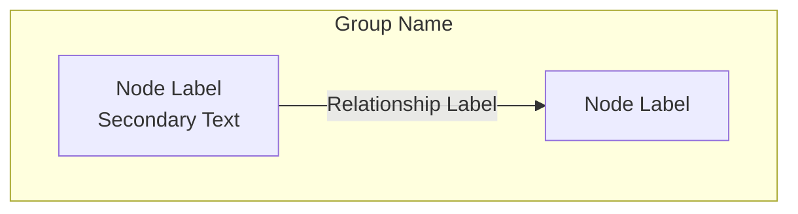

# O³ Platform — Documentation Writing Standard

**Status:** Production-Grade v1.0.0  
**Owner:** Chief Architect  
**Applies To:** All O³ Platform documentation — Books, Product Specifications, Developer Specifications, ADRs, technical documents  
**Reference Implementation:** Book 00: Platform Overview (v1.0.0)

---

## 1. Purpose and Scope

### Purpose

This document defines the mandatory writing standards for all O³ Platform documentation. It ensures consistency, completeness, and professional quality across every document in the repository. Every author—human or AI Agent—must follow these standards.

### Scope

This standard applies to:

| Document Type | Location | Standard Level |
|--------------|----------|---------------|
| Platform Books (00–20) | `books/book-NN-*/index.md` | Full standard — all sections |
| Book README files | `books/book-NN-*/README.md` | Abbreviated — Purpose, Chapters, Key Takeaways |
| Product Specifications | `books/book-17-product-specifications/` | Full standard |
| Developer Specifications | `books/book-19-engineering-handbook/` | Full standard |
| Architecture Decision Records | `adr/adr-NNN-*.md` | ADR template (see Section 16) |
| Knowledge Base articles | `knowledge/` | Abbreviated — Purpose, Background, Rules, Examples |
| Patterns | `patterns/` | Abbreviated — Problem, Solution, When to Use, Example |
| Templates | `templates/` | Template-specific format |
| Cross-cutting standards | `standards/` | This document's format |

### Exclusions

- Generated files (HTML, PDF) — these are outputs, not sources
- Source code — governed by Book 19: Engineering Handbook
- Configuration files — governed by Book 16: DevOps
- External communications (marketing, investor decks) — governed by Book 02: Business Architecture

---

## 2. Documentation Philosophy

### Core Philosophy

O³ documentation is written for **four audiences simultaneously**:

1. **Product Manager** — Can plan features and understand scope from the documentation alone
2. **Software Architect** — Can design solutions based on documented architecture and principles
3. **Developer** — Can implement features following documented standards and patterns
4. **AI Agent** — Can continue the project with full context from the documentation

### Writing Principles

| # | Principle | Description |
|---|-----------|-------------|
| DP-01 | **Practical Over Theoretical** | Every statement should answer "What do I do with this information?" If it doesn't, it doesn't belong. |
| DP-02 | **Actionable Over Descriptive** | "The system validates data" is weak. "The Upload API validates Employee_ID for uniqueness, format, and cross-sheet consistency before storage" is strong. |
| DP-03 | **Specific Over General** | "Use best practices for security" is useless. "All API endpoints require Supabase Auth JWT; Row Level Security policies restrict data access to the authenticated user's company" is useful. |
| DP-04 | **Connected, Not Isolated** | Every document links to related documents. No document is an island. Cross-references are mandatory, not optional. |
| DP-05 | **Single Source of Truth** | Information lives in exactly one canonical location. Other documents reference it; they do not duplicate it. |
| DP-06 | **Progressive Disclosure** | Start with the essential concept, then add detail. A new reader should understand the purpose in the first paragraph. |
| DP-07 | **Honest About Gaps** | If information is incomplete, mark it clearly: `[DRAFT: Requires validation against actual implementation]`. Never pretend certainty where there is none. |
| DP-08 | **Versioned and Dated** | Every document has a version number and last-updated date. Changes are tracked in CHANGELOG.md. |

### What O³ Documentation Is NOT

- ❌ A marketing document — no persuasive language, no value propositions, no competitive claims
- ❌ A presentation deck — no bullet-point-only sections, no "click to reveal" patterns
- ❌ A business proposal — no financial projections, no market sizing, no investor language
- ❌ A tutorial — no step-by-step walkthroughs (those belong in Academy or onboarding guides)
- ❌ A meeting note — no informal language, no "we decided," no personal opinions

### What O³ Documentation IS

- ✅ A software architecture handbook — precise, technical, authoritative
- ✅ A reference manual — designed for lookup, not linear reading
- ✅ A decision record — documents what was decided, why, and what the consequences are
- ✅ An implementation guide — provides enough detail to build without asking
- ✅ A knowledge system — interconnected documents that form a coherent whole

---

## 3. Writing Style Guide

### Language

- **Primary language:** English for technical terms, architecture, code, API names, field names
- **Thai:** Used for business context explanations, user-facing concept descriptions, examples relevant to Thai SMEs
- **Mixed:** Technical documents use English structure with Thai explanations where culturally relevant
- **Consistency:** Once a term is chosen (English or Thai), use it consistently throughout all documents

### Tone

- Professional, authoritative, precise
- Direct — no hedging ("might," "could," "perhaps" are avoided unless expressing genuine uncertainty)
- Confident where the architecture is decided; honest where it is not
- Impersonal — "The system validates" not "We validate" or "You should validate"

### Terminology

| Rule | Example |
|------|---------|
| Use O³ vocabulary exclusively | "Workforce Intelligence" not "HR Analytics" |
| Capitalize defined terms | "Insight Engine" not "insight engine" |
| Use OWDS field names exactly | `Employee_ID` not "employee id" or "Employee Id" |
| Product names are fixed | "O³ Dashboard" not "the dashboard" or "O3 Dashboard" |
| Acronyms defined on first use | "OWDS (O³ Workforce Data Standard)" then "OWDS" thereafter |

### Formatting

| Element | Style |
|---------|-------|
| File names | `code` style: `index.md`, `README.md` |
| API endpoints | `code` style: `GET /api/v1/workforce/summary` |
| Database tables | `code` style: `employees`, `exits` |
| OWDS fields | `code` style: `Employee_ID`, `Department` |
| Code | Fenced code blocks with language: ` ```typescript ` |
| Commands | `code` style: `npm run build` |
| User actions | Bold: **"คลิก Upload"** |
| Emphasis | `**bold**` for strong emphasis, `*italic*` for mild emphasis |
| Quotes | No smart quotes; use straight quotes in code, curly quotes in prose |

### Structure

- **One idea per paragraph.** If a paragraph has two ideas, split it.
- **Headings are descriptive.** "Principle 03: API First" not "API Stuff"
- **Lists are parallel.** All items in a list share the same grammatical structure.
- **Tables have headers.** Every table has a header row with `th` elements.
- **Code blocks have context.** Every code block is introduced by a sentence explaining what it shows.

---

## 4. Documentation Hierarchy

Documents exist in a strict hierarchy. Higher documents constrain lower documents. Lower documents must not contradict higher documents.

| Level | Document Type | Constrains | Constrained By |
|-------|--------------|------------|----------------|
| L0 | O³ Master Context | Everything below | Nothing (root) |
| L1 | Platform Operating Manual + Standards | All Books, ADRs, Specs | Master Context |
| L2 | Platform Books (00–20) | Product Specs, Developer Specs | L0, L1 |
| L3 | Product Specifications | Developer Specs | L2 |
| L4 | Developer Specifications | Implementation | L3 |
| L5 | Implementation (Code) | Testing | L4 |

**Rules:**
- When writing at Level N, read all documents at Levels 0 through N-1 that are relevant to your topic
- Cross-references always point upward or sideways in the hierarchy, never downward
- If a conflict is found between levels, the higher level wins; file an ADR to resolve

---

## 5. Mandatory Sections for Every Chapter

Every chapter in a Platform Book MUST include these sections. Do not skip any. Do not leave any empty—if content is not yet available, mark as `[DRAFT: explanation of what is needed]`.

### 5.1 Purpose

**What:** One to three sentences explaining why this chapter exists and what the reader will understand after reading it.

**Example:**
> Define the five-layer architecture of the O³ platform in precise detail. Each layer has defined responsibilities, interfaces, and constraints. This layered architecture is the foundation for all technical decisions.

### 5.2 Background

**What:** Context that explains why this topic matters, what problem it solves, and what happened before this decision was made. Assume the reader is technically competent but new to O³.

**Example:**
> Complex platforms become unmaintainable when concerns are mixed—when UI code queries databases directly, when AI calls bypass security controls, when business logic is scattered across frontend and backend. The five-layer architecture enforces separation of concerns, making the platform modular, testable, and evolvable.

### 5.3 Principles

**What:** A numbered table of principles that govern this topic. Each principle has an ID, a short name, and a one-sentence description.

**Format:**
```markdown
| # | Principle | Description |
|---|-----------|-------------|
| PL-01 | **Strict Layering** | Each layer may only communicate with the layer directly below it. No layer skipping. |
```

**Rules:**
- Principle IDs follow the pattern: `{CHAPTER_PREFIX}-{NN}` (e.g., `PL-01`, `SSOT-01`, `OWDS-01`)
- Principle names are bold
- Descriptions are one sentence, declarative, and testable

### 5.4 Architecture

**What:** Mermaid diagrams, architecture descriptions, component inventories, and layer definitions. This section is the visual and structural heart of the chapter.

**Requirements:**
- At least one Mermaid diagram per chapter (unless the topic is purely conceptual)
- Diagrams must have descriptive titles
- Diagrams must be accompanied by explanatory text
- Component tables must include: Component Name, Purpose/Technology, Key Details

### 5.5 Business Rules

**What:** A table of rules that must be enforced in the platform. Each rule has an ID, the rule text, and the enforcement mechanism.

**Format:**
```markdown
| Rule ID | Rule | Enforcement |
|---------|------|-------------|
| BR-SSOT-001 | Employee data MUST be stored only in OWDS tables. | Database schema review — blocking violation |
```

**Rules:**
- Rule IDs follow the pattern: `BR-{CHAPTER_PREFIX}-{NNN}`
- Rules use MUST (mandatory), SHOULD (recommended), MUST NOT (forbidden)
- Enforcement is specific: "Code Review — blocking violation" not "We should check this"

### 5.6 Examples

**What:** Concrete, realistic examples that illustrate the principles and rules in action. Examples make abstract concepts tangible.

**Requirements:**
- At least two examples per chapter
- Examples show both correct and incorrect approaches where applicable
- Examples use realistic data (Thai company names, realistic employee counts, plausible scenarios)
- Code examples use TypeScript/JavaScript (the platform language)

### 5.7 AI Instructions

**What:** Specific instructions for AI Agents that are generating code, documentation, or designs related to this chapter's topic.

**Format:** Bullet points starting with action verbs: "When generating...", "Never...", "Always...", "If..."

**Example:**
> - When generating code that reads business data, always use the canonical API for that data type
> - Never generate code that creates a new table for data that already has a canonical source
> - If you detect a potential violation of this principle in existing code, flag it — do not silently work around it

### 5.8 Cross References

**What:** A list of related Books, chapters, ADRs, and other documents that the reader should consult for related information.

**Format:**
```markdown
- Book 03: Domain Model — Defines the canonical business objects and their relationships
- Book 06: OWDS — The canonical data standard for all workforce data
- ADR-001: Use OWDS as the Workforce Data Standard
```

**Rules:**
- Every cross-reference includes the document title AND a brief explanation of why it's relevant
- Cross-references point to the most specific location possible (chapter, not just book)
- No circular references (A → B → A)

### 5.9 Definition of Ready

**What:** A checklist of criteria that must be met before work related to this chapter's topic can begin.

**Format:** Checkbox list
```markdown
☐ All business object types have a documented canonical owner
☐ No product maintains a duplicate data store for any canonical object
```

### 5.10 Definition of Done

**What:** A checklist of criteria that must be met for work related to this chapter's topic to be considered complete.

**Format:** Checkbox list (same format as Definition of Ready)

### 5.11 Validation Checklist

**What:** A checklist for verifying that the principles and rules in this chapter are being followed in the actual implementation.

**Format:** Checkbox list with empty `[ ]` markers for manual verification
```markdown
☐ Does every business object have exactly one database table that owns it?     [ ]
☐ Can every data value displayed in the UI be traced to its canonical source?  [ ]
```

---

## 6. Optional Sections (Use Only When Relevant)

These sections add depth to a chapter but are not required for every topic. Include them only when they provide meaningful value. Never include an empty optional section.

### 6.1 Common Mistakes

**When to include:** When there are known, recurring mistakes that teams make related to this topic.

**Format:** Table with columns: Mistake, Why It Happens, How to Avoid

### 6.2 Anti-patterns

**When to include:** When there are architectural or design patterns that seem reasonable but lead to problems.

**Format:** Table with columns: Anti-pattern, Description, Consequence, Correct Approach

### 6.3 Decision Log

**When to include:** When the chapter covers a topic where multiple options were considered and a specific choice was made.

**Format:** Table with columns: Decision, Alternatives Considered, Rationale, Date

### 6.4 Trade-offs

**When to include:** When the architecture involves explicit trade-offs (performance vs. consistency, flexibility vs. simplicity).

**Format:** Table with columns: Choice, Pros, Cons, Why This Choice

### 6.5 Evolution

**When to include:** When the topic has a planned evolution path or has evolved significantly over time.

**Format:** Timeline or table showing versions and changes

### 6.6 Developer Notes

**When to include:** When there are implementation-specific details that developers need but that don't fit in the main architecture sections.

**Format:** Bullet points with technical specifics (package names, file paths, configuration values)

### 6.7 PM Notes

**When to include:** When there are product management considerations related to the technical topic.

**Format:** Bullet points about scope, prioritization, user impact, metrics

### 6.8 Implementation Notes

**When to include:** When there are specific implementation patterns, gotchas, or setup instructions.

**Format:** Bullet points or code blocks showing specific implementation approaches

### 6.9 Related ADR / Related OWDS / Related APIs / Related Database Tables / Related UI Components

**When to include:** When the chapter's topic directly relates to specific ADRs, OWDS fields, API endpoints, database tables, or UI components.

**Format:** Table or list with specific references and brief relevance explanations

### 6.10 Security Considerations

**When to include:** When the topic has security implications (data sensitivity, access control, encryption, audit).

**Format:** Bullet points describing security requirements and mitigations

### 6.11 Performance Considerations

**When to include:** When the topic has performance implications (caching, query optimization, load expectations).

**Format:** Bullet points with specific performance targets or optimization strategies

### 6.12 Open Questions

**When to include:** When there are unresolved questions that need future investigation or decision.

**Format:** Numbered list of questions with context about what's needed to resolve them

### 6.13 Future Roadmap

**When to include:** When the topic has planned future enhancements beyond the current version.

**Format:** Table with columns: Phase, Change, Impact

### 6.14 Glossary

**When to include:** When the chapter introduces multiple new terms that need definition.

**Format:** Table with columns: Term, Definition, Usage Context

### 6.15 References

**When to include:** When the chapter references external sources (industry standards, research papers, competitor documentation).

**Format:** Numbered list with full citations

---

## 7. Cross-Reference Rules

### Mandatory Cross-References

Every chapter MUST include cross-references to:
1. The Book that owns the most closely related topic (if not this Book)
2. Any ADR that directly governs the chapter's topic
3. The OWDS Book (Book 06) if the topic involves workforce data
4. The API Standards Book (Book 10) if the topic involves APIs
5. The Platform Operations Book (Book 20) if the topic involves governance or process

### Cross-Reference Format

```markdown
- Book NN: Full Title — Brief explanation of relevance (1 sentence)
- ADR-NNN: Title — Brief explanation of relevance (1 sentence)
- Book 20, Chapter NN: Chapter Title — Brief explanation of relevance (1 sentence)
```

### Cross-Reference Rules

| Rule | Description |
|------|-------------|
| **Upward or Sideways Only** | Cross-references point to higher or equal levels in the documentation hierarchy. Never reference downward (e.g., Book 03 should not reference Book 17). |
| **Specific, Not General** | Reference a specific chapter or section, not just a whole Book. "Book 06, Chapter 3: OWDS Field Definitions" not just "Book 06." |
| **Explain Relevance** | Every cross-reference includes WHY the reader should follow it. Not just "See Book 03" but "See Book 03: Domain Model — defines the Employee entity that OWDS implements." |
| **No Circular References** | If A references B, B must not reference A. |
| **Validate Links** | All cross-references must be valid. Broken links are blocking issues. |

### Duplication Policy

If another Book already owns a topic, do NOT re-explain it. Instead:
1. Write a one-sentence summary of the concept
2. Link to the owning Book for full details
3. Focus this chapter on what is UNIQUE about this topic's relationship to that concept

**Example (Good):**
> Employee data is governed by OWDS (Book 06). The Dashboard reads workforce data through the Workforce API (Book 10, Chapter 4). This chapter focuses on how the Dashboard renders OWDS data as insight widgets—not on the data model itself.

**Example (Bad — Duplication):**
> OWDS defines Employee_ID as a unique identifier, Department as a text field... [300 words duplicating Book 06]

---

## 8. Naming Conventions

### Document Files

| Type | Convention | Example |
|------|-----------|---------|
| Book content | `index.md` | `books/book-03-domain-model/index.md` |
| Book overview | `README.md` | `books/book-03-domain-model/README.md` |
| Chapter file | `chapter-NN-slug.md` | `chapter-01-platform-concept.md` |
| ADR file | `adr-NNN-slug.md` | `adr-001-owds-standard.md` |
| Standard file | `descriptive-slug.md` | `documentation-writing-standard.md` |
| Diagram (Mermaid) | `diagram-slug.mmd` | `diagram-platform-layers.mmd` |
| Diagram (image) | `diagram-slug.png` | `diagram-data-flow.png` |
| Template | `template-purpose.ext` | `template-owds-data.xlsx` |

### Directory Names

| Rule | Example | Anti-pattern |
|------|---------|-------------|
| Lowercase kebab-case | `book-03-domain-model/` | `Book 03 - Domain Model/` |
| Zero-padded two-digit numbers | `book-00/`, `book-03/`, `book-20/` | `book-0/`, `book-3/` |
| No spaces | `business-architecture/` | `business architecture/` |
| No special characters except hyphen | `api-standards/` | `api & standards/` |

### Section Headings in Documents

| Level | Markdown | Usage |
|-------|----------|-------|
| H1 (`#`) | Document title only | One per file: `# Book 03: Domain Model` |
| H2 (`##`) | Chapter titles | `## Chapter 1: Core Domains` |
| H3 (`###`) | Section titles | `### Purpose`, `### Business Rules` |
| H4 (`####`) | Sub-section titles | `#### Product 1: O³ Dashboard` |
| H5 (`#####`) | Minor headings | Use sparingly |

### IDs and Codes

| Element | Pattern | Example |
|---------|---------|---------|
| Principle ID | `{PREFIX}-{NN}` | `PL-01`, `SSOT-03`, `OWDS-05` |
| Business Rule ID | `BR-{PREFIX}-{NNN}` | `BR-SSOT-001`, `BR-OWDS-003` |
| Requirement ID | `REQ-{PRODUCT}-{NNN}` | `REQ-DASH-001`, `REQ-AI-003` |
| ADR ID | `ADR-{NNN}` | `ADR-001`, `ADR-008` |

---

## 9. Mermaid Diagram Standards

### When to Use Mermaid

Use Mermaid diagrams for:
- Architecture diagrams (layers, components, relationships)
- Data flow diagrams
- Process flows (user journeys, decision trees, build sequences)
- Dependency graphs
- Entity relationship diagrams (simplified)
- State machines

Do NOT use Mermaid for:
- UI mockups (use Figma or image exports)
- Detailed database schemas (use SQL DDL or schema visualization tools)
- Complex diagrams with 20+ nodes (split into multiple diagrams)

### Mermaid Syntax Standards

| Rule | Requirement |
|------|------------|
| Direction | Specify explicitly: `graph TD` (top-down) or `graph LR` (left-right) |
| Node IDs | Use descriptive IDs: `DASHBOARD` not `A` |
| Node Labels | Use `["Label"]` with line breaks via `<br/>` for multi-line labels |
| Subgraphs | Use `subgraph "Title"` for grouping related nodes |
| Styling | Use `classDef` for consistent styling across diagrams |
| Colors | Use O³ palette: `#c00` (red), `#0d0d0d` (black), `#fafafa` (light gray), `#fff` (white) |
| Accessibility | Every diagram MUST have a text description immediately after it |

### Diagram Template

```markdown
### Architecture



*Description: This diagram shows the relationship between NODE1 and NODE2. NODE1 represents...*
```

### Diagram Checklist

```
☐ Direction specified (TD or LR)
☐ All nodes have descriptive IDs
☐ All nodes have readable labels
☐ Relationships have labels where non-obvious
☐ Subgraphs used for logical grouping
☐ Text description provided below diagram
☐ Diagram renders correctly in GitHub Markdown preview
☐ No more than 15 nodes (split if larger)
```

---

## 10. Markdown Standards

### File Structure

```markdown
# Document Title

**Status:** Production-Grade v1.0.0

---

## Chapter 1: Chapter Title

### Purpose
...

### Background
...

[All mandatory sections]

---

## Chapter 2: Chapter Title

...

---

## Version History

| Version | Date | Changes |
|---------|------|---------|
| v1.0.0 | YYYY-MM-DD | Initial production-grade release |
```

### Markdown Rules

| Rule | Requirement |
|------|------------|
| Headings | ATX-style (`#`). One H1 per file. No skipped levels (H1 → H2 → H3, never H1 → H3). |
| Line length | No hard limit. Wrap prose at ~120 characters for readability. Do not wrap tables or code. |
| Lists | Unordered: `-`. Ordered: `1.` Indent nested lists with 2 spaces. |
| Code blocks | Fenced with language: ` ```typescript `. Always specify language. |
| Inline code | Backticks for: file names, API paths, field names, commands, code symbols |
| Links | Inline `[text](url)` for external. Reference-style `[text][ref]` for repeated internal links. |
| Tables | Align pipes. Header row required. Consistent spacing. |
| Images | Alt text mandatory. Relative paths. |
| Emphasis | `**bold**` for strong. `*italic*` for emphasis. No underline. No strikethrough. |
| Blockquotes | Use `>` only for actual quotations. Do not use for styling. |
| Horizontal rules | Use `---` to separate major sections only. |
| File ending | Exactly one newline at end of file. |

### What NOT to Use

- ❌ HTML in Markdown (except for details/summary for collapsible sections)
- ❌ Emoji in technical documentation (except in examples of user-facing UI)
- ❌ Mention-style links (`@username`)
- ❌ Task lists outside of Definition of Ready/Done/Validation sections
- ❌ Footnotes (use inline links instead)
- ❌ Definition lists (use tables instead)

---

## 11. AI Agent Writing Rules

### Core Rules

These rules apply to ALL AI Agents generating O³ documentation:

| # | Rule | Description |
|---|------|-------------|
| AI-01 | **Read Before Writing** | Read Master Context + relevant Books before generating any document. |
| AI-02 | **Follow the Standard** | This document is the writing standard. Do not deviate. |
| AI-03 | **No Invented Terminology** | Use only terms defined in the O³ Vocabulary (Master Context, Section 14). |
| AI-04 | **No Placeholder Text** | Every section must have real content. If information is missing, mark as `[DRAFT: specific explanation of what's needed]`. |
| AI-05 | **Cross-Reference Everything** | Every chapter must link to related Books, ADRs, and standards. |
| AI-06 | **Use O³ Vocabulary** | "Workforce Intelligence" not "HR Analytics." "Insight Engine" not "Analytics Engine." |
| AI-07 | **Preserve Architecture** | Do not propose architecture changes in documentation. File an ADR. |
| AI-08 | **Markdown is Source of Truth** | Generate Markdown first. HTML is generated from Markdown, never the reverse. |
| AI-09 | **State Assumptions** | If you must assume something not in the source documents, state it clearly: `[ASSUMPTION: ...]` |
| AI-10 | **Validate Before Submitting** | Run through the Quality Review Checklist (Section 21) before marking any document as complete. |

### AI Agent Prompt Template

When instructing an AI Agent to write documentation, use this template:

```markdown
## Role
You are [ROLE] for O³ ZONE.

## Context
Read these before writing:
- O³ Master Context (all sections)
- O³ Documentation Writing Standard (standards/documentation-writing-standard.md)
- [RELEVANT BOOKS]

## Task
Write [DOCUMENT TYPE] for [TOPIC].

## Requirements
- Follow the Documentation Writing Standard exactly
- Include all mandatory sections
- Include optional sections only where they add value
- No placeholder text
- Cross-reference all related documents
- Use O³ vocabulary consistently

## Output Format
- Markdown following the standard chapter structure
- Mermaid diagrams where applicable
- Version history section
```

---

## 12. Developer Notes Standards

### When to Include Developer Notes

Include Developer Notes when the chapter contains information that developers need for implementation but that doesn't fit in the main architecture sections. This includes:

- Specific package names and versions
- File paths and directory structures
- Configuration values and environment variables
- Code organization patterns
- Build and deployment specifics
- Testing strategies
- Debugging tips

### Format

```markdown
### Developer Notes

- The platform uses a monorepo structure. Product-specific code lives in `packages/` or `apps/` directories.
- Shared foundation code (auth, OWDS, AI Gateway) lives in `packages/core/`.
- Environment variables are managed in `.env` files; never hardcode configuration.
- Database migrations are in `packages/data-layer/migrations/` and run via `npm run migrate`.
```

### Rules

- Use `code` formatting for all technical terms, file paths, commands
- Be specific: "Use `node-fetch v3.3.2`" not "Use a recent version of node-fetch"
- Include the "why" when it's not obvious: "Use Supabase Auth (not NextAuth) because it provides Row Level Security integration"
- Keep Developer Notes focused on implementation; move architectural discussion to the main sections

---

## 13. PM Notes Standards

### When to Include PM Notes

Include PM Notes when the chapter has implications for product management:

- Feature scope and prioritization
- User impact of technical decisions
- Metrics and KPIs affected
- Cross-product coordination needs
- Customer communication considerations
- Timeline and resource implications

### Format

```markdown
### PM Notes

- Roadmap items must be tagged with the target product and the shared foundation impact.
- A feature for one product that requires shared foundation changes needs coordination with the platform team.
- Product KPIs should include cross-product metrics: how many Dashboard users also use AI Studio?
- The Product Relationship Model (Assess → Advise → Accelerate) should be reflected in the user journey.
```

### Rules

- Keep PM Notes focused on product decisions; move technical discussion to Developer Notes
- Link to Product Specifications (Book 17) where detailed feature specs exist
- Include success metrics where applicable
- Flag customer-facing implications of technical decisions

---

## 14. Architecture Documentation Standards

### Architecture Diagram Requirements

Every architecture diagram must:
1. Have a title
2. Show components and their relationships
3. Use consistent visual language across all Books
4. Be accompanied by explanatory text
5. Have a text description for accessibility

### Architecture Description Requirements

When describing architecture:
- Start with the high-level structure, then detail each component
- Use consistent terminology: "Layer," "Component," "Module," "Service" have specific meanings
- Specify interfaces between components (API contracts, event schemas, data formats)
- Document constraints: what each component MUST do, MUST NOT do, and MAY do
- Include rationale: why this architecture, not alternatives

### Layer Definitions

When defining layers:
- Name the layer (e.g., "Platform Layer")
- State its responsibility in one sentence
- List all components in the layer with their purpose
- Define what the layer depends on (layer below)
- Define what depends on this layer (layer above)
- List constraints specific to this layer

---

## 15. OWDS Reference Standards

### When to Reference OWDS

Reference OWDS (Book 06) whenever the chapter discusses:
- Workforce data fields
- Data validation rules
- Data ingestion or upload
- Data transformation or standardization
- Any feature that reads or writes employee, exit, performance, training, survey, or business output data

### How to Reference OWDS

```markdown
### Related OWDS

| OWDS Sheet | Fields Used | Purpose |
|------------|-------------|---------|
| Employee_Master | Employee_ID, Department, Position, Salary, Start_Date | Core workforce data for dashboard widgets |
| Exit_Record | Exit_Date, Exit_Reason, Regrettable_Loss | Turnover and attrition analysis |
```

### Rules

- Always use exact OWDS field names with correct capitalization: `Employee_ID` not `employee_id`
- Reference the specific OWDS sheet and fields, not just "OWDS"
- If a feature needs a field not in OWDS, propose an OWDS extension — do not work around it

---

## 16. ADR Reference Standards

### When to Reference ADRs

Reference ADRs whenever the chapter discusses a decision that:
- Was formally recorded as an ADR
- Involves a trade-off between architectural options
- Has platform-wide implications
- Might be controversial or non-obvious

### How to Reference ADRs

```markdown
### Related ADR

| ADR | Title | Relevance |
|-----|-------|-----------|
| ADR-001 | Use OWDS as the Workforce Data Standard | Establishes OWDS as the canonical data model |
| ADR-002 | API First Architecture | Mandates API-based communication between all components |
```

### ADR Document Format

When writing an ADR, use this template:

```markdown
# ADR-NNN: Title

**Status:** Proposed | Accepted | Deprecated | Superseded
**Date:** YYYY-MM-DD
**Deciders:** [Names]

## Context
[What is the issue? What forces are at play?]

## Decision
[What is the decision? Be specific.]

## Consequences
### Positive
- ...

### Negative
- ...

### Neutral
- ...

## Options Considered
| Option | Pros | Cons | Why Rejected? |
|--------|------|------|---------------|
| ... | ... | ... | ... |

## Cross-References
- Related ADRs
- Related Books
```

---

## 17. API Documentation Standards

### When to Document APIs

Document APIs when the chapter:
- Defines API endpoints
- Describes API patterns or conventions
- References APIs that products consume

### API Reference Format

```markdown
### Related APIs

| API Group | Endpoint | Method | Purpose | Used By |
|-----------|----------|--------|---------|---------|
| Workforce API | /api/v1/workforce/summary | GET | Returns headcount, demographics, department mix | Dashboard, AI Studio |
```

### API Design Documentation

When documenting API design (primarily in Book 10):
- Every endpoint must have: Method, Path, Request Parameters, Request Body, Response Body, Error Codes, Authentication Required, Rate Limit
- Use OpenAPI/Swagger format for detailed endpoint documentation
- Include example requests and responses

---

## 18. Security Documentation Standards

### When to Include Security Considerations

Include security considerations when the chapter discusses:
- Authentication or authorization
- Data access or storage
- API endpoints
- AI features (prompt injection, data leakage)
- File uploads
- User management
- Multi-tenancy

### Format

```markdown
### Security Considerations

- **Authentication:** All endpoints require Supabase Auth JWT. Unauthenticated requests return 401.
- **Authorization:** Row Level Security ensures users can only access their company's data.
- **Data Sensitivity:** Salary data is classified as PII-Sensitive. Access requires HR Manager role or higher.
- **AI Safety:** AI prompts are sanitized to prevent prompt injection. User inputs are validated before inclusion in prompts.
- **File Upload:** Uploaded files are scanned for malware. File size limited to 10MB. Only .xlsx and .csv formats accepted.
```

---

## 19. Validation Checklist Standards

### Purpose

Validation checklists verify that the principles and rules in a chapter are actually being followed in the implementation. They are used during code review, architecture review, and release readiness assessment.

### Format

```markdown
### Validation Checklist

☐ Does every business object have exactly one database table that owns it?     [ ]
☐ Can every data value displayed in the UI be traced to its canonical source?  [ ]
☐ Are there any product-specific tables that duplicate canonical data?         [ ]
```

### Rules

- Each item is a yes/no question
- Items are specific and verifiable
- Items map directly to principles or business rules in the chapter
- The `[ ]` is for manual checkmark during review
- Aim for 5–10 items per chapter

---

## 20. Definition of Ready / Definition of Done Standards

### Definition of Ready

Definition of Ready checklists define what must be true BEFORE work begins on a topic.

**Format:**
```markdown
### Definition of Ready

☐ All business object types have a documented canonical owner
☐ No product maintains a duplicate data store for any canonical object
☐ All data access paths are through defined APIs
```

**Rules:**
- Items describe a state that must exist before work starts
- Items are prerequisites, not deliverables
- If an item is not met, work must not begin

### Definition of Done

Definition of Done checklists define what must be true for work to be considered complete.

**Format:**
```markdown
### Definition of Done

☐ Database schema review confirms no duplicate tables across products
☐ API access controls enforce write-only-by-owner
☐ All products read from canonical APIs (verified by code review)
```

**Rules:**
- Items describe a state that must exist for work to be complete
- Items are verifiable deliverables
- If an item is not met, the work is not Done

---

## 21. Quality Review Checklist

Before marking any document as complete, verify ALL of the following:

### Structural Completeness

```
☐ All mandatory sections present (Purpose, Background, Principles, Architecture, Business Rules, Examples, AI Instructions, Cross References, Definition of Ready, Definition of Done, Validation Checklist)
☐ Optional sections included only where they add value
☐ No empty sections (all have content or [DRAFT: ...] markers)
☐ Version history section present with current version
☐ Status indicator present at top of document
```

### Content Quality

```
☐ Every principle is testable (can be verified true/false)
☐ Every business rule has an enforcement mechanism
☐ Every example is concrete and realistic
☐ Every cross-reference includes a relevance explanation
☐ No placeholder text without [DRAFT: ...] explanation
☐ No duplicated content from other Books (summarize + link instead)
☐ O³ vocabulary used consistently throughout
```

### Technical Accuracy

```
☐ All Mermaid diagrams render correctly
☐ All code examples are syntactically correct
☐ All API paths, field names, and table names are accurate
☐ All cross-reference links are valid
☐ All ADR references use correct ADR numbers
☐ All OWDS field references use correct field names
```

### Writing Quality

```
☐ No marketing language or persuasive tone
☐ No informal language or personal opinions
☐ No hedging where the architecture is decided
☐ Honest about gaps and uncertainties
☐ Consistent terminology throughout
☐ Correct Markdown formatting
☐ File ends with exactly one newline
```

### AI Agent Compliance

```
☐ AI Instructions section provides clear guidance for AI Agents
☐ No invented terminology (all terms from O³ Vocabulary)
☐ Architecture decisions trace to ADRs where applicable
☐ Data concepts trace to OWDS where applicable
☐ KPIs trace to Semantic Layer where applicable
```

---

## 22. Versioning Rules

### Document Version Format

All documents use Semantic Versioning: `MAJOR.MINOR.PATCH`

| Change Type | Version Bump | Example |
|-------------|-------------|---------|
| **MAJOR** — Structural changes, section renames, breaking changes to principles or rules | X.0.0 | v1.0.0 → v2.0.0 |
| **MINOR** — New chapters, new sections, expanded content, new examples | x.Y.0 | v1.0.0 → v1.1.0 |
| **PATCH** — Typo fixes, clarification, formatting improvements, link fixes | x.y.Z | v1.0.0 → v1.0.1 |

### Version History

Every document MUST have a Version History section at the end:

```markdown
## Version History

| Version | Date | Changes |
|---------|------|---------|
| v1.0.0 | YYYY-MM-DD | Initial production-grade release |
```

### Status Indicators

| Status | Meaning |
|--------|---------|
| `Production-Grade vX.Y.Z` | Complete, reviewed, approved |
| `Draft vX.Y.Z` | In progress, not yet reviewed |
| `Deprecated vX.Y.Z` | No longer maintained; see [replacement document] |
| `Living Document vX.Y.Z` | Continuously updated (e.g., CHANGELOG, Roadmap) |

---

## 23. Change Management Rules

### When to Update a Document

Update a document when:
1. The architecture changes (ADR accepted)
2. A new feature is added that affects the document's domain
3. An error or omission is discovered
4. A new Book is created that this document should reference
5. The OWDS schema changes
6. An API endpoint is added, changed, or deprecated

### Change Process

1. Identify the change and its impact (use Book 20, Chapter 05: Change Impact Matrix)
2. Determine the version bump (MAJOR/MINOR/PATCH)
3. Update the document
4. Update all cross-references in other documents that point to changed sections
5. Update CHANGELOG.md
6. Submit for review (Architecture Review for MAJOR changes)

### What NOT to Change Without ADR

- Document structure (adding/removing mandatory sections)
- Principle definitions
- Business rules
- Architecture decisions
- Naming conventions
- This Documentation Writing Standard itself

---

## 24. Future Documentation Guidelines

### Planned Improvements

| Area | Planned Enhancement | Timeline |
|------|-------------------|----------|
| Automated validation | CI script to validate cross-references, Mermaid syntax, Markdown formatting | Post-MVP |
| Diagram consistency | Shared Mermaid style definitions (classDef) across all Books | Post-MVP |
| Search index | Generated search index for all documentation | Growth Phase |
| PDF generation | Automated PDF generation from Markdown for offline reading | Post-MVP |
| Interactive diagrams | Where Mermaid is insufficient, interactive architecture diagrams | Growth Phase |
| Multi-language | Full Thai translation of technical documentation | Growth Phase |

### Guidelines for Future Standards

As the platform evolves, new documentation standards may be needed. When creating new standards:
1. Follow this document's format and philosophy
2. Propose via ADR
3. Get Chief Architect approval
4. Add to the `standards/` directory
5. Update this document's cross-references

---

## Version History

| Version | Date | Changes |
|---------|------|---------|
| v1.0.0 | 2026-06-25 | Initial production-grade release — 24 sections covering all documentation standards |