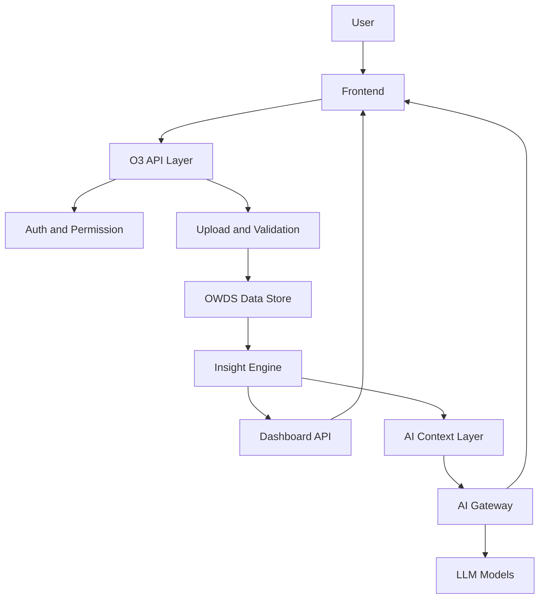

# 09 Architecture and API

## Recommended MVP Stack

Current preferred stack:

- Frontend: Next.js
- Backend/API: Next.js API routes or backend service
- Database: Supabase PostgreSQL
- Storage: Supabase Storage
- Authentication: Supabase Auth
- Hosting: Vercel
- AI: OpenAI and/or multi-model AI Gateway
- Repository: GitHub

This can change later, but should be stable during MVP build.

## API First Principle

All products should interact through APIs.

Frontend should not directly implement business logic that belongs to backend or insight engine.

## MVP API Groups

### Auth API

- Sign up
- Sign in
- User profile
- Role and permission

### Company API

- Create company
- Update company profile
- Get company profile

### Upload API

- Upload OWDS template
- Validate file
- Import data
- Get import status

### Workforce API

- Get employee summary
- Get department mix
- Get headcount trend

### Turnover API

- Get turnover summary
- Get regrettable loss
- Get exit reasons
- Get attrition cost

### Dashboard API

- Get dashboard layout
- Get widget data
- Get AI summary

### AI API

- Ask AI Advisor
- Run AI tool
- Get AI history
- Get credit usage

### Subscription API

- Get package
- Get entitlements
- Get credit balance
- Update subscription

## Data Flow

Recommended flow:

1. User uploads Excel.
2. Upload API stores file.
3. Validation service checks structure and quality.
4. Import service maps file into OWDS tables.
5. Insight engine calculates KPIs.
6. Dashboard API serves metrics.
7. AI Gateway receives structured context.
8. User receives explanation and action plan.

## Architecture Diagram

## Admin Configuration

Admin should configure:

- Product visibility
- Package entitlement
- AI credits
- Feature flags
- Template versions
- Survey availability
- Academy courses

## Logging

The platform should log:

- Login
- File upload
- Validation errors
- Import success/failure
- Dashboard view
- AI prompt
- AI tool run
- Export
- Subscription event

